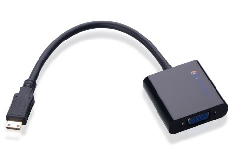
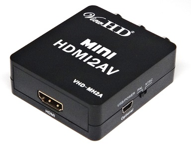

.. _accessories-adapters:

Adapters 
#########

HDMI Adapters
==============

The following adapters were tested and have been verified to work with the BeagleBone Black.
HDMI Type A to VGA Male/Female with 3.5mm Stereo Adapter

`HDMI to VGA link <https://www.amazon.com/Cable-Matters-Active-Female-Adapter/dp/B00879EZJI/ref=sr_1_2?ie=UTF8&qid=1381610066&sr=8-2&keywords=micro-hdmi+to+vga>`_

**Additional Parts Required:** (Click on the links to view the parts)

- `Stereo Adapter (Included) <http://kbsinc.com/media/catalog/category/audiocable.jpg>`_
- `VGA Male to VGA Male <http://pixels.uk.com/images/uploads/cables/vga-m-m.png>`_
- `Micro-USB Cable <http://image.made-in-china.com/2f0j00wvsTIeQCZhqG/Micro-USB-Cable.jpg>`_
- `HDMI to Mini HDMI <http://www.archos.com/manuals/A101_EN_v1.1_files/hdmi_cable.jpg>`_

EDID Information:

.. code-block::

    Section "Monitor"
        # Block type: 2:0 3:fd
        # Block type: 2:0 3:fc
        Identifier "LCDTV16"
        VendorName "___"
        ModelName "LCDTV16"
        # Block type: 2:0 3:fd
        HorizSync 30-49
        VertRefresh 57-63
        # Max dot clock (video bandwidth) 90 MHz
        # Block type: 2:0 3:fc
        # DPMS capabilities: Active off:no  Suspend:no  Standby:no
        Mode    "1360x768"      # vfreq 60.366Hz, hfreq 47.991kHz
                DotClock        86.000000
                HTimings        1360 1424 1536 1792
                VTimings        768 771 777 795
                Flags   "+HSync" "+VSync"
        EndMode
        Mode    "1280x768"      # vfreq 60.247Hz, hfreq 48.077kHz
                DotClock        80.000000
                HTimings        1280 1344 1472 1664
                VTimings        768 771 778 798
                Flags   "+HSync" "-VSync"
        EndMode
        # Block type: 2:0 3:fd
        # Block type: 2:0 3:fc
    EndSection

Mini HDMI to Composite/CVBS/RCA AV Video Converter
---------------------------------------------------

`ViewHD link <http://u9ltd.myshopify.com/products/vhd-mh2a>`_

Additional Parts Required: (Click on the links to view the parts)

- `RCA Audio Video Composite Cable <http://p.globalsources.com/IMAGES/PDT/B1058307580/RCA-Cable.jpg>`_
- `Mini USB Data Cable <http://i.expansys.com/i/b/b140784.jpg>`_
- `HDMI to Mini HDMI Converter <http://ecx.images-amazon.com/images/I/31JeVuRNx1L._SX385_.jpg>`_
- `HDMI to Mini HDMI <http://www.archos.com/manuals/A101_EN_v1.1_files/hdmi_cable.jpg>`_

..  code-block::

    EDID Information:

        # EDID version 1 revision 3
    Section "Monitor"
        # Block type: 2:0 3:fc
        Identifier "HDMI TO AV"
        VendorName "SNY"
        ModelName "HDMI TO AV"
        # Block type: 2:0 3:fc
        # Block type: 2:0 3:fd
        HorizSync 14-70
        VertRefresh 48-62
        # Max dot clock (video bandwidth) 150 MHz
        # DPMS capabilities: Active off:no  Suspend:no  Standby:no
        Mode    "1920x1080"     # vfreq 50.000Hz, hfreq 56.250kHz
                DotClock        148.500000
                HTimings        1920 1968 2012 2640
                VTimings        1080 1084 1089 1125
                Flags   "+HSync" "+VSync"
        EndMode
        Mode    "720x480"       # vfreq 59.940Hz, hfreq 31.469kHz
                DotClock        27.000000
                HTimings        720 736 798 858
                VTimings        480 489 495 525
                Flags   "-HSync" "-VSync"
        EndMode
        # Block type: 2:0 3:fc
        # Block type: 2:0 3:fd
    EndSection

HDMI-F to Micro HDMI-M Adapter
-------------------------------

This adapter is compatible with the Blackberry Z10. 
`Click here <http://www.newegg.com/Product/Product.aspx?Item=9SIA0PG0RV2736>`_ to view. 