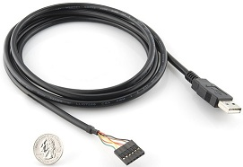
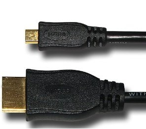

.. _accessories-cables:

Cables
#######

USB Cables
***********

This will normally be supplied with the BeagleBone Black, but in the case of the BBB RevA4, it was not. 
For other beaglebone boards like Pocket Beagle, BeagleBone AI, BeagleBone Ai-64 you'll have . The connector on the board is a miniUSB type B female connector and requires a miniUSB type B male mating connector.
The original BeagleBone uses a miniUSB type AB connector.

Serial Debug Cables
====================

The default serial port settings for the board are:

Baud 115,200
Bits 8
Parity N
Stop Bits 1
Handshake None

Standard FTDI Cable
--------------------

The debug cable is a standard FTDI to TTL cable. Make sure you get the 3.3V version. You can purchase this from several different sources including but not limited to:

- `DigiKey <http://www.digikey.com/product-detail/en/TTL-232R-3V3/768-1015-ND/1836393>`_
- `Newark <http://www.newark.com/jsp/search/productdetail.jsp?SKU=34M8872&CMP=KNC-GPLA&mckv=%7Cpcrid%7C19038771501%7Cplid%7C>`_
- `Sparkfun <https://www.sparkfun.com/products/9717>`_
- `FTDI <http://www.ftdichip.com/Products/Cables/USBTTLSerial.htm>`_
- `Adafruit <https://www.adafruit.com/products/70>`_

Pin 1 on the cable is the black wire and connects to pin 1 on the board, the pin with the white dot next to it. 

Adafruit 4 Pin Cable (PL2303)
------------------------------

One is from `Adafruit <http://www.adafruit.com/products/954>`_. This is a Prolific chipset based cable. 
Some people have reported issues with the cable causing some issues with data corruption. You experience 
may vary. You will need to install the Prolific drivers. Those can be downloaded from Adafruit.

.. image:: images/RPI_Serial.png
    :align: center
    :alt: 4 pin serial cable
    
.. table:: Adafruit 4 pin serial cable connection to BeagleBone Black

    +--------------+--------------+--------------+
    | Board        | Wire         | Function     |
    +==============+==============+==============+
    | Pin 1        | Black        | Ground       |
    +--------------+--------------+--------------+
    | Pin 4        | Green        | Receive      |
    +--------------+--------------+--------------+
    | Pin 5        | White        | Transmit     |
    +--------------+--------------+--------------+

.. note:: 
    The naming of the signals reflect those of the cable. 
    The swapping of TX and RX takes place on the board.

You will also find an extra RED wire on this cable. Just leave it unconnected.

FTDI 3 Pin Cable
-----------------

You can purchase the another version direct from *FTDI
This cable only has three wires for connection. You can find the datasheet and a picture at *Cable

.. table:: 3 pin FTDI cable connection to BeagleBone Black

    +--------------+--------------+--------------+
    | Board        | Wire         | Function     |
    +==============+==============+==============+
    | Pin 1        | Black        | Ground       |
    +--------------+--------------+--------------+
    | Pin 4        | Yellow       | Receive      |
    +--------------+--------------+--------------+
    | Pin 5        | Orange       | Transmit     |
    +--------------+--------------+--------------+

.. note:: 
    The naming of the signals reflect those of the cable. 
    The swapping of TX and RX takes place on the board. 

Olimex 3 Pin Cable (PL2303)
----------------------------

A third version is sold by `Olimex <https://www.olimex.com/Products/Components/Cables/USB-Serial-Cable/USB-Serial-Cable-F/>`_

.. table:: 3 pin FTDI cable connection to BeagleBone Black

    +--------------+--------------+--------------+
    | Board        | Wire         | Function     |
    +==============+==============+==============+
    | Pin 1        | Black        | Ground       |
    +--------------+--------------+--------------+
    | Pin 4        | Green        | Receive      |
    +--------------+--------------+--------------+
    | Pin 5        | Red          | Transmit     |
    +--------------+--------------+--------------+

HDMI Cables
============

Working HDMI Cables
--------------------

The board uses a microHDMI cable. Sources include but are not limited to:

- `Amazon <http://www.amazon.com/Amzer-Micro-HDMI-Speed-Cable/dp/B003OBZSHC>`_
- `Staples <http://www.staples.com/Staples-HDMI-To-Micro-D-HDMI-Cable/product_926993>`_
- `Mediabridge <http://www.mediabridgeproducts.com/store/pc/6FT-FLEX-Series-High-Speed-Micro-HDMI-to-HDMI-Cable-with-Ethernet-p246.htm>`_
- `Monoprice <http://www.monoprice.com/products/product.asp?c_id=102&cp_id=10253&cs_id=1025301&p_id=7557&seq=1&format=2>`_ NOTE: Reports are that this cable does not work with the `Adafruit Clear Top Case <http://www.adafruit.com/products/1555>`_.

Bad HDMI Cables
----------------

`High Speed HDMI Cable with Ethernet ,Type D Micro M/M Cable <http://www.newegg.com/Product/Product.aspx?Item=N82E16882241049>`_: Didn't work, not grounded. 

USB Cables
-----------

TBD

