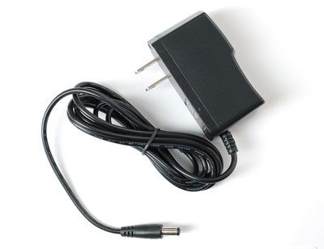

.. accessories-power-supplies::

Power supplies
###############

All Beaglebone boards require different power supplies like Beaglebone Balack and other AM335X 
based boards will be fine with a 5VDC @ 1A  but, Beaglebone AI-64 requires aleast 5VDC @ 3A. You 
have to either supply the power via usb jack or a 2.1mm, center positive barrel jack. 

.. note::
    The power supply is not supplied with the board.

Sources for supplies that work include:

- `Adafruit <http://www.adafruit.com/products/276>`_
- `Sparkfun <https://www.sparkfun.com/products/8269?>`_
- `Logic Supply <http://www.logicsupply.com/pw-5v2a/>`_

If you plan to use capes or add your own circuitry, higher amperage may be required.
Make sure that you have a grounded connection. This can be the USB cable or the HDMI cable.
