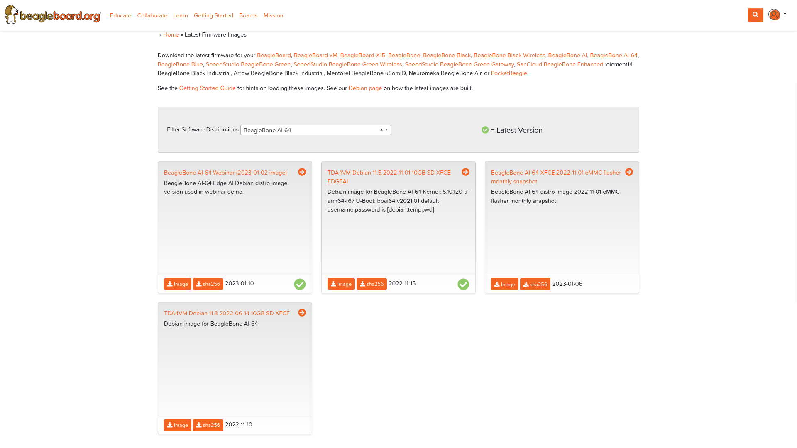

.. _support-information:

Support Information
####################

All support for this design is through BeagleBoard.org community at: link: `BeagleBoard.org forum <https://forum.beagleboard.org/>`_ .


.. _hardware-design:

Hardware Design
------------------

You can find all BeagleBone AI-64 hardware files `here <https://git.beagleboard.org/beagleboard/beaglebone-ai-64>`_ under the `hw` folder.


.. _software-updates:

Software Updates
-----------------

Follow instructions below to download the latest image for your BeagleBone AI-64:

1. Go to `BeagleBoard.org distro <https://www.beagleboard.org/distros>`_ page.
2. :ref:`filter-software-distribution-AI-64` from dropdown and download the image.

.. _filter-software-distribution-AI-64:



   Filter Software Distributions for BeagleBone AI-64

.. tip::
   You can follow the :ref:`flash-latest-image` guide for more information on 
   flashing the downloaded image to your board.

To see what SW revision is loaded into the eMMC check `/etc/dogtag`.
It should look something like as shown below,

```
root@BeagleBone:~# cat /etc/dogtag
BeagleBoard.org Debian Bullseye Xfce Image 2022-01-14
```

.. _rma-support:

RMA Support
-------------------------------------

If you feel your board is defective or has issues, request an Return Merchandise Application (RMA) by filling out the form at http://beagleboard.org/support/rma . You will need the serial number and revision of the board. The serial numbers and revisions keep moving. Different boards can have different locations depending on when they were made. The following figures show the three locations of the serial and revision number.

.. _trouble-shooting-video-output-issues:

Troubleshooting video output issues
-------------------------------------

.. warning:: 

   When connecting to an HDMI monitor, make sure your miniDP adapter is *active*. A *passive* adapter will not work. See :ref:`display-adapters-figure`.


.. _getting-help:

Getting Help
*************

If you need some up to date troubleshooting techniques, you can post your queries on link: `BeagleBoard.org forum <https://forum.beagleboard.org/>`_
