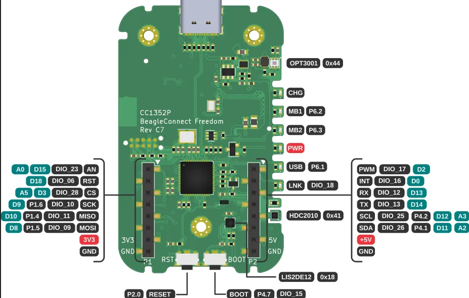
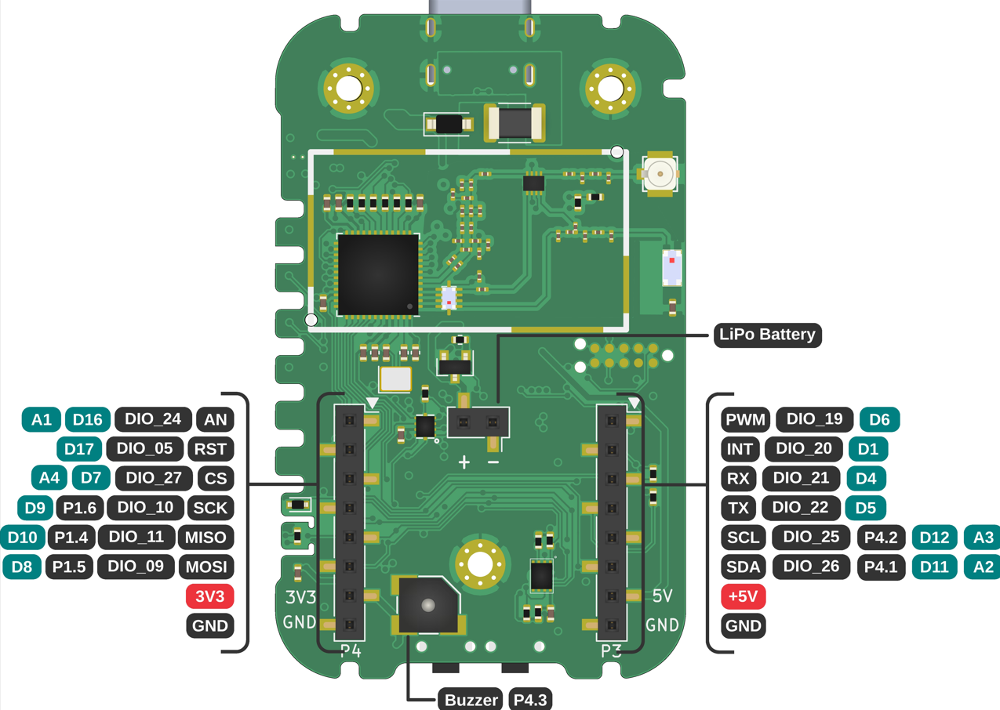

.. _beagleconnect-freedom-using-arduino-zephyr-template:

Using Arduino Zephyr Template 
##############################

The `Arduino Core API module for zephyr <https://github.com/zephyrproject-rtos/gsoc-2022-arduino-core>`_ leverages the power of Zephyr under an
Arduino-C++ style abtraction layer thus helping zephyr new-comers to start using
it without worrying about learning new APIs and libraries.

Using this template you can run arduino code on your BeagleConnect Freedom.

Pin Numbering For BeagleConnect Freedom
***************************************

You will see pins over ``Mikrobus-1`` and ``Mikrobus-2`` that can be used for Arduino code.
You can set each pin to either **read signals (input)** from things like buttons and
sensors or **send signals (output)** to things like LEDs and motors. This lets you
interact with and control the physical world using arduino code on BeagleConnect
Freedom board. 

Commonly used GPIOs are specified:

- **D0-D18** Digital GPIO pins
- **A0-A5** ADC GPIO pins
- **D2** and **D6** PWM GPIO pins

Reference to all GPIO pins are shown in the below images.

    
    Mikrobus-1 front annotated arduino pinout

    
    Mikrobus-2 back annotated arduino pinout

Setup Arduino workspace
***********************

If this is your first time using zephyr, `Install Zephyr SDK <https://docs.zephyrproject.org/latest/develop/getting_started/index.html#install-the-zephyr-sdk>`_  and install ``cc1352-flasher`` 
using command ``pip install cc1352-flasher`` before following the steps below.

1. Create a workspace folder:

.. code:: shell-session

    mkdir arduino-workspace
    cd arduino-workspace

2. Setup virtual environment

.. code:: shell-session

    python -m venv .venv
    source .venv/bin/activate
    pip install west

3. Setup Zephyr app:

.. code:: shell-session
    
    west init -m https://openbeagle.org/beagleconnect/arduino-zephyr-template .
    west update

4. Setup Arduino module

.. code:: shell-session
    
    ln -srf modules/lib/ArduinoCore-API/api modules/lib/Arduino-Zephyr-API/cores/arduino/.

5. Install python deps

.. code:: shell-session

    pip install -r zephyr/scripts/requirements-base.txt

Arduino Code
============

You can find ``main.cpp`` file in the directory ``arduino-workspace/arduino-zephyr-template/src/``
which contains your arduino code. The default code prints ``Hello World`` on the serial monitor. 

.. code:: shell-session

    nano arduino-workspace/arduino-zephyr-template/src/main.cpp

.. code-block:: shell-session
    :caption: main.cpp

    #include <Arduino.h>

    void setup() {
        Serial.begin(115200);
    }

    void loop() {
        Serial.println("Hello World");
        delay(5000);
    }

Press ``CTRL+O`` and ``ENTER`` to save, ``CTRL+X`` to exit.

.. important::
    
    You must start your ``main.cpp`` code with ``#include <Arduino.h>``.

Build the Arduino directory
===========================

Before flashing, run the command below to build the ``arduino-zephyr-template`` for the board 
``beagleconnect_freedom``.

.. code:: shell-session

    west build -b beagleconnect_freedom arduino-zephyr-template -p

.. note:: 

    Only if you are following the steps from the beginning then the above command will work. 
    Otherwise, make sure that you are in the ``arduino-workspace`` directory and setup
    virtual environment using command ``source .venv/bin/activate``.

Flash BeagleConnect Freedom
============================

Make sure that your BeagleConnect Freedom is connected with your linux system
via USB.

.. code:: shell-session

    west flash

Serial Output
=============

Considering your BeagleConnect Freedom is connected to ``/dev/ttyACM0`` you can see the serial output coming from your BeagleConnect Freedom.

.. code:: shell-session

    tio /dev/ttyACM0

Arduino blink code running on BeagleConnect Freedom
***************************************************

For BeagleConnect Freedom LNK LED will work as ``LED_BUILTIN`` in Arduino code.

First you have to modify ``main.cpp`` located in the directory  ``arduino-workspace/arduino-zephyr-template/src/``
created at the time of setup. 

.. code-block:: shell-session
    :caption: main.cpp

    #include <Arduino.h>
    
    void setup() {
    // initialize digital pin LED_BUILTIN as an output.
    pinMode(LED_BUILTIN, OUTPUT);
    }

    // the loop function runs over and over again forever
    void loop() {
    digitalWrite(LED_BUILTIN, HIGH);  // turn the LED on (HIGH is the voltage level)
    delay(1000);                      // wait for a second
    digitalWrite(LED_BUILTIN, LOW);   // turn the LED off by making the voltage LOW
    delay(1000);                      // wait for a second
    }

Before doing ``Build`` and ``Flash``, you must activate the virtual environment in the ``arduino-workspace`` directory which has been created earlier.

.. code:: shell-session

    source .venv/bin/activate

Now, execute the build command.

.. code:: shell-session

    west build -b beagleconnect_freedom arduino-zephyr-template -p

Make sure your BeagleConnect Freedom is connected to your linux system via USB.

Finally, flash using the command below. The ``LNK`` LED of BeagleConnect will start blinking after flashing
is complete.

.. code:: shell-session

    west flash

.. tip::

    You can try more `Arduino examples <https://docs.arduino.cc/built-in-examples/>`_ on BeagleConnect Freedom.