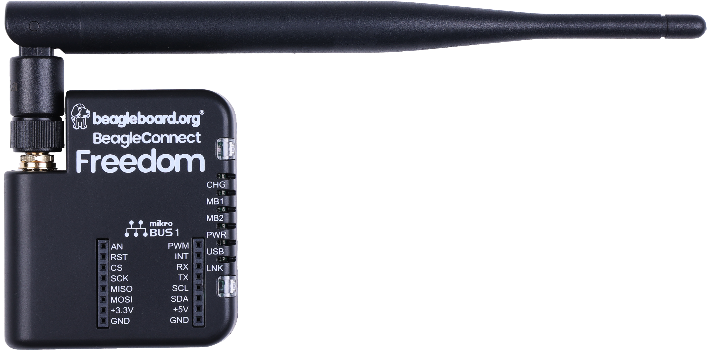

.. _beagleconnect_freedom_home:

BeagleConnect™ Freedom
######################

BeagleConnect Freedom is an open-hardware wireless hardware platform developed by BeagleBoard.org and built around the TI CC1352P7 microcontroller, which supports both 
2.4-GHz and long-range, low-power Sub-1 GHz wireless protocols. Rapidly prototyping of IoT applications is accelerated by hardware compatibility with over 1,000 mikroBUS add-on sensors,
acutators, indicators and additional connectivity and storage options, and backed with software support utilizing the Zephyr scalable and modular real-time operating system, allowing developers
to tailor the solution to their specific needs.  BeagleConnect Freedom further includes MSP430F5503 for USB-to-UART functionality, temperature and humidity sensor, light sensor, SPI flash,
battery charger, buzzer, LEDs, and JTAG connections to make it a comprehensive solution for IoT development and prototyping.

The TI CC1352P7 microcontroller (MCU) includes a 48-MHz Arm Cortex-M4F processor, 704KB Flash memory, 256KB ROM, 8KB Cache SRAM, 144KB of ultra-low leakage SRAM, and
over-the-air upgrades (OTA) capability. This MCU provides flexible support for many different protocols and bands making it suitable for many different communication requirements.

.. important::

   This is a work in progress, for latest documentation please visit https://docs.beagleboard.org/latest/

.. grid:: 1 1 2 3
   :margin: 4 4 0 0
   :gutter: 4

   .. grid-item-card::
      :link: beagleconnect-freedom-introduction
      :link-type: ref

      **1. Introduction**
      ^^^

      .. image:: media/chapter-thumbnails/introduction.jpg
         :align: center
         :alt: BeagleConnect™ Freedom Chapter1 thumbnail
      
      +++

      Introduction to BeagleConnect™ Freedom.

   .. grid-item-card::
      :link: beagleconnect-freedom-change-history
      :link-type: ref

      **2. Change History**
      ^^^

      .. image:: media/chapter-thumbnails/change-history.jpg
         :align: center
         :alt: BeagleConnect™ Freedom Chapter2 thumbnail

      +++

      Hardware, Software, and Documentation change history.

   .. grid-item-card:: 
      :link: beagleconnect-freedom-quick-start
      :link-type: ref

      **3. Quick start**
      ^^^

      .. image:: media/chapter-thumbnails/quick-start.jpg
         :align: center
         :alt: BeagleConnect™ Freedom Chapter3 thumbnail

      +++

      Getting started guide.

   .. grid-item-card:: 
      :link: beagleconnect-freedom-detailed-overview
      :link-type: ref

      **4. Detailed overview**
      ^^^

      .. image:: media/chapter-thumbnails/detailed-overview.jpg
         :align: center
         :alt: BeagleConnect™ Freedom Chapter4 thumbnail

      +++

      Detailed overview.

   .. grid-item-card:: 
      :link: beagleconnect-freedom-high-level-specifications
      :link-type: ref

      **5. High level specification**
      ^^^

      .. image:: media/chapter-thumbnails/specifications.jpg
         :align: center
         :alt: BeagleConnect™ Freedom Chapter5 thumbnail

      +++

      High level specifications.

   .. grid-item-card:: 
      :link: beagleconnect-freedom-detailed-hardware-design
      :link-type: ref

      **6. Detailed hardware design**
      ^^^

      .. image:: media/chapter-thumbnails/hardware-design.jpg
         :align: center
         :alt: BeagleConnect™ Freedom Chapter6 thumbnail

      +++

      Detailed hardware design.

   .. grid-item-card:: 
      :link: beagleconnect-freedom-connectors
      :link-type: ref

      **7. Connectors**
      ^^^

      .. image:: media/chapter-thumbnails/connectors.jpg
         :align: center
         :alt: BeagleConnect™ Freedom Chapter7 thumbnail

      +++

      Connectors pinout diagrams and more.

   .. grid-item-card:: 
      :link: beagleconnect-freedom-support
      :link-type: ref

      **8. Support**
      ^^^

      .. image:: media/chapter-thumbnails/support-documents.jpg
         :align: center
         :alt: BeagleConnect™ Freedom Chapter8 thumbnail

      +++

      User support document for easy development.

   .. grid-item-card:: 
      :link: beagleconnect-freedom-mechanical
      :link-type: ref

      **9. Mechanical**
      ^^^

      .. image:: media/chapter-thumbnails/mechanical-specifications.jpg
         :align: center
         :alt: BeagleConnect™ Freedom Chapter9 thumbnail

      +++

      Mechanical dimensions.

   .. grid-item-card:: 
      :link: beagleconnect-freedom-pictures
      :link-type: ref

      **10. Pictures**
      ^^^

      .. image:: media/chapter-thumbnails/pictures.jpg
         :align: center
         :alt: BeagleConnect™ Freedom Chapter10 thumbnail

      +++

      BeagleConnect™ Freedom board pictures.

.. toctree::
   :maxdepth: 1
   :hidden:

   /boards/beagleconnect/freedom/ch1-introduction.rst
   /boards/beagleconnect/freedom/ch2-change-history.rst
   /boards/beagleconnect/freedom/ch3-quick-start.rst
   /boards/beagleconnect/freedom/ch4-detailed-overview.rst
   /boards/beagleconnect/freedom/ch5-high-level-specifications.rst
   /boards/beagleconnect/freedom/ch6-detailed-hardware-design.rst
   /boards/beagleconnect/freedom/ch7-connectors.rst
   /boards/beagleconnect/freedom/ch8-support.rst
   /boards/beagleconnect/freedom/ch9-mechanical.rst
   /boards/beagleconnect/freedom/ch10-pictures.rst

