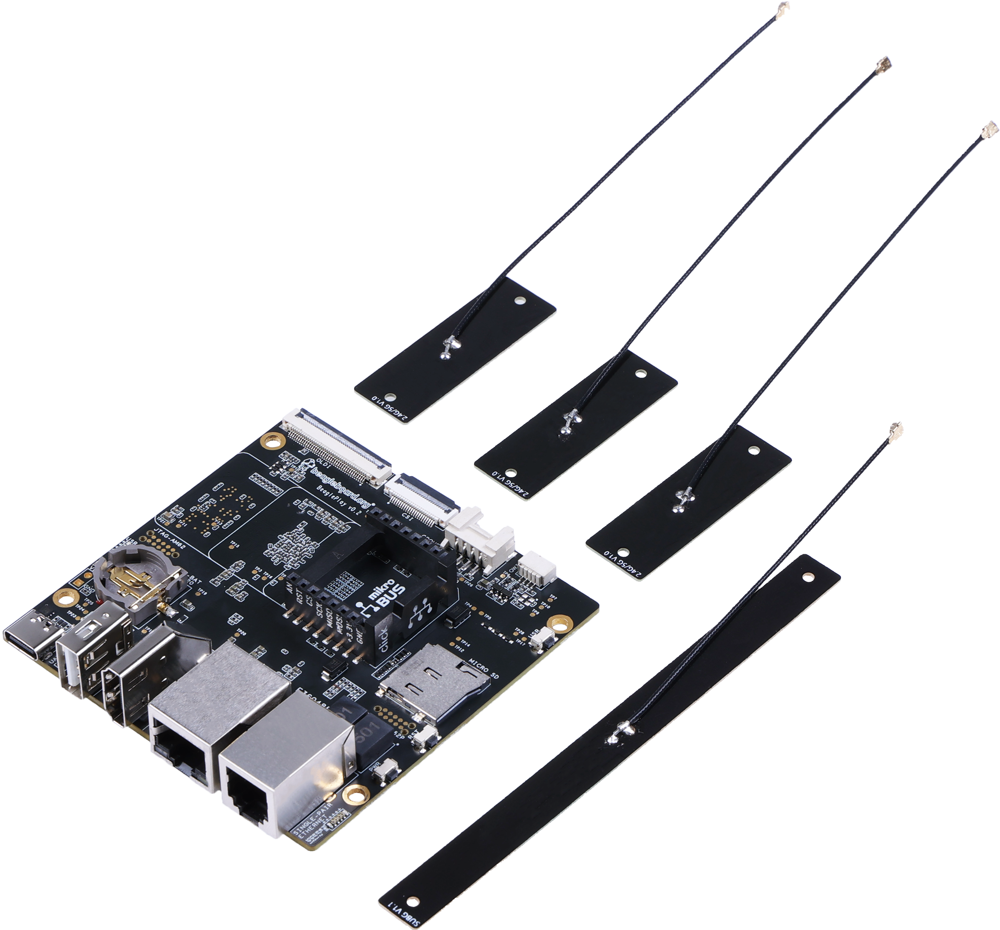
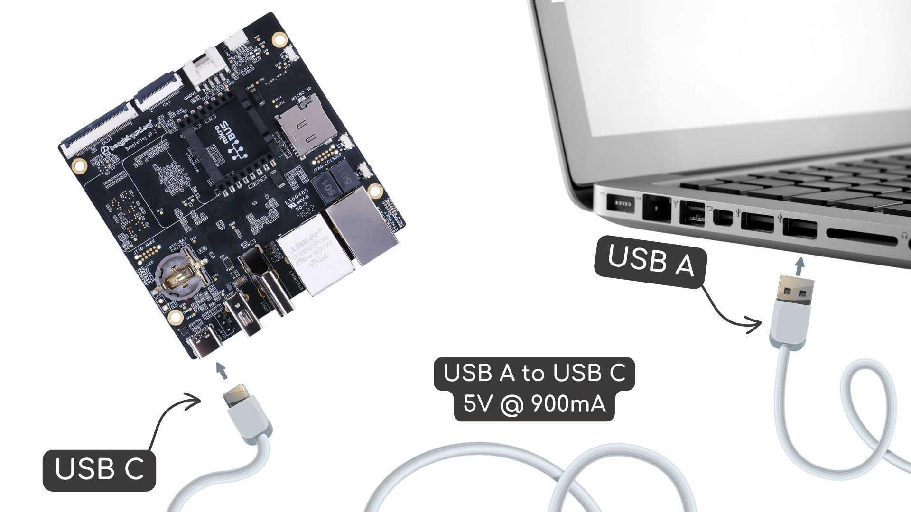
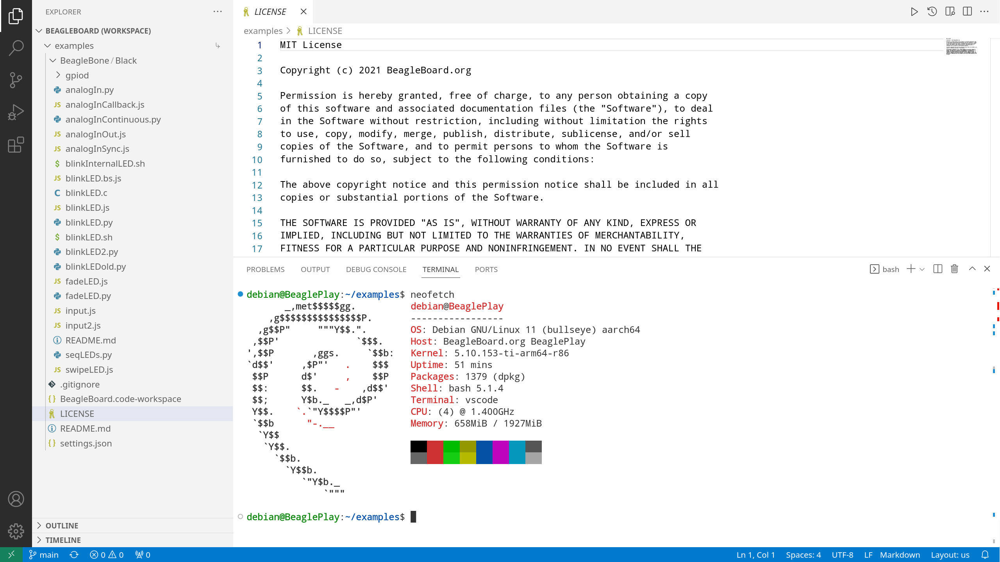

.. _beagleplay-quick-start:

Quick Start Guide
####################

.. tip::
    This section provides you with the basic quick start guide for Tutorials & demos 
    you can checout :ref:`beagleplay-demos-and-tutorials` chapter.

What's included in the box?
****************************

When you purchase a brand new BeaglePlay, In the box you'll get:

1. BeaglePlay board
2. A sub-GHz antenna
3. 3pcs 2.5GHz/5GHz antennas

Tethering to PC
****************

.. tip:: 
    Checkout :ref:`beagleboard-getting-started` for,

    1. Updating to latest software.
    2. Power and Boot.
    3. Network connection.
    4. Browsing to your Beagle.
    5. Troubleshooting.

For tethering to your PC you'll need a USB-C to USB-A data cable.

    Tethering BeaglePlay to PC

Access VSCode
****************

Once connected you can browse to ``192.168.7.2:3000`` to access the VSCode IDE 
to browse documents and start programming your BeaglePlay!

    BeaglePlay VSCode IDE (192.168.7.2:3000)

.. raw:: latex
   
   \begin{comment}

.. _beagleplay-demos-and-tutorials:

.. dropdown:: **Demos & Tutorials**
    :margin: 4 4 2 2
    :open:

    .. card::
        :margin: 4 4 2 2
        :link: beagleplay-connect-wifi
        :link-type: ref

        **01. Connect WiFi**
        ^^^

        Connect to wifi using wpa_gui & wpa_cli tools.
    
    .. card::
        :margin: 4 4 2 2
        :link: beagleplay-serial-console
        :link-type: ref

        **02. Using serial console**
        ^^^

        Use USB-UART adaptor to access boot console.

    .. card::
        :margin: 4 4 2 2
        :link: beagleplay-mikrobus
        :link-type: ref

        **03. Using mikroBUS**
        ^^^

        Use mikroBUS interface for expansion.

    .. card::
        :margin: 4 4 2 2
        :link: beagleplay-qwiic
        :link-type: ref

        **04. Using qwiic interface**
        ^^^

        Use qwiic I2C interface to connect 1000s of qwiic enabled boards.

    .. card::
        :margin: 4 4 2 2
        :link: beagleplay-grove
        :link-type: ref

        **05. Using grove modules**
        ^^^

        Learn to use grove modules.

    .. card::
        :margin: 4 4 2 2
        :link: beagleplay-csi
        :link-type: ref

        **06. Using CSI interface**
        ^^^

        Connect and use cameras via CSI interface.

    .. card::
        :margin: 4 4 2 2
        :link: beagleplay-oldi
        :link-type: ref

        **07. Using oldi**
        ^^^

        Learn to use oldi display interface.

    .. card::
        :margin: 4 4 2 2
        :link: beagleplay-zephyr-development
        :link-type: ref

        **08. Zephyr Development**
        ^^^

        Setup zephyr development environment.

.. raw:: latex

   \end{comment}

.. toctree::
   :maxdepth: 1
   :hidden:

   demos-and-tutorials/connect-wifi
   demos-and-tutorials/using-serial-console
   demos-and-tutorials/using-mikrobus
   demos-and-tutorials/using-qwiic
   demos-and-tutorials/using-grove
   demos-and-tutorials/using-csi
   demos-and-tutorials/using-oldi
   demos-and-tutorials/zephyr-cc1352-development

