.. _beagleplay-design:

Design and specifications
#########################

If you want to know how the BeaglePlay hardware is designed and what are it's 
high-level specifications then this chapter is for you. We are going to discuss 
each hardware design element in detail and provide high-level device 
specifications in  a short and crisp form as well.

.. tip:: 
    You can download BeaglePlay schematic to have clear view of 
    all the elements that makes up the BeaglePlay hardware.

    :download:`BeaglePlay schematic diagram PDF <https://git.beagleboard.org/beagleplay/beagleplay/-/blob/main/BeaglePlay_SCH_PDF.pdf>`

Block diagram
*************

The block diagram below shows all the parts that makes up your BeaglePlay board. 
BeaglePlay as mentioned in previous chapters is based on AM6254 SoC which is shown in the middle. 
Connection of other parts like power supply, memory, storage, wifi, ethernet, and others is also 
clearly shown in the block diagram. This block diagram shows the high level specifications of the 
BeaglePlay hardware and the sections below this are going to show you the individual part in 
more detail with schematic diagrams. 

.. figure:: images/block-diagrams/System-Block-Diagram.svg
    :width: 1247
    :align: center
    :alt: BeaglePlay block diagram

 

System on Chip (SoC)
*********************

`AM62x Sitara™ Processors <https://www.ti.com/product/AM625>`_ from Texas Instruments are 
Human-machine-interaction SoC with Arm® Cortex®-A53-based edge AI and full-HD dual display. 
AM6254 which is on your BeaglePlay board has a multi core design with Quad 64-bit Arm® 
Cortex®-A53 microprocessor subsystem at up to 1.4 GHz, Single-core Arm® Cortex®-M4F 
MCU at up to 400MHz, and Dedicated Device/Power Manager. Talking about the multimedia 
capabilities of the processor you can connect upto two display monitors with 1920x1080 @ 60fps 
each, additionally there is a OLDI/LVDS (4 lanes - 2x) and 24-bit RGB parallel interface for connecting 
external display panels. One 4 Lane CSI camera interface is also available which has support 
for 1,2,3 or 4 data lane mode up to 2.5Gbps speed. The list of features is very long and if you 
are interested to know more about the AM62x SoC you may take a look at
`AM62x Sitara™ Processors datasheet <https://www.ti.com/lit/ds/symlink/am625.pdf>`_.

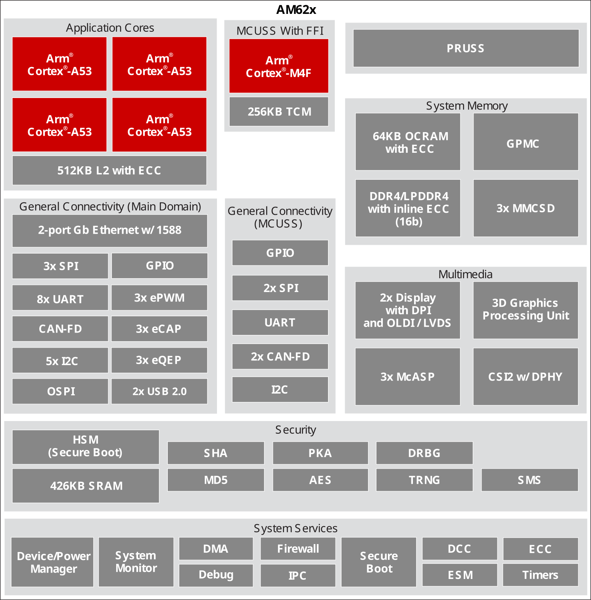

    AM6254 SoC block diagram

Power management
*****************

Different parts of the board requires different voltages to operate and to fulfill requirements of 
all the chips on BeaglePlay we have Low Drop Out (LDO) voltage regulators for fixed voltage output 
and Power Management Integrated Circuit (PMIC) that interface with SoC to generate software programable voltages. 
2 x LDOs and 1 x PMIC used on BeaglePlay are shown below.

TLV75801 - LDO
===============

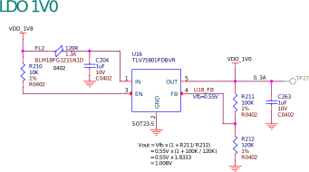

    TLV75801PDBVR LDO schematic for 1V0 output

TLV62595 - LDO
==============

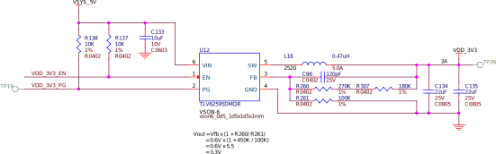

    TLV62595DMQR LDO schematic for 3V3 output

TPS65219 - PMIC
================

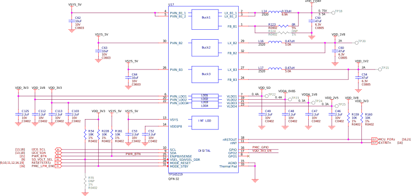

    TPS65219 Power Management Integrated Circuit (PMIC) schematic

General connectivity and expansion
***********************************

One of the main advantage of using a Single Board Computer (SBC) is having direct accessibility of 
general purpose input & output (GPIO) pins and other interfaces like I2C, SPI, ADC, PWM. Your BeaglePlay 
board shines in this domain as well with mikroBUS connector that can take 1000s of click board from 
`MikroElektronika <https://www.mikroe.com/>`_, Grove connector allows to connect hundereds of Grove modules 
from `Seeed Studio <https://www.seeedstudio.com/grove.html>`_, and QWIIC connector allows to connect I2C modules 
like QWIIC modules from spartkfun or STEMMA QT modules from Adafruit. Not only that you also get one USB-A port 
and one USB-C port. BeaglePlay's USB-A port with host support so that you can connect any USB device 
like your keyboard & mouse combo, USB-C connector allows to power the board and to connect the board to 
a PC to connect via SSH & use pre-installed and actively running VisualStudio Code at ``192.168.7.2:3000``.

USB A & USB C
==============

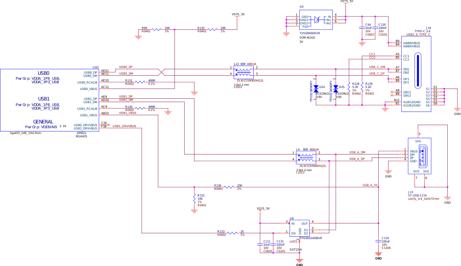

    USB-A and USB-C

ADC102S051 - 2ch 10bit ADC
===========================

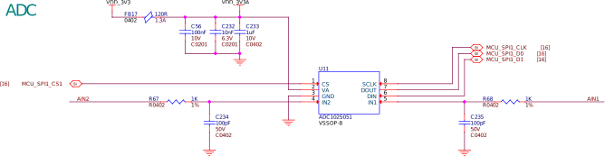

    ADC102S051 - 12bit Aanalog to Digital Converter (ADC)

mikroBUS
=========

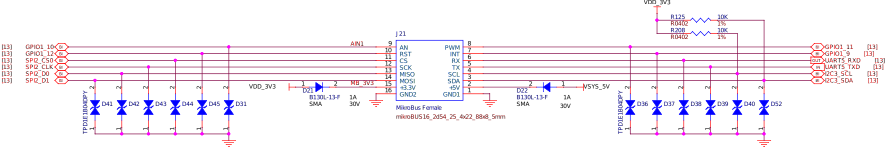

    mikroBUS connector schematic

Grove
======

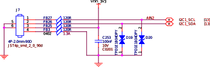

    Grove connector schematic

Qwiic
=====

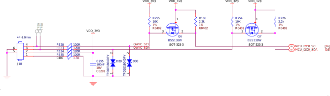

    QWIIC connnector for I2C modules

Buttons and LEDs
********************

To interact with the Single Board Computers we use buttons for input and LEDs visual feedback to the user. 
On your BeaglePlay board you'll find 3 buttons namely power, reset, and user button each with a specific purpuse. 
For visual feedback you'll see 5 user LEDs near USB-C port and 6 more indicator LEDs near you BeaglePlay board's 
Single Pair ethernet port. Schematic diagrams below shows how these button and LEDs are wired inside you BeaglePlay.

Buttons
========

.. table:: BeaglePlay buttons

    +-------------------------------------------------------------+-------------------------------------------------------------+--------------------------------------------------------+
    | Power                                                       | Reset                                                       | User                                                   |
    +=============================================================+=============================================================+========================================================+
    | .. image:: images/hardware-design/power-button.svg          | .. image:: images/hardware-design/reset-button.svg          | .. image:: images/hardware-design/power-button.svg     |
    |    :width: 742                                              |    :width: 742                                              |    :width: 742                                         |
    |    :align: center                                           |    :align: center                                           |    :align: center                                      |
    +-------------------------------------------------------------+-------------------------------------------------------------+--------------------------------------------------------+

LEDs
=====

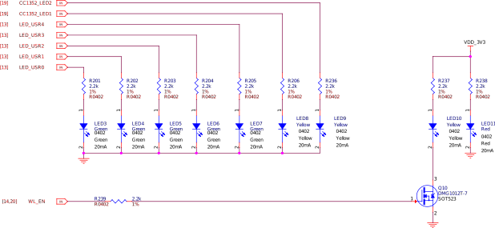

    BeaglePlay LEDs

Wired and wireless connectivity
********************************

Gigabit ethernet
=================

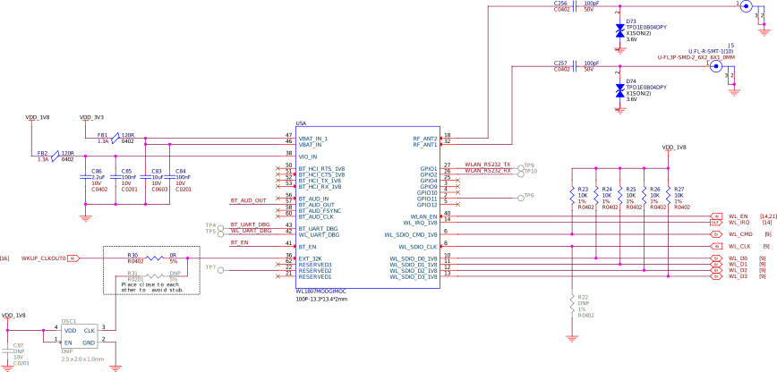

    Gigabit ethernet

Single pair ethernet
=====================

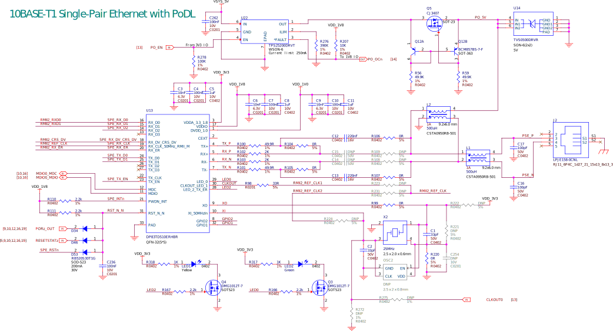

    Single pair ethernet

WL1807MOD - WiFi 2.4G/5G
=========================

    WL1807MOD dual-band (2.4G/5G) WiFi

CC1352P7 - BLE & SubGHz
========================

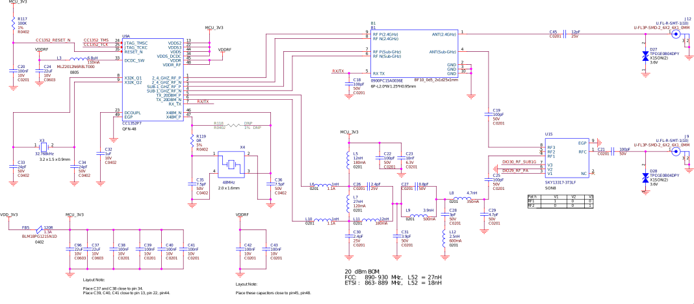

    CC1352P7 Bluetooth Low Energy (BLW) and SubGHz connectivity

Memory, Media and Data storage
********************************

DDR4
====

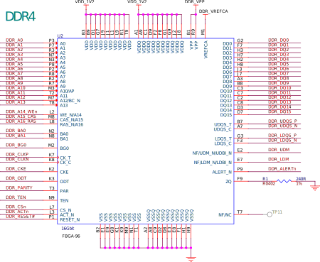

    DDR4 Memory

eMMC/SD
=======

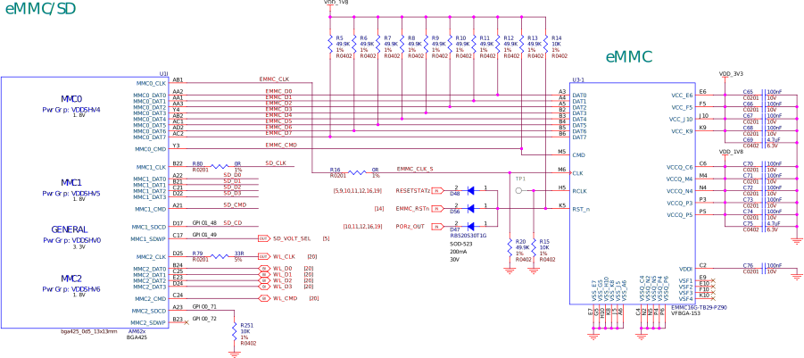

    eMMC/SD storage

microSD Card
=============

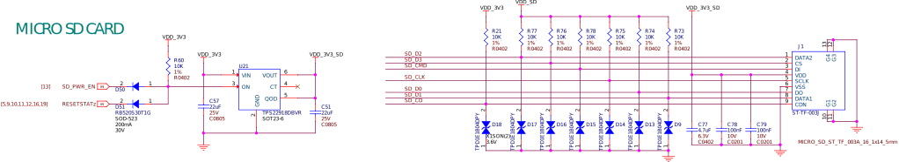

    microSD Card storage slot

Board EEPROM
=============

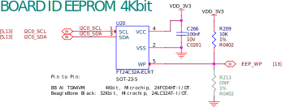

    Board EEPROM ID

Multimedia I/O
***************

HDMI
=====

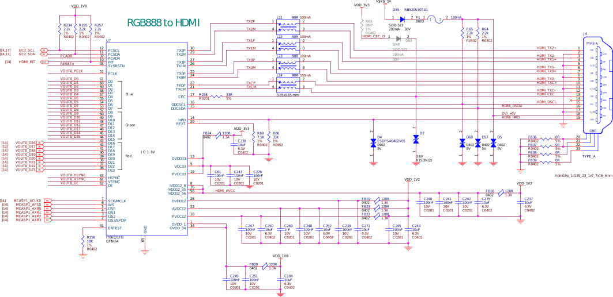

    HDMI output

OLDI
=====

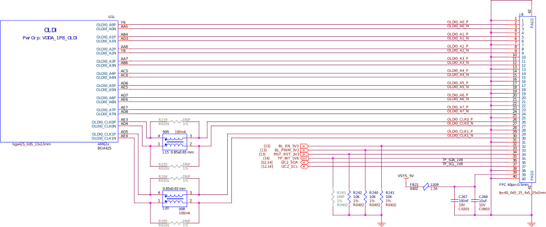

    OLDI display interface

CSI
====

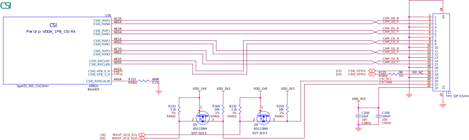

    CSI camera interface

RTC & Debug
************

RTC
====

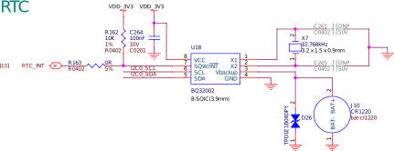

    Real Time Clock (RTC)

UART Debug port
================

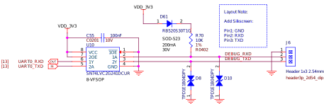

    UART debug port

AM62x JTAG & TagConnect
=======================

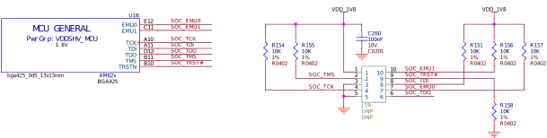

    AM62 JTAG debug port and TagConnect interface

CC1352 JTAG & TagConnect
========================

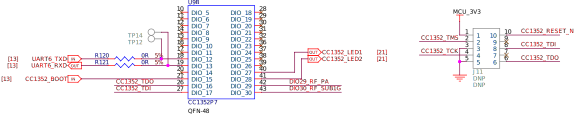

    CC1352 JTAG debug port and TagConnect interface

.. _beagleplay-mechanical-specifications:

Mechanical Specifications 
**************************

Dimensions & weight
===================

.. table:: Dimensions & weight

    +--------------------+----------------------------------------------------+
    | Parameter          | Value                                              |
    +====================+====================================================+
    | Size               | 82.5x80x20mm                                       |
    +--------------------+----------------------------------------------------+
    | Max heigh          | 20mm                                               |
    +--------------------+----------------------------------------------------+
    | PCB Size           | 80x80mm                                            |
    +--------------------+----------------------------------------------------+
    | PCB Layers         | 8 layers                                           |
    +--------------------+----------------------------------------------------+
    | PCB Thickness      | 1.6mm                                              |
    +--------------------+----------------------------------------------------+
    | RoHS compliant     | Yes                                                |
    +--------------------+----------------------------------------------------+
    | Weight             | 55.3g                                              |
    +--------------------+----------------------------------------------------+

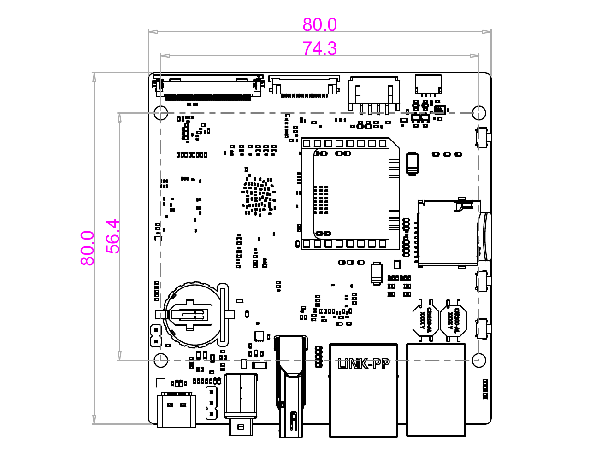

    BeaglePlay board dimensions

.. figure:: images/side-dimensions.png
    :width: 700
    :align: center
    :alt: BeaglePlay board side dimensions

    BeaglePlay board side dimensions

