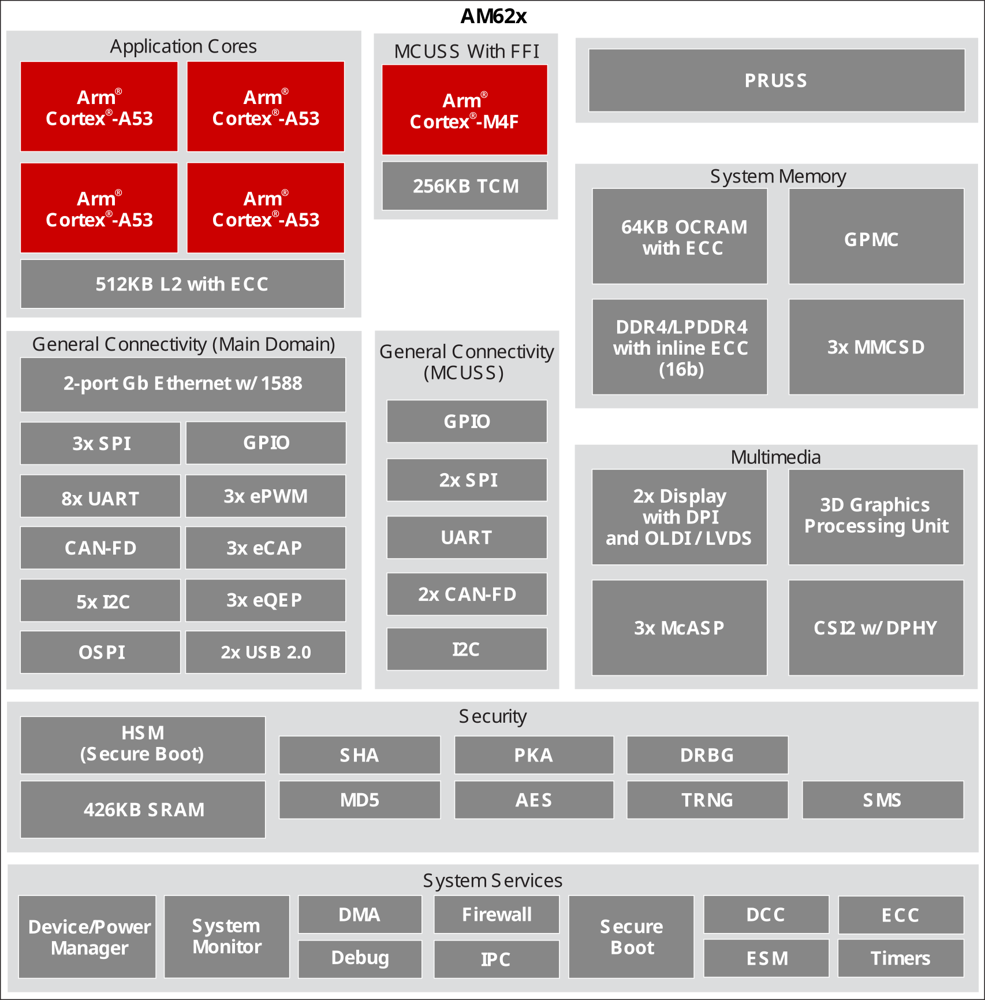
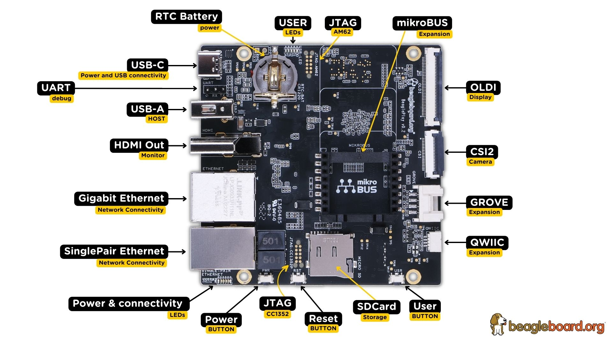
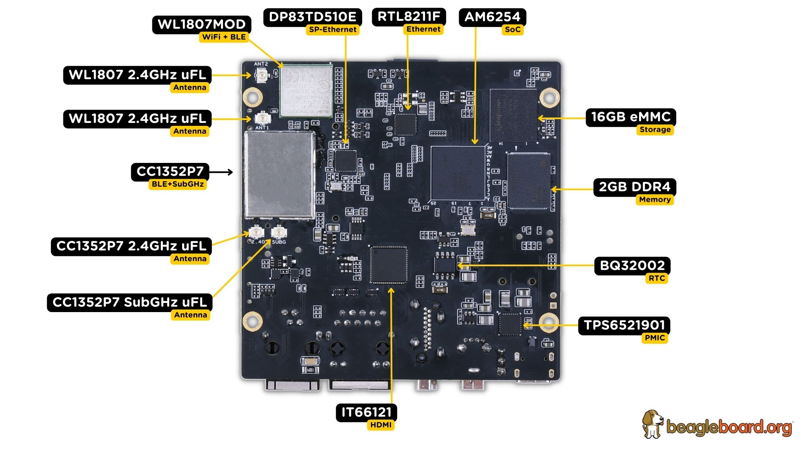

.. _beagleplay-detailed-overview:

Detailed overview
##################

BeaglePlay is built around Texas Instruments AM62x Sitara™ Processors which is a 
Human-machine-interaction SoC with Arm® Cortex®-A53. It comes with 2GB DDR4 RAM, 16GB eMMC storage,
Full size HDMI, USB-A host port, USB-C power & connectivity port, serial debug interface, and much more. 

.. table:: BeaglePlay features
        
    +----------------------------+---------------------------------------------------------------------------+
    | Feature                    | Description                                                               |
    +============================+===========================================================================+
    | Processor                  | TI AM6254 (multicore A53s with R5, M4s and PRUs)                          |
    +----------------------------+---------------------------------------------------------------------------+
    | PMIC                       | TPS6521901                                                                |
    +----------------------------+---------------------------------------------------------------------------+
    | Memory                     | 2GB DDR4                                                                  |
    +----------------------------+---------------------------------------------------------------------------+
    | Storage                    | 16GB eMMC                                                                 |
    +----------------------------+---------------------------------------------------------------------------+
    | WiFi                       | - PHY: WL1807MOD (roadmap to next-gen TI WiFi)                            |
    |                            | - Antennas: 2.4GHz & 5GHz                                                 |
    +----------------------------+---------------------------------------------------------------------------+
    | BLE/SubG                   | - CC1352P7 M4+M0 with BeagleConnect firmware                              |
    |                            | - BeagleConnect Wireless enabled                                          |
    |                            | - Antennas: 2.4GHz & SubG IEEE802.15.4 software defined radio (SDR)       |
    +----------------------------+---------------------------------------------------------------------------+
    | Ethernet                   | - PHY: Realtek RTL8211F-VD-CG gigabit Ethernet phy                        |
    |                            | - Connector: integrated magnetics RJ-45                                   |
    +----------------------------+---------------------------------------------------------------------------+
    | Single-pair Ethernet       | - BeagleConnect Wired enabled                                             |
    |                            | - PHY: DP83TD510E 10Mbit single-pair Ethernet phy                         |
    |                            | - Connector: RJ-11 jack                                                   |
    |                            | - Power (PoDL): Input: N/A (protection to 12V), Output: 5V @ 250mA        |
    |                            | - Isolation: ???                                                          |
    +----------------------------+---------------------------------------------------------------------------+
    | USB type-C                 | - PD/CC: None, HS shorted to both sides                                   |
    |                            | - Power: Input: 5V @ 3A, Output: N/A                                      |
    +----------------------------+---------------------------------------------------------------------------+
    | HDMI                       | - PHY: IT66121                                                            |
    |                            | - Connector: full-size                                                    |
    +----------------------------+---------------------------------------------------------------------------+
    | Other connectors           | - microSD                                                                 |
    |                            | - USB type-A (480Mbit)                                                    |
    |                            | - mikroBUS connector (I2C/UART/SPI/MCAN/MCASP/PWM/GPIO)                   |
    |                            | - Grove connector (I2C/UART/ADC/PWM/GPIO)                                 |
    |                            | - QWIIC connector (I2C)                                                   |
    |                            | - CSI connector like BBAI-64/R-Pi                                         |
    |                            | - OLDI connector (40-pin)                                                 |
    +----------------------------+---------------------------------------------------------------------------+
            
AM6254 SoC 
***********

The low-cost AM62x Sitara™ MPU family of application processors are built for Linux® application development. 
With scalable Arm® Cortex®-A53 performance and embedded features, such as: dual-display support and 3D 
graphics acceleration, along with an extensive set of peripherals that make the AM62x device well-suited 
for a broad range of industrial and automotive applications while offering intelligent features and optimized 
power architecture as well.

Some of these applications include:

- Industrial HMI
- EV charging stations
- Touchless building access
- Driver monitoring systems

AM62x Sitara™ processors are industrial-grade in the 13 x 13 mm package (ALW) and can meet the AEC-Q100 
automotive standard in the 17.2 x 17.2 mm package (AMC). Industrial and Automotive functional safety 
requirements can be addressed using the integrated Cortex-M4F cores and dedicated peripherals, which 
can all be isolated from the rest of the AM62x processor.

.. tip:: 
    For more details checkout https://www.ti.com/product/AM625

The 3-port Gigabit Ethernet switch has one internal port and two external ports with Time-Sensitive 
Networking (TSN) support. An additional PRU module on the device enables real-time I/O capability 
for customer’s own use cases. In addition, the extensive set of peripherals included in AM62x 
enables system-level connectivity, such as: USB, MMC/SD, Camera interface, OSPI, CAN-FD and GPMC 
for parallel host interface to an external ASIC/FPGA. The AM62x device also supports secure boot 
for IP protection with the built-in Hardware Security Module (HSM) and employs advanced power management 
support for portable and power-sensitive applications

    AM6254 SoC block diagram

Board components location
**************************

This section describes the key components on the board, their location and function.

Front components location
==========================

    BeaglePlay board front components location

.. table:: BeaglePlay board front components location
    :align: center
        
    +----------------------------+---------------------------------------------------------------------------+
    | Feature                    | Description                                                               |
    +============================+===========================================================================+
    | RTC Battery                | BQ32002 Real Time Clock (RTC) Battery holder takes CR1220 3V battery      |
    +----------------------------+---------------------------------------------------------------------------+
    | User LEDs                  | Five user LEDs, :ref:`board-power-and-boot` section provides more details.|
    |                            | These LEDs are connect to the AM6254 SoC.                                 |
    +----------------------------+---------------------------------------------------------------------------+
    | JTAG (AM62)                | AM6254 SoC JTAG debug port.                                               |
    +----------------------------+---------------------------------------------------------------------------+
    | mikroBUS                   | MikroElectronica mikroBUS connected to CC1352P7 for MikroE Click boards.  |
    +----------------------------+---------------------------------------------------------------------------+
    | OLDI                       | AM6254 OpenLDI(OLDI) display port.                                        |
    +----------------------------+---------------------------------------------------------------------------+
    | CSI2                       | AM6254 Camera Serial Interface (CSI2).                                    |
    +----------------------------+---------------------------------------------------------------------------+
    | Grove                      | SeeedStudio grove modules connection port.                                |
    +----------------------------+---------------------------------------------------------------------------+
    | QWIIC                      | SparkFun QWIIC / Adafruit STEMMA-QT port for I2C modules connectivity.    |
    +----------------------------+---------------------------------------------------------------------------+
    | User Button                | Programmable user button, also servers as boot mode slect button          |
    |                            | (SDCard/eMMC). Press down to select SD Card as boot medium.               |
    +----------------------------+---------------------------------------------------------------------------+
    | SDCard                     | Use to expand storage, boot linux image or flash latest image on eMMC.    |
    +----------------------------+---------------------------------------------------------------------------+
    | Reser button               | Press to reset BeaglePlay board (AM6254 SoC).                             |
    +----------------------------+---------------------------------------------------------------------------+
    | JTAG (CC1352)              | JTAG debug port for CC1352P7.                                             |
    +----------------------------+---------------------------------------------------------------------------+
    | Power button               | Press to shut-down (OFF), hold down to boot (ON).                         |
    +----------------------------+---------------------------------------------------------------------------+
    | Power & Connectivity LEDs  | Indicator LEDs for Power ON, CC1352 RF, and Single-pair connectivity.     |
    +----------------------------+---------------------------------------------------------------------------+
    | Single-pair Ethernet       | Single-pair Ethernet connectivity port with power over data line.         |
    +----------------------------+---------------------------------------------------------------------------+
    | GigaBit Ethernet           | 1Gb/s Wired internet connectivity.                                        |
    +----------------------------+---------------------------------------------------------------------------+
    | HDMI Output                | Full size HDMI port for connecting to external display monitors.          |
    +----------------------------+---------------------------------------------------------------------------+
    | USB-A host port            | Port to connect USB devices like cameras, keyboard & mouse combos, etc.   |
    +----------------------------+---------------------------------------------------------------------------+
    | USB-C port                 | Power and tethered connection port.                                       |
    +----------------------------+---------------------------------------------------------------------------+

Back components location
==========================

    BeaglePlay board back components location

.. table:: BeaglePlay board back components location
    :align: center
        
    +----------------------------+---------------------------------------------------------------------------+
    | Feature                    | Description                                                               |
    +============================+===========================================================================+
    | CC1352P7                   | 2.4GHz BLE + SubG IEEE802.15.4 with 1 x 2.4GHz + 1 x SubG uFL antenna.    |
    +----------------------------+---------------------------------------------------------------------------+
    | WL1807MOD                  | Dual band (2.4GHz & 5GHz) WiFi module with 2 x uFL antennas.              |
    +----------------------------+---------------------------------------------------------------------------+
    | DP83TD510E                 | Single-pair ethernet PHY.                                                 |
    +----------------------------+---------------------------------------------------------------------------+
    | RTL8211F                   | Ethernet PHY.                                                             |
    +----------------------------+---------------------------------------------------------------------------+
    | AM6254                     | Main SoC.                                                                 |
    +----------------------------+---------------------------------------------------------------------------+
    | 16GB eMMC                  | Flash storage.                                                            |
    +----------------------------+---------------------------------------------------------------------------+
    | 2GB DDR$                   | RAM / Memory.                                                             |
    +----------------------------+---------------------------------------------------------------------------+
    | BQ32002                    | Real Time Clock (RTC).                                                    |
    +----------------------------+---------------------------------------------------------------------------+
    | TPS6521901                 | Power management IC.                                                      |
    +----------------------------+---------------------------------------------------------------------------+
    | IT66121                    | HDMI PHY.                                                                 |
    +----------------------------+---------------------------------------------------------------------------+