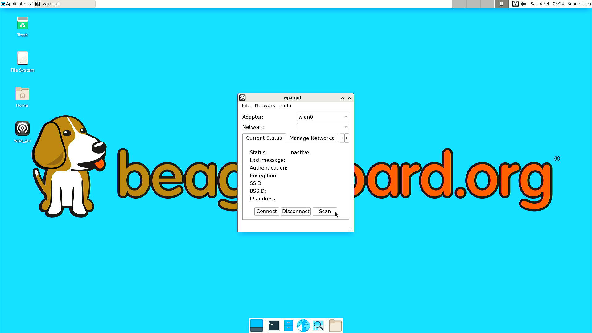
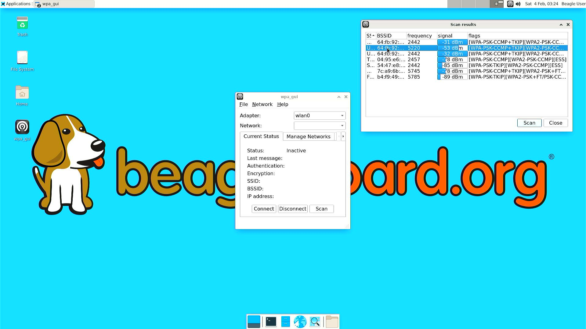
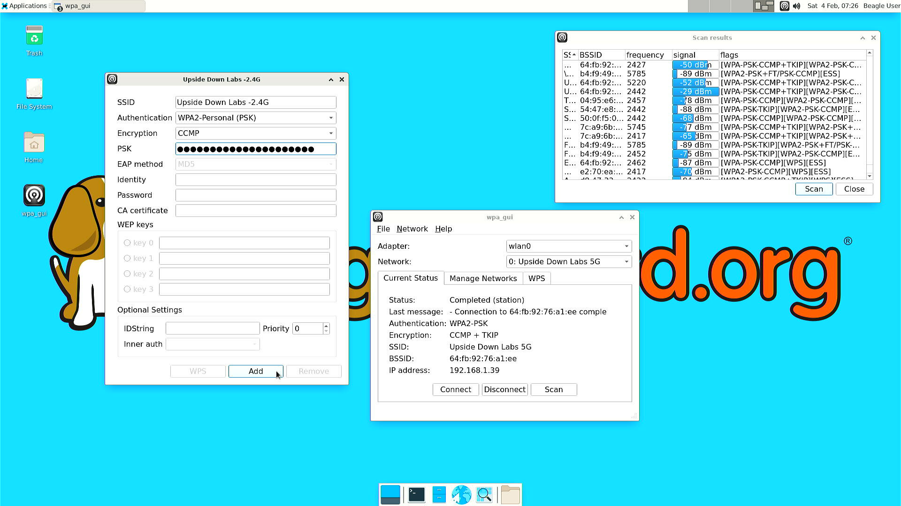
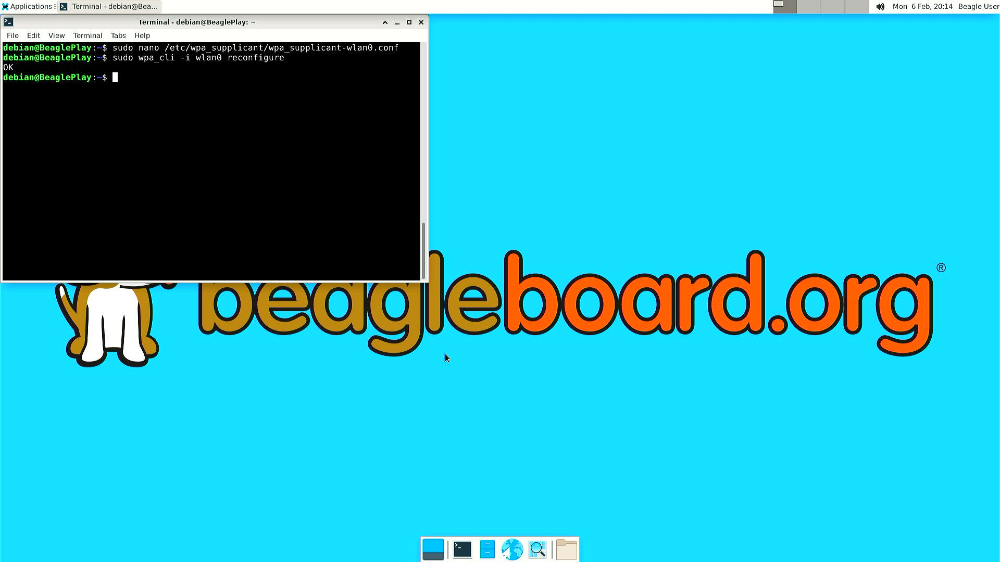
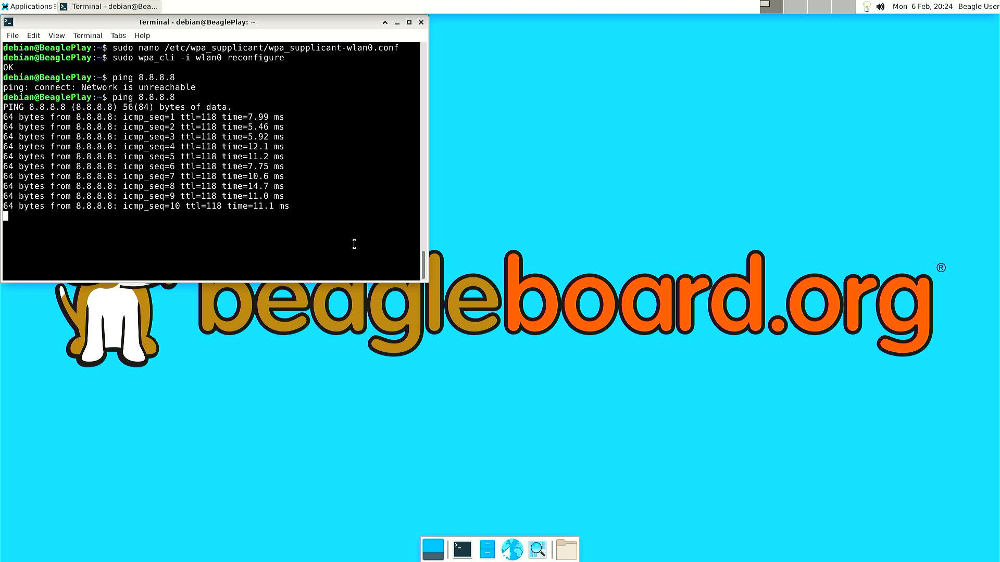

.. _beagleplay-connect-wifi:

Connect WiFi
#############

wpa_gui
********

Simplest way to connect to WiFi is to use ``wpa_gui`` tool pre-installed on your BeaglePlay. 
Follow simple steps below to connect to any WiFi access point.

Step 1: Starting wpa_gui
=========================

You can start ``wpa_gui`` either from ``Applications > Internet > wpa_gui`` or double click on the ``wpa_gui`` desktop application shortcut.

    Starting wpa_gui from Applications > Internet > wpa_gui

    Starting wpa_gui from Desktop application shortcut    

Step 2: Understanding wpa_gui interface
========================================

Let's see the ``wpa_gui`` interface in detail,

1. ``Adapter`` is the WiFi interface device, it should be ``wlan0`` (on-board WiFi) by default.
2. ``Network`` shows the WiFi access point ``SSID`` if you are connected to that network.
3. ``Current Status`` tab shows you network information if you are connected to any network.
    - Click on ``Connect`` to connect if not automatically done.
    - Click on ``Disconnect`` to disconnect/reset the connection.
    - Click on ``Scan`` to scan nearby WiFi access points.
4. ``Manage Network`` tab shows you all the saved networks and options to manage those.

    wpa_gui interface

Step 3: Scanning & Connecting to WiFi access points
====================================================

To scan the WiFi access points around you, just click on ``Scan`` button availale under 
``wpa_gui > Current Status > Scan``.

    Scanning WiFi access points

A new window will open up with,

1. SSID (WiFi name)
2. BSSID
3. Frequency
4. Signal strength
5. flags

Now, you just have to double click on the Network you want to connect to as shown below.

.. note:: 
    SSIDs and BSSIDs are not fully visible in screenshot below 
    but you can change the column length to see the WiFi names better.

    Selecting WiFi access point

Final step is to type your WiFi access point password under ``PSK`` input field and 
click on ``Add`` (as shown in screenshot below) which will automatically connect 
your board to WiFi (if password is correct). 

    Connecting to WiFi access point

wpa_cli (console)
*****************

.. tip:: 
    Checkout :ref:`beagleplay-serial-console` section.

Connect your BeaglePlay to a USB to UART cable through the UART debug 
header pins near USB-C port of BeaglePlay. 

.. table:: connecting BeaglePlay to USB-UART bridge

    +-------------------------+----------------------------+
    | USB to UART debug probe | BeaglePlay UART debug port |
    +=========================+============================+
    | Transmit (TX)           | Recieve (RX)               |
    +-------------------------+----------------------------+
    | Recieve (RX)            | Transmit (RX)              |
    +-------------------------+----------------------------+
    | Ground (GND)            | Ground (GND)               |
    +-------------------------+----------------------------+

After getting the access to BeaglePlay's console using application like ``tio`` 
you can follow the exact steps in the section below to setup your WiFi using ``wpa_cli``.

wpa_cli (XFCE)
**************

Another way of connecting to a WiFi access point is to use ``wpa_cli`` tool.

Step 1: Open up terminal
=========================

Open up a terminal window either from ``Applications > Terminal Emulator`` Or from Task Manager.

    Open terminal from Applications > Terminal Emulator    

    Open terminal from Task Manager

Step 2: Setup credentials
=========================

To setup credentials of your WiFi access point follow these steps,

1. Execute ``sudo nano /etc/wpa_supplicant/wpa_supplicant-wlan0.conf``, 
which will open up ``wpa_supplicant-wlan0.conf`` inside ``nano`` (terminal based) text editor.
2. Edit ``wpa_supplicant-wlan0.conf`` to add SSID (WiFi name) & PSK (WiFi password) of your WiFi access point.

.. code-block::

    ....
    network={
            ssid="WiFi Name"
            psk="WiFi Password"
            ....
    }

3. Now save the details using ``ctrl + O`` then enter.
4. To exit out of the ``nano`` text editor use ``ctrl + X``.

    Run: $ sudo nano /etc/wpa_supplicant/wpa_supplicant-wlan0.conf

    Add SSID and PSK

    Save credentials (ctrl + O) and Exit (ctrl + X)

Step 3: Reconfigure wlan0
=========================

The WiFi doesn't automatically connect to your WiFi access point 
after you add the credentials to ``wpa_supplicant-wlan0.conf``. 

1. To connect you can either execute ``sudo wpa_cli -i wlan0 reconfigure`` 
2. Or Reboot your device by executing ``reboot`` inside your terminal window.
3. Execute ``ping 8.8.8.8`` to check your connection. Use ``ctrl + C`` to quit.

.. code-block:: shell

    debian@BeaglePlay:~$ ping 8.8.8.8
    PING 8.8.8.8 (8.8.8.8) 56(84) bytes of data.
    64 bytes from 8.8.8.8: icmp_seq=1 ttl=118 time=5.83 ms
    64 bytes from 8.8.8.8: icmp_seq=2 ttl=118 time=7.27 ms
    64 bytes from 8.8.8.8: icmp_seq=3 ttl=118 time=5.30 ms
    64 bytes from 8.8.8.8: icmp_seq=4 ttl=118 time=5.28 ms
    64 bytes from 8.8.8.8: icmp_seq=5 ttl=118 time=9.04 ms
    64 bytes from 8.8.8.8: icmp_seq=6 ttl=118 time=7.52 ms
    64 bytes from 8.8.8.8: icmp_seq=7 ttl=118 time=5.39 ms
    64 bytes from 8.8.8.8: icmp_seq=8 ttl=118 time=5.94 ms
    ^C
    --- 8.8.8.8 ping statistics ---
    8 packets transmitted, 8 received, 0% packet loss, time 7008ms
    rtt min/avg/max/mdev = 5.281/6.445/9.043/1.274 ms

    Connect to WiFi by running $ sudo wpa_cli -i wlan0 reconfigure

    To check connection try running $ ping 8.8.8.8 