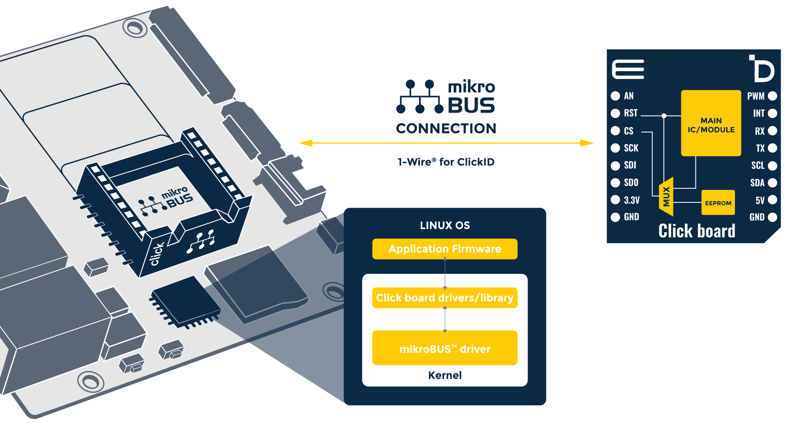

.. _beagleplay-mikrobus:

Using mikroBUS
##############

Steps:

1. Identify if mikroBUS add-on includes a ClickID with ``manifest``. If not, ``manifest`` must be supplied.
2. Identify if mikroBUS add-on is supported by the kernel. If not, kernel module must be added.
3. Identify how driver exposes the data: IIO, net, etc.
4. Connect and power
5. Verify and utilize

.. _beagleplay-mikrobus-clickid:

Using boards with ClickID
*************************

What is mikroBUS?
=================

mikroBUS is an open standard for add-on boards for sensors, connectivity, displays, storage and more with over 1,400 available from just a single source, `MikroE <https://www.mikroe.com/click>`_. With the flexibility of all of the most common embedded serial busses, UART, I2C and SPI, along with ADC, PWM and GPIO functions, it is a great solution for connecting all sorts of electronics.

.. note::

   Learn more at https://www.mikroe.com/mikrobus

What is ClickID?
================

ClickID enables mikroBUS add-on boards to be identified along with the configuration required to use it with the mikroBUS Linux driver. The configuration portion is called a ``manifest``.

.. note::

   Learn more at https://github.com/MikroElektronika/click_id

BeaglePlay's Linux kernel is patched with a mikrobus driver that automatically reads the ClickID and loads a driver, greatly simplifying usage.

Does my add-on have ClickID?
============================

Look for the ``'D`` logo on the board. It's near PWM pin on upper right hand side in the illustration shown below.

   mikroBUS clickID - BeaglePlay connection

If your add-on has ClickID, simply connect it while BeaglePlay is powered off and then apply power.

Example of examining boot log to see a ClickID was detected.

.. code:: shell-session

   debian@BeaglePlay:~$ dmesg | grep mikrobus
   [    2.096254] mikrobus:mikrobus_port_register: registering port mikrobus-0
   [    2.096325] mikrobus mikrobus-0: mikrobus port 0 eeprom empty probing default eeprom
   [    2.663698] mikrobus_manifest:mikrobus_manifest_attach_device: parsed device 1, driver=opt3001, protocol=3, reg=44
   [    2.663711] mikrobus_manifest:mikrobus_manifest_parse:  Ambient 2 Click manifest parsed with 1 devices
   [    2.663783] mikrobus mikrobus-0: registering device : opt3001

.. important::
   
   Not all Click boards with ClickID have valid ``manifest`` entries.
   If your add-on has clickID but shows the command output like below. 

   .. code:: shell-session

      debian@BeaglePlay:~$ dmesg | grep mikrobus
      [    2.119771] mikrobus:mikrobus_port_register: registering port mikrobus-0 
      [    2.119842] mikrobus mikrobus-0: mikrobus port 0 eeprom empty probing default eeprom
      [    2.261113] mikrobus_manifest:mikrobus_manifest_header_validate: manifest version too new (150.189 > 0.3)
      [    2.261130] mikrobus mikrobus-0: invalid manifest size -22

   Then you can follow same steps of :ref:`beagleplay-mikrobus-without-clickid` to make your 
   add-on detected.

To use the add-on, see :ref:`beagleplay-mikrobus-using`.

.. _beagleplay-mikrobus-without-clickid:

What if my add-on doesn't have ClickID?
***************************************
If add-on doesn't have clickID then it can not be detected directly.

.. code:: shell-session 

   debian@BeaglePlay:~$ dmesg | grep mikrobus
   [    2.123994] mikrobus:mikrobus_port_register: registering port mikrobus-0 
   [    2.124059] mikrobus mikrobus-0: mikrobus port 0 eeprom empty probing default eeprom

Available ``manifest`` can be installed that has been created for your add-on as we have created over 100 of them. 
You can install the existing manifest files onto your BeaglePlay. First, make sure you have the 
latest manifests installed in your system.

.. code:: console

   sudo apt update
   sudo apt install bbb.io-clickid-manifests

Take a look at the list of ``manifest`` files to see if the Click or other mikrobus add-on board ``manifest`` is installed.

.. code:: shell-session

   debian@BeaglePlay:~$ ls /lib/firmware/mikrobus/
   10DOF-CLICK.mnfb          COMPASS-2-CLICK.mnfb       I2C-2-SPI-CLICK.mnfb        PWM-CLICK.mnfb
   13DOF-2-CLICK.mnfb        COMPASS-CLICK.mnfb         I2C-MUX-CLICK.mnfb          RFID-CLICK.mnfb
   3D-HALL-3-CLICK.mnfb      CURRENT-CLICK.mnfb         ILLUMINANCE-CLICK.mnfb      RF-METER-CLICK.mnfb
   3D-HALL-6-CLICK.mnfb      DAC-7-CLICK.mnfb           IR-GESTURE-CLICK.mnfb       RMS-TO-DC-CLICK.mnfb
   6DOF-IMU-2-CLICK.mnfb     DAC-CLICK.mnfb             IR-THERMO-2-CLICK.mnfb      RTC-6-CLICK.mnfb
   6DOF-IMU-4-CLICK.mnfb     DIGIPOT-3-CLICK.mnfb       LED-DRIVER-7-CLICK.mnfb     SHT1x-CLICK.mnfb
   6DOF-IMU-6-CLICK.mnfb     DIGIPOT-CLICK.mnfb         LIGHTRANGER-2-CLICK.mnfb    SHT-CLICK.mnfb
   6DOF-IMU-8-CLICK.mnfb     EEPROM-2-CLICK.mnfb        LIGHTRANGER-3-CLICK.mnfb    SMOKE-CLICK.mnfb
   9DOF-CLICK.mnfb           EEPROM-3-CLICK.mnfb        LIGHTRANGER-CLICK.mnfb      TEMP-HUM-11-CLICK.mnfb
   ACCEL-3-CLICK.mnfb        EEPROM-CLICK.mnfb          LPS22HB-CLICK.mnfb          TEMP-HUM-12-CLICK.mnfb
   ACCEL-5-CLICK.mnfb        ENVIRONMENT-CLICK.mnfb     LSM303AGR-CLICK.mnfb        TEMP-HUM-3-CLICK.mnfb
   ACCEL-6-CLICK.mnfb        ETH-CLICK.mnfb             LSM6DSL-CLICK.mnfb          TEMP-HUM-4-CLICK.mnfb
   ACCEL-8-CLICK.mnfb        ETH-WIZ-CLICK.mnfb         MAGNETIC-LINEAR-CLICK.mnfb  TEMP-HUM-7-CLICK.mnfb
   ACCEL-CLICK.mnfb          FLASH-2-CLICK.mnfb         MAGNETIC-ROTARY-CLICK.mnfb  TEMP-HUM-9-CLICK.mnfb
   ADC-2-CLICK.mnfb          FLASH-CLICK.mnfb           MICROSD-CLICK.mnfb          TEMP-HUM-CLICK.mnfb
   ADC-3-CLICK.mnfb          GENERIC-SPI-CLICK.mnfb     MPU-9DOF-CLICK.mnfb         TEMP-LOG-3-CLICK.mnfb
   ADC-5-CLICK.mnfb          GEOMAGNETIC-CLICK.mnfb     MPU-IMU-CLICK.mnfb          TEMP-LOG-4-CLICK.mnfb
   ADC-8-CLICK.mnfb          GNSS-4-CLICK.mnfb          NO2-2-CLICK.mnfb            TEMP-LOG-6-CLICK.mnfb
   ADC-CLICK.mnfb            GNSS-7-CLICK.mnfb          NO2-CLICK.mnfb              THERMO-12-CLICK.mnfb
   AIR-QUALITY-2-CLICK.mnfb  GNSS-ZOE-CLICK.mnfb        OLEDB-CLICK.mnfb            THERMO-15-CLICK.mnfb
   AIR-QUALITY-3-CLICK.mnfb  GSR-CLICK.mnfb             OLEDC-CLICK.mnfb            THERMO-17-CLICK.mnfb
   AIR-QUALITY-5-CLICK.mnfb  GYRO-2-CLICK.mnfb          OLEDW-CLICK.mnfb            THERMO-3-CLICK.mnfb
   ALCOHOL-2-CLICK.mnfb      GYRO-CLICK.mnfb            OZONE-2-CLICK.mnfb          THERMO-4-CLICK.mnfb
   ALCOHOL-3-CLICK.mnfb      HALL-CURRENT-2-CLICK.mnfb  PRESSURE-11-CLICK.mnfb      THERMO-7-CLICK.mnfb
   ALTITUDE-3-CLICK.mnfb     HALL-CURRENT-3-CLICK.mnfb  PRESSURE-3-CLICK.mnfb       THERMO-8-CLICK.mnfb
   ALTITUDE-CLICK.mnfb       HALL-CURRENT-4-CLICK.mnfb  PRESSURE-4-CLICK.mnfb       THERMO-CLICK.mnfb
   AMBIENT-2-CLICK.mnfb      HDC1000-CLICK.mnfb         PRESSURE-CLICK.mnfb         THERMOSTAT-3-CLICK.mnfb
   AMBIENT-4-CLICK.mnfb      HEART-RATE-3-CLICK.mnfb    PROXIMITY-10-CLICK.mnfb     UV-3-CLICK.mnfb
   AMBIENT-5-CLICK.mnfb      HEART-RATE-4-CLICK.mnfb    PROXIMITY-2-CLICK.mnfb      VACUUM-CLICK.mnfb
   AMMETER-CLICK.mnfb        HEART-RATE-5-CLICK.mnfb    PROXIMITY-5-CLICK.mnfb      VOLTMETER-CLICK.mnfb
   COLOR-2-CLICK.mnfb        HEART-RATE-7-CLICK.mnfb    PROXIMITY-9-CLICK.mnfb      WAVEFORM-CLICK.mnfb
   COLOR-7-CLICK.mnfb        HEART-RATE-CLICK.mnfb      PROXIMITY-CLICK.mnfb        WEATHER-CLICK.mnfb

Below command to grant root privileges of the intended user and then enter passsword.
This will take you to the different shell.

.. code:: bash

   sudo su

Then, load the appropriate ``manifest`` using the ``mikrobus`` bus driver. For example, with the Ambient 2 Click, 
you can write that ``manifest`` to the ``mikrobus-0`` ``new_device`` entry.

.. code:: bash

   cat /lib/firmware/mikrobus/AMBIENT-2-CLICK.mnfb > /sys/bus/mikrobus/devices/mikrobus-0/new_device

You can now exit this shell.

.. code:: shell

   exit

Once done, you can check it using command ``dmesg | grep mikrobus`` which shows that
add-on is now detected.

.. code:: shell-session

   debian@BeaglePlay:~$ dmesg | grep mikrobus
   [    2.096254] mikrobus:mikrobus_port_register: registering port mikrobus-0
   [    2.096325] mikrobus mikrobus-0: mikrobus port 0 eeprom empty probing default eeprom
   [    2.663698] mikrobus_manifest:mikrobus_manifest_attach_device: parsed device 1, driver=opt3001, protocol=3, reg=44
   [    2.663711] mikrobus_manifest:mikrobus_manifest_parse:  Ambient 2 Click manifest parsed with 1 devices
   [    2.663783] mikrobus mikrobus-0: registering device : opt3001

.. note::

   We will be adding a link to the ``mikrobus-0`` device at ``/dev/play/mikrobus`` in the near
   future, but you can find it for now at ``/sys/bus/mikrobus/devices/mikrobus-0``. If you
   need to supply an ID (manifest), this is the directory where you will do it.

   Manifesto: https://git.beagleboard.org/beagleconnect/manifesto

   Patched Linux with out-of-tree Mikrobus driver: https://git.beagleboard.org/beagleboard/linux

.. note::

   It'll forget on reboot... need to have a boot service.

.. todo::

   To make it stick, ...

To use the add-on, see :ref:`beagleplay-mikrobus-using`.

.. _beagleplay-mikrobus-using:

Using boards with Linux drivers
*******************************

Depending on the type of mikrobus add-on board, the Linux driver could be of various different types. For sensors, the most common is :ref:`beagleplay-mikrobus-using-iio`.

.. _beagleplay-mikrobus-using-iio:

IIO driver
==========

Per https://docs.kernel.org/driver-api/iio/intro.html,

    The main purpose of the Industrial I/O subsystem (IIO) is to provide support for devices that in some sense perform either analog-to-digital conversion (ADC) or digital-to-analog conversion (DAC) or both. The aim is to fill the gap between the somewhat similar hwmon and input subsystems. Hwmon is directed at low sample rate sensors used to monitor and control the system itself, like fan speed control or temperature measurement. Input is, as its name suggests, focused on human interaction input devices (keyboard, mouse, touchscreen). In some cases there is considerable overlap between these and IIO.

    Devices that fall into this category include:

    * analog to digital converters (ADCs)
    * accelerometers
    * capacitance to digital converters (CDCs)
    * digital to analog converters (DACs)
    * gyroscopes
    * inertial measurement units (IMUs)
    * color and light sensors
    * magnetometers
    * pressure sensors
    * proximity sensors
    * temperature sensors

See also https://wiki.analog.com/software/linux/docs/iio/iio.

To discover IIO driver enabled devices, use the ``iio_info`` command.

.. code-block:: console

    debian@BeaglePlay:~$ iio_info
    Library version: 0.24 (git tag: v0.24)
    Compiled with backends: local xml ip usb
    IIO context created with local backend.
    Backend version: 0.24 (git tag: v0.24)
    Backend description string: Linux BeaglePlay 5.10.168-ti-arm64-r104 #1bullseye SMP Thu Jun 8 23:07:22 UTC 2023 aarch64
    IIO context has 2 attributes:
    	    local,kernel: 5.10.168-ti-arm64-r104
    	    uri: local:
    IIO context has 2 devices:
    	    iio:device0: opt3001
    		    1 channels found:
    			illuminance:  (input)
    			    2 channel-specific attributes found:
    				    attr  0: input value: 163.680000
    				    attr  1: integration_time value: 0.800000
    		    2 device-specific attributes found:
    				    attr  0: current_timestamp_clock value: realtime
    				    attr  1: integration_time_available value: 0.1 0.8
    		    No trigger on this device
    	    iio:device1: adc102s051
    		    2 channels found:
    			    voltage1:  (input)
    			    2 channel-specific attributes found:
    				    attr  0: raw value: 4084
    				    attr  1: scale value: 0.805664062
    			    voltage0:  (input)
    			    2 channel-specific attributes found:
    				    attr  0: raw value: 2440
    				    attr  1: scale value: 0.805664062
    		    No trigger on this device

Note that the units are standardized for the IIO interface based on the device type. If raw values are provided, a scale must be applied to get to the standardized units.

.. _beagleplay-mikrobus-using-storage:

Storage driver
==============

.. _beagleplay-mikrobus-using-net:

Network driver
==============

.. _beagleplay-mikrobus-how:

How does ClickID work?
**********************

.. _beagleplay-mikrobus-disable:

Disabling the mikroBUS driver
*****************************

If you'd like to use other means to control the mikroBUS connector, you might want to disable the mikroBUS driver. This is most easily done by enabling a deivce tree overlay at boot.

.. todo::

    Document kernel version that integrates this overlay and where to get update instructions.

.. note::

    To utilize the overlay with these instructions, make sure to have TBD version of kernel, modules and firmware installed. Use `uname -a` to determine the currently running kernel version. See TBD for information on how to update.

Apply overlay to disable mikrobus0 instance.

.. code-block:: bash

    echo "    fdtoverlays /overlays/k3-am625-beagleplay-release-mikrobus.dtbo" | sudo tee -a /boot/firmware/extlinux/extlinux.conf
    sudo shutdown -r now

Log back in after reboot and verify the device driver did not capture the busses.

.. code-block:: console

    debian@BeaglePlay:~$ ls /dev/play
    grove  mikrobus  qwiic
    debian@BeaglePlay:~$ ls /dev/play/mikrobus/
    i2c
    debian@BeaglePlay:~$ ls /sys/bus/mikrobus/devices/
    debian@BeaglePlay:~$ ls /proc/device-tree/chosen/overlays/
    k3-am625-beagleplay-release-mikrobus  name
    debian@BeaglePlay:~$

To re-enable.

.. code-block:: bash

    sudo sed -e '/release-mikrobus/ s/^#*/#/' -i /boot/firmware/extlinux/extlinux.conf
    sudo shutdown -r now

Verify driver is enabled again.

.. code-block:: console

    debian@BeaglePlay:~$ ls /sys/bus/mikrobus/devices/
    mikrobus-0
    debian@BeaglePlay:~$ ls /proc/device-tree/chosen/overlays/
    ls: cannot access '/proc/device-tree/chosen/overlays/': No such file or directory
    debian@BeaglePlay:~$

.. todo::

   * How do turn off the driver?
   * How do turn on spidev?
   * How do I enable GPIO?
   * How do a provide a manifest?

.. todo::

   * Needs udev
   * Needs live description
