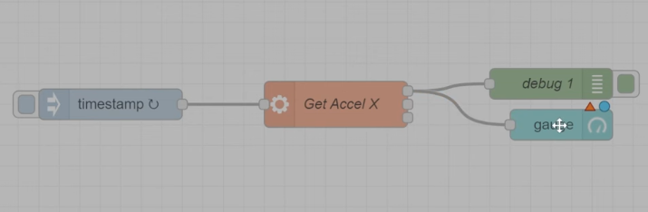
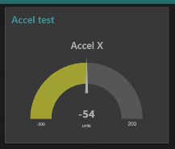
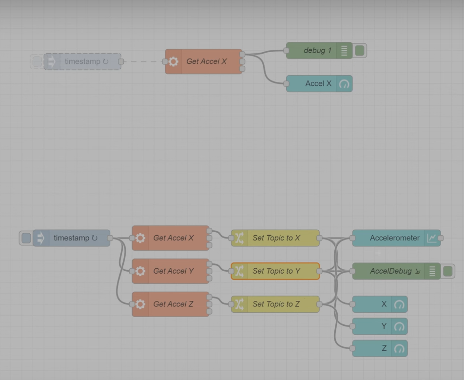

.. _beagleplay-nodered:

Using Node-RED
##############

Node-RED provides a browser-based editor that makes it easy to wire together
flows using the wide range of nodes in the palette that can be deployed to
its runtime in a single-click.

.. youtube:: 2llY2ZnTmnw

***************

1. Install Node-RED using the `official guide here <https://nodered.org/docs/getting-started/beaglebone>`_
2. MikroE `Accel click <https://www.mikroe.com/accel-click>`_ or any mikroBUS add-on

Let's get started!
*************************

First, we want to make sure the mikroBUS™ add-on board is connected and functioning as expected.
To do this, we make use of the `iio_info command <https://man.archlinux.org/man/iio_info.1.en>`_.

Connecting mikroBUS™ add-on board
*********************************

``iio_info`` is a utility for displaying information about local or remote IIO devices, in this case it's the accel click board.

.. figure:: ./iio_info_out.png
   :scale: 100
   :align: center

Accessing Node-RED
******************

Once your BeaglePlay is booted up and connected to your computer, access it from your browser by typing
``192.168.7.2:1880`` in your address bar.

Creating a basic flow
*********************

In this flow we'll take a look at how we can get the accelerometer readings output on the node
red console.

First, let's insert the exec function block. This will help us capture a linux command from
an entry like `/sys/bus/iio/...`.

Double click on the function block and in the command paste:

.. code-block:: bash
   cat /sys/bus/iio/devices/iio\:device0.../in_accel_x_raw

Give it some name and press Done.

Next, we add the "Debug" node and connect it to the previous function block we made
to get the output.

Optionally, as shown in the video we can also "Inject" a timestamp into the
function block which will then go into the debug console to give us the logs
with timestamps.

.. figure:: ./nodered-debug-logs.png
   :scale: 100
   :align: center

Adding a Gauge
**************

Adding a Graph and 3 Axis
**************************

.. todo::
        * Add flow diagram
        * Show the output

