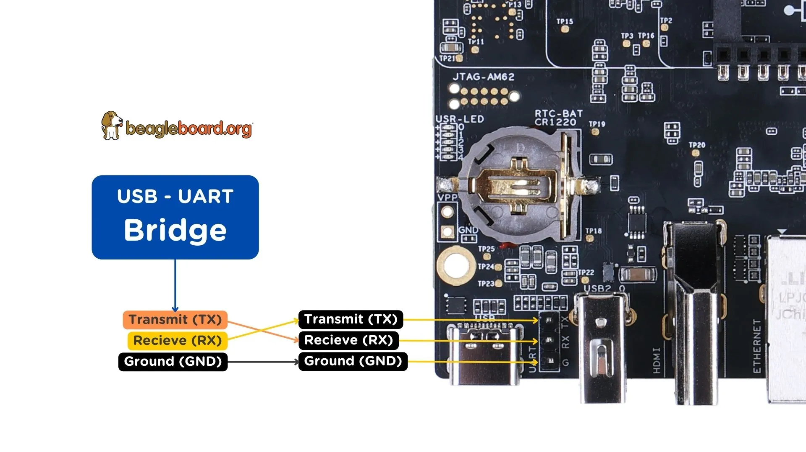

.. _beagleplay-serial-console:

Using Serial Console
####################

To see the board boot log and access your BeaglePlay's console you can connect a USB-UART  
cable as depicted in the image below and use applications like ``tio`` to access the console.

    Serial debug (USB-UART) cable connection.

If you are using Linux your USB to UART converter may appear as ``/dev/ttyUSB``. 
It will be different for Mac and Windows operating systems.

.. code-block:: shell

    [lorforlinux@fedora ~] $ tio /dev/ttyUSB0 
    tio v2.5
    Press ctrl-t q to quit
    Connected

.. tip::
    For more information on ``USB to UART`` cables, 
    you can checkout :ref:`serial-debug-cables` section.
