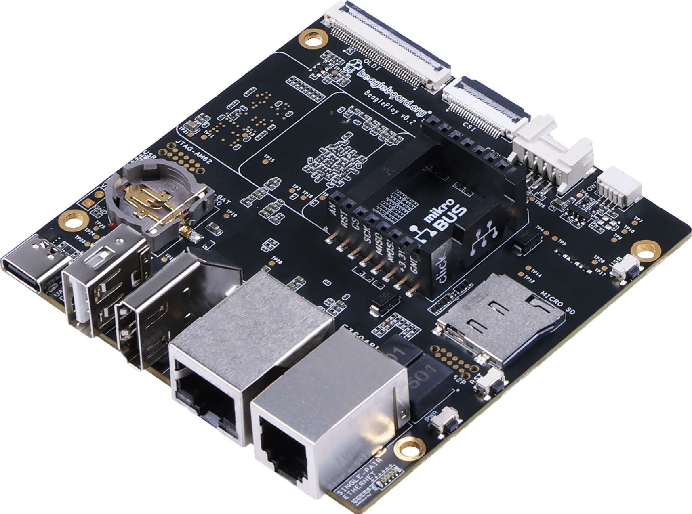

.. _beagleplay-home:

BeaglePlay
##########

BeaglePlay is an open-source single board computer designed to simplify the process of adding
sensors, actuators, indicators, human interfaces, and connectivity to a reliable embedded system.
It features a powerful 64-bit, quad-core processor and innovative connectivity options, including
WiFi, Gigabit Ethernet, sub-GHz wireless, and single-pair Ethernet with power-over-data-line. With
compatibility with 1,000s of off-the-shelf add-ons and a customized Debian Linux image, BeaglePlay
makes expansion and customization easy. It also includes ribbon-cable connections for cameras and
touch-screen displays, and a socket for a battery-backed real-time-clock, making it ideal for
human-machine interface designs. With its competitive price and user-friendly design, BeaglePlay
provides a positive development experience for users.

.. admonition:: Contributors

    This work is licensed under a `Creative Commons Attribution-ShareAlike
    4.0 International License <http://creativecommons.org/licenses/by-sa/4.0/>`__

.. note::
    Make sure to read and accept all the terms & condition provided in the :ref:`boards-terms-and-conditions` page. 
    
    Use of either the boards or the design materials constitutes agreement to the T&C including any 
    modifications done to the hardware or software solutions provided by beagleboard.org foundation.

.. toctree::

.. toctree::
   :maxdepth: 1

   /boards/beagleplay/using-serial-console.rst
   /boards/beagleplay/using-mikrobus.rst
   /boards/beagleplay/using-qwiic.rst
   /boards/beagleplay/using-grove.rst
   /boards/beagleplay/using-csi.rst
   /boards/beagleplay/using-oldi.rst
   /boards/beagleplay/zephyr-cc1352-development.rst
