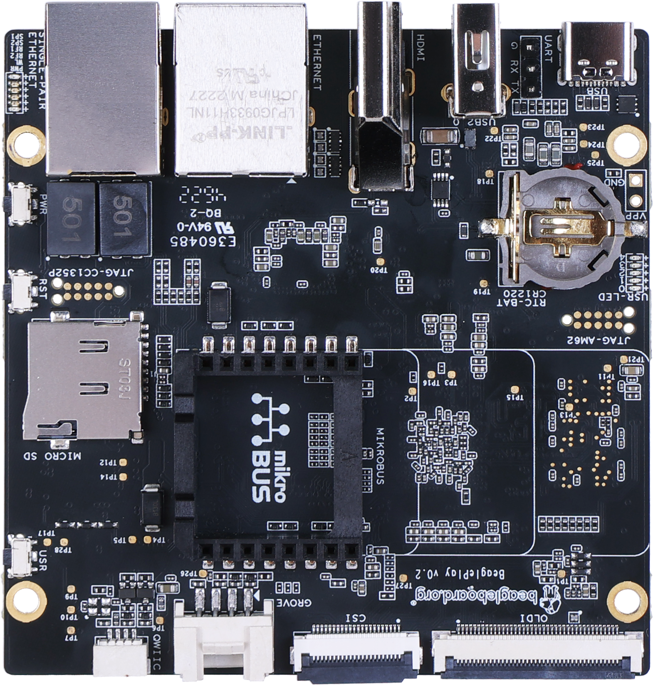

.. _beagleplay-home:

BeaglePlay
##########

.. important::
    This is a work in progress, for latest documentation please 
    visit https://docs.beagleboard.org/latest/

.. grid:: 1 1 2 3
   :margin: 4 4 0 0
   :gutter: 4

   .. grid-item-card::
      :link: beagleplay-introduction
      :link-type: ref

      **01. Introduction**
      ^^^

      .. image:: images/chapter-thumbnails/01-introduction.jpg
         :align: center
         :alt: BeaglePlay Chapter01 thumbnail
      
      +++

      Introduction to BeaglePlay board.

   .. grid-item-card::
      :link: beagleplay-change-history
      :link-type: ref

      **02. Change History**
      ^^^

      .. image:: images/chapter-thumbnails/02-change-history.jpg
         :align: center
         :alt: BeaglePlay Chapter02 thumbnail

      +++

      Hardware, Software, and Documentation change history.

   .. grid-item-card:: 
      :link: beagleplay-quick-start
      :link-type: ref

      **03. Quick start**
      ^^^

      .. image:: images/chapter-thumbnails/03-quick-start.jpg
         :align: center
         :alt: BeaglePlay Chapter03 thumbnail

      +++

      Getting started guide.

   .. grid-item-card:: 
      :link: beagleplay-detailed-overview
      :link-type: ref

      **04. Detailed overview**
      ^^^

      .. image:: images/chapter-thumbnails/04-detailed-overview.jpg
         :align: center
         :alt: BeaglePlay Chapter04 thumbnail

      +++

      Detailed overview.

   .. grid-item-card:: 
      :link: beagleplay-high-level-specifications
      :link-type: ref

      **05. High level specification**
      ^^^

      .. image:: images/chapter-thumbnails/05-high-level-specifications.jpg
         :align: center
         :alt: BeaglePlay Chapter05 thumbnail

      +++

      High level specifications.

   .. grid-item-card:: 
      :link: beagleplay-detailed-hardware-design
      :link-type: ref

      **06. Detailed hardware design**
      ^^^

      .. image:: images/chapter-thumbnails/06-detailed-hardware-design.jpg
         :align: center
         :alt: BeaglePlay Chapter06 thumbnail

      +++

      Detailed hardware design.

   .. grid-item-card:: 
      :link: beagleplay-connectors
      :link-type: ref

      **07. Connectors**
      ^^^

      .. image:: images/chapter-thumbnails/07-connectors.jpg
         :align: center
         :alt: BeaglePlay Chapter07 thumbnail

      +++

      Connectors pinout diagrams and more.

   .. grid-item-card:: 
      :link: beagleplay-expansion
      :link-type: ref

      **08. Expansion**
      ^^^

      .. image:: images/chapter-thumbnails/08-expansion.jpg
         :align: center
         :alt: BeaglePlay Chapter08 thumbnail

      +++

      BeaglePlay board expansion interface

   .. grid-item-card:: 
      :link: beagleplay-demos-and-tutorials
      :link-type: ref

      **09. Demos & Tutorials**
      ^^^

      .. image:: images/chapter-thumbnails/09-demos-and-tutorials.jpg
         :align: center
         :alt: BeaglePlay Chapter09 thumbnail

      +++

      Demos and Tutorials

   .. grid-item-card:: 
      :link: beagleplay-support-documents
      :link-type: ref

      **10. Support**
      ^^^

      .. image:: images/chapter-thumbnails/10-support-documents.jpg
         :align: center
         :alt: BeaglePlay Chapter10 thumbnail

      +++

      User support document for easy development.

   .. grid-item-card:: 
      :link: beagleplay-mechanical-specifications
      :link-type: ref

      **11. Mechanical Specifications**
      ^^^

      .. image:: images/chapter-thumbnails/11-mechanical-specifications.jpg
         :align: center
         :alt: BeaglePlay Chapter11 thumbnail

      +++

      Mechanical dimensions.

   .. grid-item-card:: 
      :link: beagleplay-additional-pictures
      :link-type: ref

      **12. Additional Pictures**
      ^^^

      .. image:: images/chapter-thumbnails/12-additional-pictures.jpg
         :align: center
         :alt: BeaglePlay Chapter12 thumbnail

      +++

      BeaglePlay Additional Pictures

.. toctree::
   :maxdepth: 1
   :hidden:

   01-introduction
   02-change-history
   03-quick-start
   04-detailed-overview
   05-high-level-specifications
   06-detailed-hardware-design
   07-connectors
   08-expansion
   09-demos-and-tutorials
   10-support-documents
   11-mechanical-specifications
   12-additional-pictures

