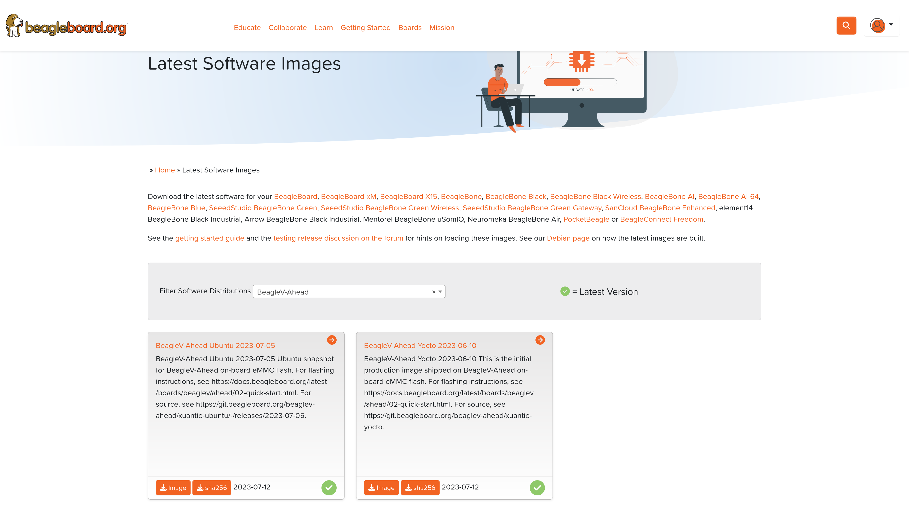

.. _beaglev-ahead-quick-start:

Quick Start
################

What's included in the box?
****************************

When you purchase a brand new BeagleV Ahead, In the box you'll get:

1. BeagleV Ahead board
2. One (1) 2.4GHz/5GHz antenna
3. USB super-speed micro-A plug to type-A receptacle cable (for connecting common USB type-A peripherals)
4. Quick-start card

.. image:: media/BeagleV-Ahead-all.*
    :width: 724
    :align: center
    :alt: BeagleV Ahead box contents

Unboxing
*********

.. youtube:: SVC9peUUzE0
   :width: 1280
   :height: 720
   :align: center

Antenna guide
*************

.. warning:: uFL antenna connectors are very delicate and should be handled with care.

.. tabs::

   .. group-tab:: Connecting antenna

      To use WiFi you are **required** to connect the 2.4GHz/5GHz antenna provided 
      in BeagleV Ahead box. Below is a guide to connect the antenna to your 
      BeagleV Ahead board.

      .. figure:: media/antenna-guide/connect.*
          :align: center
          :alt: Connecting 2.4GHz/5GHz antenna to BeagleV Ahead.

          Connecting 2.4GHz/5GHz antenna to BeagleV Ahead.

   .. group-tab:: Disconnecting antenna

      If for some reason you want to disconnect the antenna from your BeagleV Ahead board 
      you can follow the guide below to remove the antenna without beaking the uFL antenna connector.

      .. figure:: media/antenna-guide/disconnect.*
          :align: center
          :alt: Removing 2.4GHz/5GHz antenna to BeagleV Ahead.

          Removing 2.4GHz/5GHz antenna to BeagleV Ahead.

Tethering to PC
****************

To connect the board to PC via USB 3.0 port you can use either a standard high-speed micro-B cable 
or a USB 3.0 super-speed micro-B cable. Connection guide for both are shown below:

.. important:: high-speed micro-B will support only USB 2.0 speed but super-speed micro-B cable will support USB 3.0 speed.

.. tabs::

   .. group-tab:: super-speed micro-B connection (USB 3.0)

      For super speed USB 3.0 connection it's recommended to use super-speed micro-B USB cable.  
      To get a super-speed micro-B cable you can checkout links below:

      1. `USB 3.0 Micro-B Cable - 1m (sparkfun) <https://www.sparkfun.com/products/14724>`_
      2. `Stewart Connector super-speed micro-B (DigiKey) <https://www.digikey.com/en/products/detail/stewart-connector/SC-3ATK003F/8544565>`_
      3. `CNC Tech super-speed micro-B (DigiKey) <https://www.digikey.com/en/products/detail/cnc-tech/103-1092-BL-00100/5023751>`_
      4. `Assmann WSW Components super-speed micro-B (DigiKey) <https://www.digikey.com/en/products/detail/assmann-wsw-components/A-USB30AM-30MBM-200/10408379>`_

      .. note:: If you only have a high-speed micro-B cable you can checkout high-speed micro-B connection guide.

      .. figure:: media/usb-guide/super-speed-micro-B-connection.*
          :align: center
          :alt: super-speed micro-B (USB 3.0) connection guide for BeagleV Ahead.
          
          super-speed micro-B (USB 3.0) connection guide for BeagleV Ahead.

   .. group-tab:: high-speed micro-B connection (USB 2.0)

      For USB 2.0 connection it's recommended to use high-speed micro-B USB cable.  
      To get a high-speed micro-B cable you can checkout links below:

      1. `USB micro-B Cable - 6 Foot (sparkfun) <https://www.sparkfun.com/products/10215>`_
      2. `Stewart Connector high-speed micro-B (DigiKey) <https://www.digikey.com/en/products/detail/stewart-connector/SC-2AMK003F/8544577>`_
      3. `Assmann WSW Components high-speed micro-B  (DigiKey) <https://www.digikey.com/en/products/detail/assmann-wsw-components/AK67421-0-3-VM/5428793>`_
      4. `Cvilux USA high-speed micro-B (DigiKey) <https://www.digikey.com/en/products/detail/cvilux-usa/DH-20M50055/13175849>`_

      .. note:: Make sure the high-speed micro-B cable you have is a data cable as some high-speed micro-B cables are power only.        

      .. figure:: media/usb-guide/high-speed-micro-B-connection.*
          :align: center
          :alt: high-speed micro-B (USB 2.0) connection guide BeagleV Ahead.

          high-speed micro-B (USB 2.0) connection guide BeagleV Ahead.

.. _beaglev-ahead-flashing-emmc:

Flashing eMMC
**************

.. note:: To flash your BeagleV Ahead you need either a super-speed micro-B or high-speed micro-B cable as shown in section above.

Download latest software image
===============================

To download the latest software image visit `https://www.beagleboard.org/distros <https://www.beagleboard.org/distros>`_ and 
search for BeagleV Ahead as shown below.

    Download latest software image for BeagleV Ahead board

Put BeagleV Ahead in USB flash mode
====================================

.. note:: Only super-speed micro-B is shown in graphic below but you can use 
    a high-speed micro-B cable. Only difference will be lower flash speeds.

To put your BeagleV Ahead board into eMMC flash mode you can follow the steps below:

1. Press and hold USB button.
2. Connect to PC with super-speed micro-B or high-speed micro-B cable.
3. Release USB button.

.. figure:: media/usb-guide/Flash-eMMC.*
    :align: center
    :alt: Connecting BeagleV Ahead to flash eMMC

    Connecting BeagleV Ahead to flash eMMC

.. important:: If you want to put the board into eMMC flashing while it is already 
    connected to a PC you can follow these steps:

    1. Press and hold USB button.
    2. Press reset button once.
    3. Release USB button.

Flash the latest image on eMMC
===============================

.. tabs:: 

    .. group-tab:: Linux

       First you need to install android platform tools which includes `adb` and `fastboot`.

       - Debian/Ubuntu-based Linux users can type the following command:

       .. code-block:: bash

           sudo apt-get install android-sdk-platform-tools
        

       - Fedora/SUSE-based Linux users can type the following command:

       .. code-block:: bash 

           sudo dnf install android-tools

       Now unzip the latest software image zip file you have downloaded from 
       `https://www.beagleboard.org/distros <https://www.beagleboard.org/distros>`_ 
       which contains four files shown below:

       .. code-block:: bash

         [lorforlinux@fedora deploy] $ ls 
         boot.ext4  fastboot_emmc.sh  root.ext4  u-boot-with-spl.bin

       .. important:: Make sure your board is in flash mode, you can follow the guide above to do that.

       To flash the board you just have to exexute the script `fastboot_emmc.sh` as root and provide your passoword:
       
       .. code-block:: bash

         [lorforlinux@fedora deploy] $ sudo ./fastboot_emmc.sh 
         [sudo] password for lorforlinux:

     
    .. group-tab:: Windows

        .. todo:: add instructions for flashing in windows.
            
    .. group-tab:: Mac

        .. todo:: add instructions for flashing in Mac.

Access UART debug console
**************************

.. note:: It has been noticed that 6pin FTDI cables like `this <https://www.adafruit.com/product/70>`_ 
    doesn't seem work with BeagleV Ahead debug port and there might be other cables/modules that will 
    show garbage when connected to the board. 
    
    Some tested devices that are working good includes:

    1. `Adafruit CP2102N Friend - USB to Serial Converter <https://www.adafruit.com/product/5335>`_
    2. `Raspberry Pi Debug Probe Kit for Pico and RP2040 <https://www.adafruit.com/product/5699>`_

To access a BeagleV Ahead serial debug console you can connected a USB to UART 
to your board as shown below:

.. figure:: media/debug/BeagleV-Ahead-UART-Debug.*
    :align: center
    :alt: BeagleV Ahead UART debug port connection

    BeagleV Ahead UART debug port connection

To see the board boot log and access your BeagleV Ahead's console you can use application like ``tio`` 
to access the conole. If you are using Linux your USB to UART converter may appear as ``/dev/ttyUSB``. 
It will be different for Mac and Windows operatig systems. To find serial port for your system you can checkout 
`this guide <https://www.mathworks.com/help/supportpkg/arduinoio/ug/find-arduino-port-on-windows-mac-and-linux.html>`_.

.. code-block:: shell

    [lorforlinux@fedora ~] $ tio /dev/ttyUSB0 
    tio v2.5
    Press ctrl-t q to quit
    Connected

Connect USB gadgets
********************

A super-speed micro-B (male) to USB A (female) OTG cable included in the box 
can be used to connect USB gadgets to your BeagleV Ahead board. 
When you do this, you'll be required to power the board via Barrel jack. 

.. important:: To properly power the board and USB gadgets you must power 
    the board with 5V @ 2A power supply.

.. figure:: media/usb-guide/OTG-usage.*
    :align: center
    :alt: USB OTG to connect USB gadgets to BeagleV Ahead board

    USB OTG to connect USB gadgets to BeagleV Ahead board

Connect to WiFi
****************

.. tabs:: 

    .. group-tab:: Yocto

        After getting access to the UART debug console you will be prompted with,

        .. code-block:: bash

            THEAD C910 Release Distro 1.1.2 BeagleV ttyS0

            BeagleV login:

        Here you have to simply type ``root`` and press enter to start uisng your 
        BeagleV Head board. Once you are in, to connect to any WiFi access point 
        you have to edit the ``/etc/wpa_supplicant.conf``
        
        .. code-block:: bash

            root@BeagleV:~# nano /etc/wpa_supplicant.conf

        In the ``wpa_supplicant.conf`` file you have to provide ``ssid`` and ``psk``. 
        Here ``ssid`` is your WiFi access point name and ``psk`` is the passoword. It 
        should look as shown below:

        .. callout:: 
            
            .. code-block:: bash

               ctrl_interface=/var/run/wpa_supplicant
               ctrl_interface_group=0
               ap_scan=1
               update_config=1

               network={
                       ssid="My WiFi" <1>
                       psk="passoword" <2>
                       key_mgmt=WPA-PSK
               }
        
            .. annotations:: 

                <1> WiFi access point name

                <2> WiFi passoword

        Once you are done with editing the file you can save the file with 
        ``CTRL+O`` and exit the nano editor with ``CTRL+X``. Once you are 
        back to terminal reconfigure the ``wlan0`` wireless interface which 
        will trigger it to connect to the access point with the credentials 
        you have added to ``wpa_supplicant.conf``. Execute the command below to 
        reconfigure ``wlan0`` wireless interface.

        .. code-block:: bash

            root@BeagleV:~# wpa_cli -i wlan0 reconfigure
            OK

        After executing this you can check if internet is working by 
        executing ``ping 8.8.8.8`` as shown below:

        .. code-block:: bash

            root@BeagleV:~# ping 8.8.8.8
            PING 8.8.8.8 (8.8.8.8): 56 data bytes
            64 bytes from 8.8.8.8: seq=0 ttl=118 time=13.676 ms
            64 bytes from 8.8.8.8: seq=1 ttl=118 time=17.050 ms
            64 bytes from 8.8.8.8: seq=2 ttl=118 time=14.367 ms
            64 bytes from 8.8.8.8: seq=3 ttl=118 time=19.320 ms
            64 bytes from 8.8.8.8: seq=4 ttl=118 time=14.796 ms
            ^C
            --- 8.8.8.8 ping statistics ---
            5 packets transmitted, 5 packets received, 0% packet loss
            round-trip min/avg/max = 13.676/15.841/19.320 ms

        .. important:: 

            Due to a software issue Yocto might now assign any ip address to wlan0 wireless interface 
            thus even if you are connected successfully to the access point of your choice you will still not 
            be able to connect to the internet. Particularly If you are not getting any pings back when you execute 
            ``ping 8.8.8.8`` you must execute the commands below:

            1. ``root@BeagleV:~# cp /lib/systemd/network/80-wifi-station.network.example /lib/systemd/network/80-wifi-station.network``
            2. ``root@BeagleV:~# networkctl reload``

            this should fix the no internet issue on your BeagleV Ahead board!

Demos and Tutorials
*******************

* :ref:`beaglev-ahead-csi`

