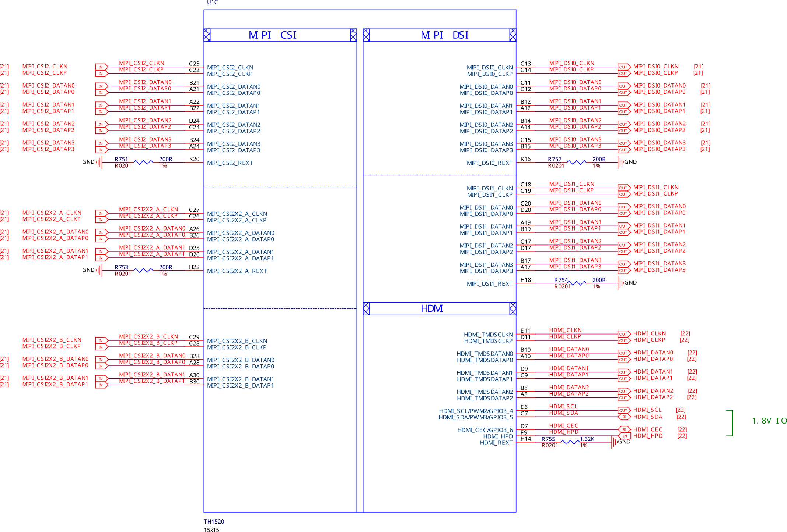
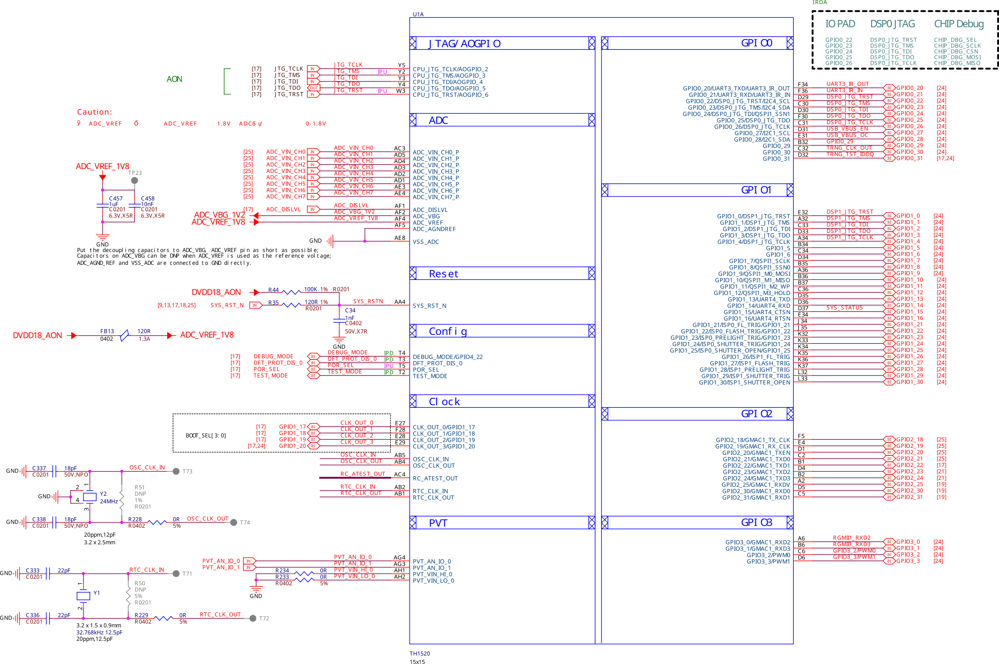
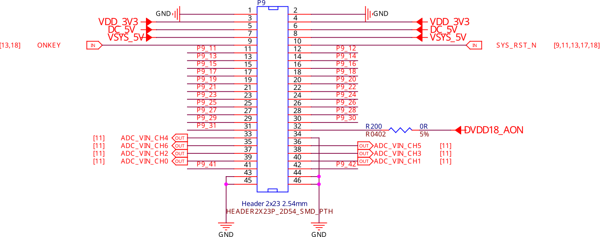
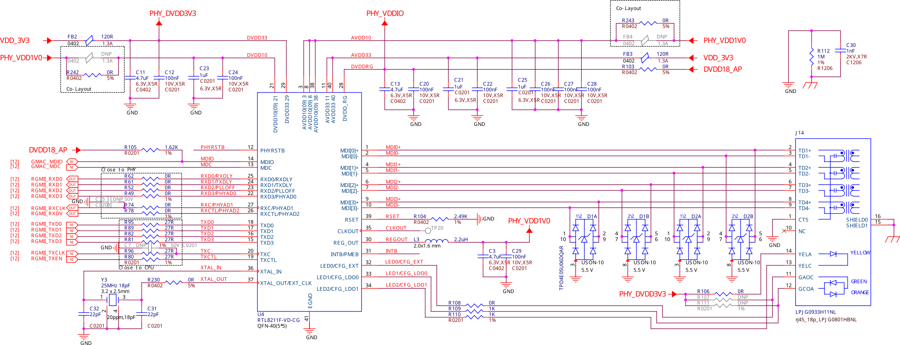
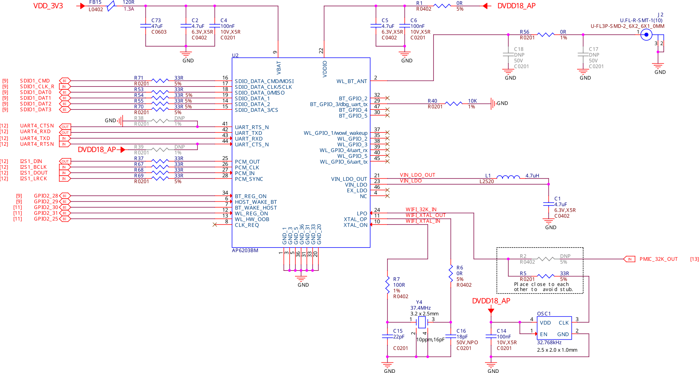
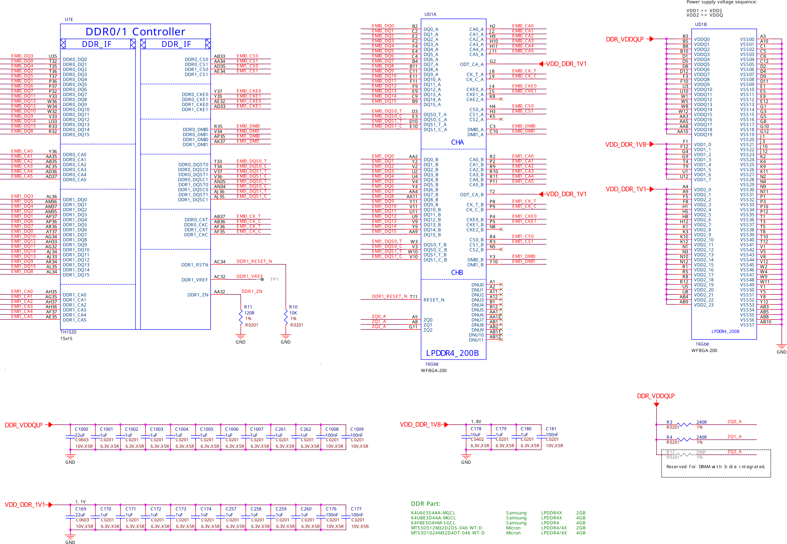
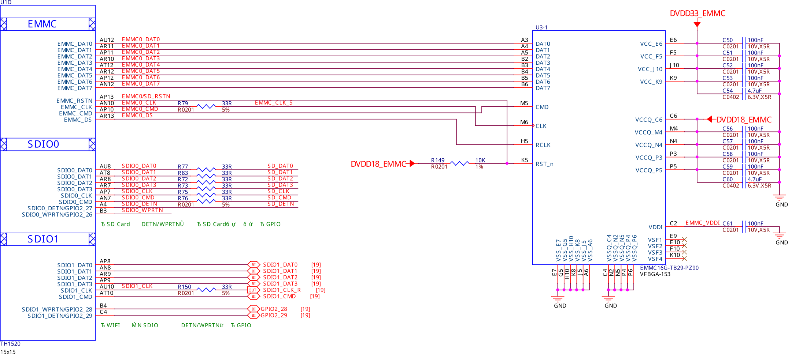
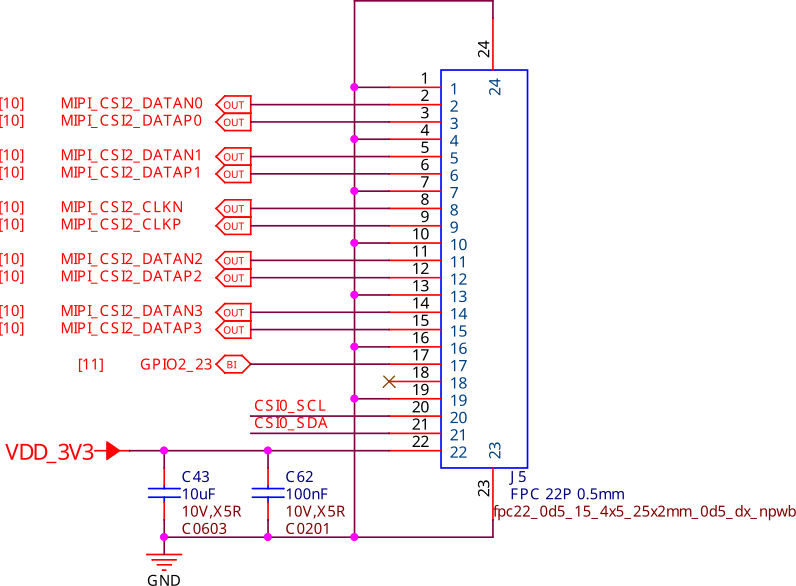
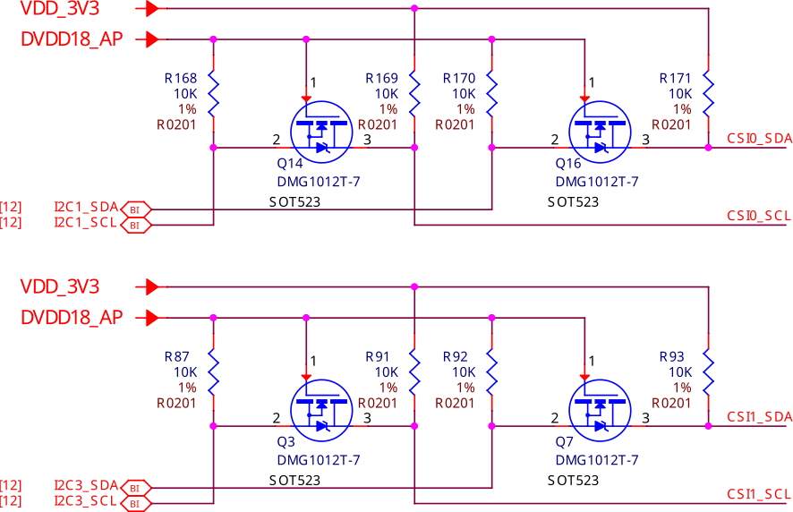

.. _beaglev-ahead-design:

Design & specifications
#######################

If you want to know how the BeagleV Ahead board is designed and what are it's 
high-level specifications then this chapter is for you. We are going to discuss 
each hardware design element in detail and provide high-level device 
specifications in  a short and crisp form as well.

Block diagram
**************

System on Chip (SoC)
*********************

.. figure:: media/hardware-design/SD-EMMC-PowerSwitch.png
    :width: 420
    :align: center
    :alt: SoC eMMC power switch

    SoC eMMC power switch

.. figure:: media/hardware-design/SoC-DDR-Power.png
    :width: 740
    :align: center
    :alt: SoC DDR Power

    SoC DDR Power

    SoC MIPI CSI DSI HDMI

.. figure:: media/hardware-design/SoC-Power.png
    :width: 740
    :align: center
    :alt: SoC power

    SoC power

    SoC sys, ADC, and Clock

.. figure:: media/hardware-design/SoC-USB-GMAC-Audio.png
    :width: 740
    :align: center
    :alt: SoC USB GMAC Audio

    SoC USB GMAC Audio

Power management
*****************

Barrel jack 
============

.. figure:: media/hardware-design/BarrelJackInput.*
    :width: 1247
    :align: center
    :alt: Barrel jack power input

    Barrel jack power input

0.8V DCDC buck 
==============

.. figure:: media/hardware-design/DCDC0V8.png
    :width: 1247
    :align: center
    :alt: 0.8V DCDC buck converter

    0.8V DCDC buck converter

3.3V DCDC buck 
==============

.. figure:: media/hardware-design/DCDC3V3.png
    :width: 740
    :align: center
    :alt: 3.3V DCDC buck converter

    3.3V DCDC buck converter

1.8V LDO
========

.. figure:: media/hardware-design/LDO1V8.png
    :width: 740
    :align: center
    :alt: 1.8V LDO regulator

    1.8V LDO regulator

PMIC
====

.. figure:: media/hardware-design/PMIC-BUCK.png
    :width: 740
    :align: center
    :alt: PMIC Buck

    PMIC Buck

.. figure:: media/hardware-design/PMIC-Control.png
    :width: 740
    :align: center
    :alt: PMIC Control

    PMIC Control

.. figure:: media/hardware-design/PMIC-LDO.png
    :width: 740
    :align: center
    :alt: PMIC LDO

    PMIC LDO

General Connectivity and Expansion
**********************************

microUSB 3.0 port
==================

.. figure:: media/hardware-design/microUSB3.png
    :width: 740
    :align: center
    :alt: microUSB 3.0 port

    microUSB 3.0 port

P8 & P9 cape header pins
=========================

.. figure:: media/hardware-design/P8-Header.png
    :width: 420
    :align: center
    :alt: P8 cape header

    P8 cape header

    P9 cape header

mikroBUS shuttle connector
==========================

.. figure:: media/hardware-design/mikroBUS.png
    :width: 420
    :align: center
    :alt: mikroBUS shuttle connector 

P8, P9, and mikroBUS helper circuitry
======================================

.. figure:: media/hardware-design/mikroBUS-reset.png
    :width: 420
    :align: center
    :alt: mikroBUS reset circuitry

.. figure:: media/hardware-design/P8-P9-mikroBUS-LevelShifter.png
    :width: 1247
    :align: center
    :alt: P8, P9, and mikroBUS level shifters

    P8, P9, and mikroBUS level shifters

Buttons and LEDs
******************

Boot select buttons
====================

.. figure:: media/hardware-design/BootSelect.*
    :width: 740
    :align: center
    :alt: Boot select buttons

    Boot select buttons

User LEDs and Power LED
========================

.. figure:: media/hardware-design/User-Power-LEDs.*
    :width: 740
    :align: center
    :alt: User LEDs and power LED

    User LEDs and power LED

Power and reset button
=======================

.. figure:: media/hardware-design/Power-Reset-Button.*
    :width: 740
    :align: center
    :alt: Power and reset button

    Power and reset button

Wired and wireless connectivity
********************************

Ethernet
========

    Ethernet

.. figure:: media/hardware-design/Ethernet-LevelShifter-Strapping.png
    :width: 740
    :align: center
    :alt: Ethernet LevelShifter and Strapping

    Ethernet LevelShifter and Strapping

WiFi & Bluetooth
=================

    WiFi and Bluetooth

Memory, Media and Data storage
********************************

DDR memory
==========

    2GB DDR4 Memory chip1

.. figure:: media/hardware-design/DDR4-2-3.png
    :width: 740
    :align: center
    :alt: 2GB DDR4 Memory chip2

    2GB DDR4 Memory chip2

eMMC
=====

    16GB eMMC

microSD
=======

.. figure:: media/hardware-design/microSDCard.png
    :width: 740
    :align: center
    :alt: microSD card connector 

    microSD card connector

EEPROM
======

.. figure:: media/hardware-design/EEPROM.png
    :width: 420
    :align: center
    :alt: 16GB EEPROM

    16GB EEPROM

Multimedia I/O
***************

CSI0
====

    CSI0 camera interface

CSI1
====

.. figure:: media/hardware-design/CSI1.png
    :width: 420
    :align: center
    :alt: CSI1 camera interface

    CSI1 camera interface

DSI
====

.. figure:: media/hardware-design/DSI.png
    :width: 420
    :align: center
    :alt: DSI display interface

    DSI display interface

CSI & DSI level shifter
=======================

    CSI & DSI level shifter

HDMI
====

.. figure:: media/hardware-design/HDMI.png
    :width: 1247
    :align: center
    :alt: HDMI display interface

    HDMI display interface

Debug
******

UART debug port 
===============

.. figure:: media/hardware-design/DebugPort.png
    :width: 420
    :align: center
    :alt: UART Debug port 

    UART Debug port

JTAG debug port
===============

.. figure:: media/hardware-design/JTAG.png
    :width: 720
    :align: center
    :alt: JTAG debug port

    JTAG debug port

Mechanical Specifications 
**************************

.. table::
   :align: center
   :widths: auto

   +----------------------------------------------------+---------------------------------------------------------+
   | Top                                                | Bottom                                                  |
   +====================================================+=========================================================+
   | .. image:: media/mechanical-design/top.*           | .. image:: media/mechanical-design/bottom.*             |
   |    :width: 427                                     |       :width: 427                                       |
   |    :align: center                                  |       :align: center                                    |
   |    :alt: BeagleV Ahead top                         |       :alt: BeagleV Ahead bottom                        |
   +----------------------------------------------------+---------------------------------------------------------+

.. table::
   :align: center
   :widths: auto

   +----------------------------------------------------+---------------------------------------------------------+---------------------------------------------------------+
   | Front                                              | Left                                                    | Right                                                   |
   +====================================================+=========================================================+=========================================================+
   | .. image:: media/mechanical-design/front.*         | .. image:: media/mechanical-design/left.*               | .. image:: media/mechanical-design/right.*              |
   |    :width: 247                                     |       :width: 295                                       |    :width: 168                                          |
   |    :align: center                                  |       :align: center                                    |    :align: center                                       |
   |    :alt: BeagleV Ahead top                         |       :alt: BeagleV Ahead left                          |    :alt: BeagleV Ahead right                            |
   +----------------------------------------------------+---------------------------------------------------------+---------------------------------------------------------+

.. table:: Dimensions & weight

    +--------------------+----------------------------------------------------+
    | Parameter          | Values                                             |
    +====================+====================================================+
    | Size               | 96.5×60.7×19.9mm                                   |
    +--------------------+----------------------------------------------------+
    | Max heigh          | 21.1mm                                             |
    +--------------------+----------------------------------------------------+
    | PCB Size           | 96.5x60.5*1.6mm                                    |
    +--------------------+----------------------------------------------------+
    | PCB Layers         | 10 layers                                          |
    +--------------------+----------------------------------------------------+
    | PCB Thickness      | 1.6mm                                              |
    +--------------------+----------------------------------------------------+
    | RoHS compliant     | yes                                                |
    +--------------------+----------------------------------------------------+
    | Gross Weight       | 128.8g                                             |
    +--------------------+----------------------------------------------------+
    |  Net weight        | 49.7g                                              |
    +--------------------+----------------------------------------------------+