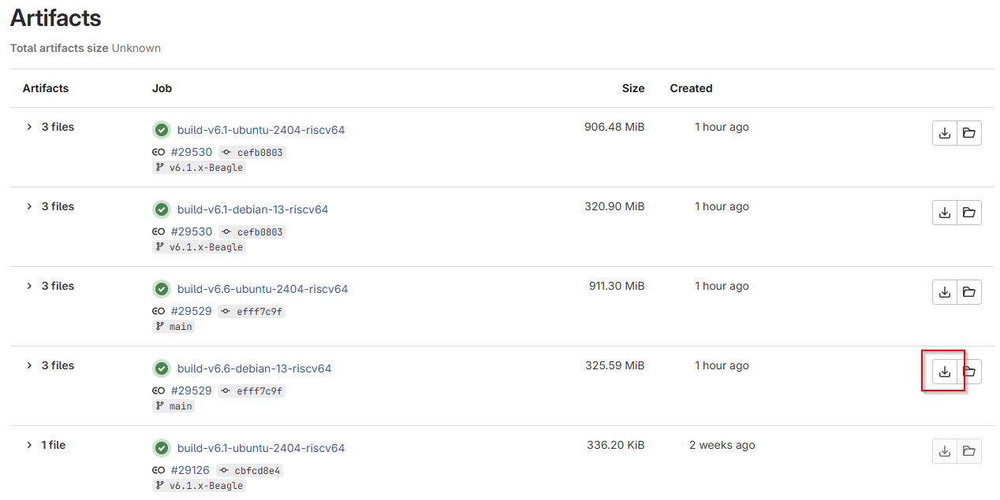
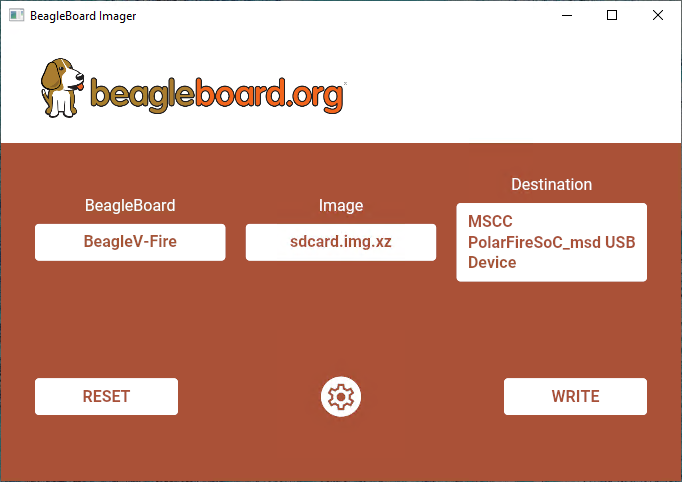

.. _beaglev-fire-quick-start:

Quick Start
###########

What's included in the box?
***************************

When you purchase a brand new BeagleV-Fire, In the box you'll get:

1. `BeagleV-Fire board <https://www.beagleboard.org/boards/beaglev-fire>`_
2. Quick-start card

.. todo:: add image & information about box content.

.. tip:: For board files, 3D model, and more, you can checkout `BeagleV-Fire repository on OpenBeagle <https://openbeagle.org/beaglev-fire/beaglev-fire>`_.

Unboxing
********

.. youtube:: 5cylv1R-1mc
   :align: center
   :width: 1280
   :height: 720

Tethering to PC
***************

To connect BeagleV-Fire board to PC via USB Type C receptacle you need a USB type C cable. Connection guide for the same is shown below:
  
.. tip::

    To get a USB type C cable you can checkout links below:

    1. `USB C cable 0.3m (mouser) <https://www.mouser.com/ProductDetail/Adafruit/4474?qs=CUBnOrq4ZJz9F%2FNF%252BRRALQ%3D%3D>`_
    2. `USB C cable 1.83m (digikey) <https://www.digikey.com/en/products/detail/coolgear/USB3-AC2MB/16384570>`_

.. figure:: images/usb-guide/tethered-connection.*
    :align: center
    :alt: BeagleV-Fire tethered connection
    
    BeagleV-Fire tethered connection

Flashing eMMC
*************

On Windows 10
=============

First we need to go get `Beagleboard Imager <https://github.com/beagleboard/bb-imager-rs/releases>`_. Just grab the latest MSI one.

Once that is installed, we make our way to `Artifacts <https://openbeagle.org/beaglev-fire/BeagleV-Fire-ubuntu/-/artifacts>`_
where we pick up the latest-n-greatest image:

.. note::

    | The images are sorted by kernel and distro, so make sure you get the one that suits your needs.
    |
    | Also, pay attention to the file-size:
    | A good Artifact needs to be larger than 200 MiB; the smaller ones were pruned and are no good.

Hit the download button and extract ``sdcard.img.xz``: This is the file we hand over to Beagleboard Imager.

Once we have the pre-requisites out of the way, it's time to get BeagleV-Fire ready for action.

Device Firmware Update (DFU)
============================

To enter "DFU" mode, you press and hold the USER button while connecting your Fire to the USB port on your Machine.

You should let the button go once the first LED comes on.

Once you have two solid lit LEDS and an extra USB drive, we're all set to continue.

Imager
======

With Imager running, work your way from left to right, like so:

1. Select board. This one's obvious.
2. Select your image from above.
3. Select your drive. This one is critical to get right; see below.
4. Click ``WRITE`` and watch it go!

With a little luck, all goes well and Imager reports no errors.

In that case, you can close out Imager and disconnect the USB cable.

On the next power-up, your Beagle will boot up the new image and you're ready to Rock!

Access UART debug console
*************************

.. note:: 

    Some tested devices that are known to be working well include:

    1. `Adafruit CP2102N Friend - USB to Serial Converter <https://www.adafruit.com/product/5335>`_
    2. `Raspberry Pi Debug Probe Kit for Pico and RP2040 <https://www.adafruit.com/product/5699>`_

To access a BeagleV-Fire serial debug console you can connect a USB to UART to your board as shown below:

.. figure:: images/debug/BeagleV-Fire-UART-Debug.*
    :align: center
    :alt: BeagleV-Fire UART debug port connection

    BeagleV-Fire UART debug port connection

To see the board boot log and access your BeagleV-Fire's console you can use application like ``tio`` 
to access the console. If you are using Linux your USB to UART converter may appear as ``/dev/ttyUSB``. 
It will be different for Mac and Windows operatig systems. To find serial port for your system you can checkout 
`this guide <https://www.mathworks.com/help/supportpkg/arduinoio/ug/find-arduino-port-on-windows-mac-and-linux.html>`_.

.. code-block:: shell

    [lorforlinux@fedora ~] $ tio /dev/ttyUSB0 
    tio v2.5
    Press ctrl-t q to quit
    Connected

Demos and Tutorials
*******************

* :ref:`beaglev-fire-gateware-version`
* :ref:`beaglev-fire-upgrade-gateware`
* :ref:`beaglev-fire-flashing-board`
* :ref:`beaglev-fire-gateware-design`
* :ref:`beaglev-fire-mchp-fpga-tools-installation-guide`
* :ref:`beagleV-fire-gateware-builder`

