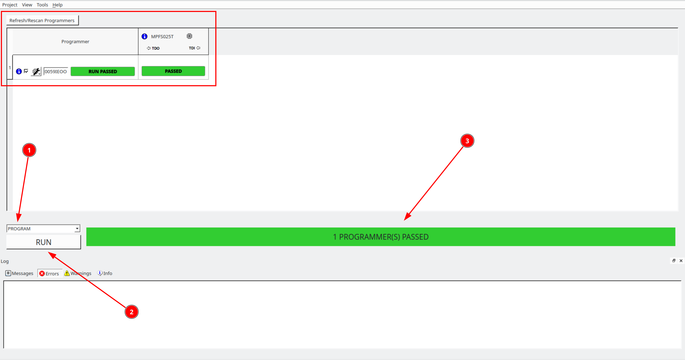
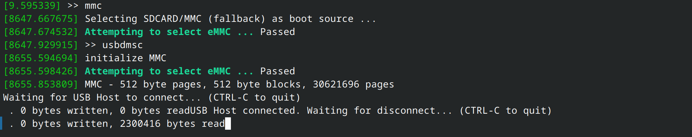
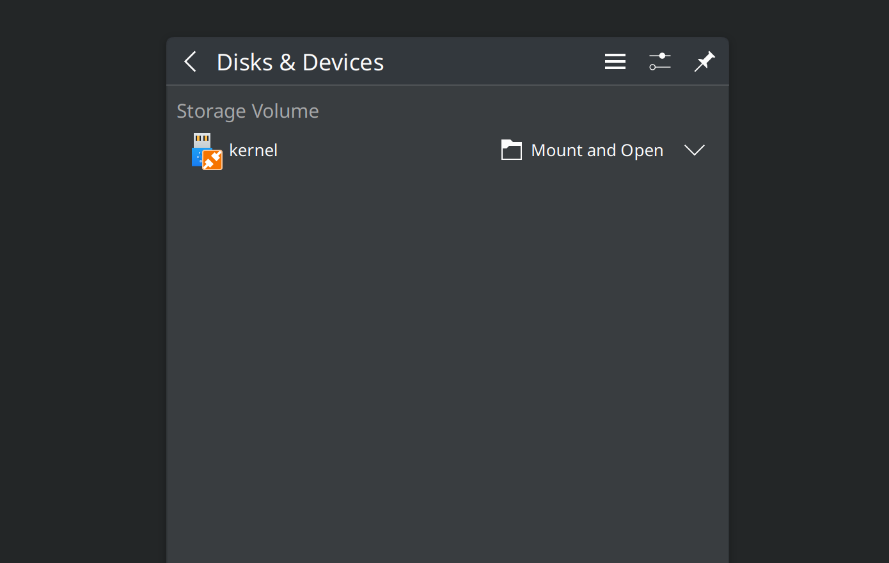

.. _beaglev-fire-flashing-board:

Flashing gateware and Linux image
##################################

.. todo::

   This is the *hard* way! Special cables and FlashPros are not required when using the firmware we initially ship on the board. This tutorial should be
   rescripted as how to _unbrick_ your board. Also, we have other work-arounds using software and GPIOs rather than FlashPros. Let's not put this in user's
   face as *the* experience when it is far more painful than using the `change-gateware.sh` script and "hold BOOT button when applying power" solutions we've created!

In this tutorial we are going to learn to flash the gateware image
to FPGA and ``sdcard.image`` to eMMC storage.

.. important::

   Additional hardware required:

   1. FlashPro5/6 programmer
   2. `Tag connect TC2050-IDC-NL 10-Pin No-Legs Cable with Ribbon connector <https://www.tag-connect.com/product/tc2050-idc-nl-10-pin-no-legs-cable-with-ribbon-connector>`_
   3. `TC2050-CLIP-3PACK Retaining CLIP board for TC2050-NL cables <https://www.tag-connect.com/product/tc2050-clip-3pack-retaining-clip>`_

Programming & Debug tools installation
***************************************

To flash a gateware image to your BeagleV-Fire board you will require a
FlashPro5/6 and FlashPro Express (FPExpress) tool which comes pre-installed as part of
`Libero SoC Design Suite <https://www.microchip.com/en-us/products/fpgas-and-plds/fpga-and-soc-design-tools/fpga/libero-software-later-versions>`_.
A standalone FlashPro Express tool is also available with MicroChip's
`Programming and Debug Tools <https://www.microchip.com/en-us/products/fpgas-and-plds/fpga-and-soc-design-tools/programming-and-debug>`_ package,
which we are going to use for this tutorial. Below are the steps to install the software:

1. Download the zip for your operating system from `Programming and Debug Tools <https://www.microchip.com/en-us/products/fpgas-and-plds/fpga-and-soc-design-tools/programming-and-debug>`_ page.
2. Unzip the file and in the unzipped folder you will find ``launch_installer.sh`` and ``Program_Debug_v2023.1.bin``.
3. Execute the ``launch_installer.sh`` script to start the installation procedure.

.. code-block:: bash

   [lorforlinux@fedora Program_Debug_v2023.1_lin] $ ./launch_installer.sh

   No additional packages to install for installer usage

   Requirement search complete.

   See /tmp/check_req_installer608695.log for information.

   Launch of installer
   Preparing to install
   Extracting the JRE from the installer archive...
   Unpacking the JRE...

.. note:: It's recommended to install under `home/user/microchip` for linux users.

Enabling non-root user to access FlashPro
==========================================

1. Download :download:`60-openocd.rules <60-openocd.rules>`
2. Copy udev rule ``sudo cp 60-openocd.rules /etc/udev/rules.d``
3. Trigger udevadm using ``sudo udevadm trigger`` or reboot the PC for the changes to take effect

Flashing gateware image
************************

.. note:: content below is valid for beta testers only.

Launch FPExpress
=================

1. Download ``FlashProExpress.zip`` file and unzip, it contains the ``*.job`` file which we need to create a new project in FPExpress.
2. Open up a terminal and go to ``/home/user/microchip/Program_Debug_v202X.Y/Program_Debug_Tool/bin`` which includes FPExpress tool.
3. Execute ``./FPExpress`` in terminal to start FlashPro Express software.

Create new project
===================

.. important::
   
   Make sure you have your FlashPro5/6 connected before you create a new project.

Press ``CTRL+N`` to create a file and you will see a pop-up window like shown below,

.. figure:: ../images/FPExpress-new-project.png
   :width: 598
   :align: center
   :alt: FPExpress new project creation window

   FPExpress new project creation window

Follow the steps below as annotated in the image above:

1. Click on browse (1) button to select the job file.
2. Click on browse (2) button to select the project location.
3. Click ok button to finish.

If your FlashPro5/6 is connected properly you'll see the window shown below:

   FPExpress new project flash window

Following the annotation in the image above:

1. From drop-down select ``Program`` action
2. Click on ``RUN`` button
3. Shows the progress

If you see a lot of green color and the progress bar says
``PASSED`` then well done you have successfully flashed
the gateware image on your BeagleV-Fire board.

Flashing eMMC
**************

Connect to BeagleV-Fire UART debug port using a 3.3v USB to UART bridge.

.. figure:: ../images/debug/BeagleV-Fire-UART-Debug.*
   :width: 1240
   :align: center
   :alt: UART debug connection

   UART debug connection

Now you can run ``tio <port> -b 115200`` in a terminal window to access
the UART debug port connection. Once you are connected properly you can
press the Reset button which will show you a progress bar like
in the

.. figure:: ../images/board-booting.png
   :width: 740
   :align: center
   :alt: BeagleV-Fire booting HSS with progress bar

   BeagleV-Fire booting HSS with progress bar

Once you see that progress bar on your screen you can start pressing any
button (0-9/a-z) which will stop the board from fully booting and you'll be
able to access Hart Software Services (HSS) prompt. BeagleV-Fire's eMMC content is
written by the Hart Software Services (HSS) using the ``usbdmsc`` command. The
HSS ``usbdmsc`` command exposes the eMMC as a USB mass storage device USB type C connector.

.. figure:: ../images/boot-message.png
   :width: 1240
   :align: center
   :alt: BeagleV-Fire boot messages with HSS prompt access

   BeagleV-Fire boot messages with HSS prompt access

Once you see ``>>`` you can execute the commands below:

1. ``>> mmc``
2. ``>> usbdmsc``

   HSS commands to show eMMC as mass storage

After executing the commands above your BeagleV-Fire's eMMC will be
exposed as a mass storage device like shown in the image below:

   BeagleV-Fire eMMC as mass storage

Once your board is exposed as a mass storage device, you can proceed to flash the ``sdcard.img`` on
your BeagleV-Fire's eMMC.

This document outlines two methods to flash from your local machine to BeagleV Fire's eMMC.

1. First method is to use `Balena Etcher <https://etcher.balena.io/#download-etcher>`_ software.
This software can be used to flash image in either Windows or Linux operating system.

.. tab-set::

   .. tab-item:: Select image
      
      1. Select the ``sdcard.img`` file from your local drive storage.
      2. Click on select target.

      .. figure:: ../images/eMMC-flashing-1.png
         :width: 740
         :align: center
         :alt: Balena Etcher selecting image

         Balena Etcher selecting image

   .. tab-item:: Select Target

      1. Select ``MCC PolarFireSoC_msd`` as target.
      2. Click ``Select(1)`` to proceed.

      .. figure:: ../images/eMMC-flashing-2.png
         :width: 740
         :align: center
         :alt: Balena Etcher selecting target

         Balena Etcher selecting target

   .. tab-item:: Flash image

      1. Click on ``Flash!`` to flash the ``sdcard.img`` on BeagleV-Fire eMMC storage.

      .. figure:: ../images/eMMC-flashing-3.png
         :width: 740
         :align: center
         :alt: Balena Etcher flashing image

         Balena Etcher flashing image

2. Second method is suitable for flashing the image using Linux machine via the command line.

.. code:: console

   sudo dd if=output/images/sdcard.img of=/dev/sdX bs=1M status=progress

.. note::

   You need to replace /dev/sdX with the actual device name of your eMMC.
   Use tools like dmesg, lsblk, or GNOME Disks before and after exposing your
   device as a USB to identify the correct device name.
   Be very careful not to overwrite the wrong drive, as this action is irreversible.

- Once the transfer is complete, type ``CTRL+C`` to disconnect your device
- Finally boot the new Linux image by typing ``boot`` or reset your board

Congratulations! with that done you have fully updated BeagleV-Fire board
with up to date gateware image on it's PolarFire SoC's FPGA
Fabric and linux image on it's eMMC storage.
