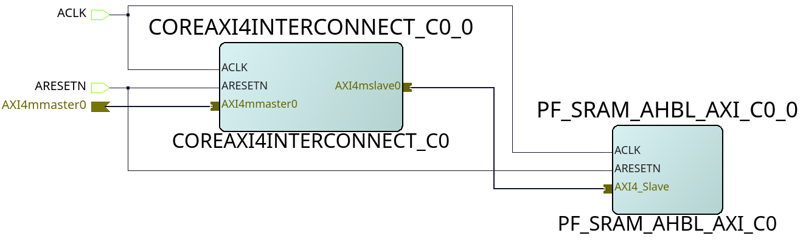

.. _beaglev-fire-axi-apb-interfaces-demo:

Accessing APB and AXI Peripherals Through Linux
###############################################

AXI
***

.. line-block::
    `AXI <https://developer.arm.com/documentation/ihi0022/latest/>`_ is part of the `ARM AMBA <https://developer.arm.com/Architectures/AMBA>`_ (Advanced Microcontroller Bus Architecture) protocol family. 
    It is designed for high-performance, high-frequency system-on-chip (SoC) designs. 
    AXI provides high-speed data transfer with minimal latency and is widely used in various applications, including high-end embedded systems and complex digital circuits.

APB
***

.. line-block::
    `APB <https://developer.arm.com/documentation/ihi0024/latest/>`_ is also part of the ARM AMBA protocol family, designed for low-power and low-latency communication with peripheral devices. 
    It is simpler and lower performance compared to AXI, making it suitable for slower peripheral devices. An APB peripheral also consumes less resources on the FPGA fabric compared to an AXI peripheral.

Accessing AXI and APB Peripherals from Linux
********************************************

.. line-block::
    To access AXI and APB peripherals from Linux, memory-mapped I/O (MMIO) is commonly used. 
    This involves mapping the physical addresses of the peripherals into the virtual address space of a user-space application. 
    The following sections demonstrate how to access APB peripherals using the Linux ``/dev/mem`` interface and AXI peripherals using the UIO (Userspace I/O) framework.

.. note::
    The codes for accessing the interfaces are available in the snippets here: `APB Interfaces <https://openbeagle.org/-/snippets/13>`_ and `AXI Interfaces <https://openbeagle.org/-/snippets/11>`_

APB Interfaces
==============

.. line-block::
    The MSS includes fabric interfaces for interfacing FPGA fabric with the CPU Core Complex. 
    It provides one 32-bit APB master interface, FIC3, and can be connected to a slave in the fabric.

Design Details
--------------

For this example, you can try to write to the APB slave present in the Verilog Tutorial Cape gateware. 
Select the gateware by changing `custom-fpga-design/my_custom_fpga_design.yaml` to include ``VERILOG_TUTORIAL`` as the cape option.

The APB Slave has two registers, one read-only register at ``0x00``, one read-write register at ``0x10``, and a status register containing the last read value at ``0x20``.

.. line-block::
    Having a look at the design, we can see that the APB slave is connected with a CoreAPB3 interconnect, which assigns it the ``0xXX10_0000`` address, the top two bits being ignored. 
    Tracing to the master connected with the CoreAPB3 device, we can see that another interconnect is present, which gives our slave the ``0xX100_0000`` address. 
    The polarfire technical manual shows that FIC3 peripherals can start from the ``0x4000_0000`` address. 
    Therefore, the final address of our APB slave becomes ``0x4110_0000``.

Now, we shall access this address through a memory-mapped interface in Linux.

.. important::

    | Make sure that before running an example to access AXI/APB slave, you must have a properly configured design.
    | Improperly configured designs will result in a *CPU Stall*, which might also damage your beagleboard's file system.
    | If you encounter a stall, a simple reset from the hardware buttons should be enough to get you out of there.
    | For more information about the stalls, please read the section :ref:`on issues faced with the interfaces <issues-with-axi-apb>`.

Accessing the Interface
------------------------

There are two ways to access such registers. One can use the `devmem2` utility or write a C program for accessing the memory region. 
The first method is quite simple.

1. To read from a register:

   .. code-block:: shell

      sudo devmem2 0x41100000 w

2. To write to a register:

   .. code-block:: shell

      sudo devmem2 0x41100010 w 0x1

In the second method, we can use the ``/dev/mem`` interface to access the registers inside the APB Slave. 
Here is an example C program which demonstrates this:

.. raw:: html

    

AXI Interfaces
==============

The MSS includes three 64-bit AXI FICs out of which FIC0 is used for data transfers to/from the fabric. 
FIC0 is connected as both master and slave. For usage of AXI peripherals, an example is also provided by microchip
in their `Polarfire SoC Linux examples <https://github.com/polarfire-soc/polarfire-soc-linux-examples>`_. The example here takes reference from
the `AXI LSRAM example <https://github.com/polarfire-soc/polarfire-soc-linux-examples/tree/master/fpga-fabric-interfaces/lsram>`_.

Design Details
--------------

.. line-block::
    A simple design can be created by first connecting the FIC0 Initiator from the MSS to a `CoreAXI4Interconnect <https://www.microchip.com/en-us/products/fpgas-and-plds/ip-core-tools/coreaxi4interconnect>`_.
    Now, you can connect an AXI slave to this interconnect. We will be using the Polarfire AXI LSRAM.

    Both the CoreAXI4Interconnect and the PF AXI LSRAM will have to be configured. 
    The AXI ID Width of both the modules will have to be matched, as well as the address space of the only slave will have to be configured. 
    In this example, LSRAM gets an address of `0x6000_0000` to `0x6000_ffff`, and the AWID is kept at 9 bits.

    AXI LSRAM slave (example design)

Finally, an entry will be added to the device tree to make a UIO device point to our LSRAM's memory region.

.. code-block::

   &{/} {
       fabric-bus@40000000 {
           fpgalsram: uio@60000000 {
               compatible = "generic-uio";
               linux,uio-name = "fpga_lsram"; // mandatory for program. If changed, please update program as well.
               reg = <0x0 0x60000000 0x0 0x1000>;
               status = "enabled";
           };
       };
   };

Once the gateware is compiled, we can access the memory-mapped interface by the same methods, and by the UIO device as well.

1. Using devmem2:

   .. code-block:: shell

      sudo devmem2 0x60000000 w # for read
      sudo devmem2 0x60000000 w 0x1 # for write

2. Using the UIO device:

.. raw:: html

    

.. _issues-with-axi-apb:

Issues that can be faced when using an improperly configured AXI/APB interface
===============================================================================

A CPU stall can be faced when accessing the FIC interfaces without any slaves connected to the memory region being accessed. 
Your BVF will stop responding if connected to SSH, and on serial you will see the following kernel messages:

.. code-block:: shell

   [   24.110099] rcu: INFO: rcu_sched detected stalls on CPUs/tasks:
   [   24.116041] rcu:     0-...0: (1 GPs behind) idle=e00c/0/0x1 softirq=40/41 fqs=2626
   [   24.123377]     (detected by 3, t=5255 jiffies, g=-1131, q=9 ncpus=4)
   [   24.129573] Task dump for CPU 0:
   [   24.132810] task:swapper/0       state:R  running task     stack:0     pid:0     ppid:0      flags:0x00000008
   [   24.142757] Call Trace:
   [   24.145213] [<ffffffff80a67ba0>] __schedule+0x27c/0x834

If this happens, please double check your design. Specifically, check the address configured for the slaves, the AXI ID wire width and other AXI parameters.

In any case, this state is virtually impossible to recover from gracefully, so the **reset** button may be your last resort.
