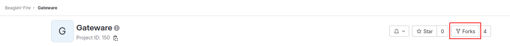
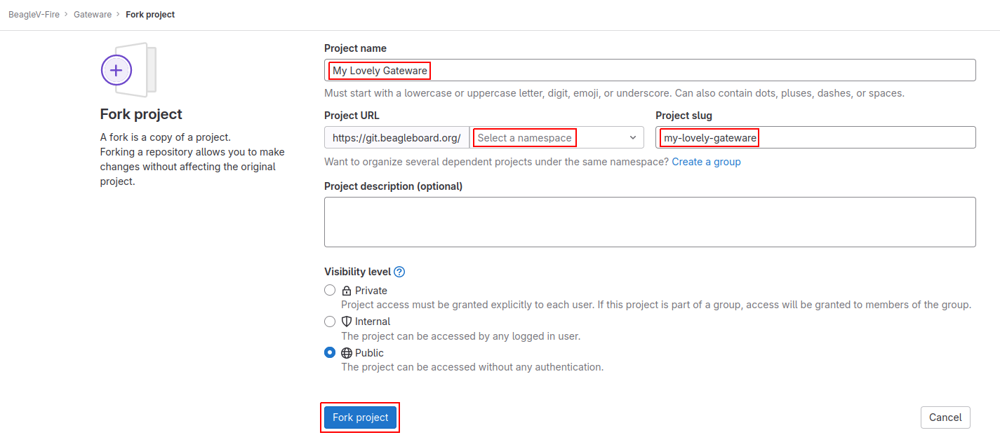
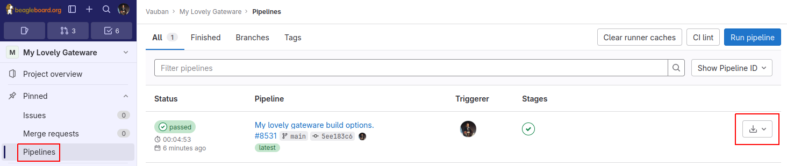
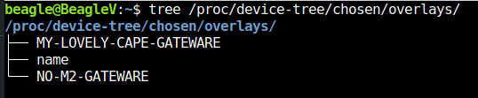

.. _beaglev-fire-customize-cape-gateware-verilog:

Customize BeagleV-Fire Cape Gateware Using Verilog
###################################################

This document describes how to customize gateware attached to BeagleV-Fire's cape interface using
Verilog as primary language. The methodolgy described can also be applied when using other HDL
languages.

It will describe:

- How to generate programming bitstreams without requiring the installation of the Libero FPGA toolchain on your development machine.
- How to use the cape Verilog template
- How to use the git.beagleboard.org CI infrastruture to generate programming bitstreams for your custom gateware

Steps:

1. Fork BeagleV-Fire gateware repository on git.beagleboard.org
2. Create a custom gateware build option
3. Rename a copy of the cape gateware Verilog template
4. Customize the cape's Verilog source code
5. Commit and push changes to your forked repository
6. Retrieve the forked repositories artifacts
7. Program BeagleV-Fire with your custom bitstream 

Fork BeagleV-Fire Gateware Repository
**************************************

.. important:: 
    All new users need to be manually approved to protect from BOT spam. You will not be able to fork the Gateware
    Repository until you have been approved. A request to `the forum <https://forum.beagleboard.org/t/requesting-access-to-gitlab-to-fork-gateware/37494>`_
    may expedite the process. 

Navigate to BeagleV-Fire's `gateware source code repository <https://git.beagleboard.org/beaglev-fire/gateware>`_.

Click on the ``Forks`` button on the top-right corner.

    BeagleV-Fire gateware repo fork button 

On the Fork Project page, select your namespace and adjust the project name to help you manage multiple 
custom gateware (e.g. ``my-lovely-gateware``). Click the ``Fork project`` button.

    Create gateware fork

Clone the forked repository
===========================

.. code-block:: shell

    git clone git@git.beagleboard.org:<MY-NAMESPACE>/my-lovely-gateware.git

Where ``<MY-NAMESPACE>`` is your Gitlab username or namespace.

Create A Custom Gateware Build Option
**************************************

BeagleV-Fire's gateware build system uses "build configuration" YAML files to describe the combination
of gateware components options that will be used to build the gateware programming bitstream. You need 
to create one such file to describe to the gateware build system that you want your own custom gateware
to be built. You need to have one such file describing your gateware in directory ``custom-fpga-design``.

Let's modify the ``./custom-fpga-design/my_custom_fpga_design.yaml`` build configuration file to 
specify that your custom cape gateware should be included in the gateware bitstream. In this instance will 
call our custom cape gateware ``MY_LOVELY_CAPE``.

.. callout::

    .. code-block:: yaml

        HSS:
            type: git
            link: https://github.com/polarfire-soc/hart-software-services.git
            branch: master
            make_clean: 1
        gateware:
            type: sources
            build-args: "M2_OPTION:NONE CAPE_OPTION:MY_LOVELY_CAPE" # <1>

    .. annotations::

        <1> On the gateware build-args line, replace VERILOG_TUTORIAL with MY_LOVELY_CAPE.

.. note:: 
        The **custom-fpga-design** directory has a special meaning for the Beagleboard Gitlab CI system.
        Any build configuration found in this directory will be built by the CI system. This allows generating
        FPGA programming bitstreams without the requirement for having the Microchip FPGA toolchain installed
        on your computer.

Rename A Copy Of The Cape Gateware Verilog Template
****************************************************

Move to the cape gateware source code
=====================================

.. code-block:: shell

    cd my-lovely-gateware/sources/FPGA-design/script_support/components/CAPE

Create a directory that will contain your custom cape gateware source code
===========================================================================

.. code-block:: shell

    mkdir MY_LOVELY_CAPE

Copy the cape Verilog template
===============================

.. code-block:: shell

    cp -r VERILOG_TEMPLATE/* ./MY_LOVELY_CAPE/

Customize The Cape's Verilog Source Code
****************************************

.. line-block::
    You will only need to change the content of ``ADD_CAPE.tcl`` if you want to modify how the cape interfaces with the rest of the gateware
    (RISC-V processor subsystem, clock and reset blocks).

.. tip::
    | Any Verilog file (\*.v) you put in the ``HDL`` subdirectory will automatically be pulled into the project by the build system.
    | Manual intervention is no longer required.

Customize The Cape's Verilog source code
========================================

We will add a simple Verilog source file, ``blinky.v``, in the ``MY_LOVELY_CAPE/HDL`` directory. Code below:

.. code-block:: verilog

    `timescale 1ns/100ps

    module blinky (
      input  clk,
      input  resetn,
      output blink
    );

    reg [22:0] counter;

    assign blink = counter[22];

    always @(posedge clk, negedge resetn)
    begin
      if(~resetn)
      begin
        counter <= 23'b0;
      end
      else
      begin
        counter <= counter + 23'b1;
      end
    end

    endmodule

Let's connect the blinky Verilog module within the cape by editing the ``CAPE.v`` file (we're still in the HDL subdirectory).

Add the instantiation of the blinky module:

.. callout::
    
    .. code-block:: dts

        //--------P9_41_42_IOPADS
        P9_41_42_IOPADS P9_41_42_IOPADS_0(
                // Inputs
                .GPIO_OE  ( GPIO_OE_const_net_3 ),
                .GPIO_OUT ( GPIO_OUT_const_net_3 ),
                // Outputs
                .GPIO_IN  (  ),
                // Inouts
                .P9_41    ( P9_41 ),
                .P9_42    ( P9_42 ) 
                );

        //--------blinky
        blinky blinky_0(                // <1>
                .clk     ( PCLK ),      // <2>
                .resetn  ( PRESETN ),   // <3>
                .blink   ( BLINK )      // <4>
                );
        
        endmodule

    .. annotations::

        <1> Create a blinky module instance called blinky_0.

        <2> Connect the clock using the existing PCLK wire.

        <3> Connect the reset using the exisitng PRESETS wire.

        <4> Connect the blinky's blink output using the BLINK wire. This BLINK wire needs to be declared.

Add the BLINK wire:

.. callout::
    
    .. code-block:: verilog

        wire           PCLK;
        wire           PRESETN;
        wire           BLINK;                   // <1>
        wire   [31:0]  APB_SLAVE_PRDATA_net_0;
        wire   [27:0]  GPIO_IN_net_1;

    .. annotations::

        <1> Create a wire called BLINK.

.. line-block::
    The BLINK wire will be used to connect the blinky module's output to a top level output connected to a LED.
    Do you see where this is going?

    Now for the complicated part. We are going to change the wiring of the bi-directional buffers
    controlling the cape I/Os including the user LEDs. 

    The original code populates two 43 bit-wide vectors,
    for controlling the output-enable and output values of the P8 cape connector I/Os.

    The bottom 28 bits being controlled by the microprocessor subsystem's GPIO block; those are the ones we want.

.. code-block:: verilog

    //--------------------------------------------------------------------
    // Concatenation assignments
    //--------------------------------------------------------------------
    assign GPIO_OE_net_0  = { 16'h0000 , GPIO_OE };
    assign GPIO_OUT_net_0 = { 16'h0000 , GPIO_OUT };

We are going to hijack the 6th I/O with our blinky's output:

.. callout::

    .. code-block:: verilog

        //--------------------------------------------------------------------
        // Concatenation assignments
        //--------------------------------------------------------------------
        assign GPIO_OE_net_0  = { 16'h0000,  GPIO_OE[27:6],  1'b1,  GPIO_OE[4:0] };    // <1>
        assign GPIO_OUT_net_0 = { 16'h0000, GPIO_OUT[27:6], BLINK, GPIO_OUT[4:0] };    // <2>

    .. annotations::

        <1> Tie high the output-enable of the 6th bit to constantly enable that output.

        <2> Control the 6th output from the blink module through the BLINK wire.

Edit The Cape's Device Tree Overlay
===================================

.. line-block::
    You should always have a device tree overlay associated with your gateware even if there is limited control from Linux.
    The device tree overlay is very useful to identify which gateware is currently programmed on your BeagleV-Fire.

.. callout::

    .. code-block:: dts

        /dts-v1/;
        /plugin/;

        &{/chosen} {
                overlays {
                        MY-LOVELY-CAPE-GATEWARE = "GATEWARE_GIT_VERSION";   // <1>
                };
        };

    .. annotations::

        <1> Replace VERILOG-CAPE-GATEWARE with MY-LOVELY-CAPE-GATEWARE.

.. line-block::
    This change will result in ``MY-LOVELY-CAPE-GATEWARE`` being visible in ``/proc/device-tree/chosen/overlays`` at run-time,
    allowing to check that my lovely gateware is successfully programmed on BeagleV-Fire.

Commit And Push Changes To Your Forked Repository
*************************************************

Move back up to the root directory of your gateware project. This is the my-lovely-gateware directory in our current example.

Add the ``my-lovely-gateware/sources/FPGA-design/script_support/components/CAPE/MY_LOVELY_CAPE`` directory content to your git repository.

.. code:: shell

    git add sources/FPGA-design/script_support/components/CAPE/MY_LOVELY_CAPE/

Commit changes to ``my-lovely-gateware/custom-fpga-design/my_custom_fpga_design.yaml``

.. code:: shell

    git commit -m "Add my lovely gateware."

Push changes to your beagleboard Gitlab repository:

.. code:: shell

    git push

Retrieve The Forked Repositories Artifacts
******************************************

.. line-block::
    Navigate to your forked repository. Click Pipelines in the left pane then the Download Artifacts button on the right handside.
    Select ``build-job:archive``. This will result in an ``artifacts.zip`` file being downloaded.

    gateware pipeline

Program BeagleV-Fire With Your Custom Bitstream 
************************************************

Unzip the downloaded ``artifacts.zip`` file. Go to the ``gateware-builds-tester/artifacts/bitstreams`` directory:

.. code:: shell

    cd gateware-builds-tester/artifacts/bitstreams

.. line-block::
    On your Linux host development computer, use the scp command to copy the bitstream to BeagleV-Fire home directory,
    replacing ``<IP_ADDRESS>`` with the IP address of your BeagleV-Fire.

.. code:: shell

    scp -r  ./my_custom_fpga_design beagle@<IP_ADDRESS>:/home/beagle/

On BeagleV-Fire, initiate the reprogramming of the FPGA with your gateware bitstream:

.. code:: shell

    sudo /usr/share/beagleboard/gateware/change-gateware.sh ./my_custom_fpga_design

Wait for a couple of minutes for the BeagleV-Fire to reprogram itself.

.. line-block::
    You will see the 6th user LED flash once the board is reprogrammed.
    That's the Verilog you added blinking the LED.

    On BeagleV-Fire, You can check that your gateware was loaded using the following command
    to see the device tree overlays:

.. code:: shell

    tree /proc/device-tree/chosen/overlays/

    gateware lovely overlay

