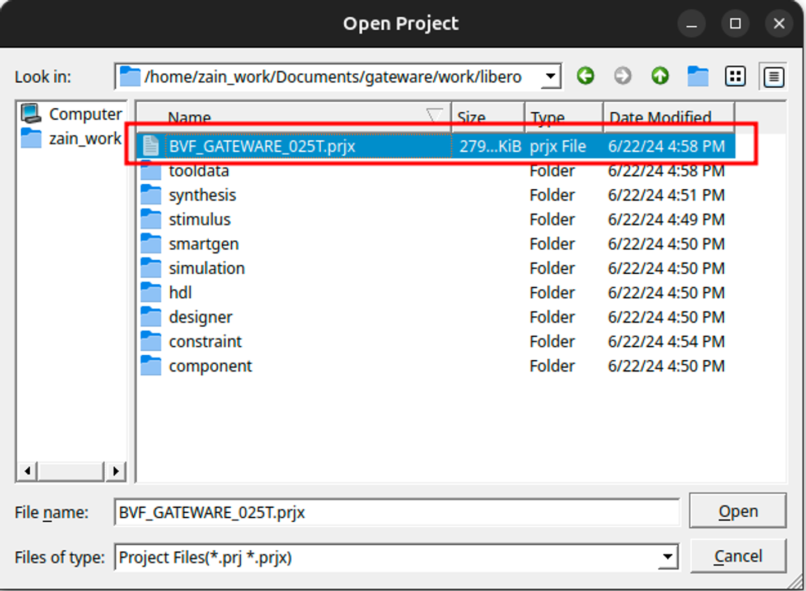
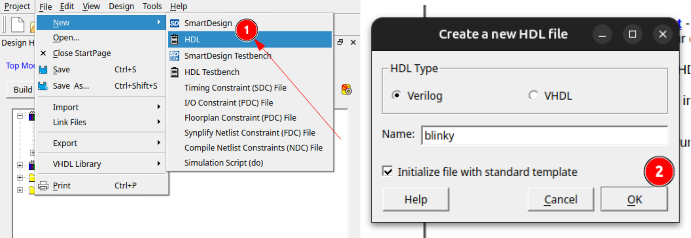
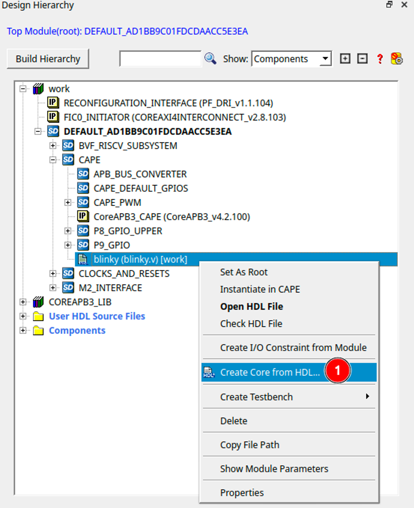
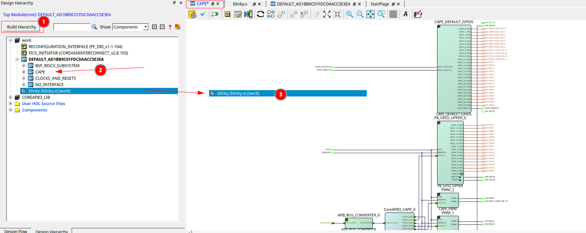
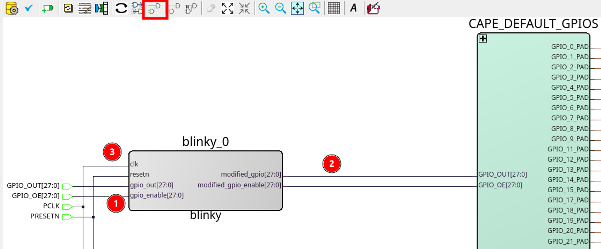
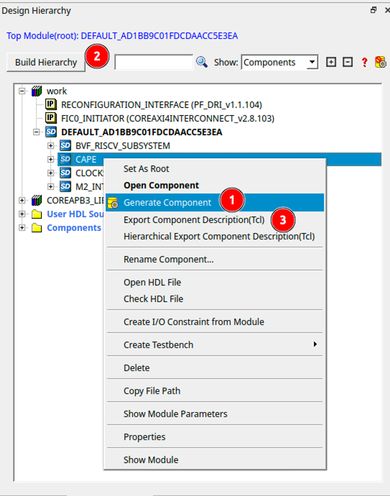
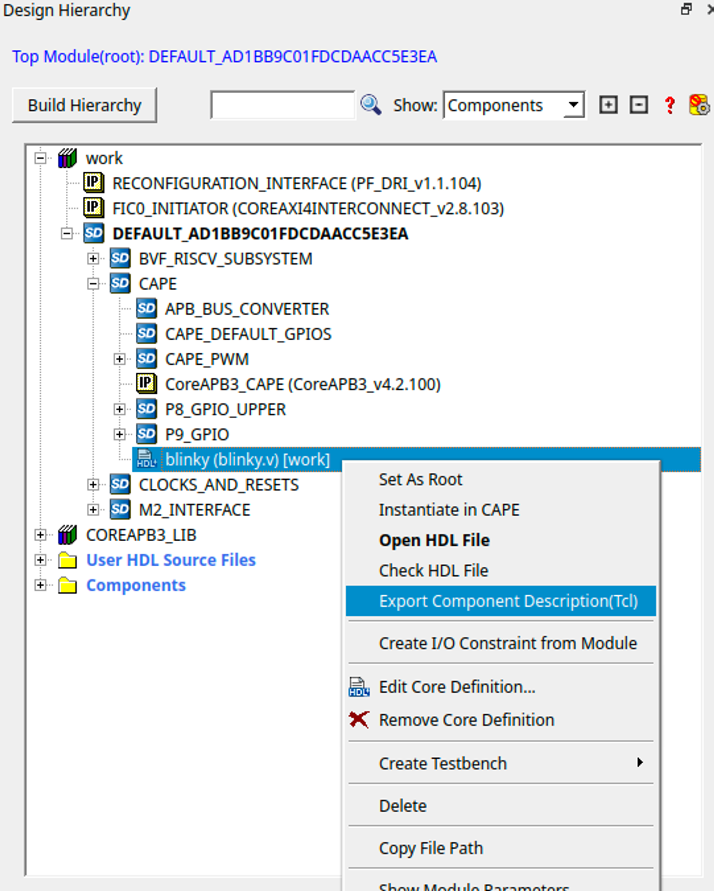

.. _beaglev-fire-exploring-gateware-design-libero:

Exploring Gateware Design with Libero
#####################################

In this demonstration, we'll be exploring the BeagleV-Fire gateware in the `Libero Design Suite <https://www.microchip.com/en-us/products/fpgas-and-plds/fpga-and-soc-design-tools/fpga/libero-software-later-versions>`_, making changes
to the default gateware. This demo will serve as an introduction to the design tool, an alternative method 
for developing gateware.

Prerequisites
*************

The prerequisites required for creating the Libero project locally are:

1. Microchip design tools: Refer to the document here for :ref:`installation instructions<beaglev-fire-mchp-fpga-tools-installation-guide>` of microchip FPGA tools.
2. Python requirements for gateware build scripts:
    
.. code-block:: shell

    pip3 install gitpython
    pip3 install pyyaml
 
3. Build requirements:
 
.. code-block:: shell

    sudo apt install device-tree-compiler
 

.. tip::

    For convience, you can install a python command alias like so:

    .. code-block:: shell

        sudo apt install python-is-python3
 
    This is optional, but remember to use ``python3`` in later command examples if you don't.
 
4. Environment variables: The following environment variables are required for compilation:
    - ``SC_INSTALL_DIR``
    - ``FPGENPROG``
    - ``LIBERO_INSTALL_DIR``
    - ``LM_LICENSE_FILE``
    
    | A script is provided for setting up these variables in the :ref:`fpga tools installation <beaglev-fire-mchp-fpga-tools-installation-guide>` section.
    | An example script for setting up the environment is available `here <https://openbeagle.org/beaglev-fire/Microchip-FPGA-Tools-Setup>`_.

5. It is highly recommended to go through the :ref:`beaglev-fire-customize-cape-gateware-verilog` tutorial
to understand the basics of the gateware structure.

Cloning and Building the Gateware
*********************************

First, we must source the environment to include the microchip tools.

.. code-block:: shell

    source /path/to/microchip/fpga/tools/setup-microchip-tools.sh

Next, we'll clone the gateware repository to get a local copy of the project.

.. code-block:: shell

    git clone https://openbeagle.org/beaglev-fire/gateware.git
    cd gateware

.. line-block::
    We can then use the ``build-bitstream.py`` script to generate a Libero project for us,
    where we can start making our changes.

.. important::

    | Make sure to source the microchip setup script before starting the next command.
    | This is required every time you open a new terminal.

.. code-block:: shell

    python build-bitstream.py ./build-options/default.yaml # exploring the default gateware

This should start a big log stating the compilation of the project. First, the device tree 
overlays are compiled, which contain information for linux about the gateware.

Next, the Hart Software Services (HSS) is compiled. This acts as a zero-stage bootloader, configuring
the Polarfire SoC and allowing services like loading the next stage bootloader and flashing the eMMC 
of the board.

Then the libero project generating is started. Here, TCL scripts inside the ``sources`` directory are 
executed, starting with the ``BUILD_BVF_GATEWARE.tcl`` script. This stitches each HDL module, IP, 
hardware configuration together in the gateware.

.. line-block::
    Once bitstream generation is completed, the Libero project is ready to be opened.
    Start Libero on the same terminal in linux, like so:

.. code-block:: shell

    libero &

or from the start menu in Windows, and open the project file by pressing 
``CTRL+O`` and selecting the generated project as ``gateware/work/libero/BVF_GATEWARE_025T.prjx`` .

    Libero project location

Exploring The Design
********************

Let the IDE load everything, and then you're all set to browse around! You can go to the 
``Design Hierarchy`` view to look at all Smart Design components. Here, all the gateware components 
are listed in block-like views. Double click the ``DEFAULT_******`` option in the hierarchy to have a look
at the whole gateware. You should also be able to see the cape, M.2 interface and the RISC-V subsystem 
modules. These modules are explained in `Gateware Introduction <beaglev-fire-gateware-design>`_.

.. figure:: images/libero-gateware-overview.png
    :align: center
    :width: 1040
    :alt: Libero gateware overview

    Libero gateware overview

Adding Custom HDL
*****************

.. line-block::
    Once you're done exploring, we can start by adding our first HDL to the design.
    Create a new HDL file through the menu bar, and name it ``blinky``.
    Once created, you can find the HDL file under the ``User HDL Source Files``
    heading in the Design Hierarchy.

    Adding new HDL

Next, add this code to the file:

.. code-block:: verilog

    `timescale 1ns/100ps
    module blinky(
    input    clk,
    input    resetn,
    input [27:0] gpio_out,
    input [27:0] gpio_enable,
    output [27:0] modified_gpio,
    output [27:0] modified_gpio_enable
    );

    reg [22:0] counter;
    assign modified_gpio = {gpio_out[27:6], counter[22], gpio_out[4:0]}; 
    assign modified_gpio_enable = {gpio_enable[27:6], 1'b1, gpio_enable[4:0]}; 

    always@(posedge clk or negedge resetn)
    begin
        if(~resetn)
            begin
                counter <= 23'h0;
            end
        else
            begin
                counter <= counter + 23'b1;
            end
    end
    endmodule

.. line-block::
    After saving it, press the ``Build Hierarchy`` button in the Design Hierarchy window to refresh it,
    and bring the added HDL to the work directory.
    Right click on it to select the “Create Core from HDL….” option.
    Press ``No`` on the dialog that follows since we've described the ports completely in our HDL.

    Create core from HDL

.. line-block::
    Now, double click the ``CAPE`` design under the ``DEFAULT_****`` smart design,
    to have a look at what's in the cape.

.. line-block::
    Drag and drop the ``blinky`` file appearing in the work section into the cape design.
    You will have successfully instantiated the new verilog file into the cape smart design.

    Add blinky to cape

Making The Connections
======================

.. line-block::
    You should see the blinky module within the CAPE design,
    and it should be fairly obvious where we're going to be connecting 
    the module if you've gone through the previous demo.

.. line-block::
    First, delete the wires connecting the ``GPIO_OUT`` and ``GPIO_OE`` to the ``CAPE_DEFAULT_GPIOS`` module.
    Then, simply connect the ``GPIO_OUT`` and the ``GPIO_OE`` terminals of the cape
    to the ``gpio_out`` and the ``gpio_enable`` pins respectively.
    Similarly connect the outputs of the blinky module to the ``CAPE_DEFAULT_GPIOS`` module.

    Connect blinky to cape

.. line-block::
    Finally, connect the CLK and the RESET pins to the ``PCLK`` and the ``PRESETN`` pins below in the cape.
    You can use the **compress layout** button in the toolbar to make the design neat once you're done connecting the wires. 

.. line-block::
    Go ahead and save the CAPE file.
    You can also verify the design by pressing the checkmark icon in the editor toolbar.
    Now, it's time to export our design back to the gateware repository.

Exporting The Design
********************

Exporting the Cape
==================

.. line-block::
    The SmartDesigns you have changed should show an “i” icon in front of them indicating
    that they need to be regenerated.
    First, regenerate the designs by right clicking on them and selecting “Generate Component”.
    Rebuild the Hierarchy too as we've done before.

    Regenerate designs

.. line-block::
    Next, right-click on the cape and select “Export Component Description (TCL)” to export it
    as a script which can be used in the gateware repository.
    I suggest creating an export directory where you can temporarily store the exported gateware files before getting them into the repository.

.. notice::
    You **must** make sure your path exist, because Libero does not currently tell you if the export is successfull or not.

Now, simply copy it into the gateware at the following path.

.. code-block:: shell

    cp ~/export/gateware/CAPE.tcl ~/gateware/sources/FPGA-design/script_support/components/CAPE/DEFAULT/

Exporting The HDL
=================

.. line-block::
    To add new HDL to the gateware repository, first we need to copy it
    to the HDL directory at `gateware/sources/FPGA-design/script_support/HDL`.
    You can do that by just creating a folder named blinky inside and copying the HDL to it.

.. code-block:: shell

    mkdir ~/gateware/sources/FPGA-design/script_support/HDL/BLINKY
    cp ~/gateware/work/libero/hdl/blinky.v ~/gateware/sources/FPGA-design/script_support/HDL/BLINKY/

.. line-block::
    Now, to add the TCL script to import this design for the CAPE scripts,
    we can export the script by right-clicking on the HDL file in the Design Hierarchy and select ``Export Component Description``.

    Export HDL

Now, concatenate the contents of this exported file to our gateware's HDL sourcing script at 
`gateware/sources/FPGA-design/script_support/hdl_source.tcl` like so:

.. code-block:: shell

    cat blinky.tcl >> ~/gateware/sources/FPGA-design/script_support/hdl_source.tcl

.. line-block::
    First, copy the contents of the exported TCL file to the bottom of the file.
    Replace the ``-file`` argument in the line with ``-file $project_dir/hdl/blinky.v``.
    Finally, source the file by add a line below line no. 11 as:

.. code-block:: tcl

        -hdl_source {script_support/HDL/AXI4_address_shim/AXI4_address_shim.v} \
        -hdl_source {script_support/HDL/BLINKY/blinky.v} # ⓵ Source the script below line 11

    #......
    #...... towards the end of the file

    hdl_core_assign_bif_signal -hdl_core_name {AXI_ADDRESS_SHIM} -bif_name {AXI4_INITIATOR} -bif_signal_name {RREADY} -core_signal_name {INITIATOR_OUT_RREADY} 
 
    create_hdl_core -file $project_dir/hdl/blinky.v -module {blinky} -library {work} -package {} 
    # ⓶ Add the core at the end of the file

Feel free to cut any extra comment lines introduced when concatenating above.
Verify your script as above, save it and now you're good to compile your project! 

.. important::

    | Make sure you close Libero at this point.
    | If you don't, ``build-bitstream.py`` **will** fail to properly checkout the required licenses.

Now is a good time to check in your changes to git:

.. code-block:: shell

    cd ~/gateware
    git add ./sources/FPGA-design/script_support/components/CAPE/DEFAULT/CAPE.tcl
    git add ./sources/FPGA-design/script_support/hdl_source.tcl
    git add ./sources/FPGA-design/script_support/HDL/BLINKY/blinky.v
    git clean -df

Final Verification
******************

Go ahead and run the python script to build the gateware and verify your changes:

.. code-block:: shell

    python build-bitstream.py ./build-options/default.yaml

.. line-block::
    If at any point the compilation fails, you can debug the script at the mentioned line.
    If it compiles successfully, it will mention it by saying:

.. code-block:: text

    The Execute Script command succeeded.
    The BVF_GATEWARE_025T project was closed.

.. line-block::

    With a little luck, the script completes successfully and you can
    now send your changes onto your gateware repository fork,
    download the artifacts after compilation,
    and program the gateware using the ``change_gateware.sh`` script.

.. tip::

    For a more direct route you can copy the generated bitstream straight to your Beagle
    and try the result immidiately:
    
    .. code-block:: shell
    
        scp -r ./bitstream beagle@<ip or name here>:
    On the beagle, use:

    .. code-block:: shell
    
        sudo /usr/share/beagleboard/gateware/change-gateware.sh ./bitstream
    

Have fun!