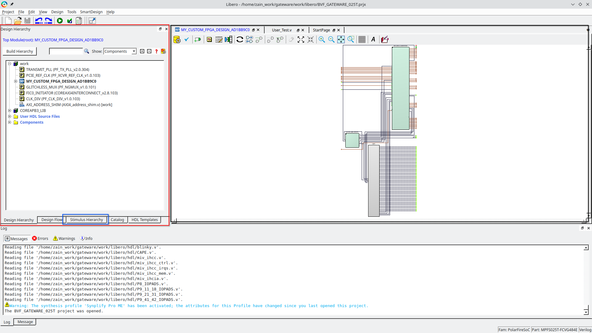
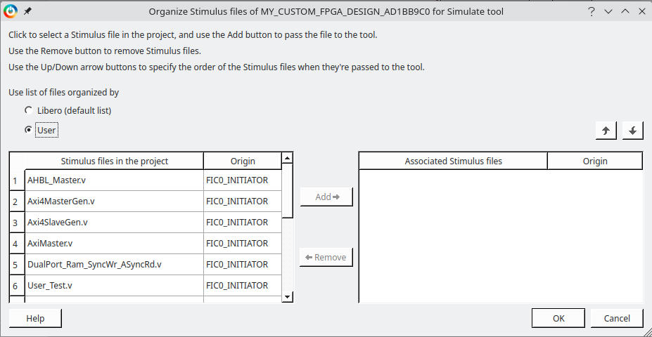
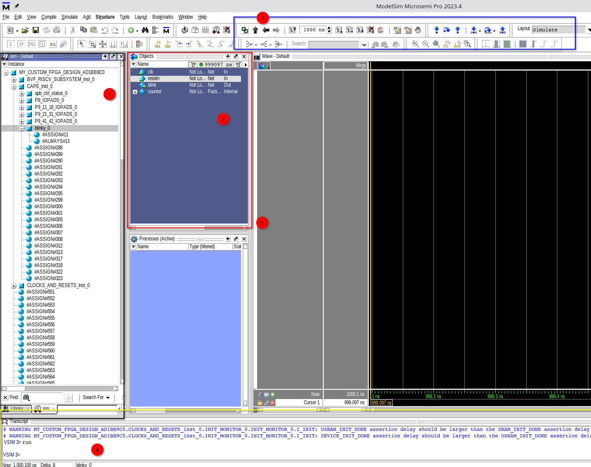
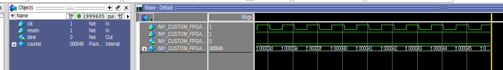

.. _beaglev-fire-gateware-design-simulation-libero:

Simulating Gateware Design with Libero
##########################################

In this demonstration, we will have a look at simulating the gateware design in Libero. Through simulations, 
one can verify the functionality of the design before implementing it on the hardware. The simulation is done using the ModelSim simulator, 
which is integrated with Libero. The gateware design that we will simulate is the blinky LED design, present in the ``VERILOG_TUTORIAL`` gateware option.

Prerequisites
*************

#. Libero SoC 2022 or later. You can follow this guide to install Libero SoC: :ref:`beaglev-fire-mchp-fpga-tools-installation-guide`.
#. A copy of the `gateware repository <https://openbeagle.org/beaglev-fire/gateware/>`_.
#. The ``setup_microchip_tools.sh`` file, to start the license server and set the environment variables. The setup of this script is also covered in the installation guide.

Setting up ModelSim
*******************

Modelsim requires certain libraries to be present in the system, which might not be installed by default. You can check if ModelSim is working by:

.. code-block:: bash

   source setup_microchip_tools.sh
   $LIBERO_INSTALL_DIR/ModelSimPro/linuxacoem/vsim

If ModelSim is not working due to missing libraries, you might see an error message like:

.. code-block:: bash

   vsim: error while loading shared libraries: libXft.so.2: cannot open shared object file: No such file or directory

To fix this, you can install the required libraries using the following command:

.. code-block:: bash

   sudo  apt-get install libxft2 libxft2:i386 lib32ncurses5

If you still cannot run ModelSim, you can try fixes from this `guide <https://profile.iiita.ac.in/bibhas.ghoshal/COA_2020/Lab/ModelSim%20Linux%20installation.html>`_.

Simulating the Blinky LED Design
*********************************

To start with the simulation, we must first compile the gateware design. The blinky LED design is present in
the ``VERILOG_TUTORIAL`` gateware option. To compile the design, follow the steps below:

#. First, compile the gateware design using the following command:

.. code-block:: bash

   cd gateware
   python build-bitstream.py custom-fpga-design/my_custom_fpga_design.yaml

#. Once the design is compiled, open the Libero SoC software and select the created project. You can find the project in the ``work/libero`` directory.

#. Once the project is opened, your window should look something like this. In front of you will be the overview of the gateware design, and on the left you will have multiple tabs showing the design hierarchy, design flow, etc.

#. For the simulation, testbench files will need to be set up, which will be used to simulate the design. This can be done from the stimulus hierarchy. However, for this example we will be using the default testbench files provided by libero.

#. To set up the simulation, go to the ``Design Flow`` tab and right click on the ``Simulate`` button to select ``Open Interactively``. 

.. figure:: images/simulation-demo/libero-start-modelsim.png
   :alt: Simulate Button
   :width: 60%
   :align: center

#. Before starting modelsim, Libero will ask you to add any additional files that you want to include in the simulation. For now, let's go with the ones that came with the design and it's IPs.

#. Once the simulation is started, you will see the ModelSim window open up. 

Exploring ModelSim and Running the simulations
**********************************************

Looking at the modelsim window, there are four main sections to look at:

#. The top left section shows the design hierarchy. This is where you can see the design modules and their instances.

#. The section beside the design hierarchy is the object hierarchy. This shows the objects in the design, including the signals and variables.

#. At the top, you should see the simulation toolbar. This is where you can run the simulations, add breakpoints, etc.

#. At the bottom, you should see the transcript window. This is where you can see the simulation logs. This also acts as a command line interface for ModelSim.

#. The far right section is the waveform window. This is where you can see the waveforms of the signals in the design.

You can add signals to the waveform window by right clicking on the signal in the object hierarchy and selecting ``Add to Wave``.
Once added, you can run the simulation by clicking on the ``Run`` button in the simulation toolbar. The simulation will run for a few nano seconds as specified
in the toolbar beside the ``Run`` button.

Once the simulation is complete, you can see the waveforms of the signals in the waveform window.

If you want to automate addition of signals to the waveform, you see the output of each GUI command in the transcript window. You can use these commands to automate the process.
Just put the commands in a file with a ``.do`` extension and run the file using the ``do`` command in the transcript window.

An example of a ``.do`` file is shown below:

.. code-block:: tcl

   add wave -noupdate /tb_top/clk
   add wave -noupdate /tb_top/rst
   add wave -noupdate /tb_top/led

   run 100 ns

A default ``run.do`` script is created at the following path - ``work/libero/simulation`` - when a simulation is run. You can use this file as a starter file
for creating your own scripts as well as for understanding how the initial simulation is set-up.

Good luck with your simulations!
