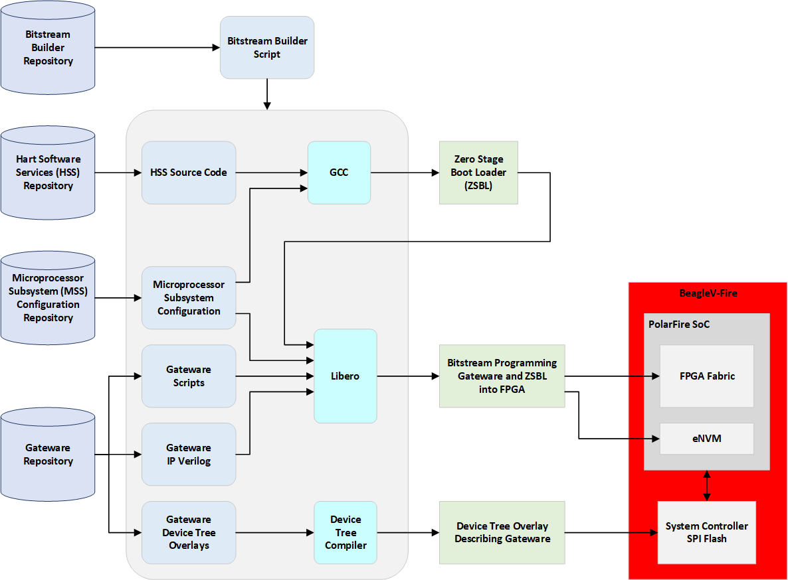

Gateware Full Build Flow
########################

Introduction
============

The BeagleV-Fire gateware is made up of several components:

- Digital design for the FPGA fabric. This can a combination of:
  
  - HDL/Verilog source code 
  - TCL scripts configuring IP blocks
  - TCL scripts stiching IP blocks together
  - Microprocessor Subsystem (MSS) configuration describing the MSS port list
  - pin, placement and timing constraints
- Microprocessor Subsystem (MSS) configuration containing MSS configuration register values
- A zero stage bootloader (HSS) that will:
  
  - Provision the MSS configuration into chip configuration registers:
  
    - Setup clocks
    - Configure memory controllers
    - Configure IOs
    - Configure transceivers
  
  - Retrieve the next boot stage from eMMc and hand-over to the next boot stage (e.g. u-boot)
  - Make the board appear as a USB mass-storage for populating the eMMC with secondary boot-loader and operating system image.
- A set of device tree ovelays describing the content of the FPGA fabric.

Of course all these components need to be in synch with each other for the system to work properly.
This is the reason for using a gateware build system rather than building and tracking each component individually.

Programming artifacts
=====================

The BeagleV-Fire gateware builder produces two programming artifacts:

- A bitstream containing the FPGA fabric and eNVM programming
- A device tree overlay describing the FPGA content.

These two artifacts are packaged differently depending on the programming method. They are merged
into a single programming file for DirectC (.dat) and FlashPro Express (.job). They are kept
separate for Linux programming (mpfs_bitstream.spi and mpfs_dtbo.spi).

Programming BeagleV-Fire with new gateware
==========================================

There are several methods possible for programming the BeagleV-Fire with new gateware:

- Linux script executed on the BeagleV-Fire board.
- Running DirectC on anothe single board computer
- Using Microchip's FlashPro Express

Linux script
------------
This is the recommended approach. It does not require any additional hardware. Simply run the script
located in /usr/share/beagleboard/gateware. You should use this methods unless you have soft-bricked
your BeagleV-Fire.

DirectC
-------
This approach uses a single board computer (SBC) connected to the BeagleV-Fire JTAG port. The SBC
bit-bangs the FPGA programming protocol over GPIOs. This approach is only required for recovering
a soft-bricked BeagleV-Fire.

FlashPro Express
----------------
This approach uses Microchip's FlashPro Express programming software and a FlashPro6 JTAG programmer.
I would recommend using the Linux script even if you are an existing Microchip FPGA user with all the
tools. This approach makes most sense when doing bare metal software development and already have a
FlashPro programmer and don't care about device tree overlays.
