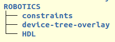
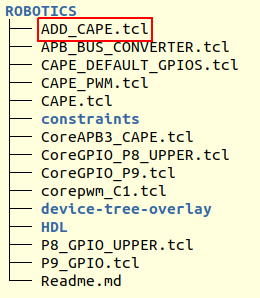

.. _beaglev-fire-gateware-tcl-scripts-structure:

Gateware TCL Scripts Structure
##############################

This document describes the structure of the gateware TCL scripts. It is of interest to understand
how to extend or customize the gateware.

The `Libero SoC TCL Command Reference Guide <https://coredocs.s3.amazonaws.com/Libero/2023_2/Tool/libero_soc_tcl_cmd_ref_ug.pdf>`_ describes the TCL command used in the gateware scripts.

Gateware Project
================

The gateware project is made up of:

- TCL scripts
- HDL/Verilog source code
- IO pin constraints
- Placement constraints
- Device tree overlays

All these files are found in the FPGA-design directory.

.. figure:: images/gateware-source-dir.*
    :align: center

Gateware Components
===================

The gateware is organized into 6 components:

- Clocks and reset control
- A base RISC-V microprocessor subsystem
- Cape interface
- M.2 interface
- MIPI camera interface
- SYZYGY high speed interface

.. figure:: images/gateware-components.*
    :align: center

Gateware Build Options
======================

Each interface component may have a number of build options. For example, which cape will be
supported by the generated gateware.

.. figure:: images/gateware-cape-options.*
    :align: center

The name of the directories within the component's directory are the option names passed to the
top Libero BUILD_BVF_GATEWATE.tcl script. These directory names are the option name specified in
the bitstream builder's build option YAML files.

The gateware is extended or customized by creating additional directories within the component
directory of interest. For example, add a MY_CUSTOM_CAPE directory under the CAPE directory to
add a gateware build option to support a custom cape.

Gateware Component Directories
==============================

The component directory contains subdirectories for:

- Constraint files
- Device tree overlay
- Optional HDL/Verilog source code

Gareware TCL Scripts
--------------------

The component directory contains the TCL scripts executed by Libero to generate the gateware.
The TCL script framework executes a hand-crafted ADD_<COMPONENT_NAME>.tcl script which instantiates
the component and stiches it to the base RISC-V subsystem and top level IOs. The other TCL scripts
are typically IP configuration scripts and SmartDesign stiching scripts.

