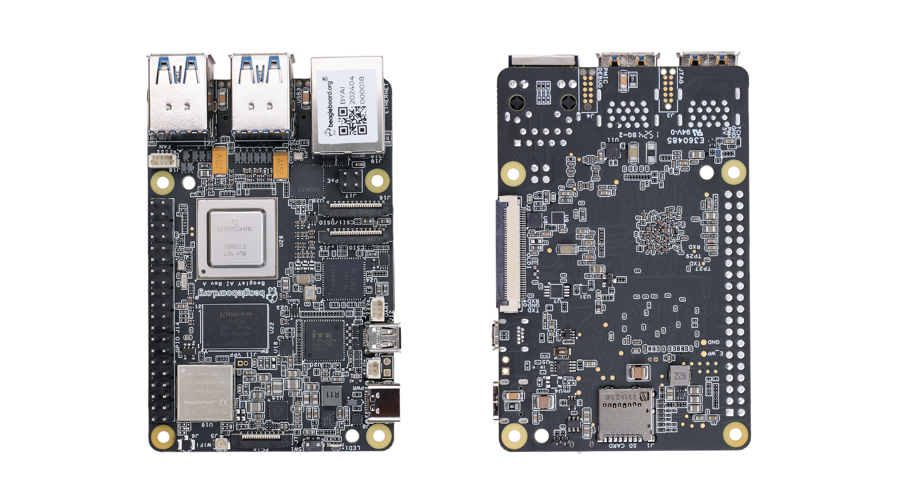

.. _beagley-ai-introduction:

Introduction 
#############

BeagleY-AI is an open-source single board computer designed for edge AI applications.

.. _beagley-ai-detailed-overview:

Detailed overview
******************

BeagleY-AI is based on the Texas Instruments AM67A Arm-based vision processor.  It features a quad-core 64-bit Arm®Cortex®-A53 CPU subsystem at 1.4GHz, 
Dual general-purpose C7x DSP with Matrix Multiply Accelerator (MMA) capable of 4 TOPs each, Arm Cortex-R5 subsystem for low-latency 
I/O and control, a 50 GFlop GPU, video and vision accelerators, and other specialized processing capability.

.. table:: BeagleY-AI features
        
    +-----------------------+---------------------------------------------------------------------------------------------------------------------------------------------------------+
    | Feature               | Description                                                                                                                                             |
    +=======================+=========================================================================================================================================================+
    | Processor             | Texas Instruments AM67A, Quad 64-bit Arm® Cortex®-A53 @1.4 GHz, multiple cores including Arm/GPU processors, DSP, and vision/deep learning accelerators |
    +-----------------------+---------------------------------------------------------------------------------------------------------------------------------------------------------+
    | RAM                   | 4GB LPDDR4 (x32)                                                                                                                                        |
    +-----------------------+---------------------------------------------------------------------------------------------------------------------------------------------------------+
    | Wi-Fi/Bluetooth       | BeagleBoard.org BeagleMod BM3301, 802.11ax Wi-Fi 6, Bluetooth Low Energy (BLE) 5.4                                                                      |
    +-----------------------+---------------------------------------------------------------------------------------------------------------------------------------------------------+
    | USB Ports             | 4 x USB 3.0 TypeA ports supporting simultaneous 5Gbps operation, 1 x USB 2.0 TypeC, supports USB 2.0 device mode                                        |
    +-----------------------+---------------------------------------------------------------------------------------------------------------------------------------------------------+
    | Ethernet              | Gigabit Ethernet, with PoE+ support (requires separate PoE HAT)                                                                                         |
    +-----------------------+---------------------------------------------------------------------------------------------------------------------------------------------------------+
    | Camera/Display        | 2 x 4-lane MIPI camera connector (one connector muxed with DSI capability)                                                                              |
    +-----------------------+---------------------------------------------------------------------------------------------------------------------------------------------------------+
    | Display Output        | 1 x HDMI display, 1 x OLDI display, 1 x DSI MIPI Display (DSI muxed with 1 CSI)                                                                         |
    +-----------------------+---------------------------------------------------------------------------------------------------------------------------------------------------------+
    | Real-time Clock (RTC) | Supports external coin-cell battery for power failure time retention                                                                                    |
    +-----------------------+---------------------------------------------------------------------------------------------------------------------------------------------------------+
    | Debug UART            | 1 x 3-pin debug UART                                                                                                                                    |
    +-----------------------+---------------------------------------------------------------------------------------------------------------------------------------------------------+
    | Power                 | 5V/3A DC power via USB-C                                                                                                                                |
    +-----------------------+---------------------------------------------------------------------------------------------------------------------------------------------------------+
    | Power Button          | On/Off included                                                                                                                                         |
    +-----------------------+---------------------------------------------------------------------------------------------------------------------------------------------------------+
    | PCIe Interface        | PCI-Express® Gen3 x 1 interface for fast peripherals (requires separate M.2 HAT or other adapter)                                                       |
    +-----------------------+---------------------------------------------------------------------------------------------------------------------------------------------------------+
    | Expansion Connector   | 40-pin header                                                                                                                                           |
    +-----------------------+---------------------------------------------------------------------------------------------------------------------------------------------------------+
    | Fan connector         | 1 x 4-pin fan connector, supports PWM control and fan speed measurement                                                                                 |
    +-----------------------+---------------------------------------------------------------------------------------------------------------------------------------------------------+
    | Storage               | microSD card slot with UHS-1 support                                                                                                                    |  
    +-----------------------+---------------------------------------------------------------------------------------------------------------------------------------------------------+
    | Tag Connect           | 1 x JTAG, 1 x External PMIC programming port                                                                                                            |
    +-----------------------+---------------------------------------------------------------------------------------------------------------------------------------------------------+

AM67A SoC
=========

.. todo:: Add AM67A SoC details

Board components location
***************************

Front components
=================

.. figure:: images/components-location/front.*
    :width: 1400
    :align: center
    :alt: BeagleY-AI board front components location 

.. table:: BeagleY-AI board front components location
    :align: center

    +----------------------+-------------------------------------------------------------------------------------------------------------------+
    | Feature              | Description                                                                                                       |
    +======================+===================================================================================================================+
    | WiFi/Bluetooth       | BeagleBoard.org BeagleMod BM3301 with 802.11ax Wi-Fi 6 & Bluetooth Low Energy 5.4 (BLE)                           |
    +----------------------+-------------------------------------------------------------------------------------------------------------------+
    | RAM                  | 4GB LPDDR4 (x32)                                                                                                  |
    +----------------------+-------------------------------------------------------------------------------------------------------------------+
    | Expansion            | 40pin Expansion header compatible with HATs                                                                       |
    +----------------------+-------------------------------------------------------------------------------------------------------------------+
    | SoC                  | TI AM67A Arm®Cortex®-A53 4 TOPS vision SoC with RGB-IR ISP for 4 cameras, machine vision, robotics, and smart HMI |
    +----------------------+-------------------------------------------------------------------------------------------------------------------+
    | Fan                  | 4-pin fan connector                                                                                               |
    +----------------------+-------------------------------------------------------------------------------------------------------------------+
    | USB-A                | 4 x USB 3 TypeA ports supporting simultaneous 5Gbps operation host ports                                          |
    +----------------------+-------------------------------------------------------------------------------------------------------------------+
    | Network Connectivity | Gigabit Ethernet                                                                                                  |
    +----------------------+-------------------------------------------------------------------------------------------------------------------+
    | PoE                  | Power over Ethernet HAT connector                                                                                 |
    +----------------------+-------------------------------------------------------------------------------------------------------------------+
    | Camera/Display       | 1 x 4-lane MIPI camera/display transceivers, 1 x 4-lane MIPI camera                                               |
    +----------------------+-------------------------------------------------------------------------------------------------------------------+
    | Debug UART           | 1 x 3-pin JST-SH 1.0mm debug UART port                                                                            |
    +----------------------+-------------------------------------------------------------------------------------------------------------------+
    | Display Output       | 1 x HDMI display                                                                                                  |
    +----------------------+-------------------------------------------------------------------------------------------------------------------+
    | USB-C                | 1 x Type-C port for power, and supports USB 2 device                                                              |
    +----------------------+-------------------------------------------------------------------------------------------------------------------+
    | PMIC                 | Power Management Integrated Circuit for 5V/5A DC power via USB-C with Power Delivery support                      |
    +----------------------+-------------------------------------------------------------------------------------------------------------------+
    | Bicolor LED          | Indicator LED                                                                                                     |
    +----------------------+-------------------------------------------------------------------------------------------------------------------+
    | Power button         | ON/OFF button                                                                                                     |
    +----------------------+-------------------------------------------------------------------------------------------------------------------+
    | PCIe                 | PCI-Express® Gen3 x 1 interface for fast peripherals (requires separate M.2 HAT or other adapter)                 |
    +----------------------+-------------------------------------------------------------------------------------------------------------------+

Back components
================

.. figure:: images/components-location/back.*
    :width: 1400
    :align: center
    :alt: BeagleY-AI board back components location 

.. table:: BeagleY-AI board back components location
    :align: center

    +----------------+-----------------------------------------------------------+
    | Feature        | Description                                               |
    +================+===========================================================+
    | Tag-Connect    | 1 x JTAG & 1 x Tag Connect for PMIC NVM Programming       |
    +----------------+-----------------------------------------------------------+
    | Display output | 1 x OLDI display                                          |
    +----------------+-----------------------------------------------------------+
    | Storage        | microSD card slot with support for high-speed SDR104 mode |
    +----------------+-----------------------------------------------------------+
