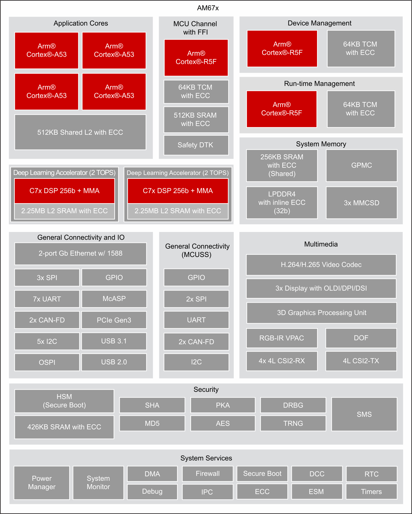

.. _beagley-ai-design:

Design and Specifications
#########################

:bdg-danger:`Work in progress`

.. todo:: Add details about all the schematic sections.

If you want to know how BeagleY-AI is designed and the detailed specifications, then
this chapter is for you. We are going to attempt to provide you a short and crisp overview
followed by discussing each hardware design element in detail.

.. tip:: For board files, 3D model, and more, you can checkout the `BeagleY-AI repository on OpenBeagle <https://openbeagle.org/beagley-ai/beagley-ai>`_.

Block Diagram and Overview
***************************

.. figure:: images/hardware-design/beagley-ai-block-diagram.*
    :width: 1040
    :align: center
    :alt: BeagleY-AI block diagram

    BeagleY-AI block diagram

Processor
**************

    AM67A block diagram

The AM67A processor from Texas Instruments is a highly integrated SoC with an Automotive pedigree. It may be referenced by TI documentation
by it's superset J722s/TDA4AEN. 

It's primary compute cluster revolves around 4xARM Cortex-A53 Cores running at 1.4Ghz. 

An MCU subsystem consisting of an ARM Cortex-R5F running at up to 800Mhz is also available for user applications and is especially useful
for real-time IO applications. 

For very advanced users, two additional R5 cores are also present, but they are normally reserved for Device and Run-time Management of the SoC typically. 

2x C7x DSPs with MMA support are intended for use as Deep Learning Accelerators for things like AI Vision, with up to 2TOPS each. 

An Imagination BXS-4-64 GPU rounds out the compute cluster, with a dedicated video encoder/decoder available for multimedia tasks. 

The SoC features advanced high speed connectivity, including USB3.1, PCIe and more.  

Secure Boot is also available with the ability burn One-Time-Programmable (OTP) eFUSES by energizing the VPP test pads.

Boot Modes
***********

.. figure:: images/hardware-design/beagley-ai-boot-modes.*
    :width: 1040
    :align: center
    :alt: BeagleY-AI boot modes

    BeagleY-AI boot modes

The default bootmode for BeagleY-AI is the SD Card Interface. 

It is also possible to load U-Boot from the SD card and then load your main file system from another source, such as :ref:`beagley-ai-expansion-nvme`.

Clocks and Resets
*********************

.. figure:: images/hardware-design/beagley-ai-reset-cntrls-mcu-osc.*
    :width: 1040
    :align: center
    :alt: BeagleY-AI SoC Reset, Cntrls, and Clk

    BeagleY-AI SoC Reset, Cntrls, and Clk

.. figure:: images/hardware-design/beagley-ai-wkup-reset-cntrls-osc.*
    :width: 1040
    :align: center
    :alt: BeagleY-AI wkup reset cntrls osc

    BeagleY-AI wkup reset cntrls osc

Power
***************

.. figure:: images/hardware-design/beagley-ai-pdn.*
    :width: 1040
    :align: center
    :alt: BeagleY-AI power distribution network

    BeagleY-AI power distribution network

BeagleY-AI is powered via USB-C. PD Power negotiation is not done dynamically but rather
by tying the CC lines to GND via 5.1KΩ resistors to indicate to the PD Source that the device requires 5V 3A. Using USB-PD power supplies rated for higher wattages is safe as they will always negotiate to the 5V 3A requested by the board. 

The power architecture is split between the TPS65219 PMIC which handles the main logic rails and a dedicated TPS62872 high current buck regulator for the SoC core rail which defaults to 0.85V on boot. 

Both PMIC and VDD_CORE regulators are highly configurable but will boot the board to "sane" defaults out of box. For advanced users, it is possible to adjust both the VDD_CORE rail as well as IO rails (voltages, timings, behavior, etc.) for applications such as low power modes where
you may want to trade clock speeds for power efficiency by running the SoC Core at 0.75V for example. Be careful, as changes here could result in unexpected behavior, the board not booting or even hardware damage, so tread carefully.

At the time of writing, DVS (Dynamic Voltage Switching) is not supported by the AM67A SoC.

USB-C Input
----------------

.. figure:: images/hardware-design/beagley-ai-usb-c.*
    :width: 1040
    :align: center
    :alt: BeagleY-AI USB-C

    BeagleY-AI USB-C

PMIC
----------------

.. figure:: images/hardware-design/beagley-ai-pmic.*
    :width: 1040
    :align: center
    :alt: BeagleY-AI PMIC

    BeagleY-AI PMIC

HCPS (High Current Power Stage)
---------------------------------

.. figure:: images/hardware-design/beagley-ai-vdd-core-hcps.*
    :width: 1040
    :align: center
    :alt: BeagleY-AI VDD core High Current Power Stage (HCPS)

    BeagleY-AI VDD core High Current Power Stage (HCPS)

Analog Rails
----------------

.. figure:: images/hardware-design/beagley-ai-soc-analog-power1.*
    :width: 1040
    :align: center
    :alt: BeagleY-AI SoC analog power1

    BeagleY-AI SoC analog power1

.. figure:: images/hardware-design/beagley-ai-soc-io-ddr-power2.*
    :width: 1040
    :align: center
    :alt: BeagleY-AI AI SoC IO and DDR power2

    BeagleY-AI AI SoC IO and DDR power2

Digital Rails
----------------

.. figure:: images/hardware-design/beagley-ai-soc-digital-power3.*
    :width: 1040
    :align: center
    :alt: BeagleY-AI SoC digital power3

    BeagleY-AI SoC digital power3

.. note:: 
    Other power sections are nested within their specific interface section. 

LDOs
----------

.. figure:: images/hardware-design/beagley-ai-vsys-3v3.*
    :width: 1040
    :align: center
    :alt: BeagleY-AI VSYS 3V3

    BeagleY-AI VSYS 3V3

.. figure:: images/hardware-design/beagley-ai-3v3-2v5-to-1v1-ldo.*
    :width: 1040
    :align: center
    :alt: BeagleY-AI 3V3/V5 to 1V1 LDO

    BeagleY-AI 3V3/V5 to 1V1 LDO

Memory
****************************

RAM (LPDDR4)
--------------

.. figure:: images/hardware-design/beagley-ai-soc-ddr0.*
    :width: 1040
    :align: center
    :alt: BeagleY-AI SoC DDR0 connections

    BeagleY-AI SoC DDR0 connections

BeagleY-AI has 4GB of Kingston x32 LPDDR4 Memory. 

.. todo:: Add Final DDR Part Number

.. figure:: images/hardware-design/beagley-ai-ddr-caps.*
    :width: 1040
    :align: center
    :alt: BeagleY-AI DDR caps

    BeagleY-AI DDR caps

.. figure:: images/hardware-design/beagley-ai-ddr.*
    :width: 1040
    :align: center
    :alt: BeagleY-AI DDR

    BeagleY-AI DDR

.. figure:: images/hardware-design/beagley-ai-ddr-power.*
    :width: 1040
    :align: center
    :alt: BeagleY-AI DDR power

    BeagleY-AI DDR power

EEPROM
--------------

.. figure:: images/hardware-design/beagley-ai-board-id-eeprom.*
    :width: 1040
    :align: center
    :alt: BeagleY-AI board id eeprom

    BeagleY-AI board id eeprom

microSD Card
--------------
.. figure:: images/hardware-design/beagley-ai-micro-sd-card-interface.*
    :width: 1040
    :align: center
    :alt: BeagleY-AI microSD card interface

    BeagleY-AI microSD card interface

.. figure:: images/hardware-design/beagley-ai-soc-mmc-012.*
    :width: 1040
    :align: center
    :alt: BeagleY-AI SoC MMC0, MMC1, and MMC2

    BeagleY-AI SoC MMC0, MMC1, and MMC2

General Expansion
************************************

40pin Header
--------------------

.. figure:: images/hardware-design/beagley-ai-user-expansion-connector.*
    :width: 1040
    :align: center
    :alt: BeagleY-AI user expansion connector

    BeagleY-AI user expansion connector

I2C
---------------

.. figure:: images/hardware-design/beagley-ai-iic-tree.*
    :width: 1040
    :align: center
    :alt: BeagleY-AI I2C tree

    BeagleY-AI I2C tree

By default, 5 different I2C interfaces are exposed, all of which feature external 2.2KΩ pull-up resistors. 3 of the interfaces are used by the CSI, DSI and OLDI ports for Cameras & Displays.
The remaining 2 ports are exposed on the 40pin GPIO expansion connector. 

The MCU_I2C0 interface is intended as the primary external I2C interface for BeagleY-AI and matches physical pins 3 and 5 of the header. Most HATs will use these pins. 

While WKUP_I2C0 is also exposed on the 40pin Header (physical pins 27 & 28), that bus is shared with several on-board devices, namely the PMIC, VDD_CORE regulator, Board ID EEPROM and RTC. As such,
it is highly advisable to leave these pins unused unless you are sure you know what you are doing. These pins are normally only pinned out as a "HAT EEPROM detect" for RPi HATs that provide such functionality (of which there are very few)

See `pinout.beagleboard.io/pinout/i2c <https://pinout.beagleboard.io/pinout/i2c>`_  for a more visual explanation. 

.. figure:: images/hardware-design/beagley-ai-i2c2-pu.*
    :width: 1040
    :align: center
    :alt: BeagleY-AI I2C2 pull-up resistors

    BeagleY-AI I2C2 pull-up resistors

.. figure:: images/hardware-design/beagley-ai-iic-ext-rtc.*
    :width: 1040
    :align: center
    :alt: BeagleY-AI I2C ext RTC

    BeagleY-AI I2C ext RTC

.. figure:: images/hardware-design/beagley-ai-iic-voltage-level-translator.*
    :width: 1040
    :align: center
    :alt: BeagleY-AI voltage level translator

    BeagleY-AI voltage level translator

USB
---------

.. figure:: images/hardware-design/beagley-ai-soc-usb0-and-usb1.*
    :width: 1040
    :align: center
    :alt: BeagleY-AI SoC USB0 and USB1

    BeagleY-AI SoC USB0 and USB1

.. figure:: images/hardware-design/beagley-ai-dual-usb-1.*
    :width: 1040
    :align: center
    :alt: BeagleY-AI dual USB1

    BeagleY-AI dual USB1

.. figure:: images/hardware-design/beagley-ai-dual-usb-2.*
    :width: 1040
    :align: center
    :alt: BeagleY-AI dual USB2

    BeagleY-AI dual USB2

.. figure:: images/hardware-design/beagley-ai-dual-usb-current-limiter.*
    :width: 1040
    :align: center
    :alt: BeagleY-AI dual USB current limiter

    BeagleY-AI dual USB current limiter

.. figure:: images/hardware-design/beagley-ai-usb3-hub.*
    :width: 1040
    :align: center
    :alt: BeagleY-AI USB3 hub

    BeagleY-AI USB3 hub

.. figure:: images/hardware-design/beagley-ai-usb-hub-config.*
    :width: 1040
    :align: center
    :alt: BeagleY-AI USB hub config

    BeagleY-AI USB hub config

.. figure:: images/hardware-design/beagley-ai-usb-vbus-resistor-divider-circuit.*
    :width: 1040
    :align: center
    :alt: BeagleY-AI USB VBUS resistor divider circuit

    BeagleY-AI USB VBUS resistor divider circuit

PCI Express
---------------

.. figure:: images/hardware-design/beagley-ai-pcie-connector.*
    :width: 1040
    :align: center
    :alt: BeagleY-AI PCIE connector

    BeagleY-AI PCIE connector

.. figure:: images/hardware-design/beagley-ai-soc-serdes0.*
    :width: 1040
    :align: center
    :alt: BeagleY-AI SoC SERDES0

    BeagleY-AI SoC SERDES0

.. figure:: images/hardware-design/beagley-ai-soc-serdes1.*
    :width: 1040
    :align: center
    :alt: BeagleY-AI SoC SERDES1

    BeagleY-AI SoC SERDES1

Fan Header
------------------------

.. figure:: images/hardware-design/beagley-ai-fan-connector.*
    :width: 1040
    :align: center
    :alt: BeagleY-AI fan connector

    BeagleY-AI fan connector

Networking
************

.. figure:: images/hardware-design/beagley-ai-wifi-module.*
    :width: 1040
    :align: center
    :alt: BeagleY-AI WiFi module

    BeagleY-AI WiFi module

BeagleY-AI features a Beagle BM3301 Wireless module based on the Texas Instruments CC3301 which features Wifi6 (802.11AX) and BLE 5.4

.. figure:: images/hardware-design/beagley-ai-soc-rgmii.*
    :width: 1040
    :align: center
    :alt: BeagleY-AI SoC RGMII

    BeagleY-AI SoC RGMII

.. figure:: images/hardware-design/beagley-ai-rgmii-rst.*
    :width: 1040
    :align: center
    :alt: BeagleY-AI SoC RGMII1 RST

    BeagleY-AI SoC RGMII1 RST

.. figure:: images/hardware-design/beagley-ai-ethernet-connector.*
    :width: 1040
    :align: center
    :alt: BeagleY-AI ethernet connector

    BeagleY-AI ethernet connector

.. figure:: images/hardware-design/beagley-ai-ethernet-dp83867.*
    :width: 1040
    :align: center
    :alt: BeagleY-AI ethernet DP83867

    BeagleY-AI ethernet DP83867

.. figure:: images/hardware-design/beagley-ai-ethernet-phy-caps.*
    :width: 1040
    :align: center
    :alt: BeagleY-AI ethernet phy caps

    BeagleY-AI ethernet phy caps

.. figure:: images/hardware-design/beagley-ai-ethernet-phy-misc.*
    :width: 1040
    :align: center
    :alt: BeagleY-AI ethernet phy misc

    BeagleY-AI ethernet phy misc

.. figure:: images/hardware-design/beagley-ai-ethernet-phy-protection.*
    :width: 1040
    :align: center
    :alt: BeagleY-AI ethernet phy protection

    BeagleY-AI ethernet phy protection

.. figure:: images/hardware-design/beagley-ai-ethernet-power-3v3-to-2v5.*
    :width: 1040
    :align: center
    :alt: BeagleY-AI ethernet power 3V3 to 2V5

    BeagleY-AI ethernet power 3V3 to 2V5

.. figure:: images/hardware-design/beagley-ai-poe-header.*
    :width: 1040
    :align: center
    :alt: BeagleY-AI PoE header

    BeagleY-AI PoE header

Cameras & Displays
***********************

HDMI (DPI)
-----------------

.. figure:: images/hardware-design/beagley-ai-soc-vout.*
    :width: 1040
    :align: center
    :alt: BeagleY-AI SoC VOUT

    BeagleY-AI SoC VOUT

.. figure:: images/hardware-design/beagley-ai-hdmi-addr-protection.*
    :width: 1040
    :align: center
    :alt: BeagleY-AI HDMI addr protection

    BeagleY-AI HDMI addr protection

.. figure:: images/hardware-design/beagley-ai-hdmi-power.*
    :width: 1040
    :align: center
    :alt: BeagleY-AI HDMI power

    BeagleY-AI HDMI power

.. figure:: images/hardware-design/beagley-ai-hdmi-reset.*
    :width: 1040
    :align: center
    :alt: BeagleY-AI HDMI reset

    BeagleY-AI HDMI reset

.. figure:: images/hardware-design/beagley-ai-rgb888-to-hdmi.*
    :width: 1040
    :align: center
    :alt: BeagleY-AI RGB888 to HDMI

    BeagleY-AI RGB888 to HDMI

OLDI (LVDS)
-----------------

.. figure:: images/hardware-design/beagley-ai-soc-oldi.*
    :width: 1040
    :align: center
    :alt: BeagleY-AI SoC OLDI

    BeagleY-AI SoC OLDI

CSI
-----------------

.. figure:: images/hardware-design/beagley-ai-soc-csi-0123.*
    :width: 1040
    :align: center
    :alt: BeagleY-AI SoC CSI1, CSI2, and CSI3

    BeagleY-AI SoC CSI1, CSI2, and CSI3

.. figure:: images/hardware-design/beagley-ai-rpi-csi.*
    :width: 1040
    :align: center
    :alt: BeagleY-AI RPI CSI

    BeagleY-AI RPI CSI

To maintain a Pi compatible form factor, BeagleY-AI only exposes 2 of the 4 Physical CSI interfaces of the AM67A SoC. 
Each CSI interfaces is MIPI® CSI-2 v1.3 + MIPI® D-PHY 1.2 with 4 Data Lanes running at up to 2.5Gbps/lane. 
The interface also supports up to 16 Virtual Channels for multi-camera applications using FPDLink or V3Link. 

DSI
-----------------

.. figure:: images/hardware-design/beagley-ai-soc-dsi.*
    :width: 1040
    :align: center
    :alt: BeagleY-AI SoC DSI connections

    BeagleY-AI SoC DSI0 TX connections

The DSI0 port is shared withe CSI1 and selectable via a MUX switch to maintain Pi functionality.

.. figure:: images/hardware-design/beagley-ai-rpi-dsi-csi.*
    :width: 1040
    :align: center
    :alt: BeagleY-AI RPI DSI/CSI

    BeagleY-AI RPI DSI/CSI

Please note that DSI is only available on one of the two 22-pin "CSI" connectors. 

Buttons and LEDs
*****************

.. figure:: images/hardware-design/beagley-ai-leds.*
    :width: 1040
    :align: center
    :alt: BeagleY-AI LEDs

    BeagleY-AI LEDs

Debug Ports
************

JTAG Tag-Connect
-------------------

.. figure:: images/hardware-design/beagley-ai-tag-connect.*
    :width: 1040
    :align: center
    :alt: BeagleY-AI Tag-Connect

    BeagleY-AI Tag-Connect

UART
-------------------

.. figure:: images/hardware-design/beagley-ai-debug-uart-port.*
    :width: 1040
    :align: center
    :alt: BeagleY-AI debug UART port

    BeagleY-AI debug UART port

PMIC NVM Tag-Connect
--------------------------------------

.. figure:: images/hardware-design/beagley-ai-pmic-nvm-programming.*
    :width: 1040
    :align: center
    :alt: BeagleY-AI PMIC NVM programming interface

    BeagleY-AI PMIC NVM programming interface

Miscellaneous
********************

.. figure:: images/hardware-design/beagley-ai-general-io.*
    :width: 1040
    :align: center
    :alt: BeagleY-AI general IO

    BeagleY-AI general IO

.. figure:: images/hardware-design/beagley-ai-mcu-general-io.*
    :width: 1040
    :align: center
    :alt: BeagleY-AI MCU general IO

    BeagleY-AI MCU general IO

.. figure:: images/hardware-design/beagley-ai-soc-ospi.*
    :width: 1040
    :align: center
    :alt: BeagleY-AI SoC OSPI0

    BeagleY-AI SoC OSPI0

.. figure:: images/hardware-design/beagley-ai-soc-efuse-vmon-jtag-rsvd.*
    :width: 1040
    :align: center
    :alt: BeagleY-AI SoC eFUSE, VMON, Debug, and RSVD

    BeagleY-AI SoC eFUSE, VMON, Debug, and RSVD

.. figure:: images/hardware-design/beagley-ai-soc-gpmc.*
    :width: 1040
    :align: center
    :alt: BeagleY-AI SoC GPMC0

    BeagleY-AI SoC GPMC0

.. figure:: images/hardware-design/beagley-ai-soc-supply-noise-kelvin-sensing.*
    :width: 1040
    :align: center
    :alt: BeagleY-AI SoC supply noise kelvin sensing

    BeagleY-AI SoC supply noise kelvin sensing

.. figure:: images/hardware-design/beagley-ai-soc-ground.*
    :width: 1040
    :align: center
    :alt: BeagleY-AI SoC ground connections

    BeagleY-AI SoC ground connections

Mechanical Specifications 
**************************

Dimensions & Weight
===================

.. table:: Dimensions & weight

    +--------------------+----------------------------------------------------+
    | Parameter          | Value                                              |
    +====================+====================================================+
    | Size               | 85 x 56 x 20 mm                                    |
    +--------------------+----------------------------------------------------+
    | Max heigh          | 20mm                                               |
    +--------------------+----------------------------------------------------+
    | PCB Size           | 85 x 56 mm                                         |
    +--------------------+----------------------------------------------------+
    | PCB Layers         | 14 layers                                          |
    +--------------------+----------------------------------------------------+
    | PCB Thickness      | 1.6mm                                              |
    +--------------------+----------------------------------------------------+
    | RoHS compliant     | Yes                                                |
    +--------------------+----------------------------------------------------+
    | Gross Weight       | 110 g                                              |
    +--------------------+----------------------------------------------------+
    | Net Weight         | 50 g                                               |
    +--------------------+----------------------------------------------------+