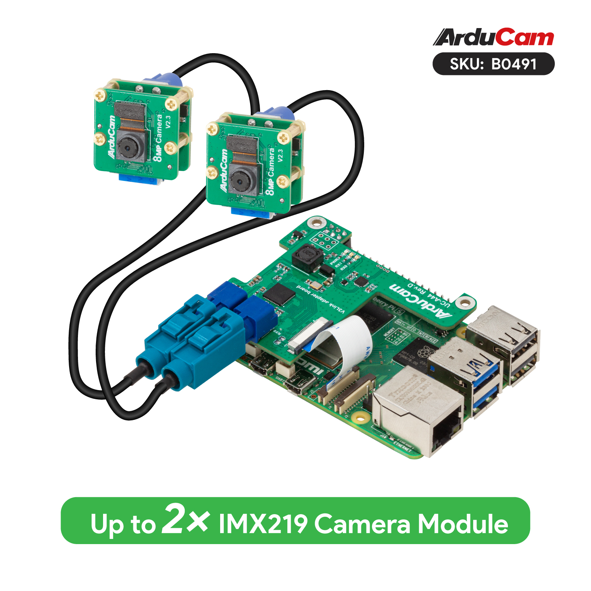

.. _beagley-ai-arducam-imx219-v3link-dual-camera-kit:

Using the Arducam Dual V3Link Camera Kit
############################################

:bdg-danger:`Work in progress`

.. todo:: Add further testing steps, results, and images.

`The Arducam Dual V3Link Camera Kit <https://www.arducam.com/product/arducam-imx219-v3link-camera-kit-for-raspberry-pi/>`_ is an IMX219 based kit that leverages Texas Instruments' FPDLink technology to enable using two CSI cameras over a single port up to 15 meters away using twisted pair cables.

.. note:: Unlike the larger quad-camera kit, the dual camera kit aims to simplify the software stack and improve interoperability with the Raspberry Pi and other non-TI SBCs by forgoing the ability to support multi-stream CSI inputs. This means that it is limited to "switching" between the two FPDLink inputs but has the benefit of not requiring additional drivers beyond support for the base CSI camera driver (IMX219 in this case)

Initial Hardware Connection
*****************************

Simply plug in the HAT into the BeagleY GPIO header and connect the CSI header as shown below. 

Either CSI header may be connected but make sure you use the corresponding CSI port DTS when enabling your "camera".

.. todo:: ADD CSI 0/1 Header Location photo.

Verify that the HAT is connected
************************************

The Arducam HAT should present itself as an I2C device on Bus 1.

To check that the I2C Bus looks like we expect:

.. code:: console

    sudo i2cdetect -r -y 1

To verify actual communication with the FPDlink device, we issue the following command: 

.. code:: console

    sudo i2ctransfer -f -y 4 w3@0x0c 0xff 0x55 0x01 r1

Switching CSI Channels
************************************

The channel numbering for FPDLink goes from 1 to 2 (as opposed to counting from 0 as is the case for CSI)

Thus, to select video output from channel 1: 

.. code:: console

    sudo i2ctransfer -f -y 4 w3@0x0c 0xff 0x55 0x01 

To switch to channel 2:

.. code:: console

    sudo i2ctransfer -f -y 4 w3@0x0c 0xff 0x55 0x02

Troubleshooting
************************************

For additional documentation and support, see the `Arducam Docs <https://docs.arducam.com/V3Link-Camera-Solution/V3Link-Camera-Solution-for-Raspberry-Pi/Introduction/>`_.