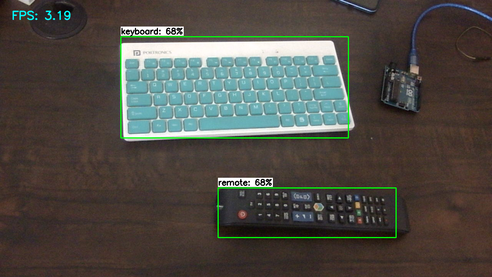
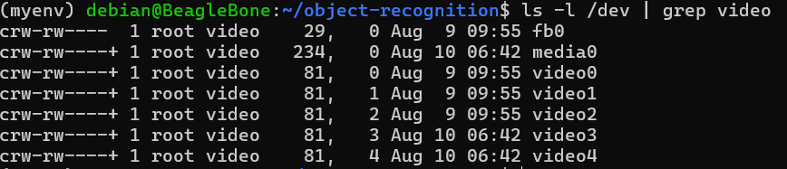

.. _beagley-ai-object-detection-tutorial:

TensorFlow Lite Object Detection
#############################################

This document describes how to set up and run an object detection model using TensorFlow Lite on the BeagleY-AI platform. Below is a demonstration.

To run the object detection model on the BeagleY-AI, you will need the following:

- **BeagleY-AI Board**: Make sure to refer to the :ref:`BeagleY-AI standalone connection <beagley-ai-standalone-connection>` for proper setup.
- **USB Webcam**: The model has been tested with the Logitech Webcam C270, but it should work well with other webcam too.
- **Active Internet Connection**: Necessary for the installation of modules. Please check the :ref:`WiFi connection guide <beagley-ai-connecting-wifi>` for setting up the network.

Step 1: Installation of Conda
=============================

In this step, we will install a lightweight version of Conda.

.. code-block:: bash

   wget https://github.com/conda-forge/miniforge/releases/download/24.3.0-0/Mambaforge-24.3.0-0-Linux-aarch64.sh
   bash Mambaforge-24.3.0-0-Linux-aarch64.sh

After accepting the license terms you can verify the installation by 

.. code-block:: bash

    conda --version

Step 2: Create Virtual Environment
================================================

Create a virtual environment with Python 3.9.

.. code-block:: bash

   conda create --name myenv python=3.9

Step 3: Activate the Virtual Environment
========================================

Activate the virtual environment created in the previous step.

.. code-block:: bash

   conda activate myenv

Step 4: Install Necessary Modules
=================================

Install the required Python modules.

.. code-block:: bash

   pip install https://github.com/google-coral/pycoral/releases/download/v2.0.0/tflite_runtime-2.5.0.post1-cp39-cp39-linux_aarch64.whl
   pip install numpy==1.26.4
   pip install opencv-python

Step 5: Load Necessary Pretrained Models
========================================

Create a directory for the object recognition models and download a pretrained model.

.. code-block:: bash

   mkdir object-recognition
   cd object-recognition
   wget https://storage.googleapis.com/download.tensorflow.org/models/tflite/coco_ssd_mobilenet_v1_1.0_quant_2018_06_29.zip
   unzip coco_ssd_mobilenet_v1_1.0_quant_2018_06_29.zip -d TFLite_model

.. tip:: You can train your own model using TensorFlow Lite.Here are some resources

    1. `Train TensorFlow Lite Object Detection Model <https://colab.research.google.com/github/EdjeElectronics/TensorFlow-Lite-Object-Detection-on-Android-and-Raspberry-Pi/blob/master/Train_TFLite2_Object_Detction_Model.ipynb#scrollTo=4VAvZo8qE4u5>`_.
    
    2. `TensorFlow Lite Model Maker <https://www.tensorflow.org/lite/models/modify/model_maker>`_.

Step 6: Connect Your USB Webcam
==================================================

Connect your USB webcam via a USB socket.

.. code-block:: bash

   ls -l /dev | grep video

.. note:: Check the video driver with the above command. Here its 3 in my case.

Step 7: Create the Code File
============================

Create a Python file for running object detection.

.. code-block:: bash

   nano object-detection.py

Paste the following code into the file:

.. code-block:: python

   import os
   import argparse
   import cv2
   import numpy as np
   import time
   from threading import Thread
   import importlib.util
   from typing import List
   import sys

   video_driver_id = 3

   class VideoStream:
       """Handles video streaming from the webcam."""
       def __init__(self, resolution=(640, 480), framerate=30):
           self.stream = cv2.VideoCapture(video_driver_id)
           self.stream.set(cv2.CAP_PROP_FOURCC, cv2.VideoWriter_fourcc(*'MJPG'))
           self.stream.set(3, resolution[0])
           self.stream.set(4, resolution[1])
           self.grabbed, self.frame = self.stream.read()
           self.stopped = False

       def start(self):
           """Starts the thread that reads frames from the video stream."""
           Thread(target=self.update, args=()).start()
           return self

       def update(self):
           """Continuously updates the frame from the video stream."""
           while True:
               if self.stopped:
                   self.stream.release()
                   return
               self.grabbed, self.frame = self.stream.read()

       def read(self):
           """Returns the most recent frame."""
           return self.frame

       def stop(self):
           """Stops the video stream and closes resources."""
           self.stopped = True

   def load_labels(labelmap_path: str) -> List[str]:
       """Loads labels from a label map file."""
       try:
           with open(labelmap_path, 'r') as f:
               labels = [line.strip() for line in f.readlines()]
           if labels[0] == '???':
               labels.pop(0)
           return labels
       except IOError as e:
           print(f"Error reading label map file: {e}")
           sys.exit()

   def load_interpreter(model_path: str, use_tpu: bool):
       """Loads the TensorFlow Lite model interpreter."""
       pkg = importlib.util.find_spec('tflite_runtime')
       if pkg:
           from tflite_runtime.interpreter import Interpreter, load_delegate
       else:
           from tensorflow.lite.python.interpreter import Interpreter
           from tensorflow.lite.python.interpreter import load_delegate

       if use_tpu:
           return Interpreter(model_path=model_path,
                              experimental_delegates=[load_delegate('libedgetpu.so.1.0')])
       else:
           return Interpreter(model_path=model_path)

   def main():
       # Argument parsing
       parser = argparse.ArgumentParser()
       parser.add_argument('--modeldir', required=True, help='Folder the .tflite file is located in')
       parser.add_argument('--graph', default='detect.tflite', help='Name of the .tflite file')
       parser.add_argument('--labels', default='labelmap.txt', help='Name of the labelmap file')
       parser.add_argument('--threshold', default='0.5', help='Minimum confidence threshold')
       parser.add_argument('--resolution', default='1280x720', help='Desired webcam resolution')
       args = parser.parse_args()

       # Configuration
       model_path = os.path.join(os.getcwd(), args.modeldir, args.graph)
       labelmap_path = os.path.join(os.getcwd(), args.modeldir, args.labels)
       min_conf_threshold = float(args.threshold)
       resW, resH = map(int, args.resolution.split('x'))

       # Load labels and interpreter
       labels = load_labels(labelmap_path)
       interpreter = load_interpreter(model_path, use_tpu)
       interpreter.allocate_tensors()

       # Get model details
       input_details = interpreter.get_input_details()
       output_details = interpreter.get_output_details()
       height, width = input_details[0]['shape'][1:3]
       floating_model = (input_details[0]['dtype'] == np.float32)

       outname = output_details[0]['name']
       boxes_idx, classes_idx, scores_idx = (1, 3, 0) if 'StatefulPartitionedCall' in outname else (0, 1, 2)

       # Initialize video stream
       videostream = VideoStream(resolution=(resW, resH), framerate=30).start()
       time.sleep(1)

       frame_rate_calc = 1
       freq = cv2.getTickFrequency()

       while True:
           t1 = cv2.getTickCount()
           frame = videostream.read()
           frame_rgb = cv2.cvtColor(frame, cv2.COLOR_BGR2RGB)
           frame_resized = cv2.resize(frame_rgb, (width, height))
           input_data = np.expand_dims(frame_resized, axis=0)

           if floating_model:
               input_data = (np.float32(input_data) - 127.5) / 127.5

           interpreter.set_tensor(input_details[0]['index'], input_data)
           interpreter.invoke()

           boxes = interpreter.get_tensor(output_details[boxes_idx]['index'])[0]
           classes = interpreter.get_tensor(output_details[classes_idx]['index'])[0]
           scores = interpreter.get_tensor(output_details[scores_idx]['index'])[0]

           for i in range(len(scores)):
               if min_conf_threshold < scores[i] <= 1.0:
                   ymin, xmin, ymax, xmax = [int(coord) for coord in (boxes[i] * [resH, resW, resH, resW])]
                   cv2.rectangle(frame, (xmin, ymin), (xmax, ymax), (10, 255, 0), 2)
                   object_name = labels[int(classes[i])]
                   label = f'{object_name}: {int(scores[i] * 100)}%'
                   labelSize, baseLine = cv2.getTextSize(label, cv2.FONT_HERSHEY_SIMPLEX, 0.7, 2)
                   label_ymin = max(ymin, labelSize[1] + 10)
                   cv2.rectangle(frame, (xmin, label_ymin - labelSize[1] - 10), (xmin + labelSize[0], label_ymin + baseLine - 10), (255, 255, 255), cv2.FILLED)
                   cv2.putText(frame, label, (xmin, label_ymin - 7), cv2.FONT_HERSHEY_SIMPLEX, 0.7, (0, 0, 0), 2)

           cv2.putText(frame, f'FPS: {frame_rate_calc:.2f}', (30, 50), cv2.FONT_HERSHEY_SIMPLEX, 1, (255, 255, 0), 2, cv2.LINE_AA)
           cv2.imshow('Object detector', frame)

           t2 = cv2.getTickCount()
           time1 = (t2 - t1) / freq
           frame_rate_calc = 1 / time1

           if cv2.waitKey(1) == ord('q'):
               break

       cv2.destroyAllWindows()
       videostream.stop()

   if __name__ == "__main__":
       main()

.. note:: Make sure to change your video driver ID depending on your video driver. Here, the video driver ID is set to 3.

Step 8: Run the Object Detection Script
=======================================

To run the object detection script, use the following command. Replace `TFLite_model` with the path to your model directory if it differs:

.. code-block:: bash

   python3 object_detection.py --modeldir=TFLite_model

A window will open, displaying the object detection model in action.