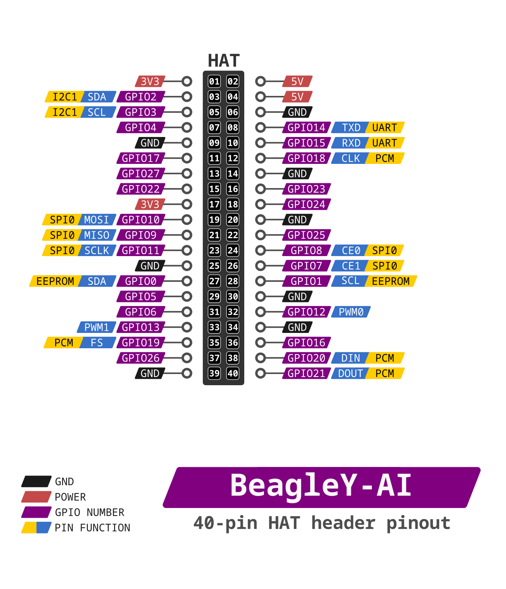
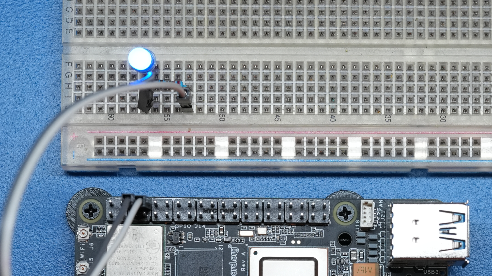
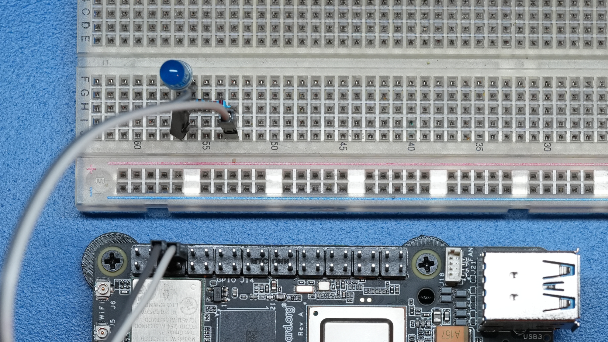
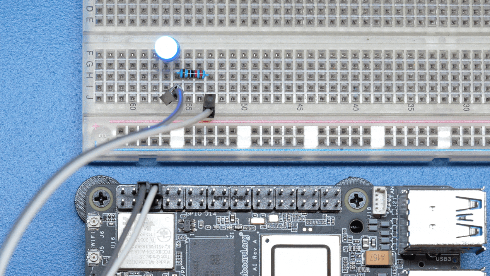
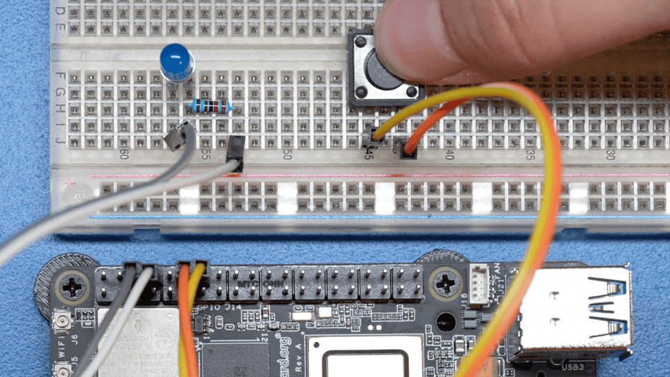
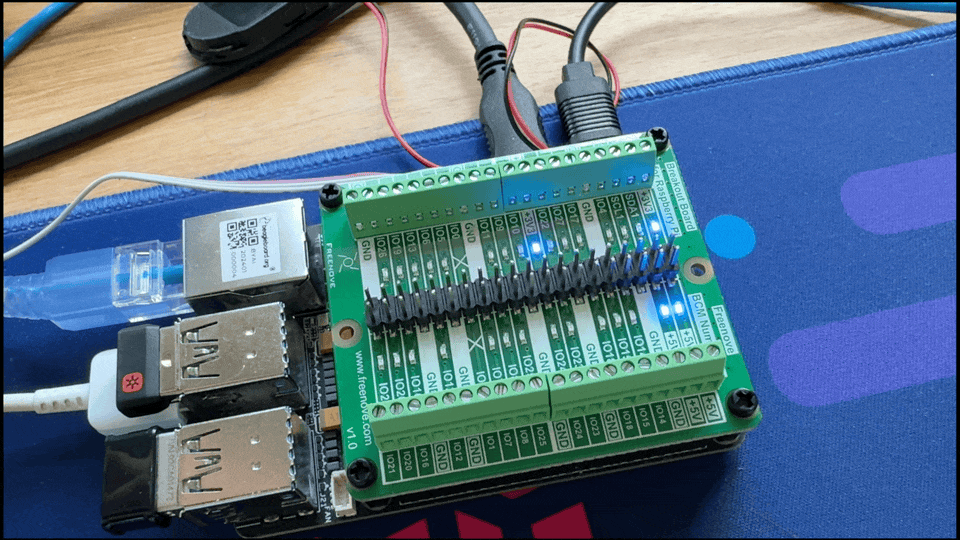

.. _beagley-ai-using-gpio:

Using GPIO
#################

:bdg-danger:`Work in progress`

.. todo:: Add information about software image used for this demo.

**GPIO** stands for **General-Purpose Input/Output**. It's a set of programmable pins that you can use to connect and control various electronic components. 

You can set each pin to either **read signals (input)** from things 
like buttons and sensors or **send signals (output)** to things like LEDs and motors. This lets you interact with and control 
the physical world using code!

A great resource for understanding pin numbering can be found at `pinout.beagley.ai <https://pinout.beagley.ai/>`_ 

.. warning:: BeagleY-AI GPIOs are 3.3V tolerant, using higher voltages **WILL DAMAGE** the processor!

Pin Numbering
**********************

You will see pins referenced in several ways. While this is confusing at first, in reality, 
we can pick our favorite way and stick to it.

The two main ways of referring to GPIOs is **by their number**, so GPIO 2, 3, 4 etc. as seen in the diagram below. This corresponds
to the SoC naming convention. For broad compatibility, BeagleY-AI re-uses the Broadcom GPIO numbering scheme used by RaspberryPi. 

The second (and arguably easier) way we will use for this tutorial is to use the **actual pin header number** (shown in dark grey)

So, for the rest of the tutorial, if we refer to **hat-08-gpio** we mean the **8th pin of the GPIO header**. Which, if you referenced
the image below, can see refers to **GPIO 14 (UART TX)**

   BeagleY-AI pinout

If you are curious about the "real" GPIO numbers on the Texas Instruments AM67A SoC, you can look at the board schematics. 

Required Hardware
******************

For the simple blink demo, all that is needed is an LED, a Resistor (we use 2.2K here) and 2 wires.

Similarly, a button is used for the GPIO read example, but you can also just connect that pin to 3.3V or GND with a wire 
to simulate a button press.

.. todo:: Add fritzing diagram and chapter on Pin Binding here

GPIO Write
***********

Before using any pin with HAT pin number we need to configure it using command below,

.. code:: console

   sudo beagle-pin-mux --pin hat-08 --mode gpio

At it's most basic, we can set a GPIO using the **gpioset** command. 

To set HAT **Pin 8** to **ON**:

.. code:: console

   gpioset hat-08-gpio 0=1

To set HAT **Pin 8** to **OFF**:

.. code:: console

   gpioset hat-08-gpio 0=0

Blink an LED
**************

Let's write a script called **blinky.sh** that contains the following:

Create the file,

.. code:: console

   touch blinky.sh

Open the file using ``nano`` editor,

.. code:: console

   nano blinky.sh

Copy paste the code below to ``blinky.sh`` file,

.. code:: bash

   #!/bin/bash

   while :
   do
	   gpioset hat-08-gpio 0=1
	   sleep 1
	   gpioset hat-08-gpio 0=0
	   sleep 1
   done

Now execute it by typing:

.. code:: console

   bash blinky.sh

You can exit the ``blinky.sh`` progrm by pressing ``CTRL + C`` on your keyboard.

Understanding the code
======================

.. callout::

   .. code-block:: bash

      #!/bin/bash

      while :
      do
         gpioset hat-08-gpio 0=1 <1>
         sleep 1 <2>
         gpioset hat-08-gpio 0=0 <3>
         sleep 1 <4>
      done

   .. annotations::

      The script is an infinite ``while`` loop in which we do the following:

      <1> set the HAT Pin 8 as 1 (HIGH)

      <2> Wait 1 Second

      <3> set the HAT Pin 8 as 0 (LOW)

      <4> Wait 1 Second

GPIO Read
**********

Reading GPIOs can be done using the ``gpioget`` command

.. code:: console

   gpioget hat-08-gpio 0
   
Results in **1** if the Input is held **HIGH** or **0** if the Input is held **LOW**

Read a Button
**************

A push button simply completes an electric circuit when pressed. Depending on wiring, it can drive a signal either "Low" (GND) or "High" (3.3V)

We will connect our Button between HAT Pin 16 (GPIO23) and Ground (GND).

The cool part is since we have an internal pull-up resistor, we don't need an external one!
The pull resistor guarantees that the Pin stays in a known (HIGH) state unless the button is pressed,
in which case it will go LOW.

.. todo:: Add fritzing diagram here

Let's write a script called **button.sh** to continuously read an input pin connected 
to a button and print out when it's pressed! :

.. code:: bash

   #!/bin/bash

   while :
   do
	   if (( $(gpioget hat-12-gpio 0) == 0))
	   then
		echo "Button Pressed!"
	   fi
   done

Combining the Two
**********************

Now, logically, let's make an LED match the state of the button.

Let's modify our script and call it **blinkyButton.sh**:

.. code:: bash

   #!/bin/bash

   while :
      do
	      if (( $(gpioget hat-12-gpio 0) == 0))
	      then
		      gpioset hat-08-gpio 0=1
	      else
		      gpioset hat-08-gpio 0=0
	      fi
      done

This means when we see HAT Pin 12 go LOW, we know the button is pressed, so we set HAT Pin 8 (our LED) to ON, otherwise, we turn it OFF.

Now execute it by typing:

.. code:: console

   bash blinkyButton.sh.sh

You can exit by pressing **Ctrl + c** on your keyboard.

Understanding Internal Pull Resistors
*******************************************

Pull-up and pull-down resistors are used in digital circuits to ensure that inputs to logic settle at expected levels.

* ``Internal pull-up resistors`` connects the pin to a high voltage level (e.g., 3.3V) to ensure the pin input reads as a logic high (1) when no active device is pulling it low.

* ``Internal pull-down resistors`` connects the pin to ground (GND) to ensure the input reads as a logic low (0) when no active device is pulling it high.

These resistors prevent floating inputs and undefined states.

By default, all GPIOs on the HAT Header are configured as **Inputs with Pull-up Resistors Enabled**.

This is important for something like a button, as without it, once a button is released, it goes in an "undefined" state!

To configure Pull-ups on a per-pin basis, we can use pass the following arguments within **gpioget or gpioset**:

.. code:: console

   -B, --bias=[as-is|disable|pull-down|pull-up] (defaults to 'as-is')

The "Bias" argument has the following options:
   * **as-is** - This leaves the bias as-is... quite self explanatory
   * **disable** - This state is also known as High-Z (high impedance) where the Pin is left Floating without any bias resistor
   * **pull-down** - In this state, the pin is pulled DOWN by the internal 50KΩ resistor
   * **pull-up** - In this state, the pin is pulled UP by the internal 50KΩ resistor

For example, a command to read an input with the Bias intentionally disabled would look  like this:

.. code:: bash

   gpioget --bias=disable hat-08-gpio 0

Pull resistors are a foundational block of digital circuits and understanding when to (and not to) use them is important.

This article from SparkFun Electronics is a good basic primer - `Link <https://learn.sparkfun.com/tutorials/pull-up-resistors/all>`_ 

Troubleshooting
*******************

* **My script won't run!**

Make sure you gave the script execute permissions first and that you're executing it with a **./** before

To make it executable:

.. code:: bash

   chmod +X scriptName.sh

To run it:

.. code:: bash

   ./scriptName.sh

Bonus - Turn all GPIOs ON/OFF
*******************************

Copy and paste this with the button on the right to turn **all pins ON**. 

.. code:: bash

   gpioset hat-03-gpio 0=1 ;\ gpioset hat-05-gpio 0=1 ;\ gpioset hat-08-gpio 0=1 ;\ gpioset hat-10-gpio 0=1 ;\ gpioset hat-11-gpio 0=1 ;\ gpioset hat-12-gpio 0=1 ;\ gpioset hat-13-gpio 0=1 ;\ gpioset hat-15-gpio 0=1 ;\ gpioset hat-16-gpio 0=1 ;\ gpioset hat-18-gpio 0=1 ;\ gpioset hat-19-gpio 0=1 ;\ gpioset hat-21-gpio 0=1 ;\ gpioset hat-22-gpio 0=1 ;\ gpioset hat-23-gpio 0=1 ;\ gpioset hat-24-gpio 0=1 ;\ gpioset hat-26-gpio 0=1 ;\ gpioset hat-29-gpio 0=1 ;\ gpioset hat-31-gpio 0=1 ;\ gpioset hat-32-gpio 0=1 ;\ gpioset hat-33-gpio 0=1 ;\ gpioset hat-35-gpio 0=1 ;\ gpioset hat-36-gpio 0=1 ;\ gpioset hat-37-gpio 0=1 ;\ gpioset hat-40-gpio 0=1

Similarly, copy and paste this to turn **all pins OFF**. 

.. code:: bash

   gpioset hat-03-gpio 0=0 ;\ gpioset hat-05-gpio 0=0 ;\ gpioset hat-08-gpio 0=0 ;\ gpioset hat-10-gpio 0=0 ;\ gpioset hat-11-gpio 0=0 ;\ gpioset hat-12-gpio 0=0 ;\ gpioset hat-13-gpio 0=0 ;\ gpioset hat-15-gpio 0=0 ;\ gpioset hat-16-gpio 0=0 ;\ gpioset hat-18-gpio 0=0 ;\ gpioset hat-19-gpio 0=0 ;\ gpioset hat-21-gpio 0=0 ;\ gpioset hat-22-gpio 0=0 ;\ gpioset hat-23-gpio 0=0 ;\ gpioset hat-24-gpio 0=0 ;\ gpioset hat-26-gpio 0=0 ;\ gpioset hat-29-gpio 0=0 ;\ gpioset hat-31-gpio 0=0 ;\ gpioset hat-32-gpio 0=0 ;\ gpioset hat-33-gpio 0=0 ;\ gpioset hat-35-gpio 0=0 ;\ gpioset hat-36-gpio 0=0 ;\ gpioset hat-37-gpio 0=0 ;\ gpioset hat-40-gpio 0=0

Going Further
*******************

* `pinout.beagley.ai <https://pinout.beagley.ai/>`_ 
* `GPIOSet Documentation <https://manpages.debian.org/testing/gpiod/gpioset.1.en.html>`_
* `GPIOGet Documentation <https://manpages.debian.org/testing/gpiod/gpioget.1.en.html>`_
