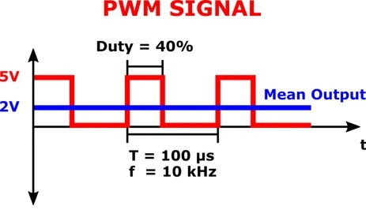
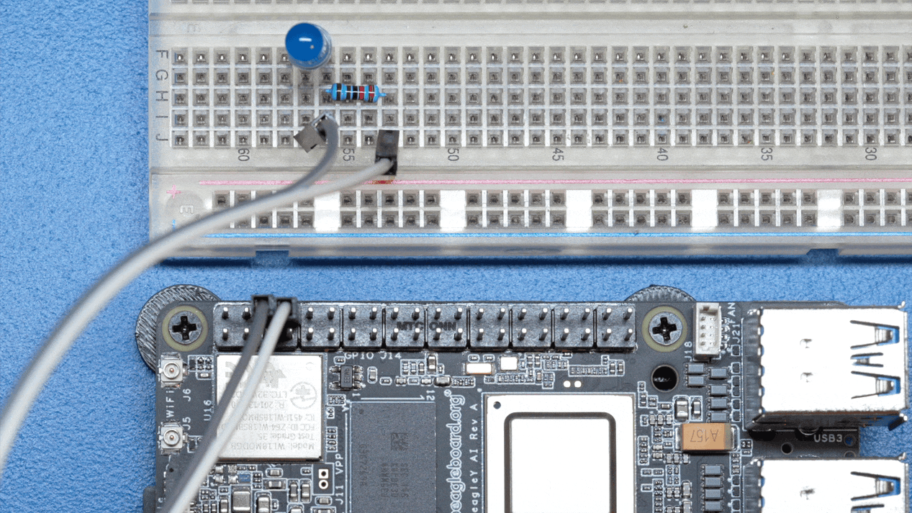

.. _beagley-ai-using-pwm:

Pulse Width Modulation (PWM)
#############################

.. todo:: Add further testing steps, results, and images..

What is it
************

``PWM`` or ``Pulse Width Modulation``, is a technique used to control the amount of power delivered to an electronic device by breaking up the power signal into discrete ON and OFF periods. 
The amount of time the signal spends ON during each cycle determines the output power level (brightness of the LED).

How do we do it
*****************

To configure HAT pin8 as PWM pin using ``beagle-pin-mux`` execute the command below,

.. code:: console

    sudo beagle-pin-mux --pin hat-08 --mode pwm

Let's create a script called ``fade.sh`` that cycles through LED brightness on HAT pin8 by changing PWM duty cycle.

.. code:: console

    touch fade.sh

Now open the file with nano editor,

.. code:: console

    nano fade.sh

In the editor copy paste the script content below,

.. code:: bash

    #!/bin/bash

    PWMPIN="/sys/devices/platform/bus@f0000/23000000.pwm/pwm/pwmchip3/pwm1"

    echo 1000 > $PWMPIN/period
    echo 0 > $PWMPIN/duty_cycle
    echo 0 > $PWMPIN/enable
    sleep 1

    for i in {1..500};
    do
	    echo $i > $PWMPIN/duty_cycle
	    echo 1 > $PWMPIN/enable
	    echo $i
	    sleep 0.0005
    done

    for i in {500..1};
    do
        echo $i > $PWMPIN/duty_cycle
        echo 1 > $PWMPIN/enable
        echo $i
        sleep 0.0005
    done
- Close the editor by pressing ``Ctrl + O`` followed by ``Enter`` to save the file and then press to ``Ctrl + X`` exit

- Now execute the ``fade.sh`` script by typing:

.. code:: console

   bash fade.sh

   LED PWM fade demo

- You can exit the ``fade.sh`` program by pressing ``Ctrl + C`` on your keyboard.

.. todo:: Add section about driving Servo Motors at 50KHz

Troubleshooting
*******************

.. todo:: Fill out empty section

Going Further
*******************

.. todo:: Fill out empty section