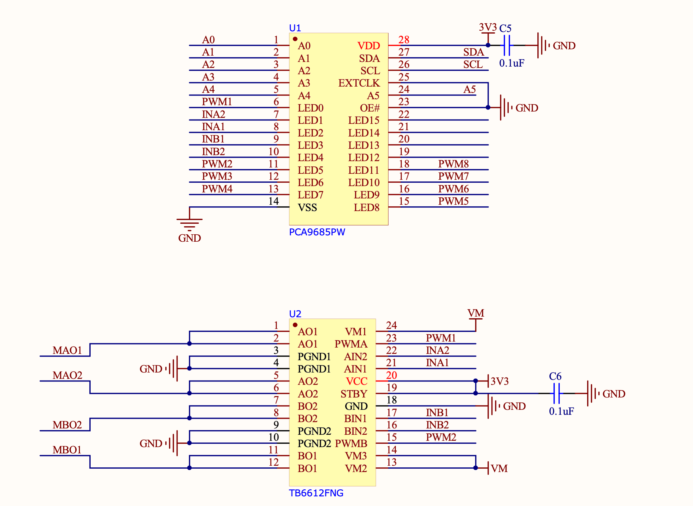
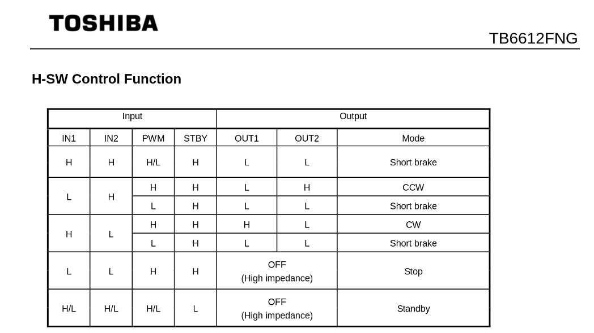
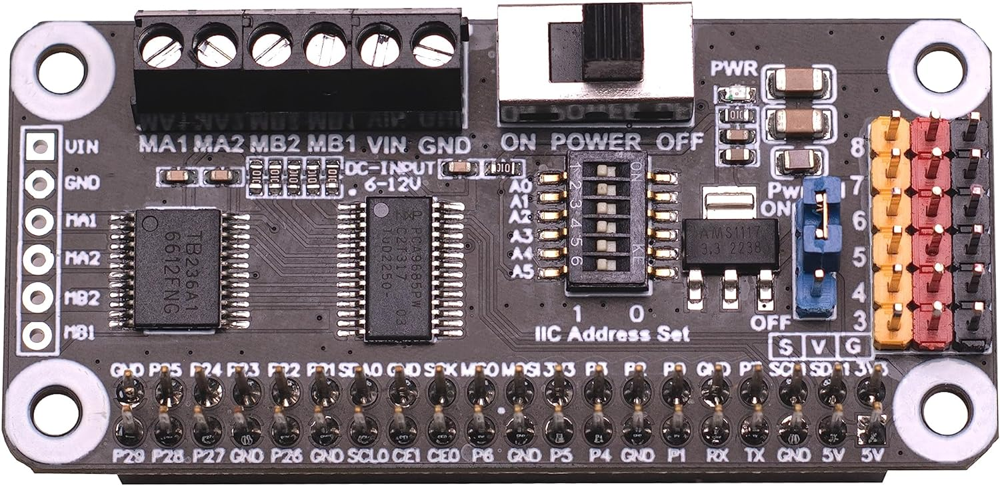
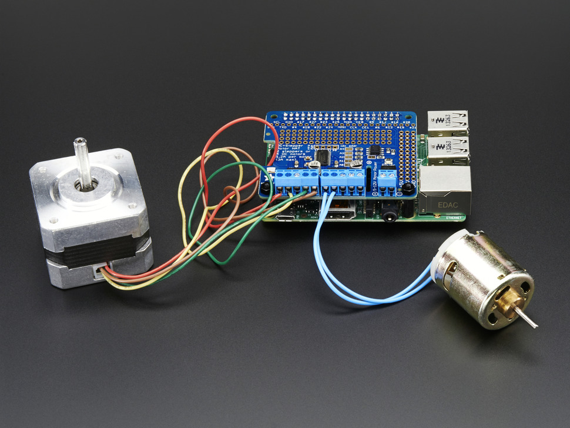

.. _pca9685-motor-drivers:

.. note:: This page is a work in progress. Further drive testing and images will be added soon

Using PCA9685 Motor Drivers
#############################

There are several such "Motor and Servo Driver HATs" available on Amazon, Adafruit and other marketplaces. While different manufacturers implement them slightly differently, the operating principle remains the same.

This guide aims to show you examples for two, namely the Xicoolee and Adafruit variants and how you can modify the example Python userspace library for other variations.

Operating Principle
************************************

The `NXP PCA9685 <https://www.nxp.com/docs/en/data-sheet/PCA9685.pdf>`_ is a simple 16-channel, 12-bit PWM controller that communicates over I2C.

While originally designed as an LED driver, it's ability to output PWM also makes it suitable as a Servo Motor driver.

In addition, to add the ability to drive DC motors, some board designers add one or two `Toshiba TB6612FNG <https://www.sparkfun.com/datasheets/Robotics/TB6612FNG.pdf>`_ dual motor drivers as shown in the schematic below.

If we look at the Xicoolee board and compare it to the schematic, we see that indeed Servo Channels 3-8 on the PCB Silkscreen match pins 12 through 18 of the PWM Driver, while PWM1, PWM2, INA1/2 and INB1/2 are used in conjunction with the TB6612FNG.

Looking at the `TB6612FNG Datasheet <https://www.sparkfun.com/datasheets/Robotics/TB6612FNG.pdf>`_, we can see that the IN pins for Channels A and B (INAx, INBx) are used to control the direction or "mode" of the DC motor, while the PWM signal controls the rotation speed for that particular channel.

Thus, we can use the decoder table above to infer that to drive motor channel A at 50% speed clockwise, we would set the PCA9685 to output INA1 High, INA2 Low and PWM1 at a 50% duty cycle.

If we wanted to go counter-clockwise, we would simply swap things around so INA1 was Low, INA2 was High and assuming we want to keep the same rotation speed, PWM1 at a 50% duty cycle. 

Lastly, we have the option for a "Short Brake" for the motors but please note that it is not recommended to keep motors in this state as that shorts the coils internally and will cause them to heat up over time. If you want to stop your motor, you should issue a "Short brake" state followed by a short delay to allow the motor to physically stop rotating and then leave the motor in the "Stop" state (which de-energizes the coils) by setting IN1 and IN2 to LOW.

But enough theory, let's use some actual code to make things spin...

Using Adafruit ServoKit
**************************

If you are looking to drive Servo motors accurately and not particularly interested in driving DC motors, you may consider using the Adafruit ServoKit library which simplifies this type of use case.
As with all python modules, make sure you do so inside a virtual environment as shown below!

.. code:: console

    mkdir project-name && cd project-name
    python3 -m venv .venv
    source .venv/bin/activate
    sudo pip3 install --upgrade setuptools
    sudo pip install --upgrade adafruit-python-shell
    wget https://raw.githubusercontent.com/adafruit/Raspberry-Pi-Installer-Scripts/master/raspi-blinka.py
    sudo python raspi-blinka.py
    pip3 install adafruit-circuitpython-servokit adafruit-circuitpython-busdevice adafruit-circuitpython-register

From here, you should be able to run some example code such as the following:

.. code:: Python
    
    import time
    from adafruit_servokit import ServoKit

    # Set channels to the number of servo channels on your kit.
    # 8 for FeatherWing, 16 for Shield/HAT/Bonnet.
    kit = ServoKit(channels=16)

    kit.servo[0].angle = 180
    kit.continuous_servo[1].throttle = 1
    time.sleep(1)
    kit.continuous_servo[1].throttle = -1
    time.sleep(1)
    kit.servo[0].angle = 0
    kit.continuous_servo[1].throttle = 0

To explore ServoKit further, check out the `ServoKit Github Page and Examples <https://github.com/adafruit/Adafruit_CircuitPython_ServoKit/tree/main>`_

Python User-space Driver
**************************

As mentioned before, the PCA9685 is a rather simple I2C device, so the driver for it is equally simple:
`PCA9685.py <https://gist.github.com/Grippy98/7ef6a75b2dc7a9470bd8c4dfc6b53f0a>`_

Simply download this to the root of your project and you are most of the way there. 

From there, you simply need an import statement and to define the driver instance:

.. code:: Python

    from PCA9685 import PCA9685

    pwm = PCA9685(0x60, debug=False) #Default I2C Address for the shield is 0x60
    pwm.setPWMFreq(50) #Most Servo Motors use a PWM Frequency of 50Hz

You can now drive LEDs or servo motors by issuing the following command (replacing pin and dutyCycle with your particular values): 

.. code:: Python

    pwm.setDutycycle(pin, dutyCycle)

WaveShare Motor and Servo Driver HAT
************************************

Waveshare writes some of the better `documentation <https://www.waveshare.com/wiki/Motor_Driver_HAT>`_ for these types of Motor Driver HATs

TODO EXPAND HERE

XICOOLEE Motor and Servo Driver HAT
************************************

Photo Credit - Xicoolee

Looking at the schematic for the Xicoolee HAT, we see that we need to define our DC motor pins as follows:

.. code:: Python

        #Xicoolee TB6612FNG

        self.PWMA = 0
        self.AIN1 = 2
        self.AIN2 = 1
        self.PWMB = 5
        self.BIN1 = 3
        self.BIN2 = 4

We can then run some simple example code as shown below:

.. code:: Python

    #!/usr/bin/python

    from PCA9685 import PCA9685
    import time

    Dir = [
        'forward',
        'backward',
    ]
    pwm = PCA9685(0x40, debug=False)
    pwm.setPWMFreq(50)

    class MotorDriver():
        def __init__(self):
            # Match these to your particular HAT!
            self.PWMA = 0
            self.AIN1 = 2
            self.AIN2 = 1
            self.PWMB = 5
            self.BIN1 = 3
            self.BIN2 = 4

        def MotorRun(self, motor, index, speed):
            if speed > 100:
                return
            if(motor == 0):
                pwm.setDutycycle(self.PWMA, speed)
                if(index == Dir[0]):
                    print ("1")
                    pwm.setLevel(self.AIN1, 0)
                    pwm.setLevel(self.AIN2, 1)
                else:
                    print ("2")
                    pwm.setLevel(self.AIN1, 1)
                    pwm.setLevel(self.AIN2, 0)
            else:
                pwm.setDutycycle(self.PWMB, speed)
                if(index == Dir[0]):
                    print ("3")
                    pwm.setLevel(self.BIN1, 0)
                    pwm.setLevel(self.BIN2, 1)
                else:
                    print ("4")
                    pwm.setLevel(self.BIN1, 1)
                    pwm.setLevel(self.BIN2, 0)

        def MotorStop(self, motor):
            if (motor == 0):
                pwm.setDutycycle(self.PWMA, 0)
            else:
                pwm.setDutycycle(self.PWMB, 0)

    print("this is a motor driver test code")
    Motor = MotorDriver()

    print("forward 2 s")
    Motor.MotorRun(0, 'forward', 100)
    Motor.MotorRun(1, 'forward', 100)
    time.sleep(2)

    print("backward 2 s")
    Motor.MotorRun(0, 'backward', 100)
    Motor.MotorRun(1, 'backward', 100)
    time.sleep(2)

    print("stop")
    Motor.MotorStop(0)
    Motor.MotorStop(1)

Adafruit DC & Stepper Motor HAT
************************************

Photo Credit - Adafruit

Looking at the schematic for the Adafruit HAT, we see that we need to define our DC motor pins as follows:

.. code:: Python

        #Adafruit TB6612FNG #1

        self.PWMA = 8
        self.AIN1 = 10
        self.AIN2 = 9
        self.PWMB = 13
        self.BIN1 = 11
        self.BIN2 = 12

        #Adafruit TB6612FNG #2

        self.PWMA_2 = 2
        self.AIN1_2 = 4
        self.AIN2_2 = 3
        self.PWMB_2 = 7
        self.BIN1_2 = 5
        self.BIN2_2 = 6

TODO - expand on running 2 DC motor objects