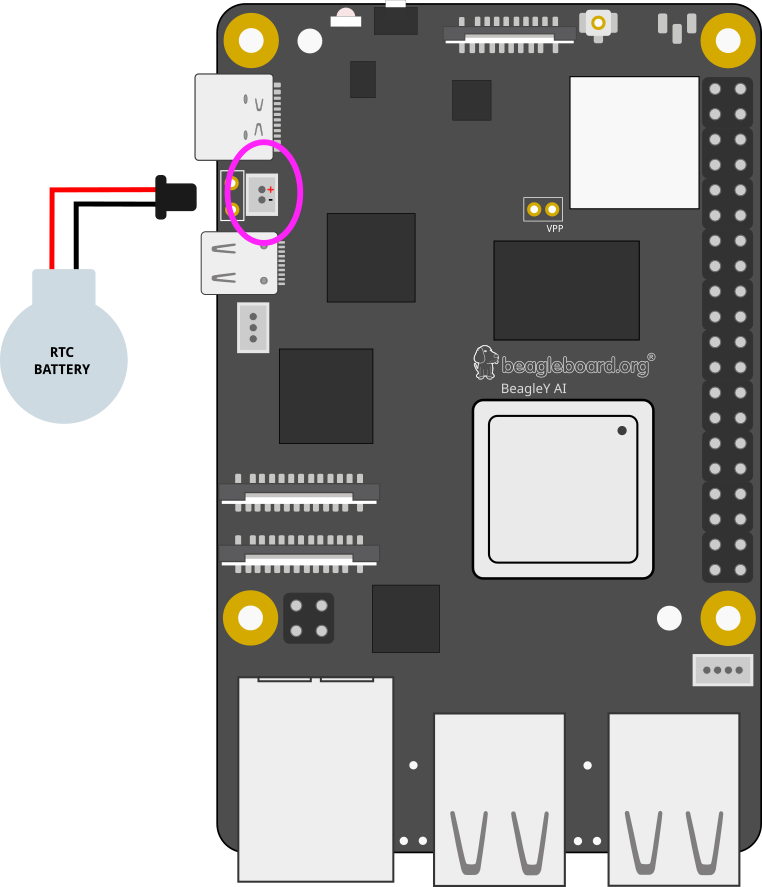

.. _beagley-ai-rtc:

.. note:: This page is a work in progress. Further testing and images will be added soon

Using the on-board Real Time Clock (RTC)
#################################################

Real Time Clocks (RTCs) provide precise and reliable timekeeping capabilities, which are beneficial for applications ranging from simple timekeeping to complex scheduling and secure operations.

Without an RTC, a computer must rely on something called Network Time Protocol (NTP) to obtain the current time from a network source. There are many cases however where an SBC such as BeagleY may not have 
a constant or reliable network connection. In situations such as these, an RTC allows the board to keep time even if the network connection is severed or the board loses power for an extended period of time. 

Fortunately, BeagleY-AI comes with a built-in `DS1340 <https://www.analog.com/media/en/technical-documentation/data-sheets/DS1340-DS1340C.pdf>`_  RTC for all your fancy time keeping needs!

Required Hardware
**********************

BeagleY provides a **1.00 mm pitch, 2-pin JST SH connector** for a coin cell battery to enable the RTC to keep time even if power is lost to the board.

These batteries are available from several vendors:

* Adafruit - `Link <https://www.adafruit.com/product/5817>`_ 
* DigiKey - `Link <https://www.digikey.com/en/products/detail/raspberry-pi/SC1163/21658274>`_ 
* Amazon (reusable battery holder) - `Link <https://www.amazon.com/KODASW-RTCBattery-Holder-Include-Battery/dp/B0CRKQ2MG1/>`_ 
  

Uses for an RTC
**********************

1. **Maintaining Accurate Time:** RTCs provide an accurate clock that continues to run even when the SBC is powered down. This is crucial for maintaining the correct time and date across reboots.

2. **Timestamping:** Many applications need to know the current time for timestamping data, logs, or events. For example, IoT devices may need to log sensor data with precise timestamps.

3. **Scheduling Tasks:** In some applications, tasks need to be scheduled at specific times. An RTC allows the SBC to keep track of time accurately, ensuring that tasks are performed at the correct times.

4. **Network Synchronization:** If the SBC is part of a larger network, having an accurate time helps with synchronizing data and events across the network.

5. **Standby Power Efficiency:** Many RTCs operate with a very low power requirement and can keep time even when the rest of the board is in a low-power or sleep mode. This helps in reducing overall power consumption.

Reading time
**********************

.. note:: If you have not connected your BeagleY to a network so it can get time from an NTP server, you must set the time before being able to read it. If you don't do this first, you'll see errors. 

Reading the current time on the RTC is achieved using the **hwclock** command.

.. code:: console

   debian@BeagleY:~$ sudo hwclock
   2024-05-10 00:00:02.224187-05:00

Setting time
**********************

You can set time manually by running the following command:

.. code:: console

   hwclock --set --date "10/05/2024 21:01:05"

Diving Deeper
**********************

There are actually two different "times" that your Linux system keeps track of. 

* System time, which can be read using the **date** or **timedatectl** commands
* RTC (hardware) time which can be read using the **hwclock** command shown above.

Comparing the time, we see something interesting, they're different!

You can just type "date" but the format will be different, so we add some extra instructions to match the format.

.. code:: console

   debian@BeagleBone:~$ date +%Y-%m-%d' '%H:%M:%S.%N%:z
   2024-05-10 21:06:50.058595373+00:00

   debian@BeagleBone:~$ sudo hwclock
   2024-05-10 21:06:56.692874+00:00

But why? We see here that our system and hardware clock are over 9 seconds apart!

Ok, in this particular case we set the HW clock slightly ahead to illustrate the point, but in real life "drift" is a real problem
that has to be dealt with. Environmental conditions like temperature or stray cosmic rays can cause electronics to become ever so slightly out of sync, and these effects only grow over time unless corrected. It's why RTCs and other fancier time keeping instruments implement various methods to help account for this
such as temperature compensated oscillators. 

Let's fix our hardware clock. We assume here that the system clock is freshly synced over NTP so it's going to be our true time "source".

.. code:: console

   debian@BeagleBone:~$ sudo hwclock --systohc

Let's write a simple script to get the two times, we'll call it **getTime.sh**:

.. code:: console

   HWTIME=$(sudo hwclock)
   echo "RTC - ${HWTIME} "

   SYSTIME=$(date +%Y-%m-%d' '%H:%M:%S.%N%:z)
   echo "SYS - ${SYSTIME} "

Now let's run it! 

.. code:: console
   
   debian@BeagleBone:~$ sudo chmod +x getTime.sh
   debian@BeagleBone:~$ ./getTime.sh
   
   RTC - 2024-05-10 21:52:58.374954+00:00
   SYS - 2024-05-10 21:52:59.048442940+00:00

As we can see, we're still about a second off, but this is because it takes a bit of time to query the RTC via I2C.

If you want to learn more, the **Going Further** at the end of this article is a good starting point!

Troubleshooting
*******************

The most common error results from not having initialized the RTC at all. 
This usually happens if the system is powered on without an RTC battery and without a network connection. 

In such cases, you should be able to read the time after setting the time as follows:

.. code:: console

   debian@BeagleBone:~$ sudo hwclock --systohc
   
   debian@BeagleBone:~$ sudo hwclock
   2024-05-10 21:06:56.692874+00:00

Going Further
*******************

Consider learning about topics such as time keeping over GPS and Atomic Clocks!

Some good YouTube Videos and sources for inspiration - 

* `Network Time Protocol - Computerphile <https://www.youtube.com/watch?v=BAo5C2qbLq8>`_
* `Nanosecond Clock Sync - Jeff Geerling <https://www.youtube.com/watch?v=RvnG-ywF6_s>`_ 
* `Using GPS with PPS to synchronize clocks over the network <https://www.youtube.com/watch?v=7aTZ66ZL6Dk>`_