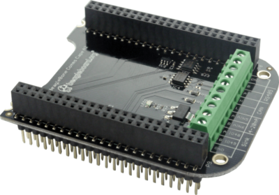

.. _industrial-comms-cape:

Beaglebone Industrial Comms Cape
#####################

For industrial communication applications. Provides an array of communication protocols including one RS485, one CAN, 
two analog 4–20 mA current loops, and two 3A 50V interfaces allowing the control of high current loads.

* `Order page <https://beagleboard.org/capes#comms>`_
* `Schematic <https://openbeagle.org/beagleboard/capes/-/tree/master/beaglebone/comms>`_

.. note::
   This cape also boasts compatiblity with the :ref:`beaglev-fire-home`. Documentation for it's setup can be found
   at :ref:`beaglev-fire-comms-cape-gateware-usage`.

Electrical Specifications
**************************

- **RS485**: `MAX13487E/MAX13488E datasheet <https://datasheets.maximintegrated.com/en/ds/MAX13487E-MAX13488E.pdf>`_
- **CAN**: `SN65HVD230 datasheet <https://www.ti.com/product/SN65HVD230>`_
- **2x 4-20mA current loop inputs**
- **2x 3A 50V sinks for high-current loads**
- **I2C EEPROM**

Mechanical Specifications
*************************

.. list-table::
   :header-rows: 1

   * - Feature
     - Specification
   * - Layers
     - 2
   * - PCB Thickness
     - 0.062"
   * - RoHS Compliant
     - Yes

EEPROM
******

.. list-table::
   :header-rows: 1

   * - Feature
     - Specification
   * - EEPROM Support
     - Yes
   * - Board Name
     - Industrial Comms Cape
   * - Version
     - A2
   * - Manufacturer
     - BeagleBoard.org
   * - Part Number
     - BBORG_COMMS
   * - Pins Used
     - (Not specified)

Documentation
*************

.. list-table::
   :header-rows: 1

   * - Feature
     - Availability
   * - Open Source
     - Yes
   * - System Reference Manual
     - Not yet
   * - Schematics
     - PDF, EAGLECape
   * - PCB Files
     - PDF, EAGLE
   * - Gerber Files
     - Not yet
   * - Bills of Materials
     - Not yet

Test Code
*********

.. code-block:: bash

   # For the RS485, you just need
   config-pin p9.11 uart
   config-pin p9.13 uart 
   # and then use /dev/ttyS4

   # For the CAN, you just need
   config-pin p9.24 can
   config-pin p9.26 can
   # and then you can use something like 
   # https://gist.github.com/jadonk/90d3462c8569d11fa3f7caf14f4769f1,
   # but replace can0 with can1

   # For the 4-20mA loop, the ADC overlay should already be loaded and you can
   cat /sys/bus/iio/devices/iio:device0/in_voltage5_raw
   cat /sys/bus/iio/devices/iio:device0/in_voltage6_raw
   # but you'll need to do the voltage to data conversion

   # For the sink drivers, you can do:
   # Sink A
   config-pin p9.15 gpio
   echo out > /sys/class/gpio/gpio48/direction
   echo 1 > /sys/class/gpio/gpio48/value
   # Sink B
   config-pin p9.23 gpio
   echo out > /sys/class/gpio/gpio49/direction
   echo 1 > /sys/class/gpio/gpio49/value
   # and that should turn them on.

