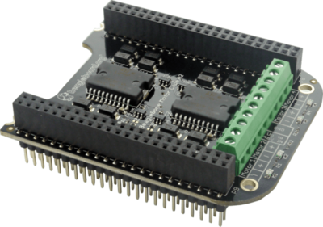

.. _bone-cape-motor:

BeagleBoard.org BeagleBone Motor Cape
#####################################

The Motor Cape, as the name suggests, is a simple Cape with two, L298P drivers on it.
It contains the two drivers and each can be operated independently from the BeagleBone.

   BeagleBone Motor Cape Rev. A2 

* `Order page <https://beagleboard.org/capes#motor>`_
* `Schematic <https://git.beagleboard.org/beagleboard/capes/-/tree/master/beaglebone/Motor>`_

.. note:: 
    The following describes how to use the device tree overlay under development.
    The description may not be suitable for those using older firmware.

Installation
************

Special configuration is required. When you plug the Motor Cape into your BeagleBone-AI64, 
it will automatically become recognized.

You can check to see if the Motor Cape is recognized with the following command.

.. code-block::

    sudo beagle-version | grep UBOOT

Your output should look similar:

`UBOOT: Booted Device-Tree:[k3-j721e-beagleboneai64.dts]`
`UBOOT: Loaded Overlay:[k3-j721e-beagleboneai64-BBORG_MOTOR.kernel]`

A list of currently loaded device tree overlays are displayed here. 
If you see `k3-j721e-beagleboneai64-BBORG_MOTOR.kernel` in this list, it has been loaded correctly.

If it is not loaded correctly, you can also load it directly 
by adding the following to the overlay options 
(which can be reflected by changing the file /boot/firmware/extlinux/extlinux.conf) to reflect the text below.

.. code-block::

    fdtoverlays /overlays/k3-j721e-beagleboneai64-BBORG_MOTOR.dtbo

Usage
*****

.. code-block:: shell-session

    ls /sys/class/leds/

The directory "m1_high", for instance, exists in the following directory.
The GPIOs can be controlled by modifying the files in its directory called `brightness`.

.. code-block:: shell-session

    echo 1 > /sys/class/leds/m1_high/brightness

This allows you to adjust the `brightness`.
Entering 1 for `brightness` turns it ON while entering 0 for `brightness` turns it OFF.

The two drivers can access all four connectors for the motors. 
Changing the file from m1_high to m2_high will grant you access to
the motor2 headers on the Motor Cape which is a file located in /sys/class/leds/m2_high/.

Also, once the below commands to get PWM accessible on the BBAI-64 are installed and commanded,
you can find your files in your FS on the BBAI-64 via `/dev/beagle/pwm/P*`.

Code to Get Started
*******************

* For instance, a kernel that I found to work is kernel: `6.1.83-ti-arm64-r64`
* An image I found to work is: `BeagleBoard.org Debian Bookworm Xfce Image 2024-07-04`

Before using the Motor Cape, some installation steps are needed:

1. `sudo apt update`
2. `cd /opt/source/dtb-6.1-Beagle/ && git pull`
3. ./build_n_install.sh

Also, a neat shell script to have access to PWM and GPIO for utilizing the Motor Cape from the
BBAI-64 is located below. I called it set_up_pwm.sh:

.. code-block:: bash

    # Here is our shell script that can be run with sh set_up_pwm.sh (sudo is needed)

    sudo beagle-pwm-export --pin p9_16

    sudo beagle-pwm-export --pin p9_14

    sudo beagle-pwm-export --pin p8_13

    sudo beagle-pwm-export --pin p8_19

* An image I found that works is `https://www.beagleboard.org/distros/bbai64-debian-12-6-2024-07-04-xfce`

There are newer images and kernels if you want to update and there are older ones in case you
would like to go back in time to use older kernels and images for the Motor Cape. Please remember
that older firmware will work differently on the BeagleBoneAI-64 and may have unintended details.

C Source with File Descriptors
******************************

You can name this file Motor_Test.c and use gcc to handle compiling the source into a binary like so:

`gcc Motor_Test.c -o Motor_Test`

.. code-block:: c

    // From Sean J. Miller on element14 with my twist for the BBAI-64 and Motor Cape
    // Since its conception, the links have changed and have since been lost!

    #include <stdio.h>
    #include <unistd.h>
    #include <stdlib.h>
    #include <fcntl.h>
    #include <sys/types.h>
    #include <sys/stat.h>
    #include <errno.h>

    void GPIO_One(int Gpio) {
        FILE *bright;
        bright = fopen("/sys/class/leds/m1_high/brightness", "w");
        fseek(bright, 0, SEEK_SET);
        fprintf(bright, "%d", 1 * Gpio);
        fclose(bright);
    }

    void setupPWM(int enable) {
        FILE *pwm;
        pwm = fopen("/dev/beagle/pwm/P9_16/enable", "w");
        fseek(pwm, 0, SEEK_SET);
        fprintf(pwm, "%d", 1 * enable);
        fclose(pwm);
    }

    void setupPeriod(int period_one) {
        FILE *period;
        period = fopen("/dev/beagle/pwm/P9_16/period", "w");
        fseek(period, 0, SEEK_SET);
        fprintf(period, "%d", 10 * period_one);
        fclose(period);
    }

    void pwm_duty(int the_duty_multiplier) {
        FILE *duty;
        duty = fopen("/dev/beagle/pwm/P9_16/duty_cycle", "w");
        fseek(duty, 0, SEEK_SET);
        fprintf(duty, "%d", 100 * the_duty_multiplier);
        fclose(duty);
    }

    int testInteger = 0;

    int main() {
        printf("Setting up\n");
        setupPWM(0);

       while(1) {
            printf("Enter an integer, Please: ");
            scanf("%d", &testInteger);
            if (testInteger >= 3) {
                setupPWM(1);
                setupPeriod(140);
                pwm_duty(8);
                GPIO_One(1);
            }
            usleep(2500);

            if (testInteger < 2) {
                setupPWM(0);
                setupPeriod(80);
                pwm_duty(8);
                GPIO_One(0);
            }

            usleep(2500);
        }
        pwm_duty(0);
        setupPWM(0);
        GPIO_One(0);
        return 0;
    }

    

Python3 Source to Lock and Unlock a Door with a Solenoid Motor
**************************************************************

If you find the daunting task of simplifying an easy one, please take this source and change it.

Make it suit your needs. I will call this file MotorLib.py. Then, we can use all of which it entails
in another file and have our GPIO files also work since the L298 drivers use two peripherals on the
TDA4VM on the BBAI-64, i.e. GPIO and PWM respectively. 

.. code-block:: python

    # This is the library called MotorLib.py for the Motor Cape
    from pathlib import Path

    class Pwm:
        def __init__( self, path, *, frequency=None, period=None, value=None, duty_cycle=None, enabled=None ):
            """path can either be absolute or relative to /dev/beagle/pwm/

            Any remaining arguments are passed to configure() as-is.  You should typically provide the desired
            frequency (or period) and initial value (or duty_cycle).
            """
            path = Path( '/dev/beagle/pwm/', path )
            self.path = path
            if not path.exists():
                raise FileNotFoundError(f'Directory not found: {path}')
            if not path.is_dir():
                raise NotADirectoryError(f'Not a directory: {path}')

            self._enabled = bool( int( (path/'enable').read_text() ) )
            self._period = int( (path/'period').read_text() )
            self._duty_cycle = int( (path/'duty_cycle').read_text() )

            self.configure( frequency=frequency, period=period, value=value, duty_cycle=duty_cycle, enabled=enabled )

        def disable( self ):
            if not self._enabled:
                return
            (self.path/'enable').write_text('0')
            self._enabled = False

        def enable( self ):
            if self._enabled:
                return
            if self._period == 0:
                raise RuntimeError("Cannot enable PWM when frequency is unconfigured (i.e. period is zero)")
            (self.path/'enable').write_text('1')
            self._enabled = True

        def configure( self, *, frequency=None, period=None, value=None, duty_cycle=None, enabled=None ):
            """Configure one or more PWM parameters.  You can specify:

            - frequency (in Hz) or period (in ns)
            - value (in range 0.0-1.0) or duty_cycle (in ns)
            - enabled (bool)

            If frequency (or period) is specified then
            - value (or duty_cycle) must also be specified
            - enabled defaults to True
            Otherwise any parameters left unspecified are maintained unchanged.
            """

            if frequency is not None or period is not None:
                if value is None and duty_cycle is None:
                    raise RuntimeError("When configuring PWM frequency or period you must also specify value or duty_cycle")
                if enabled is None:
                    enabled = True
            else:
                if enabled is None:
                    enabled = self._enabled

            if frequency is not None:
                if period is not None:
                    raise RuntimeError("Cannot configure both PWM frequency and period")
                if frequency <= 0:
                    period = 2**32
                else:
                    period = round( 1e9 / frequency )
                if period not in range( 1, 2**32 ):
                    raise RuntimeError(f"PWM frequency must be in range {1e9/(2**32-1)} .. {1e9/1} Hz")
            elif period is not None:
                period = round( period )
                if period <= 0 or period >= 2**32:
                    raise RuntimeError("PWM period must be in range 1 .. 4294967295 ns")
            else:
                period = self._period

            if value is not None:
                if duty_cycle is not None:
                    raise RuntimeError("Cannot configure both PWM value and duty_cycle")
                if period == 0:
                    raise RuntimeError("Cannot set PWM value when frequency is unconfigured (i.e. period is zero)")
                if value < 0.0 or value > 1.0:
                    raise RuntimeError("PWM value must be in range 0.0 .. 1.0")
                duty_cycle = round( value * period )
            elif duty_cycle is not None:
                duty_cycle = round( duty_cycle )
                if duty_cycle < 0 or duty_cycle > period:
                    raise RuntimeError(f"PWM duty_cycle must be in range 0 .. period ({period}) ns")
            else:
                duty_cycle = self._duty_cycle

            if not enabled:
                self.disable()

            if duty_cycle < self._duty_cycle:
                (self.path/'duty_cycle').write_text( str( duty_cycle ) )
                self._duty_cycle = int( (self.path/'duty_cycle').read_text() )

            if period != self._period:
                (self.path/'period').write_text( str( period ) )
                self._period = int( (self.path/'period').read_text() )

            if duty_cycle != self._duty_cycle:
                (self.path/'duty_cycle').write_text( str( duty_cycle ) )
                self._duty_cycle = int( (self.path/'duty_cycle').read_text() )

            if enabled:
                self.enable()

        @property
        def enabled( self ):
            return self._enabled

        @enabled.setter
        def enabled( self, enabled ):
            if enabled:
                self.enable()
            else:
                self.disable()

        @property
        def period( self ):
            return self._period

        @period.setter
        def period( self, period ):
            if self._duty_cycle > 0:
                raise RuntimeError("Cannot set period when PWM value is non-zero (i.e. duty_cycle is non-zero)")
            self.configure( period=period, duty_cycle=0, enabled=self._enabled )

        @property
        def frequency( self ):
            if self._period == 0:
                return None
            return 1e9 / self._period

        @frequency.setter
        def frequency( self, frequency ):
            if self._duty_cycle > 0:
                raise RuntimeError("Cannot set frequency when PWM value is non-zero (i.e. duty_cycle is non-zero)")
            self.configure( frequency=frequency, duty_cycle=0, enabled=self._enabled )

        @property
        def value( self ):
            if self._period == 0:
                return None
            return self._duty_cycle / self._period

        @value.setter
        def value( self, value ):
            self.configure( value=value )

        @property
        def duty_cycle( self ):
            return self._duty_cycle

        @duty_cycle.setter
        def duty_cycle( self, duty_cycle ):
            self.configure( duty_cycle=duty_cycle )

    # support being used as context manager to automatically disable pwm when exiting scope

        def __enter__( self ):
            return self

        def __exit__( self, exc_type, exc_val, exc_tb ):
            self.disable()

The next file is not our library but our file to run on the command line to call MotorLib for our
use case, e.g. opening a door by unbolting our locking solenoid and/or locking it back.

.. code-block::

    #!/usr/bin/python3

    # This is for Motor1 on the Headers of the Motor Cape
    # Use for PWM on /dev/beagle/pwm/

    from pathlib import Path
    from MotorLib import Pwm  # see https://pastebin.com/R70P1wAn
    from time import sleep

    pwm1b = Pwm('/dev/beagle/pwm/P9_16/', frequency=50, value=0)

    GPIO  = Path('/sys/class/leds/m1_high/brightness')
    GPIO.write_text('0')

    try:
        while True:
            port = float(input("Please type a 0 or a 1 : "))
            if port == 0:
                GPIO.write_text('1')
                sleep(1)
                frequency=150
                pwm1b.value=1.0
                sleep(1)
            elif port == 1:
                GPIO.write_text('1')
                sleep(1)
                frequency=70
                pwm1b.value=0.1
                sleep(1)

    except KeyboardInterrupt:
        GPIO.write_text("0")
        pwm1b.enabled = False
        print("Unlatching and Closing... ")
        pass

These are a few examples on how to use the Motor Cape and TDA4VM (Cortex-A72) supported BeagleBoneAI-64 SBC.

