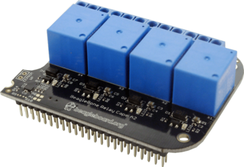

.. _bone-cape-relay:

BeagleBoard.org BeagleBone Relay Cape
#####################################

The Relay Cape, as the name suggests, is a simple Cape with relays on it.
It contains four relays, each of which can be operated independently from the BeagleBone.

* `Order page <https://beagleboard.org/capes#relay>`_
* `Schematic <https://git.beagleboard.org/beagleboard/capes/-/tree/master/beaglebone/Relay>`_

.. note:: 
    The following describes how to use the device tree overlay under development.
    The description may not be suitable for those using older firmware.

Installation
************

No special configuration is required. When you plug the Relay Cape into your BeagleBoard, 
it will automatically be recognized by the Cape Universal function.

You can check to see if the Relay Cape is recognized with the following command.

.. code-block::

    ls /proc/device-tree/chosen/overlay

A list of currently loaded device tree overlays is displayed here. 
If you see `BBORG_RELAY-00A2.kernel` in this list, it has been loaded correctly.

If it is not loaded correctly, you can also load it directly 
by adding the following to the U-Boot options 
(which can be reflected by changing the file /boot/uEnv.txt) to reflect the text below.

.. code-block::

    uboot_overlay_addr0=BBORG_RELAY-00A2.dtbo

Usage
*****

.. code-block::

    ls /sys/class/leds

The directory "relay1", for instance, exists in the following directory.
The LEDs can be controlled by modifying the files in its directory.

.. code-block::

    echo 1 > relay1/brightness

This allows you to adjust the brightness;
entering 1 for brightness turns it ON while entering 0 turns it OFF.

The four relays can be changed individually 
by changing the number after "relay" in /sys/class/leds/relay.

Code to Get Started
*******************

Currently, using sysfs in .c files, libgpiod-dev/gpiod in .c files, and 
python3 files with the Relay Cape work well!

* For instance, a kernel that I found to work is kernel: `5.10.168-ti-r77`

* Another idea, an image I found that works is `BeagleBoard.org Debian Bookworm IoT Image 2023-10-07`

There are newer images and kernels if you want to update and there are older ones in case you
would like to go back in time to use older kernels and images for the Relay Cape. Please remember
that older firmware will work differently on the BeagleBone Black or other related am335x SBC.

C Source with File Descriptors
******************************

You can name this file Relay_Test.c and use gcc to handle compiling the source into a binary like so:

`gcc Relay_Test.c -o Relay_Test`

.. code-block::

    /*

    This is an example of programming a Relay on the Relay Cape for the BeagleBone Black or other am335x board with the Relay Cape.

    Use the Relay Cape attached to the BeagleBone Black for a change in seconds and then exit with CTRL-C.

    The original source can be found here by Mr. Tranter: https://github.com/tranter/blogs/blob/master/gpio/part5/demo1.c

    Jeff Tranter <jtranter@ics.com>

    and...Seth. I changed the source a bit to fit the BeagleBone Black and Relay Cape while using sysfs.

    */

    #include <errno.h>
    #include <fcntl.h>
    #include <stdio.h>
    #include <stdlib.h>
    #include <sys/stat.h>
    #include <sys/types.h>
    #include <unistd.h>

    int main()
    {

    // Export the desired pin by writing to /sys/class/leds/relay1/brightness

        int fd = open("/sys/class/leds/relay1/brightness", O_WRONLY);
        if (fd == -1) {
            perror("Unable to open /sys/class/leds/relay1/brightness");
            exit(1);
        }

        fd = open("/sys/class/leds/relay1/brightness", O_WRONLY);
        if (fd == -1) {
            perror("Unable to open /sys/class/leds/relay1/brightness");
            exit(1);
        }

    // Toggle LED 50 ms on, 50ms off, 100 times (10 seconds)

        for (int i = 0; i < 100; i++) {
            if (write(fd, "1", 1) != 1) {
                perror("Error writing to /sys/class/leds/relay1/brightness");
                exit(1);
            }
            usleep(50000);

            if (write(fd, "0", 1) != 1) {
                perror("Error writing to /sys/class/leds/relay1/brightness");
                exit(1);
            }
            usleep(50000);
        }

        close(fd);

        // And exit
        return 0;
    }

C Source with gpiod.h and File Descriptors
***********************************************

Also...if you are looking to dive into the new interface, libgpiod-dev/gpiod, here is another form of
source that can toggle the same relay listed from the file descriptor. 

One thing to note: `sudo apt install cmake`

1. mkdir GPIOd && cd GPIOd

2. nano Relay.c

3. add the below source into the file Relay.c

.. code-block::

    /*

    Simple gpiod example of toggling a LED connected to a gpio line from
    the Relay Cape on the BeagleBone Black.
    Exits with or without CTRL-C.

    */

    // This source can be found here: https://github.com/tranter/blogs/blob/master/gpio/part9/example.c
    // It has been changed by me, Seth, to handle the Relay Cape and BBB Linux based SoC SBC.

    // kernel: 5.10.168-ti-r77
    // image : BeagleBoard.org Debian Bookworm IoT Image 2023-10-07

    // type gpioinfo and look for this line: line 20: "P9_41B" "relay1" output active-high [used]
    // That line shows us the info. we need to make an educated decision on what fd we will use, i.e. relay1.
    // We will also need to locate which chipname is being utilized. For instance: gpiochip0 - 32 lines:

    // #include <linux/gpio.h>
    #include <gpiod.h>
    #include <stdio.h>
    #include <unistd.h>

    int main(int argc, char **argv)
    {
        const char *chipname = "gpiochip0";
        struct gpiod_chip *chip;
        struct gpiod_line *lineLED;

    int i, ret;

    // Open GPIO chip
    chip = gpiod_chip_open_by_name(chipname);
    if (!chip) {
        perror("Open chip failed\n");
        return 1;
    }

    // Open GPIO lines
    lineLED = gpiod_chip_get_line(chip, 20);
    if (!lineLED) {
        perror("Get line failed\n");
        return 1;
    }

    // Open LED lines for output
    ret = gpiod_line_request_output(lineLED, "relay1", 0);
    if (ret < 0) {
        perror("Request line as output failed\n");
        return 1;
    }

    // Blink a LED
    i = 0;
    while (true) {
        ret = gpiod_line_set_value(lineLED, (i & 1) != 0);
        if (ret < 0) {
            perror("Set line output failed\n");
            return 1;
        }
        usleep(1000000);
        i++;
    }

    // Release lines and chip
    gpiod_line_release(lineLED);
    gpiod_chip_close(chip);
    return 0;
    }

4. mkdir build && touch CMakeLists.txt

5. In CMakeLists.txt, add these values and text via nano or your favorite editor!

.. code-block::

    cmake_minimum_required(VERSION 3.25.0)

    project(gpiod LANGUAGES C)

    add_executable(Relay Relay.c)
    
    target_link_libraries(Relay gpiod)

6. cd build && cmake ..

7. make 

8. ./Relay

Here is a simple, Python3 file to handle a relay on the Relay Cape with the BBB.

.. code-block::

    #!/usr/bin/python3

    # Getting help from #beagle on IRC
    # You know who you are currently!

    # Run by typing python3 Relay.py or after the command
    # chmod a+x Relay.py, use ./Relay.py

    from pathlib import Path
    from time import sleep

    class Gpio:
        def __init__(self, name):
            self.name = name
            self._value_path = Path('/sys/class/leds/', name, 'brightness')

        def get(self):
            return int(self._value_path.read_text())

        def set(self, value):
            self._value_path.write_text(str(value))

    relay_one = Gpio('relay1/')

    relay_one.set('1')
    sleep(2)
    relay_one.set('0')
    sleep(2)

These are a few examples on how to use the Relay Cape and am335x supported BeagleBone Black SBC.
