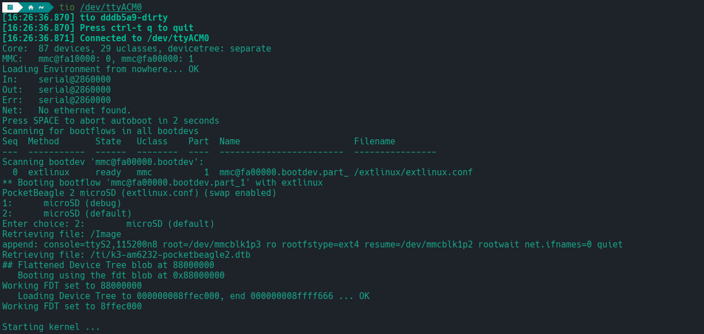

.. _pocketbeagle-2-quick-start:

Quick Start Guide
##################

This section provides instructions on how to hook up your board. This Beagle requires a 5V @ 1A (5W) 
power supply to work properly via either USB Type-C power adapter or via cape header pins. 

Recommended adapters can be found at :ref:`accessories-power-supplies` section.

.. _pocketbeagle-2-whats-in-the-box:

What’s In the Box
*******************

In the box you will find two main items,

* `PocketBeagle 2 <https://www.beagleboard.org/boards/pocketbeagle-2>`_
* Instruction card

.. note:: 
   
   A USB-C to USB-C / USB-A to USB-C cable is not included, but recommended for the tethered scenario and creates 
   a developer experience where the board can be used immediately with no other equipment needed.

.. tip:: 
   
   For board files, 3D model, and more, you can checkout 
   `PocketBeagle 2 repository on OpenBeagle <https://openbeagle.org/pocketbeagle/pocketbeagle-2>`_.

.. todo:: Add picture of PocketBeagle 2 box content

Creating bootable microSD card
*******************************

To get started with creating a bootable microSD card, you need folloiwing items,

1. Up to date `bb-imager-rs <https://openbeagle.org/ayush1325/bb-imager-rs/>`_
2. microSD card (8GB or larger)

.. tip::

   If required you can manually download the image from 
   `beagleboard.org distros page <https://www.beagleboard.org/distros/>`_, for example,
   https://www.beagleboard.org/distros/pocketbeagle2-debian-12-9-2025-01-15-minimal

   .. figure:: images/distro/pocketbeagle-2-distro-selection.png
      :align: center
      :alt: Distro selection

      Distros selection

To begin you have to select PocketBeagle 2 from the list of boards, 
then select the image you want to flash, and finally select the microSD card.
After doing this you have to select the config button to configure the image 
and then click on the flash button to start the flashing process.

.. figure:: images/distro/bb-imager-selection.png
   :align: center
   :alt: Board and image selection

   Board and image selection

Below image shows the configuration options available for the image.

.. tip:: 

   You can enable Skip ``Verification`` as shown in the image below, 
   which will make the flashing process faster by skipping the verification step.

.. figure:: images/distro/bb-imager-config.png
   :align: center
   :alt: Configuration options

   Configuration options

Make sure to select the correct microSD card and click on the flash button to start the flashing process.

.. figure:: images/distro/bb-imager-flashing.png
   :align: center
   :alt: Flashing in progress

   Flashing in progress

Once the flashing is done, you will see the following screen.

.. figure:: images/distro/bb-imager-flashing-done.png
   :align: center
   :alt: Flashing done

   Flashing done

Your microSD card is now ready to boot PocketBeagle 2.

.. _pocketbeagle-2-main-connection-scenarios:

Main Connection Scenarios
*************************

This section describes how to connect and power the board and serves as a slightly more detailed 
description of the quick start guide included in the box. The board can be configured in several 
different ways, but we will discuss the two most common scenarios.

1.  Directly tethered to a PC via pocketbeagle 2 USB-C port.
2.  With `TechLab Cape <https://www.beagleboard.org/boards/techlab>`_ or `GamePup Cape <https://www.beagleboard.org/boards/pocketbeagle-gamepup-cape>`_  for sensors, USB host, LEDs and Buttons.

.. _pocketbeagle-2-tethered-scenario:

Tethered Connection
====================

In this scenario, the board is directly connected to a PC via USB-C port. This is the simplest way to get started with the board.
Optionally you can connect rpi debug probe to 3-pin JST-SH connector to see boot log, board console access and for general debugging.

.. figure:: images/connection-diagrams/tethered-connection.*
   :align: center
   :alt: Tethered Connection

   Tethered Connection

USB connection
---------------

1. Connect the USB-C cable to the PocketBeagle 2 and the other end to the PC.
2. The board will power up and boot from the microSD card.
3. The board will show up as a USB device on the PC.
4. You can access the board via ``SSH`` or board ``serial`` connection or though ``Visial Studio Code Server`` web interface.

.. tab-set::
   .. tab-item:: Visial Studio Code Server

      After connecting the board to the PC, you can access the board via a web browser by entering the IP address of the board in the address bar.

      .. code-block:: text

         https://192.168.7.2:3000/

      .. figure:: images/misc/vscode-server.png
         :align: center
         :alt: Visual Studio Code Server

         Visual Studio Code Server

   .. tab-item:: SSH

      After connecting the board to the PC, you can access the board via SSH executing the following command in your terminal.

      .. code-block:: bash

         ssh <username>@192.168.7.2

      Where ``<username>`` is the username you selected during the microSD card flashing process.

      .. figure:: images/misc/ssh-connection.png
         :align: center
         :alt: SSH connection

         SSH connection

   .. tab-item:: Serial

      PocketBeagle 2 has a built-in UART debug connection. You can connect to the board console using a serial 
      console application (e.g. Putty) on the PC just like your would connection using any external UART debug probe

      If PocketBeagle 2 is the old device connected with UART, on linux you can use `tio` utility, replace ``ttyACMx`` with the actual device name.

      .. code-block:: bash

         tio /dev/ttyACMx

      .. figure:: images/misc/serial-connection.png
         :align: center
         :alt: Serial connection

         Serial connection

Once you have access to the console using any of the methods above, you might want to share interne connection with the board.
You can do this by running ``pb2-internet.sh`` file on your PocketBeagle 2 board. and the follow OS specific steps to share internet connection.

First you have to create ``pb2-internet.sh`` file on PocketBeagle 2 with the following content,

.. code-block:: bash

   #!/bin/sh -e
   #

   if ! id | grep -q root; then
           echo "must be run as root"
           exit
   fi

   if [ -f /etc/default/bb-boot ] ; then
           . /etc/default/bb-boot
   fi

   if [ "x${USB_CONFIGURATION}" = "x" ] ; then
           USB0_SUBNET=192.168.7
           DNS_NAMESERVER=8.8.8.8
   fi

   /sbin/route add default gw ${USB0_SUBNET}.1 || true

   ping -c1 ${DNS_NAMESERVER}
   echo "nameserver ${DNS_NAMESERVER}" >> /etc/resolv.conf

   #

then execute following commands,

.. code-block:: bash

   chmod +x pb2-internet.sh
   sudo ./pb2-internet.sh

On PC you have to follow OS specific steps to share internet connection with the board.

.. tab-set::

   .. tab-item:: Linux

      First you have to identify your WiFi interface name and PocketBeagle 2 Ethernet interface name using following command,

      .. code-block:: bash

         ip a

      If you have your WiFi connected to router and PB2 connected to one of the USB the you should see four interfaces listed

      - 1: lo
      - 2: wlp0s20f3
      - 3: enp0s20f0u2
      - 4: enp0s20f0u2i2

      Out of which ``wlp0s20f3`` is the WiFi interface and ``enp0s20f0u2`` is the PocketBeagle 2 Ethernet interface. 
      
      Once you know the interface names, you have to create ``pc-internet.sh`` file on PC with the following content,

      .. code-block:: bash

         sudo sysctl net.ipv4.ip_forward=1
         sudo iptables --table nat --append POSTROUTING --out-interface wlp0s20f3 -j MASQUERADE
         sudo iptables --append FORWARD --in-interface enp0s20f0u1 -j ACCEPT

      make sure to update line 2 and 3 with your WiFi and PocketBeagle 2 Ethernet interface names. Then execute following commands,

      .. code-block:: bash

         chmod +x pc-internet.sh
         sudo ./pc-internet.sh

   .. tab-item:: Windows

      .. todo:: Add steps to share internet connection on Windows

   .. tab-item:: MacOS

      .. todo:: Add steps to share internet connection on MacOS

UART serial debug connection
----------------------------

1. Connect the rpi debug probe to the 3-pin JST-SH connector on the board.
2. Connect the other end of the probe to the PC.
3. Use command line utility like `tio` with default setting or a serial console application (e.g. Putty) to accress your board.
4. You will see the boot log and can access the board console.

   Serial debug

.. _pocketbeagle-2-cape-scenario:

