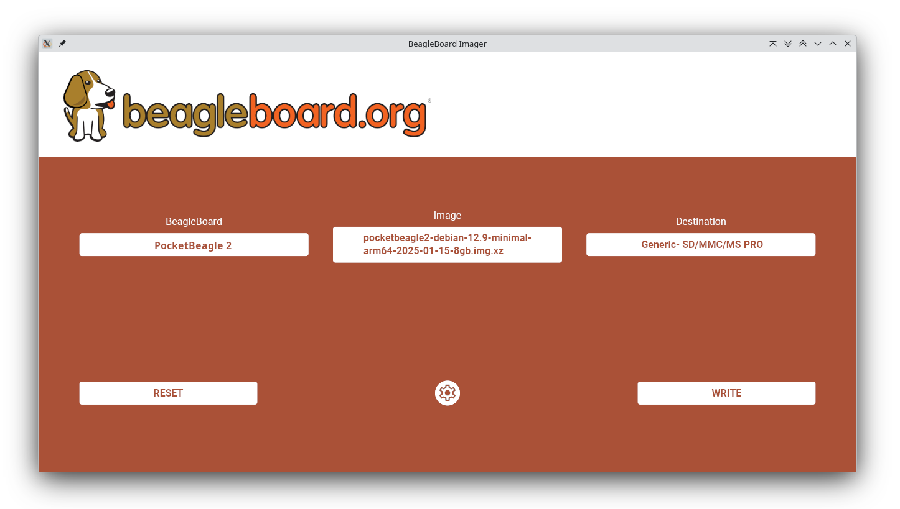
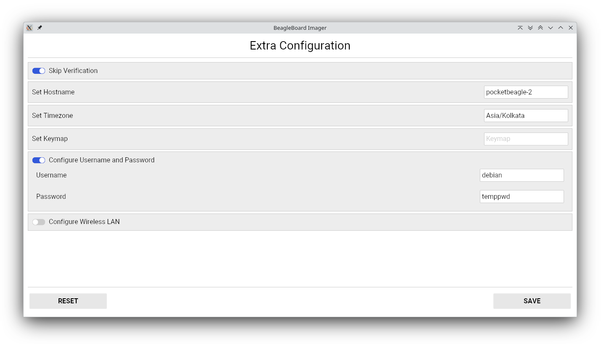
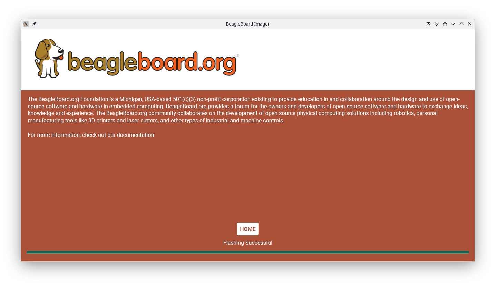

.. _pocketbeagle-2-quick-start:

Quick Start Guide
##################

This section provides instructions on how to hook up your board. This Beagle requires a 5V @ 1A (5W) 
power supply to work properly via either USB Type-C power adapter or via cape header pins. 

Recommended adapters can be found at :ref:`accessories-power-supplies` section.

.. _pocketbeagle-2-whats-in-the-box:

What’s In the Box
*******************

In the box you will find two main items,

* `PocketBeagle 2 <https://www.beagleboard.org/boards/pocketbeagle-2>`_
* Instruction card

.. note:: 
   
   A USB-C to USB-C / USB-A to USB-C cable is not included, but recommended for the tethered scenario and creates 
   a developer experience where the board can be used immediately with no other equipment needed.

.. tip:: 
   
   For board files, 3D model, and more, you can checkout 
   `PocketBeagle 2 repository on OpenBeagle <https://openbeagle.org/pocketbeagle/pocketbeagle-2>`_.

.. todo:: Add picture of PocketBeagle 2 box content

Creating bootable microSD card
*******************************

To get started with creating a bootable microSD card, you need folloiwing items,

1. Up to date `bb-imager-rs <https://openbeagle.org/ayush1325/bb-imager-rs/>`_
2. microSD card (8GB or larger)

.. tip::

   If required you can manually download the image from 
   `beagleboard.org distros page <https://www.beagleboard.org/distros/>`_, for example,
   https://www.beagleboard.org/distros/pocketbeagle2-debian-12-9-2025-01-15-minimal

   .. figure:: images/distro/pocketbeagle-2-distro-selection.png
      :align: center
      :alt: Distro selection

      Distros selection

To begin you have to select PocketBeagle 2 from the list of boards, 
then select the image you want to flash, and finally select the microSD card.
After doing this you have to select the config button to configure the image 
and then click on the flash button to start the flashing process.

   Board and image selection

Below image shows the configuration options available for the image.

.. tip:: 

   You can enable Skip ``Verification`` as shown in the image below, 
   which will make the flashing process faster by skipping the verification step.

   Configuration options

Make sure to select the correct microSD card and click on the flash button to start the flashing process.

.. figure:: images/distro/bb-imager-flashing.png
   :align: center
   :alt: Flashing in progress

   Flashing in progress

Once the flashing is done, you will see the following screen.

   Flashing done

Your microSD card is now ready to boot PocketBeagle 2.

Methods of operation
*********************

1.  Directly tethered to a PC via USB-C port.
2.  With TechLab Cape for sesors, USB host, LEDs and Buttons.

.. todo:: add link to TechLab Cape

.. _pocketbeagle-2-main-connection-scenarios:

Main Connection Scenarios
============================

This section describes how to connect and power the board and serves as a slightly more detailed 
description of the Quick Start Guide included in the box. The board can be configured in several 
different ways, but we will discuss the two most common scenarios.

* Tethered to a PC via the USB cable  
* Attached to a cape like TechLab Cape

.. todo:: Add connection information in detail

