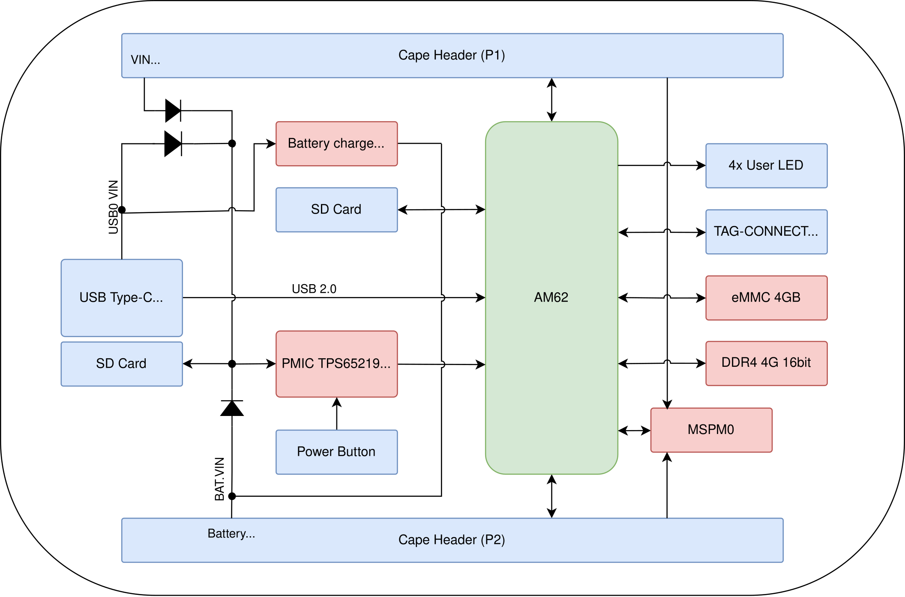
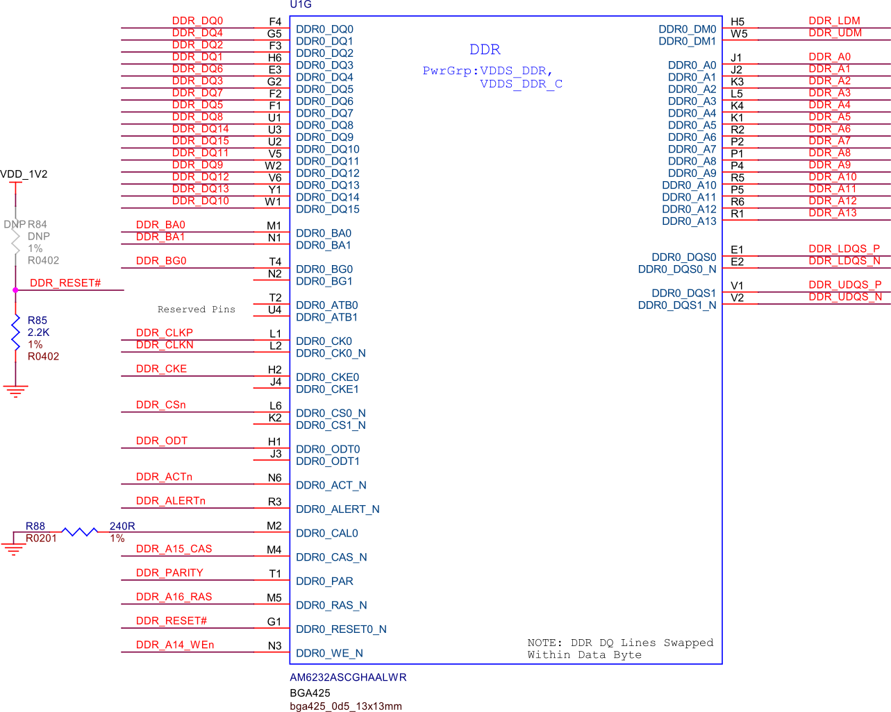
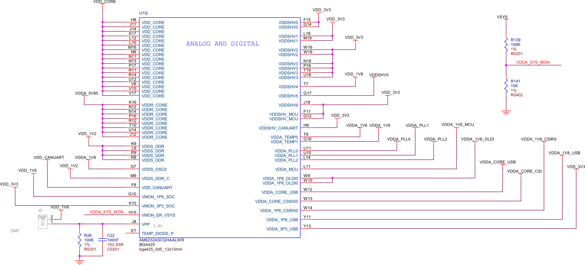
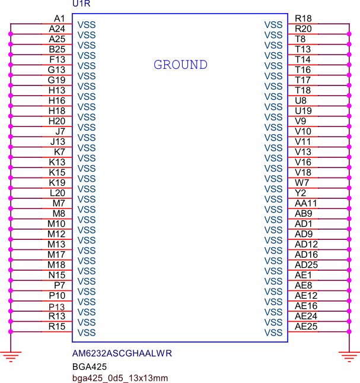
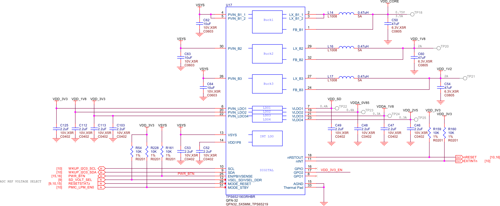
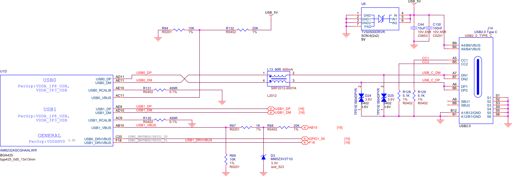
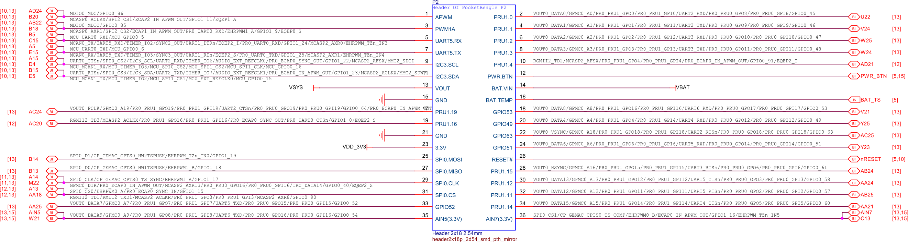
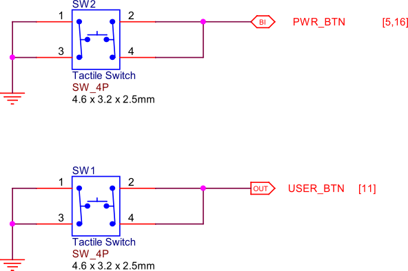
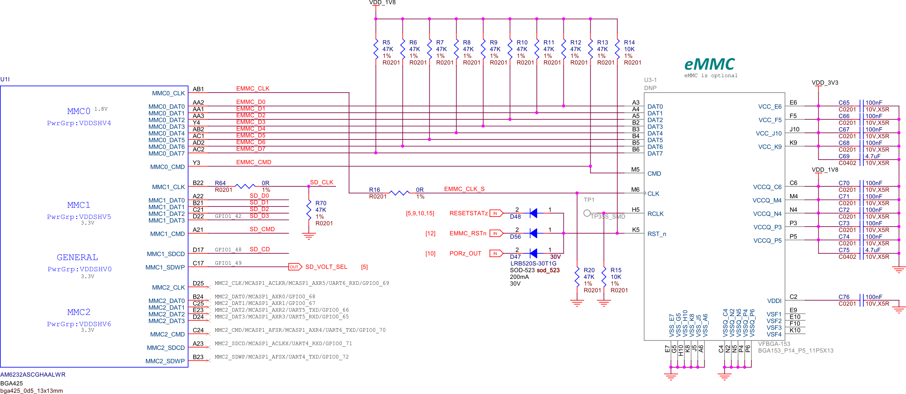
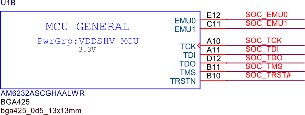

.. _pocketbeagle2-design:

Design and Specifications
##########################

In this chapter, we delve into the intricate design and detailed specifications of PocketBeagle 2, 
offering a thorough understanding of its hardware architecture. We begin with a high-level overview, 
presenting block diagrams that illustrate the main components and their interconnections, including 
the System on Chip (SoC), power management, memory, connectivity interfaces, and peripheral components. 
These diagrams provide a visual representation of the I2C tree, power distribution, and boot configurations, 
essential for grasping the board's functionality.

The chapter then focuses on the heart of PocketBeagle 2, the AM6232 SoC. We explore its internal 
architecture, highlighting the dual ARM Cortex-A53 cores, Cortex-M4F core, and various integrated 
peripherals. Detailed figures illustrate the SoC's functional blocks, decoupling capacitors, 
DDR controller, and power management, emphasizing the importance of each component 
in ensuring efficient and reliable operation.

Connectivity and expansion options are also covered extensively. We discuss the USB connections, 
cape headers, and the MicroSD card slot, which enhance the board's versatility and usability. 
Additionally, we provide insights into the debug ports, including the serial debug port and 
JTAG connections, which are crucial for development and troubleshooting.

The power management section details the integrated circuits responsible for stable and efficient power 
delivery, such as the TPS6521903 PMIC, TLV62595 step-down converter, LM73100 power path management IC, 
and BQ21040 battery charger. Each component's role in maintaining power integrity and optimizing 
consumption is explained, supported by relevant figures.

Finally, we present the mechanical specifications of PocketBeagle 2, including its dimensions, 
weight, and PCB details. This comprehensive overview ensures that you have a complete understanding 
of PocketBeagle 2's design, capabilities, and potential applications, making it an invaluable 
resource for developers and engineers.

Block Diagram and Overview
**************************

The figure below provides a high-level overview of PocketBeagle 2 hardware architecture, illustrating 
the main components and their interconnections. This includes the System on Chip (SoC), power management, 
memory, connectivity interfaces, and other peripheral components. 

- **System on Chip (SoC)**: At the core of PocketBeagle 2 is the AM6232 SoC, which integrates dual ARM Cortex-A53 cores, a Cortex-M4F core, and various peripherals. This SoC is optimized for power efficiency and performance, making it suitable for a wide range of embedded applications.

- **Power Management**: The diagram highlights several power management ICs:
   - **TPS6521903 PMIC**: Manages multiple power rails, including buck converters and LDOs, to supply necessary voltages.
   - **TLV62595 Step-Down Converter**: Provides a stable 3.3V power supply with high efficiency.
   - **LM73100 Power Path Management IC**: Seamlessly switches between multiple power sources (VIN_5V, USB_5V, VBAT) to ensure stable system voltage.

- **Memory Components**: PocketBeagle 2 includes:
   - **512MB LPDDR4 RAM**: Ensures efficient data transfer and memory access.
   - **Optional 4GB eMMC Storage**: Provides non-volatile storage for the operating system and user data.

- **Connectivity Interfaces**: The board offers various connectivity options:
   - **USB Ports**: For data transfer and power supply.
   - **Cape Headers**: P1 and P2 headers for expansion and additional peripherals.
   - **MicroSD Card Slot**: For additional storage and boot options.

- **Debug Ports**: Essential for development and troubleshooting:
   - **Serial Debug Port**: Compatible with the Raspberry Pi Debug Probe for UART communication.
   - **JTAG**: For in-depth debugging and programming.

This comprehensive block diagram is essential for understanding the intricate design and functionality of PocketBeagle 2, providing a visual representation of how each component interacts within the system.

   PocketBeagle2 Block Diagram

The following figure illustrates the I2C tree of PocketBeagle 2, showing the connections between the I2C 
master and various I2C slave devices on the board. The I2C tree is crucial for understanding the communication 
pathways and how different components interact with each other.

Key I2C Ports and Connections:

.. list-table:: Key I2C Ports and Connections
   :header-rows: 1

   * - I2C
     - Connection
   * - **WAUP_I2C0**
     - Connected to the TPS6521903 PMIC for power management control and monitoring.
   * - **I2C0**
     - Connected to the MSPM0L1105 microcontroller, which emulates an 8-channel 12-bit ADC and a 4KB EEPROM.
   * - **I2C1**
     - Available on the P1 cape header for additional peripherals and expansion options.
   * - **I2C2**
     - Also available on the P1 cape header for additional peripherals and expansion options.
   * - **I2C3**
     - Available on the P2 cape header for user-defined peripherals and custom applications.
   * - **MCU_I2C0**
     - Not connected to anything internally, thus can be used if someone wants to modify PocketBeagle 2 design to add something like a QWIIC connector.

These connections ensure efficient communication and control across PocketBeagle 2, enabling robust and flexible system design.

.. figure:: images/hardware-design/i2c-tree.png
   :width: 900px
   :align: center
   :alt: I2C tree

   I2C tree

The following figure shows the power tree of PocketBeagle 2, detailing the power distribution from the 
main power sources to various components on the board. This diagram is crucial for understanding how power 
is managed and distributed across the board to ensure stable and efficient operation.

Key Components and Power Paths:

- **VIN_5V**: This is the primary power input, typically supplied by an external power adapter. It is the main source of power for the board when available.
- **USB_5V**: This input comes from a USB connection. It serves as an alternative power source when VIN_5V is not available, allowing the board to be powered via a USB connection.
- **VBAT**: This is the battery voltage input, used when neither VIN_5V nor USB_5V is available. It ensures that the board remains powered in portable applications.

Power Management ICs:

- **TPS6521903 PMIC**: Manages multiple power rails, including buck converters and LDOs, to supply necessary voltages to various components. It ensures stable and efficient power delivery.
- **TLV62595 Step-Down Converter**: Provides a stable 3.3V power supply with high efficiency, powering critical components on the board.
- **LM73100 Power Path Management IC**: Seamlessly switches between VIN_5V, USB_5V, and VBAT to ensure a stable system voltage (VSYS). It prioritizes the highest available power source and transitions smoothly between sources to prevent power interruptions.
- **BQ21040 Battery Charger**: Manages the charging of a single-cell Li-Ion or Li-Polymer battery. It features high-accuracy voltage regulation, programmable charge current, and thermal protection, ensuring safe and efficient battery charging.

Power Distribution:

- **3.3V Rail**: Powers various components, including the SoC, memory, and peripheral interfaces. The TLV62595 step-down converter ensures a stable 3.3V supply.
- **1.8V and 1.2V Rails**: These lower voltage rails are generated by the TPS6521903 PMIC and are used to power specific components that require lower operating voltages.
- **VDDA 0.85V**: This rail powers the analog components of the SoC, ensuring precise analog signal processing.
- **VDD Core**: Powers the core logic of the SoC, ensuring stable operation of the processor and integrated peripherals.

The power tree diagram provides a comprehensive overview of how power is distributed and managed across PocketBeagle 2, highlighting the role of each power management component in maintaining system stability and efficiency.

.. figure:: images/hardware-design/power-tree.png
   :width: 900px
   :align: center
   :alt: Power tree

   Power tree

.. _pocketbeagle2-processor:

System on Chip (SoC)
*********************

PocketBeagle 2 is powered by the AM6232 SoC, which is a high-performance, low-power processor 
designed for embedded applications. The AM6232 integrates dual ARM Cortex-A53 cores, a 
Cortex-M4F core, and various peripherals to support a wide range of functionalities. It is 
optimized for power efficiency and performance, making it suitable for applications requiring 
robust processing capabilities while maintaining low power consumption. The AM6232 SoC functional 
block diagram below provides a detailed view of the internal architecture of the System on Chip. It 
highlights the various functional blocks such as the CPU cores, memory controllers, peripheral 
interfaces, and other integrated components. This diagram is essential for understanding how 
the SoC manages data flow and interacts with other hardware components on PocketBeagle 2 board.

.. figure:: images/hardware-design/soc-functional-block-diagram.png
   :align: center
   :alt: SoC functional block diagram

   SoC functional block diagram

Decoupling capacitors are used to filter out noise and provide a stable power supply to the SoC. They 
help in maintaining the integrity of the power signals by smoothing out voltage fluctuations and transient 
spikes, ensuring reliable operation of the SoC and preventing potential malfunctions due to power instability.

.. figure:: images/hardware-design/soc-dcaps.png
   :align: center
   :alt: SoC decoupling capacitors
   
   SoC decoupling capacitors

The following figure shows the DDR controller of the SoC, which manages the communication between the 
processor and the DDR memory. It ensures efficient data transfer and memory access, playing a crucial 
role in the overall performance of the system.

   
   SoC DDR controller

The following figure shows the power capacitors used for the SoC. These capacitors are crucial for 
maintaining stable power delivery to the SoC, filtering out noise, and ensuring reliable operation 
by smoothing out voltage fluctuations.

.. figure:: images/hardware-design/soc-power-caps.png
   :align: center
   :alt: SoC power capacitors
   
   SoC power capacitors

The following figure shows the power distribution for the SoC, detailing how power is supplied to 
various components within the SoC to ensure stable and efficient operation.

   
   SoC power

The following figure shows the VSS (Ground) connection for the SoC. This connection is crucial 
for providing a common reference point for all the electrical signals and ensuring the proper 
operation of the SoC by stabilizing the voltage levels.

   
   SoC VSS (Ground) connection

.. _pocketbeagle2-boot-modes:

Boot Modes
===========

The following figure shows the boot configuration of PocketBeagle 2 for emmc and sd card version of boards.

.. figure:: images/hardware-design/boot-config.png
   :align: center
   :alt: Boot configuration

   Boot configuration

The following figure illustrates the bootstrap pins connection, which are used to select the boot mode during the power-up sequence.

.. figure:: images/hardware-design/bootstrap.png
   :align: center
   :alt: Bootstrap pins connection

   Bootstrap pins connection

SoC GPIOs
==========

.. tab-set::

   .. tab-item:: GPIO GPMC

      .. figure:: images/hardware-design/gpio-gpmc.png
         :align: center
         :alt: GPIO GPMC

         GPIO GPMC

   .. tab-item:: GPIO MCASP0

      .. figure:: images/hardware-design/gpio-mcasp0.png
         :align: center
         :alt: GPIO MCASP0

         GPIO MCASP0

   .. tab-item:: GPIO OSC0

      .. figure:: images/hardware-design/gpio-osc0.png
         :align: center
         :alt: GPIO OSC0

         GPIO OSC0

   .. tab-item:: GPIO OSPI

      .. figure:: images/hardware-design/gpio-ospi.png
         :align: center
         :alt: GPIO OSPI

         GPIO OSPI

   .. tab-item:: GPIO RGMII1

      .. figure:: images/hardware-design/gpio-rgmii1.png
         :align: center
         :alt: GPIO RGMII1

         GPIO RGMII1

.. tab-set::

   .. tab-item:: GPIO RGMII2

      .. figure:: images/hardware-design/gpio-rgmii2.png
         :align: center
         :alt: GPIO RGMII2

         GPIO RGMII2

   .. tab-item:: GPIO VOUT0

      .. figure:: images/hardware-design/gpio-vout0.png
         :align: center
         :alt: GPIO VOUT0

         GPIO VOUT0

   .. tab-item:: MCU domain

      .. figure:: images/hardware-design/mcu-domain.png
         :align: center
         :alt: MCU domain

         MCU domain

   .. tab-item:: MCU system

      .. figure:: images/hardware-design/mcu-system.png
         :align: center
         :alt: MCU system

         MCU system

   .. tab-item:: Wakeup domain

      .. figure:: images/hardware-design/wkup-domain.png
         :align: center
         :alt: Wakeup domain

         Wakeup domain

.. _pocketbeagle2-power-management:

Power Management
*****************

PMIC
====

The TPS6521903 is a power management integrated circuit (PMIC) designed to provide efficient power 
management for PocketBeagle. It integrates multiple power rails, including buck converters and 
LDOs, to supply the necessary voltages to various components on the board. The PMIC ensures stable 
and reliable power delivery, optimizing power consumption and extending battery life.

   PMIC

3V3 power
=========

The TLV62595 is a high-efficiency, synchronous step-down converter that provides a stable 
3.3V power supply to various components on PocketBeagle 2. It features a wide input voltage 
range, low quiescent current, and excellent transient response, making it suitable for 
powering sensitive electronics and ensuring reliable operation.

.. figure:: images/hardware-design/dc-3v3.png
   :align: center
   :alt: 3V3 power

   3V3 power

Power path
===========

The LM73100 is a power path management IC that can be used to seamlessly switch between multiple 
power sources to generate a stable system voltage (VSYS). In this design, we have three power 
sources: VIN_5V, USB_5V, and VBAT. Here's how each of these sources is utilized:

1. VIN_5V: This is typically the main power input, which could come from an external power adapter. The LM73100 prioritizes this input when it is available, ensuring that the system is powered by this stable and higher current source.
2. USB_5V: This input comes from a USB connection. When VIN_5V is not available, the LM73100 switches to USB_5V to power the system. This allows the device to be powered or charged via a USB connection when an external adapter is not connected.
3. VBAT: This is the battery voltage input. When neither VIN_5V nor USB_5V is available, the LM73100 switches to VBAT to ensure that the system remains powered. This is crucial for portable devices that need to operate on battery power when no external power sources are connected.

The LM73100 manages these inputs and switches between them to provide a stable VSYS output. It 
ensures that the highest priority power source is used first, and seamlessly transitions to the 
next available source if the current one is disconnected or falls below a certain threshold.

This power path management ensures that the system remains powered without interruption, 
providing a reliable and efficient power solution for various applications.

.. figure:: images/hardware-design/power-path.png
   :align: center
   :alt: Power path

   Power path

Battery charging
================

The BQ21040 is a highly integrated Li-Ion and Li-Polymer linear battery charger device 
targeted at space-limited portable applications. The device operates from either a USB 
port or AC adapter and supports high input voltage. It features a high-accuracy voltage 
regulation, programmable charge current, and thermal regulation. The BQ21040 is designed 
to charge single-cell Li-Ion and Li-Polymer batteries and includes a power path 
management feature to power the system while charging the battery.

Key Features:
- Input voltage range: 4.5V to 28V
- Programmable charge current up to 800mA
- High-accuracy voltage regulation
- Thermal regulation and protection
- Power path management
- Status indication for charge and fault conditions

Applications:
- Wearable devices
- Fitness accessories
- Portable medical devices
- Bluetooth headsets
- Other space-limited portable applications

On PocketBeagle 2, the BQ21040 is used to manage the charging of a single-cell Li-Ion or Li-Polymer battery. 
The BQ21040's status indication feature provides feedback on the charging status and any fault conditions, 
making it easier to monitor the charging process. This integration of the BQ21040 in PocketBeagle 2 design 
enhances the device's portability and reliability, making it suitable for various applications that require battery power.

.. figure:: images/hardware-design/battery-charging.png
   :align: center
   :alt: Battery charging

   Battery charging

Decoupling capacitors
======================

.. figure:: images/hardware-design/vdd-1v2-caps.png
   :align: center
   :alt: VDD 1.2V capacitors

   VDD 1.2V capacitors

.. figure:: images/hardware-design/vdd-1v8-caps.png
   :align: center
   :alt: VDD 1.8V capacitors

   VDD 1.8V capacitors

.. figure:: images/hardware-design/vdd-3v3-caps.png
   :align: center
   :alt: VDD 3.3V capacitors

   VDD 3.3V capacitors

.. figure:: images/hardware-design/vdda-0v85-caps.png
   :align: center
   :alt: VDDA 0.85V capacitors

   VDDA 0.85V capacitors

.. figure:: images/hardware-design/vdd-core-caps.png
   :align: center
   :alt: VDD core capacitors

   VDD core capacitors

.. _pocketbeagle2-connectivity-and-expansion:

General connectivity and expansion
************************************

USB connections
===============

   USB connections

Cape headers
=============

P1 cape header
---------------

.. figure:: images/hardware-design/cape-header-p1.png
   :align: center
   :alt: P1 cape headers

   P1 cape headers

P2 cape header
---------------

   P2 cape headers

MicroSD card slot
=================

.. figure:: images/hardware-design/microsd.png
   :align: center
   :alt: MicroSD card slot

   MicroSD card slot

.. figure:: images/hardware-design/microsd-3v3.png
   :align: center
   :alt: MicroSD card power

   MicroSD card power

.. todo:: Add MicroSD card slot information

Buttons & LEDs
***************

User & Power Button
=====================

   Buttons

.. todo:: Add button details

LED Indicators
===============

.. todo:: Add information about LED indicators

.. figure:: images/hardware-design/leds.png
   :align: center
   :alt: LED indicators

   LED indicators

.. _pocketbeagle2-memory-media-storage:

Memory, Media, and storage 
***************************

Described in the following sections are the memory devices found on the board.

.. _pocketbeagle2-gb-embedded-mmc:

4GB embedded MMC (optional)
===========================

   4GB eMMC storage (optional)

.. _pocketbeagle2-4gb-ddr4:

512MB LPDDR4
==============

.. figure:: images/hardware-design/ddr.png
   :align: center
   :alt: 512MB LPDDR4 RAM

   512MB LPDDR4 RAM

.. figure:: images/hardware-design/ddr-power.png
   :align: center
   :alt: DDR power

   DDR power

.. _pocketbeagle2-mspm0-adc-eeprom:

MSPM0 ADC & EEPROM
==================

The MSPM0L1105 is a versatile microcontroller that we are utilizing to emulate an 8-channel 12-bit ADC and a 4KB EEPROM. 
This microcontroller is connected to PocketBeagle via the I2C interface, allowing for efficient communication and data transfer.

1. The 8-channel 12-bit ADC provides high-resolution analog-to-digital conversion, enabling precise measurement of analog signals 
from various sensors and inputs. This is particularly useful for applications requiring accurate data acquisition and monitoring.
2. The 4KB EEPROM emulation offers non-volatile storage for configuration data, calibration parameters, and other critical information. 
This ensures that important data is retained even when the system is powered off, enhancing the reliability and functionality of PocketBeagle 2.

By integrating the MSPM0L1105, we can leverage its capabilities to expand the analog input and storage options of PocketBeagle 2, 
making it suitable for a wider range of applications and use cases.

.. figure:: images/hardware-design/mspm0.png
   :align: center
   :alt: MSPM0L1105 as 8ch 12bit ADC & 4KB EEPROM

   MSPM0L1105 as 8ch 12bit ADC & 4KB EEPROM

.. _pocketbeagle2-debug-ports:

Debug Ports
************

Serial debug port
=================

PocketBeagle 2 features a JST-SH 1.00mm connector for UART, which is compatible with the Raspberry Pi Debug Probe. 
This connector allows for easy and reliable serial communication for boot time debugging purposes.

.. figure:: images/hardware-design/uart-debug.png
   :align: center
   :alt: Serial debug port

   Serial debug port

TagConnect (JTAG)
=================

   JTAG

.. figure:: images/hardware-design/tag-connect.png
   :align: center
   :alt: TagConnect (JTAG)

   TagConnect (JTAG)

Mechanical specifications
**************************

Dimensions & Weight
====================

.. table:: Dimensions & weight

   +--------------------+----------------------------------------------------+
   | Parameter          | Value                                              |
   +====================+====================================================+
   | Size               | 56 x 35mm                                          |
   +--------------------+----------------------------------------------------+
   | Max heigh          | 13.6                                               |
   +--------------------+----------------------------------------------------+
   | PCB Size           | 55 x 35mm                                          |
   +--------------------+----------------------------------------------------+
   | PCB Layers         | 10--layers                                         |
   +--------------------+----------------------------------------------------+
   | PCB Thickness      | 1.6mm                                              |
   +--------------------+----------------------------------------------------+
   | RoHS compliant     | Yes                                                |
   +--------------------+----------------------------------------------------+
   | Net Weight         | 12.7g                                              |
   +--------------------+----------------------------------------------------+
   | Gross Weight       | 19g                                                |
   +--------------------+----------------------------------------------------+

Board Dimensions
=================

.. figure:: images/pocketbeagle2-revA-dimensions.jpg
   :align: center
   :alt: PocketBeagle2 RevA Dimensions

   PocketBeagle2 RevA Dimensions
