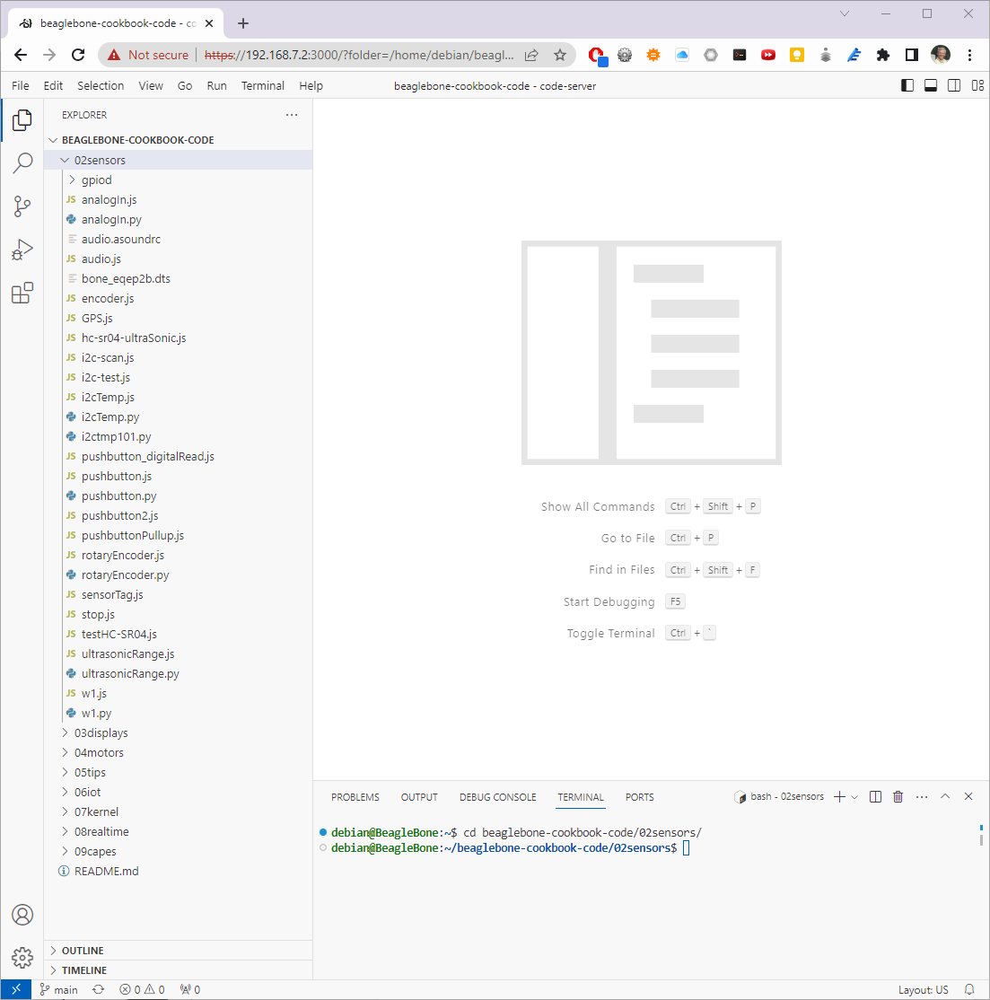

.. _beaglebone-cookbook-sensors:

Sensors
########

.. |kohm| replace:: kΩ
.. |ohm| replace:: Ω
.. |deg| replace:: °

In this chapter, you will learn how to sense the physical world with BeagleBone Black. 
Various types of electronic sensors, such as cameras and microphones, can be connected 
to the Bone using one or more interfaces provided by the standard USB 2.0 host port, 
as shown in :ref:`sensors_host_port`.

.. note::
  
   All the examples in the book assume you have cloned the Cookbook 
   repository on git.beagleboard.org. Go here :ref:`basics_repo` for instructions.

.. _sensors_host_port:

.. figure:: figures/black_hardware_details.*
   :align: center
   :alt: USB Host Port

   The USB 2.0 host port

The two 46-pin cape headers (called *P8* and *P9*) along the long 
edges of the board (:ref:`sensors_P8P9_fig`) provide connections for 
cape add-on boards, digital and analog sensors, and more.

.. _sensors_P8P9_fig:

.. figure:: figures/P8P9_bb.png
   :align: center
   :alt: Cape Headers P8 and P9

   Cape Headers P8 and P9

The simplest kind of sensor provides a single digital status, such as off or on, 
and can be handled by an *input mode* of one of the Bone's 65 general-purpose input/output 
(GPIO) pins. More complex sensors can be connected by using one of the Bone's seven 
analog-to-digital converter (ADC) inputs or several |I2C| buses. 

:ref:`beaglebone-cookbook-displays` discusses some of the *output mode* usages of the GPIO pins.

All these examples assume that you know how to edit a file (:ref:`basics_vsc`) and run 
it, either within the Visual Studio Code (VSC) integrated development environment (IDE) or from 
the command line (:ref:`tips_shell`).

Choosing a Method to Connect Your Sensor
=========================================

Problem
-------

You want to acquire and attach a sensor and need to understand your basic options.

Solution
--------

:ref:`sensors_cape_headers` shows many of the possibilities for connecting a sensor.

.. _sensors_cape_headers:

.. figure:: figures/cape-headers.*
   :align: center
   :alt: Sensor Connection Modes
   
   Some of the many sensor connection options on the Bone

Choosing the simplest solution available enables you to move on quickly to 
addressing other system aspects. By exploring each connection type, you can 
make more informed decisions as you seek to optimize and troubleshoot your design.

.. _sensors_getting_started:

Input and Run a Python or JavaScript Application for Talking to Sensors
=========================================================================

Problem
--------

You have your sensors all wired up and your Bone booted up, and you need to know how to enter and run your code.

Solution
--------

You are just a few simple steps from running any of the recipes in this book.

- Plug your Bone into a host computer via the USB cable (:ref:`basics_out_of_the_box`).
- Start Visual Studio Code (:ref:`basics_vsc`).
- In the *bash* tab (as shown in :ref:`sensors_vsc_bash`), run the following commands:

.. code-block:: bash

  bone$ cd
  bone$ cd beaglebone-cookbook-code/02sensors

.. _sensors_vsc_bash:

   
   Entering commands in the VSC bash tab

Here, we issued the *change directory* (*cd*) command without specifying a target directory. 
By default, it takes you to your home directory. Notice that the prompt has changed to reflect the change. 

.. note:: 

  If you log in as *debian*, your home is */home/debian*. If you were to create a new user 
  called *newuser*, that user's home would be */home/newuser*. By default, all non-root 
  (non-superuser) users have their home directories in */home*.

.. note::

   All the examples in the book assume you have cloned the 
   Cookbook repository on git.beagleboard.org. Go here 
   :ref:`basics_repo` for instructions.

- Double-click the *pushbutton.py* file to open it.
- Press ^S (Ctrl-S) to save the file. (You can also go to the File menu in VSC and select Save to save the file, but Ctrl-S is easier.) Even easier, VSC can be configured to autosave every so many seconds.
- In the *bash* tab, enter the following commands:

.. code-block::

  debian@beaglebone:beaglebone-cookbook/code/02sensors$ ./pushbutton.py
  data= 0
  data= 0
  data= 1
  data= 1
  ^C

This process will work for any script in this book.

.. _sensors_pushbutton:

Reading the Status of a Pushbutton or Magnetic Switch (Passive On/Off Sensor)
==============================================================================

Problem
--------

You want to read a pushbutton, a magnetic switch, or other sensor that is electrically open or closed.

Solution
---------

Connect the switch to a GPIO pin and read from the proper place in */sys/class/gpio*.

To make this recipe, you will need:

* Breadboard and jumper wires.
* Pushbutton switch.
* Magnetic reed switch. (optional)

You can wire up either a pushbutton, a magnetic reed switch, 
or both on the Bone, as shown in :ref:`js_pushbutton_fig`.

.. _js_pushbutton_fig:

.. figure:: figures/pushbutton_bb.png
   :align: center
   :alt: Bone with pushbutton
   
   Diagram for wiring a pushbutton and magnetic reed switch input

The code in :ref:`py_pushbutton_code` 
reads GPIO port *P9_42*, which is attached to the pushbutton. 

.. tabs::
   .. group-tab:: Python

      .. _py_pushbutton_code:

      .. literalinclude:: ../code/02sensors/pushbutton.py
         :caption: Monitoring a pushbutton (pushbutton.py)
         :linenos:

      :download:`pushbutton.py <../code/02sensors/pushbutton.py>`

   .. group-tab:: c

      .. _c_pushbutton_code:

      .. literalinclude:: ../code/02sensors/pushbutton.c
         :caption: Monitoring a pushbutton (pushbutton.c)
         :linenos:

      :download:`pushbutton.c <../code/02sensors/pushbutton.c>`

Put this code in a file called *pushbutton.py* following the steps in :ref:`sensors_getting_started`. 
In the VSC *bash* tab, run it by using the following commands:

.. code-block:: bash

  bone$ ./pushbutton.py
  data = 0
  data = 0
  data = 1
  data = 1
  ^C

The command runs it. Try pushing the button. The code reads the pin and prints its current value.

You will have to press ^C (Ctrl-C) to stop the code.

If you want to run the C version do:

.. code-block:: bash

  bone$ gcc -o pushbutton pushbutton.c -lgpiod
  bone$ ./pushbutton
  data = 0
  data = 0
  data = 1
  data = 1
  ^C

If you want to use the magnetic reed switch wired as shown in 
:ref:`js_pushbutton_fig`, change *P9_42* to *P9_26* which is gpio *14*. 

Mapping Header Numbers to gpio Numbers
=======================================

Problem
--------

You have a sensor attached to the P8 or P9 header and need to know which gpio pin it's using.

Solution
---------

The *gpioinfo* command displays information about all the P8 and P9 header pins. To see the info for just one pin, use *grep*.

.. code-block:: bash

  bone$ gpioinfo | grep -e chip -e P9.42
  gpiochip0 - 32 lines:
	  line   7: "P8_42A [ecappwm0]" "P9_42" input active-high [used]
  gpiochip1 - 32 lines:
  gpiochip2 - 32 lines:
  gpiochip3 - 32 lines:

This shows P9_42  is on  chip 0 and pin 7.  To find the gpio number multiply 
the chip number by 32 and add it to the pin number.  This gives 0*32+7=7.  

For P9_26 you get:

.. code-block:: bash

  bone$ gpioinfo | grep -e chip -e P9.26
  gpiochip0 - 32 lines:
	  line  14: "P9_26 [uart1_rxd]" "P9_26" input active-high [used]
  gpiochip1 - 32 lines:
  gpiochip2 - 32 lines:
  gpiochip3 - 32 lines:

0*32+14=14, so the P9_26 pin is gpio 14.

Reading a Position, Light, or Force Sensor (Variable Resistance Sensor)
========================================================================

Problem
--------

You have a variable resistor, force-sensitive resistor, flex sensor, or any of a 
number of other sensors that output their value as a variable resistance, 
and you want to read their value with the Bone.

Solution
--------

Use the Bone's analog-to-digital converters (ADCs) and a resistor 
divider circuit to detect the resistance in the sensor.

The Bone has seven built-in analog inputs that can easily read a 
resistive value. :ref:`sensors_cape_headers_analog` shows them 
on the lower part of the *P9* header.

.. _sensors_cape_headers_analog:

.. figure:: figures/cape-headers-analog.png
   :align: center
   :alt: Seven analog inputs on the *P9* header
   
   Seven analog inputs on P9 header

To make this recipe, you will need:

- Breadboard and jumper wires.
- 10k trimpot or
- Flex resistor (optional)
- 22 |kohm| resistor

A variable resistor with three terminals
^^^^^^^^^^^^^^^^^^^^^^^^^^^^^^^^^^^^^^^^

:ref:`sensors_analogIn_fig` shows a simple variable resistor (trimpot) 
wired to the Bone. One end terminal is wired to the ADC 1.8 V power supply on pin *P9_32*, 
and the other end terminal is attached to the ADC ground (*P9_34*). The middle terminal 
is wired to one of the seven analog-in ports (*P9_36*).

.. _sensors_analogIn_fig:

.. figure:: figures/analogIn_bb.png
   :align: center
   :alt: Analog

   Wiring a 10 |kohm| variable resistor (trimpot) to an ADC port

:ref:`py_analogIn_code` shows the code used to read the variable resistor.  
Add the code to a file called *analogIn.py* and run it; then change the resistor and run it again. The voltage read will change.

.. tabs::

   .. group-tab:: Python

         .. _py_analogIn_code:

         .. literalinclude:: ../code/02sensors/analogIn.py
            :caption: Reading an analog voltage (analogIn.py)
            :linenos:

         :download:`analogIn.py <../code/02sensors/analogIn.py>`

   .. group-tab:: JavaScript

         .. _sensors_analogIn_code:

         .. literalinclude:: ../code/02sensors/analogIn.js
            :caption: Reading an analog voltage (analogIn.js)
            :linenos:

         :download:`analogIn.js <../code/02sensors/analogIn.js>`

.. note::

  The code in :ref:`sensors_analogIn_code` 
  outputs a value between 0 and 4096.

A variable resistor with two terminals
^^^^^^^^^^^^^^^^^^^^^^^^^^^^^^^^^^^^^^

Some resistive sensors have only two terminals, such as the flex sensor in :ref:`sensors_flexResistor_fig`
The resistance between its two terminals changes when it is flexed.
In this case, we need to add a fixed resistor in series with the flex sensor. :ref:`sensors_flexResistor_fig` 
shows how to wire in a 22 |kohm| resistor to give a voltage to measure
across the flex sensor.

.. _sensors_flexResistor_fig:

.. figure:: figures/flexResistor_bb.png
   :align: center
   :alt: Flex Resistor
   
   Reading a two-terminal flex resistor

The code in :ref:`py_analogIn_code` and 
:ref:`sensors_analogIn_code` also works for this setup.

Reading a Distance Sensor (Analog or Variable Voltage Sensor)
=============================================================

Problem
--------

You want to measure distance with a `LV-MaxSonar-EZ1 Sonar Range Finder <https://www.sparkfun.com/products/11309>`_, 
which outputs a voltage in proportion to the distance.

Solution
--------

To make this recipe, you will need:

* Breadboard and jumper wires.
* LV-MaxSonar-EZ1 Sonar Range Finder

All you have to do is wire the EZ1 to one of the Bone's *analog-in* pins, 
as shown in :ref:`sensors_ultrasonic_fig`. The device outputs ~6.4 mV/in when powered from 3.3 V.

.. WARNING::

   Make sure not to apply more than 1.8 V to the Bone's *analog-in* 
   pins, or you will likely damage them. In practice, this circuit should follow that rule.

.. _sensors_ultrasonic_fig:

.. figure:: figures/ultrasonicRange_bb.png
   :align: center
   :alt: Analog

   Wiring the LV-MaxSonar-EZ1 Sonar Range Finder to the *P9_33* analog-in port

:ref:`py_ultrasonicRange_code` 
shows the code that reads the sensor at a fixed interval.

.. tabs::

   .. group-tab:: Python

      .. _py_ultrasonicRange_code:

      .. literalinclude:: ../code/02sensors/ultrasonicRange.py
         :caption: Reading an analog voltage (ultrasonicRange.py)
         :linenos:

      :download:`ultrasonicRange.py <../code/02sensors/ultrasonicRange.py>`

   .. group-tab:: JavaScript

      .. _sensors_ultrasonicRange_code:

      .. literalinclude:: ../code/02sensors/ultrasonicRange.js
         :caption: Reading an analog voltage (ultrasonicRange.js)
         :linenos:

      :download:`ultrasonicRange.js <../code/02sensors/ultrasonicRange.js>`

.. _sensors_hc-sr04:

Reading a Distance Sensor (Variable Pulse Width Sensor)
========================================================

Problem
--------

You want to use a HC-SR04 Ultrasonic Range Sensor with BeagleBone Black.

Solution
---------

The HC-SR04 Ultrasonic Range Sensor (shown in :ref:`sensors_hc_sr04_image_fig`) 
works by sending a trigger pulse to the *Trigger* input and then measuring the 
pulse width on the *Echo* output. The width of the pulse tells you the distance.

.. _sensors_hc_sr04_image_fig:

.. figure:: figures/hc-sr04.jpg
   :align: center
   :alt: HC-SR04 Ultrasonic Sensor

   HC-SR04 Ultrasonic range sensor

To make this recipe, you will need:

* Breadboard and jumper wires.
* 10 |kohm| and 20 |kohm| resistors
* HC-SR04 Ultrsonic Range Sensor.

Wire the sensor as shown in :ref:`sensors_hc-sr04_fig`. 
Note that the HC-SR04 is a 5 V device, so the *banded* wire (running from 
*P9_7* on the Bone to VCC on the range finder) attaches the 
HC-SR04 to the Bone's 5 V power supply. 

.. _sensors_hc-sr04_fig:

.. figure:: figures/hc-sr04-ultraSonic_bb.png
   :align: center
   :alt: Wiring an HC-SR04 Ultrasonic Sensor

   Wiring an HC-SR04 Ultrasonic Sensor

:ref:`sensors_hc-sr04_code` shows BoneScript code used to drive the HC-SR04.  

.. _sensors_hc-sr04_code:

.. literalinclude:: ../code/02sensors/hc-sr04-ultraSonic.js
   :caption: Driving a HC-SR04 ultrasound sensor (hc-sr04-ultraSonic.js)
   :linenos:

:download:`hc-sr04-ultraSonic.js <../code/02sensors/hc-sr04-ultraSonic.js>`

This code is more complex than others in this chapter, 
because we have to tell the device when to start 
measuring and time the return pulse.

Accurately Reading the Position of a Motor or Dial
===================================================

Problem
--------

You have a motor or dial and want to detect rotation using a rotary encoder.

Solution
---------

Use a rotary encoder (also called a *quadrature encoder*) connected to one of 
the Bone's eQEP ports, as shown in :ref:`digital_rotaryEncoder_fig`.

.. _digital_rotaryEncoder_fig:

.. figure:: figures/rotaryEncoder_bb.png
   :align: center
   :alt: Wiring a rotary encoder using eQEP2

   Wiring a rotary encoder using eQEP2

.. table:: On the BeagleBone and PocketBeage the three encoders are:

  +-------------+------------------------------------+
  | eQEP0       | P9.27 and P9.42 OR P1_33 and P2_34 |
  +-------------+------------------------------------+
  |eQEP         | P9.33 and P9.35                    |
  +-------------+------------------------------------+
  |eQEP2        | P8.11 and P8.12 OR P2_24 and P2_33 |
  +-------------+------------------------------------+

.. table:: On the AI it's:

  +-------------+------------------------------------+
  |eQEP1        | P8.33 and P8.35                    |
  +-------------+------------------------------------+
  |eQEP2        | P8.11 and P8.12 or P9.19 and P9.41 |
  +-------------+------------------------------------+
  |eQEP3        | P8.24 and P8.25 or P9.27 and P9.42 |
  +-------------+------------------------------------+

To make this recipe, you will need:

* Breadboard and jumper wires.
* Rotary encoder.

We are using a quadrature rotary encoder, which has two switches inside 
that open and close in such a manner that you can tell which way the shaft 
is turning. In this particular encoder, the two switches have a common lead, 
which is wired to ground. It also has a pushbutton switch wired to the other 
side of the device, which we aren't using. 

Wire the encoder to *P8_11* and *P8_12*, as shown in :ref:`digital_rotaryEncoder_fig`.

BeagleBone Black has built-in hardware for reading up to three encoders.  
Here, we'll use the *eQEP2* encoder via the Linux *count* subsystem.

Then run the following commands:

.. code-block:: bash

   bone$ config-pin P8_11 qep
   bone$ config-pin P8_12 qep
   bone$ show-pins | grep qep
   P8.12        12 fast rx  up  4 qep 2 in A    ocp/P8_12_pinmux (pinmux_P8_12_qep_pin)
   P8.11        13 fast rx  up  4 qep 2 in B    ocp/P8_11_pinmux (pinmux_P8_11_qep_pin)

This will enable *eQEP2* on pins *P8_11* and *P8_12*. 
The *2* after the *qep* returned by *show-pins* shows it's *eQEP2*.  

Finally, add the code in :ref:`digital_rotaryEncoder_py` 
to a file named *rotaryEncoder.py* and run it.

.. tabs::

   .. group-tab:: Python

      .. _digital_rotaryEncoder_py:

      .. literalinclude:: ../code/02sensors/rotaryEncoder.py
         :caption: Reading a rotary encoder (rotaryEncoder.py)
         :linenos:

      :download:`rotaryEncoder.py <../code/02sensors/rotaryEncoder.py>`

   .. group-tab:: JavaScript

      .. _digital_rotaryEncoder_js:

      .. literalinclude:: ../code/02sensors/rotaryEncoder.js
         :caption: Reading a rotary encoder (rotaryEncoder.js)
         :linenos:

      :download:`rotaryEncoder.js <../code/02sensors/rotaryEncoder.js>`

Try rotating the encoder clockwise and counter-clockwise. 
You'll see an output like this:

.. code-block:: bash

   data = 32
   data = 40
   data = 44
   data = 48
   data = 39
   data = 22
   data = 0
   data = 999989
   data = 999973
   data = 999972
   ^C

The values you get for *data* will depend on which way you are 
turning the device and how quickly. You will need to press ^C (Ctrl-C) to end.

See Also
---------

You can also measure rotation by using a variable resistor (see :ref:`sensors_analogIn_fig`).

.. _sensors_GPS:

Acquiring Data by Using a Smart Sensor over a Serial Connection
================================================================

Problem
--------

You want to connect a smart sensor that uses a built-in microcontroller to stream data, 
such as a global positioning system (GPS), to the Bone and read the data from it.

Solution
--------

The Bone has several serial ports (UARTs) that you can use to read data from an external 
microcontroller included in smart sensors, such as a GPS. Just wire one up, and you'll 
soon be gathering useful data, such as your own location.

Here's what you'll need:

* Breadboard and jumper wires.
* GPS receiver

Wire your GPS, as shown in :ref:`digital_GPS_fig`.

.. _digital_GPS_fig:

.. figure:: figures/GPS_bb.png
   :align: center
   :alt: Wiring a GPS to UART 4

   Wiring a GPS to UART 4

The GPS will produce raw National Marine Electronics Association (NMEA) 
data that's easy for a computer to read, but not for a human. 
There are many utilities to help convert such sensor data into a 
human-readable form. For this GPS, run the following command to load a NMEA parser:

.. code-block:: bash

   bone$ npm install -g nmea

Running the code in :ref:`digital_GPS_code` 
will print the current location every time the GPS outputs it.

.. _digital_GPS_code:

.. literalinclude:: ../code/02sensors/GPS.js
   :caption: Talking to a GPS with UART 4 (GPS.js)
   :linenos:

:download:`GPS.js <../code/02sensors/GPS.js>`

If you don't need the NMEA formatting, you can skip the *npm* part and remove the lines in the code that refer to it.

.. note:: 
  If you get an error like this
  *TypeError: Cannot call method 'readline' of undefined*

   add this line to the end of file ``/usr/local/lib/node_modules/bonescript/serial.js``:

   *exports.serialParsers = m.module.parsers;*

.. _cape-headers-serial_fig:

.. figure:: figures/cape-headers-serial.png
   :align: center
   :alt: UART outputs

   Table of UART outputs

.. _sensors_i2c_temp:

Measuring a Temperature
=======================

Problem
-------

You want to measure a temperature using a digital temperature sensor.

Solution
---------

The TMP101 sensor is a common digital temperature 
sensor that uses a standard |I2C|-based serial protocol.

.. |I2C| replace:: I\ :sup:`2`\ C

To make this recipe, you will need:

* Breadboard and jumper wires.
* Two 4.7 |kohm| resistors.
* TMP101 temperature sensor.

Wire the TMP101, as shown in :ref:`sensors_i2cTemp_fig`.

.. _sensors_i2cTemp_fig:

.. figure:: figures/i2cTemp_bb.png
   :align: center
   :alt: |I2C| Temp

   Wiring an |I2C| TMP101 temperature sensor

There are two |I2C| buses brought out to the headers. 
:ref:`sensors_cape_headers_i2c` 
shows that you have wired your device to |I2C| bus *2*.

.. _sensors_cape_headers_i2c:

.. figure:: figures/cape-headers-i2c.png
   :align: center
   :alt: Table of |I2C| outputs

   Table of |I2C| outputs

Once the |I2C| device is wired up, you can use a couple handy |I2C| 
tools to test the device. Because these are Linux command-line tools, 
you have to use *2* as the bus number. *i2cdetect*, shown in :ref:`js_i2cTools`, 
shows which |I2C|  devices are on the bus. The *-r* flag indicates which bus to use. 
Our TMP101 is appearing at address *0x49*. You can use the *i2cget* command to read 
the value. It returns the temperature in hexadecimal and degrees C. 
In this example, 0x18 = 24{deg}C, which is 75.2{deg}F. (Hmmm, the office is a bit warm today.) 
Try warming up the TMP101 with your finger and running *i2cget* again.

.. todo
   fix deg

.. _js_i2cTools:

|I2C| tools
============

.. code-block:: bash

  bone$ i2cdetect -y -r 2
    0  1  2  3  4  5  6  7  8  9  a  b  c  d  e  f
    00:          -- -- -- -- -- -- -- -- -- -- -- -- -- 
    10: -- -- -- -- -- -- -- -- -- -- -- -- -- -- -- -- 
    20: -- -- -- -- -- -- -- -- -- -- -- -- -- -- -- -- 
    30: -- -- -- -- -- -- -- -- -- -- -- -- -- -- -- -- 
    40: -- -- -- -- -- -- -- -- -- 49 -- -- -- -- -- -- 
    50: -- -- -- -- UU UU UU UU -- -- -- -- -- -- -- -- 
    60: -- -- -- -- -- -- -- -- -- -- -- -- -- -- -- -- 
    70: -- -- -- -- -- -- -- --

  bone$ i2cget -y 2 0x49
    0x18

Reading the temperature via the kernel driver
==============================================

The cleanest way to read the temperature from at TMP101 sensor is to use the kernel drive.

Assuming the TMP101 is on bus 2 (the last digit is the bus number)

.. _js_i2cKernel:

|I2C| TMP101 via Kernel

.. code-block:: bash

  bone$ cd /sys/class/i2c-adapter/
  bone$ ls
  i2c-0  i2c-1  i2c-2			# Three i2c buses (bus 0 is internal)
  bone$ cd i2c-2	# Pick bus 2
  bone$ ls -ls
  0 --w--w---- 1 root gpio 4096 Jul  1 09:24 delete_device
  0 lrwxrwxrwx 1 root gpio    0 Jun 30 16:25 device -> ../../4819c000.i2c
  0 drwxrwxr-x 3 root gpio    0 Dec 31  1999 i2c-dev
  0 -r--r--r-- 1 root gpio 4096 Dec 31  1999 name
  0 --w--w---- 1 root gpio 4096 Jul  1 09:24 new_device
  0 lrwxrwxrwx 1 root gpio    0 Jun 30 16:25 of_node -> ../../../../../../../../firmware/devicetree/base/ocp/interconnect@48000000/segment@100000/target-module@9c000/i2c@0
  0 drwxrwxr-x 2 root gpio    0 Dec 31  1999 power
  0 lrwxrwxrwx 1 root gpio    0 Jun 30 16:25 subsystem -> ../../../../../../../../bus/i2c
  0 -rw-rw-r-- 1 root gpio 4096 Dec 31  1999 uevent

Assuming the TMP101 is at address 0x49

.. code-block:: bash

  bone$ echo tmp101 0x49 > new_device

This tells the kernel you have a TMP101 sensor at address 0x49. Check the log to be sure.

.. code-block:: bash

  bone$ dmesg -H | tail -3
  [ +13.571823] i2c i2c-2: new_device: Instantiated device tmp101 at 0x49
  [  +0.043362] lm75 2-0049: supply vs not found, using dummy regulator
  [  +0.009976] lm75 2-0049: hwmon0: sensor 'tmp101'

Yes, it's there, now see what happened.

.. code-block:: bash

  bone$ ls
  2-0049  delete_device  device  i2c-dev  name new_device  of_node  power  subsystem  uevent

Notice a new directory has appeared. It's for i2c bus 2, address 0x49. Look into it.

.. code-block:: bash

  bone$ cd 2-0049/hwmon/hwmon0
  bone$ ls -F
  device@  name  power/  subsystem@  temp1_input  temp1_max temp1_max_hyst  uevent  update_interval
  bone$ cat temp1_input
  24250

There is the temperature in milli-degrees C.

Other i2c devices are supported by the kernel.
You can try the Linux Kernel Driver Database, 
https://cateee.net/lkddb/ to see them.

Once the driver is in place, you can read it via code. 
:ref:`py_i2cTemp_code` shows how to read the TMP101.

.. _py_i2cTemp_code:

.. literalinclude:: ../code/02sensors/i2cTemp.py
   :caption: Reading an |I2C|  device (i2cTemp.py)
   :linenos:

:download:`i2cTemp.py <../code/02sensors/i2cTemp.py>`

.. _js_i2cTemp_code:

.. literalinclude:: ../code/02sensors/i2cTemp.js
   :caption: Reading an |I2C|  device (i2cTemp.js)
   :linenos:

:download:`i2cTemp.js <../code/02sensors/i2cTemp.js>`

Run the code by using the following command:

.. code-block:: bash

  bone$ ./i2cTemp.js
  data (C) = 25.625
  data (C) = 27.312
  data (C) = 28.187
  data (C) = 28.375
  ^C

Notice using the  kernel interface gets you more digits of accuracy.

Reading i2c device directly
===========================

The TMP102 sensor can be read directly with i2c commands rather than 
using the kernel driver.  First you need to install the i2c module.

.. code-block:: bash

  bone$ pip install smbus

.. _js_i2ctmp101_code:

.. literalinclude:: ../code/02sensors/i2ctmp101.py
   :caption: Reading an |I2C|  device (i2cTemp.py)
   :linenos:

:download:`i2ctmp101.py <../code/02sensors/i2ctmp101.py>`

This gets only 8 bits for the temperature. See the TMP101 datasheet 
(https://www.ti.com/product/TMP101)
for details on how  to get up to 12 bits.

Reading Temperature via a Dallas 1-Wire Device
===============================================

Problem
--------

You want to measure a temperature using a Dallas Semiconductor DS18B20 temperature sensor.

Solution
---------

.. I need to double-check how we provide attribution for recipes, but we'll need to have 
.. something more than "From" followed by a link. For now, we should at least do 
.. something like what I've changed it to. --BS

.. --may A bigger question is, when do we need attribution?  
.. I pull bits and pieces from everywhere and try to keep good records of sources.

The DS18B20 is an interesting temperature sensor that uses Dallas 
Semiconductor's 1-wire interface. The data communication requires only 
one wire! (However, you still need wires from ground and 3.3 V.) 
You can wire it to any GPIO port.

To make this recipe, you will need:

* Breadboard and jumper wires.
* 4.7 |kohm| resistor
* DS18B20 1-wire temperature sensor.

Wire up as shown in :ref:`sensors_1-wire_fig`.

.. _sensors_1-wire_fig:

.. figure:: figures/onewire_bb.png
   :align: center
   :alt: 1-wire

   Wiring a Dallas 1-Wire temperature sensor 

.. hide
   The bit.ly doesn't work.
  .. note:: 
  This solution, written by Elias Bakken (@AgentBrum), 
  originally appeared on`Hipstercircuits <http://bit.ly/1FaRbbK>`_.

Edit the file */boot/uEnt.txt*. 
Go to about line 19 and edit as shown:

.. code-block:: bash

  17 ###
  18 ###Additional custom capes
  19 uboot_overlay_addr4=BB-W1-P9.12-00A0.dtbo
  20 #uboot_overlay_addr5=<file5>.dtbo

Be sure to remove the *#* at the beginning of the line.

Reboot the bone:

.. code-block:: bash

  bone$ reboot

Now run the following command to discover the serial number on your device:

.. code-block:: bash

  bone$ ls /sys/bus/w1/devices/
  28-00000114ef1b  28-00000128197d  w1_bus_master1

I have two devices wired in parallel on the same P9_12 input. 
This shows the serial numbers for all the devices. 

Finally, add the code in :ref:`py_onewire__code` in to a 
file named *w1.py*, edit the path assigned to *w1* so 
that the path points to your device, and then run it.

.. _py_onewire__code:

.. literalinclude:: ../code/02sensors/w1.py
   :caption: Reading a temperature with a DS18B20 (w1.py)
   :linenos:

:download:`w1.py <../code/02sensors/w1.py>`

.. _sensors_onewire__code:

.. literalinclude:: ../code/02sensors/w1.js
   :caption: Reading a temperature with a DS18B20 (w1.js)
   :linenos:

:download:`w1.js <../code/02sensors/w1.js>`

.. code-block:: bash

   bone$ ./w1.js
   temp (C) = 28.625
   temp (C) = 29.625
   temp (C) = 30.5
   temp (C) = 31.0
   ^C

Each temperature sensor has a unique serial number, so you can have several all sharing the same data line.

.. // .. _sensors_sensortag:

.. // Sensing All Sorts of Things with SensorTag via Bluetooth v4.0
.. ----------------------------------------------------
.. // //  TODO Remove
.. // Problem
.. **********
.. // ((("sensors", "Bluetooth 4.0 interface for")))((("Bluetooth Low Energy (BLE)")))((("TI SensorTag")))((("SensorTag")))((("environmental sensors", "TI SensorTag")))((("temperature sensors", "Sensor Tag")))((("humidity sensor")))((("accelerometers")))((("pressure sensors")))((("magnetometers")))((("gyroscopes")))((("motion sensors")))You have a TI SensorTag, and you want to interface it to BeagleBone Black via Bluetooth Low Energy (BLE).

.. // Solution
.. **********
.. // TI's http://bit.ly/1C58WIN[SensorTag] (shown in <<sensors_sensortag_fig>>) combines six sensors (temperature, humidity, accelerometer, pressure, magnetometer, and gyroscope) in one package that interfaces via http://bit.ly/1EzMo4x[Bluetooth Low Energy]. 

.. // .. _sensors_sensortag_fig:

.. // .SensorTag
.. // .. figure:: figures/sensorTag.jpg[SensorTag]

.. // To make this recipe, you will need:

.. // * BLE USB dongle
.. // * SensorTag
.. // * 5 V adapter for the Bone

.. // Power up your Bone using the 5 V adapter. You need the adapter because the BLE dongle needs extra power for the radios it contains. After it is booted up, log in (:ref:`shell tips <tips_shell>`) and run the following commands:

.. // ++++
.. // <pre data-type="programlisting">
.. // bone$ sudo apt install libbluetooth-dev
.. // bone$ npm install -g sensortag
.. // </pre>
.. // ++++

.. // This installs the Bluetooth tools and the JavaScript library to talk to it.

.. // Add the code in <<sensors_sensorTag_code>> to a file called _sensorTag.js_ and run it.

.. // .. _sensors_sensorTag_code:

.. // .Code for reading the temperature from a SensorTag (sensorTag.js)
.. // ====
.. // [source, js]
.. // ----

.. // include::../code/02sensors/sensorTag.js[sensorTag.js]

.. // ----
.. // ====
.. // <1> Read in the various packages that are needed.

.. // <2> *SensorTag.discover* checks what SensorTags are out there. When found, it calls the inline function that follows.

.. // <3> pass:[This] function is called when the SensorTag is disconnected.

.. // <4> Normally JavaScript does everything synchronously. Here, we want to do the following asynchronously--that is, step-by-step, one after the other. We are passing an array to *async.series()*, which contains the functions to run in the order in which they appear in the array.

.. // <5> Connect to the SensorTag.  

.. // <6> Discover what the SensorTag can do. This is necessary before we can give it any commands.

.. // <7> Enable temperatures. We don't get a temperature reading yet. Rather, we're instructing it to begin reading and report back when they are ready.

.. // <8> Wait a bit for the first temperatures to be read.

.. // <9> This specifies the function to call every time a temperature is ready. The callback is passed *objectTemperature* (what's read by the touchless IR sensors) and *ambientTemperature* (the temperature inside the SensorTag). Try putting your hand in front of the device; the *objectTemperature* should go up.

.. // <10> Define the callback for when the temperature changes.

.. // <11> This commented-out code is used when you want to turn off the temperature readings.

.. // <12> Assign a callback to respond to the *left* and *right* button pushes. 

.. // <13> If both buttons are pushed, pass the *callback* function to *sensorTag.notifySimpleKey()*.

.. // <14> *sensorTag.notifySimpleKey()* doesn't do anything in this case, but it does evaluate *callback*, allowing it to progress to the next and final state.

.. // <15> When we get to here, we disconnect from the SensorTag, which causes the code to exit (see pass:[]).

.. // [role="pagebreak-before"]
.. // Here's some output from the code:

.. // [source, console]
.. // ----
.. // Be sure sensorTag is on
.. // sensorTag = {"uuid":"9059af0b8457"}
.. // connect
.. // discoverServicesAndCharacteristics
.. // enableIrTemperature
.. // readIrTemperature
.. //     object  temperature = 2.8 °C
.. // 	ambient temperature = 0 °C
.. // readSimpleRead
.. // notifyIrTemperature
.. // 	object  temperature = 31.8 °C
.. // 	ambient temperature = 24.8 °C

.. // 	object  temperature = 25.9 °C
.. // 	ambient temperature = 24.8 °C

.. // 	object  temperature = 27.4 °C
.. // 	ambient temperature = 24.8 °C

.. // 	object  temperature = 32.2 °C
.. // 	ambient temperature = 24.8 °C

.. // left: false right: true
.. // left: true right: true
.. // left: false right: false
.. // disconnect
.. // disconnected!
.. // ----

.. // Discussion
.. **********

.. // Here, you see examples of how to read all the sensors. Look in _index.js_ (in the same directory) to see all the methods that are defined.

.. _sensors_audio:

Playing and Recording Audio
============================

.. TODO
  Remove?

Problem
--------

BeagleBone doesn't have audio built in, but you want to play and record files.

Solution
--------

One approach is to buy an audio cape, but another, possibly cheaper approach is to buy a USB audio adapter, 
such as the one shown in :ref:`usb_audio_dongle`.

.. _usb_audio_dongle:

.. figure:: figures/audioDongle.jpg
  :align: center
  :alt: Audio Dongle
  
  A USB audio dongle

Drivers for the `Advanced Linux Sound Architecture <http://bit.ly/1MrAJUR>`_ (ALSA) 
are already installed on the Bone. You can list the recording and playing devices on 
your Bone by using *aplay* and *arecord*, as shown in :ref:`sensors_alsa`. BeagleBone Black 
has audio-out on the HDMI interface. It's listed as *card 0* in 
:ref:`sensors_alsa`. *card 1* is my USB audio adapter's audio out.

.. _sensors_alsa:

Listing the ALSA audio output and input devices on the Bone
============================================================

.. code-block:: bash

  bone$ aplay -l
  **** List of PLAYBACK Hardware Devices ****
  card 0: Black [TI BeagleBone Black], device 0: HDMI nxp-hdmi-hifi-0 []
    Subdevices: 1/1
    Subdevice #0: subdevice #0
  card 1: Device [C-Media USB Audio Device], device 0: USB Audio [USB Audio]
    Subdevices: 1/1
    Subdevice #0: subdevice #0

  bone$ arecord -l
  **** List of CAPTURE Hardware Devices ****
  card 1: Device [C-Media USB Audio Device], device 0: USB Audio [USB Audio]
    Subdevices: 1/1
    Subdevice #0: subdevice #0

In the *aplay* output shown in :ref:`sensors_alsa`, you can see the 
USB adapter's audio out. By default, the Bone will send audio to the HDMI. You 
can change that default by creating a file in your home directory called 
*~/.asoundrc* and adding the code in :ref:`sensors_asoundrc` to it.

.. _sensors_asoundrc:

.. literalinclude:: ../code/02sensors/audio.asoundrc
   :caption: Change the default audio out by putting this in ~/.asoundrc (audio.asoundrc)
   :linenos:

:download:`audio.asoundrc <../code/02sensors/audio.asoundrc>`

You can easily play ``.wav`` files with *aplay*:

.. code-block:: bash

  bone$ aplay test.wav

You can play other files in other formats by installing *mplayer*:

.. code-block:: bash

  bone$ sudo apt update
  bone$ sudo apt install mplayer
  bone$ mplayer test.mp3

Discussion
-----------

Adding the simple USB audio adapter opens up a world of audio I/O on the Bone.
