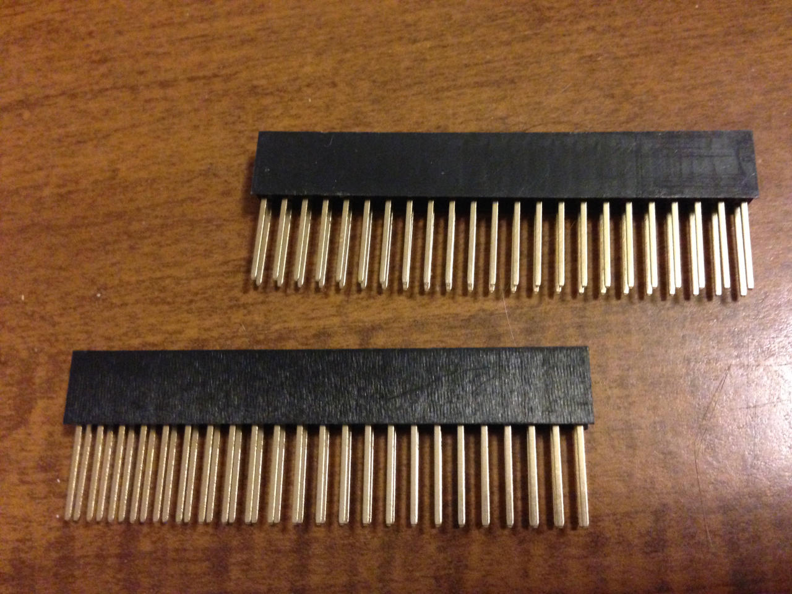
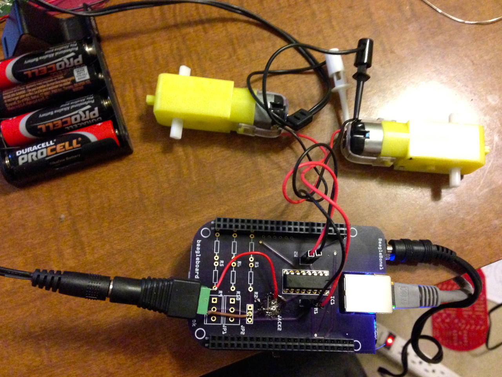

.. _beaglebone-cookbook-capes:

Capes
#####

Previous chapters of this book show a variety of ways to interface BeagleBone Black 
to the physical world by using a breadboard and wiring to the +P8+ and +P9+ headers. 
This is a great approach because it's easy to modify your circuit to debug it or try 
new things. At some point, though, you might want a more permanent solution, either 
because you need to move the Bone and you don't want wires coming loose, or because 
you want to share your hardware with the masses. 

You can easily expand the functionality of the Bone by adding a  `cape <http://bit.ly/1wucweC>`_. 
A cape is simply a board--often a printed circuit board (PCB) that connects to the +P8+ 
and +P9+ headers and follows a few standard pin usages. You can stack up to four capes onto the 
Bone. Capes can range in size from Bone-sized (:ref:`capes_miniDisplay`) to much larger than the Bone (:ref:`capes_7inLCD`).

This chapter shows how to attach a couple of capes, move your design to a protoboard, then to a PCB, 
and finally on to mass production.

..
  #TODO# LCD7 is no longer available. Example needs to be redone with a board that is available. Removing due to broken links
  .. _capes_7inLCD:

  Using a Seven-Inch LCD Cape
  ============================

  Problem
  --------

  You want to display the Bone's desktop on a portable LCD.

  Solution
  --------

  .. note:: #TODO# The 4D Systems LCD capes would make a better example. CircuitCo is out of business.

  A number of `LCD capes <http://bit.ly/1AjlXJ9>`_ are built for the Bone, ranging in size from three 
  to seven inches. This recipe attaches a seven-inch `BeagleBone LCD7 <http://bit.ly/1NK8Hra>`_ 
  from `CircuitCo <http://circuitco.com/>`_ (shown in :ref:`capes_7inLCD_fig`) to the Bone.

  .. _capes_7inLCD_fig:

  7" LCD
  ========

  .. note:: 
      Seven-inch LCD from CircuitCo, :ref:`capes_7inLCD_fig` was originally posted by CircuitCo 
      at http://elinux.org/File:BeagleBone-LCD7-Front.jpg under a 
      `Creative Commons Attribution-ShareAlike 3.0 Unported License <http://creativecommons.org/licenses/by-sa/3.0/>`_.

  .. figure:: figures/LCD.png
      :align: center
      :alt: 7 inch LCD

  To make this recipe, you will need:

  * Seven-inch LCD cape
  * A 5 V power supply

  Just attach the Bone to the back of the LCD, making sure pin 1 of *P9* lines up with 
  pin 1 of +P9+ on the LCD. Apply a 5 V power supply, and the desktop will appear on 
  your LCD, as shown in :ref:`capes_LCD7Desktop`. 

  .. _capes_LCD7Desktop:

  .. figure:: figures/LCD7Desktop.png
      :align: center
      :alt: 7 inch LCD desktop

      Seven-inch LCD desktop

  Attach a USB keyboard and mouse, and you have a portable Bone. 
  `Wireless keyboard and mouse combinations <https://www.adafruit.com/products/922>`_ 
  make a nice solution to avoid the need to add a USB hub.

  #TODO# miniDisplay Cape is no longer available. Example needs to be redone with a board that is available. Removing due to broken links

  .. _capes_miniDisplay:

  Using a 128 x 128-Pixel LCD Cape
  =================================

  Problem
  --------

  You want to use a small LCD to display things other than the desktop.

  Solution
  ---------

  The `MiniDisplay <http://bit.ly/1xd0r8p>`_ is a 128 x 128 full-color LCD cape that just fits on the 
  Bone, as shown in :ref:`capes_miniDisplay_fig`. 

  .. _capes_miniDisplay_fig:

  .. figure:: figures/MiniDisplay-A1.jpg
      :align: center
      :alt: miniDisplay LCD

      MiniDisplay 128 x 128-pixel LCD from CircuitCo

  To make this recipe, you will need:

  * MiniDisplay LCD cape

  Attach to the Bone and apply power. Then run the following commands:

  .. code-block:: bash

      # From http://elinux.org/CircuitCo:MiniDisplay_Cape
      # Datasheet:
      # https://www.crystalfontz.com/products/document/3277/ST7735_V2.1_20100505.pdf
      bone$ wget http://elinux.org/images/e/e4/Minidisplay-example.tar.gz
      bone$ tar zmxvf Minidisplay-example.tar.gz
      bone$ cd minidisplay-example
      bone$ make
      bone$ ./minidisplay-test
      Unable to initialize SPI: No such file or directory
      Aborted

  .. warning:: 
      You might get a compiler warning, but the code should run fine.

  The MiniDisplay uses the Serial Peripheral Interface (SPI) interface, and it's not initialized. 
  The `manufacturer's website <http://bit.ly/1xd0r8p>`_ suggests enabling SPI0 by using the following commands:

  .. code-block:: shell-session

      bone$ export SLOTS=/sys/devices/bone_capemgr.*/slots
      bone$ echo BB-SPIDEV0 > $SLOTS

  Hmmm, something isn't working here. Here's how to see what happened:

  .. callout::

    .. code-block:: shell-session
    
        bone$ dmesg | tail
        [  625.334497] bone_capemgr.9: part_number 'BB-SPIDEV0', version 'N/A'
        [  625.334673] bone_capemgr.9: slot #11: generic override
        [  625.334720] bone_capemgr.9: bone: Using override eeprom data at slot 11
        [  625.334769] bone_capemgr.9: slot #11: 'Override Board Name,00A0,Override \
                    Manuf,BB-SPIDEV0'
        [  625.335026] bone_capemgr.9: slot #11: \Requesting part number/version based \
                    'BB-SPIDEV0-00A0.dtbo
        [  625.335076] bone_capemgr.9: slot #11: Requesting firmware \
                    'BB-SPIDEV0-00A0.dtbo' \
                    for board-name 'Override Board Name', version '00A0'
        [  625.335144] bone_capemgr.9: slot #11: dtbo 'BB-SPIDEV0-00A0.dtbo' loaded; \
                    converting to live tree
        [  625.341842] bone_capemgr.9: slot #11: BB-SPIDEV0 conflict P9.21 \
                    (#10:bspwm_P9_21_b) # <1>
        [  625.351296] bone_capemgr.9: slot #11: Failed verification

    .. annotations::

        <1> Shows there is a conflict for pin `P9_21`: it's already configured for pulse width modulation (PWM).

  Here's how to see what's already configured:

  .. callout::

    .. code-block:: shell-session

        bone$ cat $SLOTS
        0: 54:PF--- 
        1: 55:PF--- 
        2: 56:PF--- 
        3: 57:PF--- 
        4: ff:P-O-L Bone-LT-eMMC-2G,00A0,Texas Instrument,BB-BONE-EMMC-2G
        5: ff:P-O-L Bone-Black-HDMI,00A0,Texas Instrument,BB-BONELT-HDMI
        7: ff:P-O-L Override Board Name,00A0,Override Manuf,bspm_P9_42_27
        8: ff:P-O-L Override Board Name,00A0,Override Manuf,bspm_P9_41_27
        9: ff:P-O-L Override Board Name,00A0,Override Manuf,am33xx_pwm
        10: ff:P-O-L Override Board Name,00A0,Override Manuf,bspwm_P9_21_b # <1>

    .. annotations::

        <1> You can see the eMMC, HDMI, and three PWMs are already using some of the pins. Slot 10 shows `P9_21` is in use by a PWM.

  You can unconfigure it by using the following commands:

  .. code-block:: bash

      bone$ echo -10 > $SLOTS
      bone$ cat $SLOTS
      0: 54:PF--- 
      1: 55:PF--- 
      2: 56:PF--- 
      3: 57:PF--- 
      4: ff:P-O-L Bone-LT-eMMC-2G,00A0,Texas Instrument,BB-BONE-EMMC-2G
      5: ff:P-O-L Bone-Black-HDMI,00A0,Texas Instrument,BB-BONELT-HDMI
      7: ff:P-O-L Override Board Name,00A0,Override Manuf,bspm_P9_42_27
      8: ff:P-O-L Override Board Name,00A0,Override Manuf,bspm_P9_41_27
      9: ff:P-O-L Override Board Name,00A0,Override Manuf,am33xx_pwm

  Now *P9_21* is free for the MiniDisplay to use.

  .. note:: 
      In future Bone images, all of the pins will already be allocated as part of the main device 
      tree using runtime pinmux helpers and configured at runtime using the `config-pin utility <http://bit.ly/1EXLeP2>`_. 
      This would eliminate the need for device tree overlays in most cases.

  Now, configure it for the MiniDisplay and run a test:

  .. code-block:: bash

      bone$ echo BB-SPIDEV0 > $SLOTS
      bone$ ./minidisplay-test

  You then see Boris, as shown in :ref:`capes_miniDisplayBoris`.

  .. _capes_miniDisplayBoris:

  Mini display Boris
  ==================

  .. note:: 
      MiniDisplay showing Boris, :ref:`capes_miniDisplayBoris` was originally posted by David Anders at http://elinux.org/File:Minidisplay-boris.jpg 
      under a `Creative Commons Attribution-ShareAlike 3.0 Unported License <http://creativecommons.org/licenses/by-sa/3.0/>`_.

  .. figure:: figures/miniDisplay_Boris.png
      :align: center
      :alt: miniDisplay LCD showing Boris

Connecting Multiple Capes
==========================

Problem
--------

You want to use more than one cape at a time.

Solution
---------

First, look at each cape that you want to stack mechanically. Are they all using stacking
headers like the ones shown in :ref:`capes_stacking_headers`? No more than one should be using non-stacking headers.

.. _capes_stacking_headers:

    Stacking headers

Note that larger LCD panels might provide expansion headers, such as the ones
shown in :ref:`capes_lcd_backside`, rather than the stacking headers, and that those can also be used for adding
additional capes.

.. _capes_lcd_backside:

LCD Backside
=============

.. note:: 
    Back side of LCD7 cape, :ref:`capes_lcd_backside` was originally posted by CircuitCo at http://elinux.org/File:BeagleBone-LCD-Backside.jpg under 
    a `Creative Commons Attribution-ShareAlike 3.0 Unported License <http://creativecommons.org/licenses/by-sa/3.0/>`_.

.. note:: #TODO# One of the 4D Systems LCD capes would make a better example for an LCD cape. The CircuitCo cape is no longer available.

.. figure:: figures/LCD7back.png
    :align: center
    :alt: 

Next, take a note of each pin utilized by each cape. The `BeagleBone Capes catalog <http://beaglebonecapes.com>`_ 
provides a graphical representation for the pin usage of most capes, as shown in :ref:`Audio_cape_pins_fig` for the Circuitco Audio Cape.

.. note:: #TODO# Bela would make a better example for an audio cape. The CircuitCo cape is no longer available.

.. _Audio_cape_pins_fig:

Audio cape pins
===============

.. note:: 
    Pins utilized by CircuitCo Audio Cape, :ref:`Audio_cape_pins_fig` was originally posted by Djackson at http://elinux.org/File:Audio_pins_revb.png 
    under a `Creative Commons Attribution-ShareAlike 3.0 Unported License <http://creativecommons.org/licenses/by-sa/3.0/>`_.

.. figure:: figures/audioCape.png
    :align: center
    :alt: CircuitCo Audio Cape

In most cases, the same pin should never be used on two different capes, though in some cases, pins can be shared. Here are some exceptions:

- GND 
    - The ground (*GND*) pins should be shared between the capes, and there's no need to worry about consumed resources on those pins.
- VDD_3V3
    - The 3.3 V power supply (*VDD_3V3*) pins can be shared by all capes to supply power, but the total combined consumption of all the capes should be less than 500 mA (250 mA per *VDD_3V3* pin).
- VDD_5V
    - The 5.0 V power supply (*VDD_5V*) pins can be shared by all capes to supply power, but the total combined consumption of all the capes should be less than 2 A (1 A per +VD*_5V+ p*n). It is possible for one, and only one, of the capes to _provide_ power to this pin rather than consume it, and it should provide at least 3 A to ensure proper system function. Note that when no voltage is applied to the DC connector, nor from a cape, these pins will not be powered, even if power is provided via USB.
- SYS_5V
    - The regulated 5.0 V power supply (*SYS_5V*) pins can be shared by all capes to supply power, but the total combined consumption of all the capes should be less than 500 mA (250 mA per *SYS_5V* pin).
- VADC and AGND
    - The ADC reference voltage pins can be shared by all capes.
- I2C2_SCL and I2C2_SDA
    - |I2C| is a shared bus, and the *I2C2_SCL* and *I2C2_SDA* pins default to having this bus enabled for use by cape expansion ID EEPROMs.

.. |I2C| replace:: I\ :sup:`2`\ C

.. _capes_soldering:

Moving from a Breadboard to a Protoboard
=========================================

Problem
--------

You have your circuit working fine on the breadboard, but you want a more reliable solution.

Solution
---------

Solder your components to a protoboard. 

To make this recipe, you will need:

* Protoboard
* Soldering iron
* Your other components

Many places make premade circuit boards that are laid out like the breadboard we have been using. 
The `Adafruit Proto Cape Kit <https://www.adafruit.com/product/572>`_
is one protoboard option.

.. _capes_beaglebread_fig:

BeagleBone Breadboard
~~~~~~~~~~~~~~~~~~~~~

.. note:: 
    This was originally posted by William 
    Traynor at http://elinux.org/File:BeagleBone-Breadboard.jpg under a 
    `Creative Commons Attribution-ShareAlike 3.0 Unported License <http://creativecommons.org/licenses/by-sa/3.0/>`_

.. figure:: figures/breadboard.png
    :align: center
    :alt: BeagleBone Breadboard

You just solder your parts on the protoboard as you had them on the breadboard.

.. _capes_creating_prototype_schematic:

Creating a Prototype Schematic
==============================

Problem
--------

You've wired up a circuit on a breadboard. How do you turn that prototype into a schematic others can read and 
that you can import into other design tools?

Solution
---------

In :ref:`tips_fritzing`, we introduced Fritzing as a useful tool for drawing block diagrams. Fritzing can also 
do circuit schematics and printed-circuit layout. For example, :ref:`capes_quickRobo_fig` shows a block diagram 
for a simple robot controller (quickBot.fzz is the name of the Fritzing file used to create the diagram).

.. _capes_quickRobo_fig:

.. figure:: figures/quickBot_bb.png
    :align: center
    :alt: Simple robot diagram

    A simple robot controller diagram (quickBot.fzz)

The controller has an H-bridge to drive two DC motors (:ref:`motors_dcDirection`), an IR range sensor, 
and two headers for attaching analog encoders for the motors. Both the IR sensor and the encoders 
have analog outputs that exceed 1.8 V, so each is run through a voltage divider (two resistors) to 
scale the voltage to the correct range (see :ref:`sensors_hc-sr04` for a voltage divider example).

:ref:`capes_quickRobo_schemRaw` shows the schematic automatically generated by Fritzing. 
It's a mess. It's up to you to fix it.

.. _capes_quickRobo_schemRaw:

.. figure:: figures/quickBot_schemRaw.png
    :align: center
    :alt: Autogenerated schematic

    Automatically generated schematic

:ref:`capes_quickRobo_schem` shows my cleaned-up schematic. I did it by moving the parts around until it looked better.

.. _capes_quickRobo_schem:

.. figure:: figures/quickBot_schem.png
    :align: center
    :alt: Cleaned up schematic

    Cleaned-up schematic

.. _capes_quickRobo_schemZoom:

.. figure:: figures/quickBot_schemZoom.png
    :align: center
    :alt: Zoomed in schematic

    Zoomed-in schematic

You might find that you want to create your design in a more advanced design tool, 
perhaps because it has the library components you desire, it integrates better with other tools 
you are using, or it has some other feature (such as simulation) of which you'd like to take advantage.

.. _capes_verify:

Verifying Your Cape Design
===========================

Problem
--------

You've got a design. How do you quickly verify that it works?

Solution
---------

To make this recipe, you will need:

* An oscilloscope

Break down your design into functional subcomponents and write tests for each. 
Use components you already know are working, such as the onboard LEDs, to display 
the test status with the code in :ref:`capes_quickBot_motor_test_code`.

.. _capes_quickBot_motor_test_code:

Testing the quickBot motors interface (quickBot_motor_test.js)
==============================================================

.. callout::

    .. code-block:: javascript

        #!/usr/bin/env node
        var b = require('bonescript');
        var M1_SPEED    = 'P9_16'; // <1>
        var M1_FORWARD  = 'P8_15';
        var M1_BACKWARD = 'P8_13';
        var M2_SPEED    = 'P9_14';
        var M2_FORWARD  = 'P8_9';
        var M2_BACKWARD = 'P8_11';
        var freq = 50; // <2>
        var fast = 0.95;
        var slow = 0.7;
        var state = 0; // <3>

        b.pinMode(M1_FORWARD, b.OUTPUT); // <4>
        b.pinMode(M1_BACKWARD, b.OUTPUT);
        b.pinMode(M2_FORWARD, b.OUTPUT);
        b.pinMode(M2_BACKWARD, b.OUTPUT);
        b.analogWrite(M1_SPEED, 0, freq); // <5>
        b.analogWrite(M2_SPEED, 0, freq);

        updateMotors(); // <6>

        function updateMotors() {
            //console.log("Setting state = " + state); // <7>
            updateLEDs(state);
            switch(state) { // <3>
                case 0:
                default:
                    M1_set(0); // <8>
                    M2_set(0);
                    state = 1; // <3>
                    break;
                case 1:
                    M1_set(slow);
                    M2_set(slow);
                    state = 2;
                    break;
                case 2:
                    M1_set(slow);
                    M2_set(-slow);
                    state = 3;
                    break;
                case 3:
                    M1_set(-slow);
                    M2_set(slow);
                    state = 4;
                    break;
                case 4:
                    M1_set(fast);
                    M2_set(fast);
                    state = 0;
                    break;
            }
            setTimeout(updateMotors, 2000); // <3>
        }

        function updateLEDs(state) { // <7>
            switch(state) {
            case 0:
                b.digitalWrite("USR0", b.LOW);
                b.digitalWrite("USR1", b.LOW);
                b.digitalWrite("USR2", b.LOW);
                b.digitalWrite("USR3", b.LOW);
                break;
            case 1:
                b.digitalWrite("USR0", b.HIGH);
                b.digitalWrite("USR1", b.LOW);
                b.digitalWrite("USR2", b.LOW);
                b.digitalWrite("USR3", b.LOW);
                break;
            case 2:
                b.digitalWrite("USR0", b.LOW);
                b.digitalWrite("USR1", b.HIGH);
                b.digitalWrite("USR2", b.LOW);
                b.digitalWrite("USR3", b.LOW);
                break;
            case 3:
                b.digitalWrite("USR0", b.LOW);
                b.digitalWrite("USR1", b.LOW);
                b.digitalWrite("USR2", b.HIGH);
                b.digitalWrite("USR3", b.LOW);
                break;
            case 4:
                b.digitalWrite("USR0", b.LOW);
                b.digitalWrite("USR1", b.LOW);
                b.digitalWrite("USR2", b.LOW);
                b.digitalWrite("USR3", b.HIGH);
                break;
            }
        }

        function M1_set(speed) { // <8>
            speed = (speed > 1) ? 1 : speed; // <9>
            speed = (speed < -1) ? -1 : speed;
            b.digitalWrite(M1_FORWARD, b.LOW);
            b.digitalWrite(M1_BACKWARD, b.LOW);
            if(speed > 0) {
                b.digitalWrite(M1_FORWARD, b.HIGH);
            } else if(speed < 0) {
                b.digitalWrite(M1_BACKWARD, b.HIGH);
            }
            b.analogWrite(M1_SPEED, Math.abs(speed), freq); // <10>
        }

        function M2_set(speed) {
            speed = (speed > 1) ? 1 : speed;
            speed = (speed < -1) ? -1 : speed;
            b.digitalWrite(M2_FORWARD, b.LOW);
            b.digitalWrite(M2_BACKWARD, b.LOW);
            if(speed > 0) {
                b.digitalWrite(M2_FORWARD, b.HIGH);
            } else if(speed < 0) {
                b.digitalWrite(M2_BACKWARD, b.HIGH);
            }
            b.analogWrite(M2_SPEED, Math.abs(speed), freq);

   .. annotations::

      <1> Define each pin as a variable. This makes it easy to change to another pin if you decide that is necessary.

      <2> Make other simple parameters variables. Again, this makes it easy to update them. When creating this test, I found that the PWM frequency to drive the motors needed to be relatively low to get over the kickback shown in :ref:`quickBot_motor_kickback`. I also found that I needed to get up to about 70 percent duty cycle for my circuit to reliably start the motors turning.

      <3> Use a simple variable such as `state` to keep track of the test phase. This is used in a `switch` statement to jump to the code to configure for that test phase and updated after configuring for the current phase in order to select the next phase. Note that the next phase isn't entered until after a two-second delay, as specified in the call to `setTimeout()`.

      <4> Perform the initial setup of all the pins.

      <5> The first time a PWM pin is used, it is configured with the update frequency. It is important to set this just once to the right frequency, because other PWM channels might use the same PWM controller, and attempts to reset the PWM frequency might fail. The `pinMode()` function doesn't have an argument for providing the update frequency, so use the `analogWrite()` function, instead. You can review using the PWM in :ref:`motors_servo`.

      <6> `updateMotors()` is the test function for the motors and is defined after all the setup and initialization code. The code calls this function every two seconds using the `setTimeout()` JavaScript function. The first call is used to prime the loop.

      <7> The call to `console.log()` was initially here to observe the state transitions in the debug console, but it was replaced with the `updateLEDs()` call. Using the `USER` LEDs makes it possible to note the state transitions without having visibility of the debug console. `updateLEDs()` is defined later.

      <8> The `M1_set()` and `M2_set()` functions are defined near the bottom and do the work of configuring the motor drivers into a particular state. They take a single argument of `speed`, as defined between `-1` (maximum reverse), `0` (stop), and `1` (maximum forward).

      <9> Perform simple bounds checking to ensure that speed values are between `-1` and `1`.

      <10> The `analogWrite()` call uses the absolute value of `speed`, making any negative numbers a positive magnitude.

.. _quickBot_motor_kickback:

.. figure:: figures/quickBot_motor_kickback.JPG
    :align: center
    :alt: quickBot kicking back

    quickBot motor test showing kickback

Using the solution in :ref:`beaglebone-cookbook-basics`, you can untether from your coding station to test your 
design at your lab workbench, as shown in :ref:`quickBot_scope_fig`.

.. _quickBot_scope_fig:

.. figure:: figures/quickBot_motor_test_scope.JPG
    :align: center
    :alt: quickBot under scope

    quickBot motor test code under scope

SparkFun provides a `useful guide to using an oscilloscope <http://bit.ly/18AzuoR>`_. 
You might want to check it out if you've never used an oscilloscope before.
Looking at the stimulus you'll generate *before* you connect up your hardware will help you avoid surprises.

.. _capes_layout:

Laying Out Your Cape PCB
=========================

Problem
--------

You've generated a diagram and schematic for your circuit and verified that they are correct. How do you create a PCB?

Solution
---------

If you've been using Fritzing, all you need to do is click the PCB tab, and there's your board. Well, almost. 
Much like the schematic view shown in :ref:`capes_creating_prototype_schematic`, you need to do some layout work 
before it's actually usable. I just moved the components around until they seemed to be grouped logically and 
then clicked the Autoroute button.  After a minute or two of trying various layouts, Fritzing picked the one it 
determined to be the best. :ref:`capes_quickRobo_pcb` shows the results.

.. _capes_quickRobo_pcb:

.. figure:: figures/quickBot_pcb.png
    :align: center
    :alt: Simple robot PCB

    Simple robot PCB

The `Fritzing pre-fab web page <http://bit.ly/1HCxokQ>`_ has a few helpful hints, including checking the widths 
of all your traces and cleaning up any questionable routing created by the autorouter.

The PCB in :ref:`capes_quickRobo_pcb` is a two-sided board. One color (or shade of gray in the printed book) 
represents traces on one side of the board, and the other color (or shade of gray) is the other side. Sometimes, 
you'll see a trace come to a small circle and then change colors. This is where it is switching sides of the board 
through what's called a _via_. One of the goals of PCB design is to minimize the number of vias.

:ref:`capes_quickRobo_pcb` wasn't my first try or my last. My approach was to see what was needed to hook where and 
move the components around to make it easier for the autorouter to carry out its job.

.. note:: 
    There are entire books and websites dedicated to creating PCB layouts. Look around and see 
    what you can find. `SparkFun's guide to making PCBs <http://bit.ly/1wXTLki>`_ is particularly useful.

Customizing the Board Outline
=============================

One challenge that slipped my first pass review was the board outline. The part we installed in 
:ref:`tips_fritzing` is meant to represent BeagleBone Black, not a cape, so the outline doesn't have 
the notch cut out of it for the Ethernet connector. 

The `Fritzing custom PCB outline page <https://fritzing.org/pcb-custom-shape/>`_ describes how to create and use a custom 
board outline. Although it is possible to use a drawing tool like `Inkscape <https://inkscape.org/en/>`_, 
I chose to use `the SVG path command <https://www.w3schools.com/graphics/svg_path.asp>`_ directly to create :ref:`capes_boardoutline_code`.

.. callout::

    .. code-block:: xml
       :caption: Outline SVG for BeagleBone cape (beaglebone_cape_boardoutline.svg)
       :name: capes_boardoutline_code
       :linenos:
    
       <?xml version='1.0' encoding='UTF-8' standalone='no'?>
       <svg xmlns="http://www.w3.org/2000/svg" version="1.1"
        width="306"  height="193.5"> <!-- <1> -->
        <g id="board"> <!-- <2> -->
         <path fill="#338040" id="boardoutline" d="M 22.5,0 l 0,56 L 72,56
          q 5,0 5,5 l 0,53.5 q 0,5 -5,5 L 0,119.5 L 0,171 Q 0,193.5 22.5,193.5 
          l 238.5,0 c 24.85281,0 45,-20.14719 45,-45 L 306,45 
          C 306,20.14719 285.85281,0 261,0 z"/> <!-- <3> -->
        </g>
       </svg>

    .. annotations::

       <1> This is a standard SVG header. The width and height are set based on the BeagleBone outline provided in the Adafruit library.

       <2> Fritzing requires the element to be within a layer called `board`

       <3> Fritzing requires the color to be `#338040` and the layer to be called `boardoutline`. The units end up being 1/90 of an inch. That is, take the numbers in the SVG code and divide by 90 to get the numbers from the System Reference Manual.

The measurements are taken from the :ref:`beagleboneblack-mechanical` section of the :ref:`BeagleBone Black System Reference Manual <beagleboneblack-home>`, as shown in :ref:`capes_dimensions_fig`.

.. _capes_dimensions_fig:

.. figure:: figures/srm_cape_dimensions.png
    :align: center
    :alt: Cape dimensions in SRM

    Cape dimensions

You can observe the rendered output of :ref:`capes_boardoutline_code` quickly by opening the 
file in a web browser, as shown in :ref:`capes_boardoutline_fig`.

.. _capes_boardoutline_fig:

.. figure:: figures/beaglebone_cape_boardoutline.png
    :align: center
    :alt: Board outline in Chrome

    Rendered cape outline in Chrome

.. _tips_fritzing:

Fritzing tips
==============

After you have the SVG outline, you'll need to select the PCB in Fritzing and select a custom shape in the 
Inspector box. Begin with the original background, as shown in :ref:`capes_fritzing1`.

.. _capes_fritzing1:

.. figure:: figures/fritzing1.png
    :align: center
    :alt: PCB orginal baord

    PCB with original board, without notch for Ethernet connector

Hide all but the Board Layer (:ref:`capes_fritzing2`).

.. _capes_fritzing2:

.. figure:: figures/fritzing2.png
    :align: center
    :alt: PCB orginal baord hidden

    PCB with all but the Board Layer hidden

Select the PCB1 object and  then, in the Inspector pane, 
scroll down to the "load image file" button (:ref:`capes_fritzing3`).

.. _capes_fritzing3:

.. figure:: figures/fritzing3.png
    :align: center
    :alt: PCB load image file

    Clicking :load image file: with PCB1 selected

Navigate to the *beaglebone_cape_boardoutline.svg* file created in 
:ref:`capes_boardoutline_code`, as shown in :ref:`capes_fritzing4`.

.. _capes_fritzing4:

.. figure:: figures/fritzing4.png
    :align: center
    :alt: PCB selecting svg file

    Selecting the .svg file

Turn on the other layers and line up the Board Layer with the rest of the 
PCB, as shown in :ref:`capes_fritzing_inspector_fig`.

.. _capes_fritzing_inspector_fig:

.. figure:: figures/Fritzing_Inspector.png
    :align: center
    :alt: PCB Inspector

    PCB Inspector

Now, you can save your file and send it off to be made, as described in :ref:`capes_prototype`.

PCB Design Alternatives
=======================

There are other free PCB design programs. Here are a few.

TO PROD: The headings I've marked as bold lines really should be subheadings of "PCB Design Alternatives," 
but AsciiDoc won't let me go that deep (to the level). Is what I've done the best solution, 
or is there a way to create another heading level?

*EAGLE*

`Eagle PCB <https://en.wikipedia.org/wiki/EAGLE_(program)>`_ and `DesignSpark PCB <https://en.wikipedia.org/wiki/DesignSpark_PCB>`_ are two popular 
design programs. Many capes (and other PCBs) are designed with Eagle PCB, and the files are available. 
For example, the MiniDisplay cape has the schematic shown in :ref:`capes_miniDisplay_schem` 
and PCB shown in :ref:`capes_miniDisplay_pcb`.

.. _capes_miniDisplay_schem:

.. figure:: figures/miniDisplay_Cape_schem.png
    :align: center
    :alt: Schematic for miniDisplay

    Schematic for the MiniDisplay cape

.. _capes_miniDisplay_pcb:

.. figure:: figures/miniDisplay_Cape_pcb.png
    :align: center
    :alt: PCB for miniDisplay

    PCB for MiniDisplay cape

.. note::
   #TODO#: The MiniDisplay cape is not currently available, so this example should be udpated.

A good starting point is to take the PCB layout for the MiniDisplay and edit it for your project. 
The connectors for +P8+ and +P9+ are already in place and ready to go.

Eagle PCB is a powerful system with many good tutorials online. The free version runs on 
Windows, Mac, and Linux, but it has three `limitations <https://en.wikipedia.org/wiki/EAGLE_(program)#License_model>`_:

* The usable board area is limited to 100 x 80 mm (4 x 3.2 inches).
* You can use only two signal layers (Top and Bottom).
* The schematic editor can create only one sheet.

You can install Eagle PCB on your Linux host by using the following command:

.. code-block:: bash

    host$ sudo apt install eagle
    Reading package lists... Done
    Building dependency tree       
    Reading state information... Done
    ...
    Setting up eagle (6.5.0-1) ...
    Processing triggers for libc-bin (2.19-0ubuntu6.4) ...
    host$ eagle

You'll see the startup screen shown in :ref:`capes_Eagle_License`.

.. _capes_Eagle_License:

.. figure:: figures/EagleLicense.png
    :align: center
    :alt: Eagle License

    Eagle PCB startup screen

Click "Run as Freeware." When my Eagle started, it said it needed to be updated. To update on Linux, 
follow the link provided by Eagle and download *eagle-lin-7.2.0.run* (or whatever version is current.). 
Then run the following commands:

.. code-block:: bash

    host$ chmod +x eagle-lin-7.2.0.run
    host$ ./eagle-lin-7.2.0.run

A series of screens will appear. Click Next. When you see a screen that looks like :ref:`capes_eagle3`, note the Destination Directory.

.. _capes_eagle3:

.. figure:: figures/eagle3.png
    :align: center
    :alt: Eagle install destination directory

    The Eagle installation destination directory

Continue clicking Next until it's installed. Then run the following commands 
(where *~/eagle-7.2.0* is the path you noted in :ref:`capes_eagle3`):

.. code-block:: bash

    host$ cd /usr/bin
    host$ sudo rm eagle
    host$ sudo ln -s ~/eagle-7.2.0/bin/eagle .
    host$ cd
    host$ eagle

The *ls* command links *eagle* in */usr/bin*, so you can run +eagle+ from any directory. 
After *eagle* starts, you'll see the start screen shown in :ref:`capes_eagle7`.

.. _capes_eagle7:

.. figure:: figures/eagle7.png
    :align: center
    :alt: Eagle start screen

    The Eagle start screen

Ensure that the correct version number appears.

If you are moving a design from Fritzing to Eagle, see :ref:`capes_schematic_migration` 
for tips on converting from one to the other.

*DesignSpark PCB*

The free `DesignSpark PCB <http://bit.ly/19cbwS0>`_ doesn't have the same limitations as Eagle PCB, 
but it runs only on Windows. Also, it doesn't seem to have the following of Eagle at this time.

.. _capes_upverter:

*Upverter*

In addition to free solutions you run on your desktop, you can also work with a browser-based 
tool called `Upverter <https://upverter.com/>`_. With Upverter, you can collaborate easily, editing 
your designs from anywhere on the Internet. It also provides many conversion options and a PCB fabrication service.

.. note:: 
    Don't confuse Upverter with Upconverter (:ref:`capes_schematic_migration`). 
    Though their names differ by only three letters, they differ greatly in what they do.

.. _capes_kicad:

Kicad
=======

Unlike the previously mentioned free (no-cost) solutions, `Kicad <http://bit.ly/1b2bnBg>`_
is open source and provides some features beyond those of Fritzing. Notably, `CircuitHub site <http://circuithub.com/>`_ 
(discussed in :ref:`capes_production`) provides support for uploading Kicad designs.

.. _capes_schematic_migration:

Migrating a Fritzing Schematic to Another Tool
===============================================

Problem
--------

You created your schematic in Fritzing, but it doesn't integrate with everything you need. 
How can you move the schematic to another tool?

Solution
---------

Use the `Upverter schematic-file-converter <https://github.com/ljmljz/schematic-file-converter>`_ Python script. For example, suppose that you want 
to convert the Fritzing file for the diagram shown in :ref:`capes_quickRobo_fig`. First, install Upverter.

I found it necessary to install +libfreetype6+ and +freetype-py+ onto my system, but you might not need this first step:

.. code-block:: bash

    host$ sudo apt install libfreetype6
    Reading package lists... Done
    Building dependency tree       
    Reading state information... Done
    libfreetype6 is already the newest version.
    0 upgraded, 0 newly installed, 0 to remove and 154 not upgraded.
    host$ sudo pip install freetype-py
    Downloading/unpacking freetype-py
    Running setup.py egg_info for package freetype-py

    Installing collected packages: freetype-py
    Running setup.py install for freetype-py

    Successfully installed freetype-py
    Cleaning up...

.. note:: 
    All these commands are being run on the Linux-based host computer, as shown by the +host$+ prompt. 
    Log in as a normal user, not +root+.

Now, install the ``schematic-file-converter`` tool:

.. code-block:: bash

    host$ git clone git@github.com:upverter/schematic-file-converter.git
    Cloning into 'schematic-file-converter'...
    remote: Counting objects: 22251, done.
    remote: Total 22251 (delta 0), reused 0 (delta 0)
    Receiving objects: 100% (22251/22251), 39.45 MiB | 7.28 MiB/s, done.
    Resolving deltas: 100% (14761/14761), done.
    Checking connectivity... done.
    Checking out files: 100% (16880/16880), done.
    host$ cd schematic-file-converter
    host$ sudo python setup.py install
    .
    .
    .
    Extracting python_upconvert-0.8.9-py2.7.egg to \
        /usr/local/lib/python2.7/dist-packages
    Adding python-upconvert 0.8.9 to easy-install.pth file

    Installed /usr/local/lib/python2.7/dist-packages/python_upconvert-0.8.9-py2.7.egg
    Processing dependencies for python-upconvert==0.8.9
    Finished processing dependencies for python-upconvert==0.8.9
    host$ cd ..
    host$ python -m upconvert.upconverter -h
    usage: upconverter.py [-h] [-i INPUT] [-f TYPE] [-o OUTPUT] [-t TYPE]
                        [-s SYMDIRS [SYMDIRS ...]] [--unsupported]
                        [--raise-errors] [--profile] [-v] [--formats]

    optional arguments:
    -h, --help            show this help message and exit
    -i INPUT, --input INPUT
                            read INPUT file in
    -f TYPE, --from TYPE  read input file as TYPE
    -o OUTPUT, --output OUTPUT
                            write OUTPUT file out
    -t TYPE, --to TYPE    write output file as TYPE
    -s SYMDIRS [SYMDIRS ...], --sym-dirs SYMDIRS [SYMDIRS ...]
                            specify SYMDIRS to search for .sym files (for gEDA
                            only)
    --unsupported         run with an unsupported python version
    --raise-errors        show tracebacks for parsing and writing errors
    --profile             collect profiling information
    -v, --version         print version information and quit
    --formats             print supported formats and quit

At the time of this writing, Upverter supports the following file types:

.. table::

    +----------------+-------------------------+
    | File type      | Support                 |
    +----------------+-------------------------+
    | openjson       | i/o                     |
    +----------------+-------------------------+
    | kicad          | i/o                     |
    +----------------+-------------------------+
    | geda           | i/o                     |
    +----------------+-------------------------+
    | eagle          | i/o                     |
    +----------------+-------------------------+
    | eaglexml       | i/o                     |
    +----------------+-------------------------+
    | fritzing       | in only schematic only  |
    +----------------+-------------------------+
    | gerber         | i/o                     |
    +----------------+-------------------------+
    | specctra       | i/o                     |
    +----------------+-------------------------+
    | image          | out only                |
    +----------------+-------------------------+
    | ncdrill        | out only                |
    +----------------+-------------------------+
    | bom (csv)      | out only                |
    +----------------+-------------------------+
    | netlist (csv)  | out only                |
    +----------------+-------------------------+

After Upverter is installed, run the file (``quickBot.fzz``) that generated :ref:`capes_quickRobo_fig` through Upverter:

.. code-block:: bash

    host$ python -m upconvert.upconverter -i quickBot.fzz \
    -f fritzing -o quickBot-eaglexml.sch -t eaglexml --unsupported 
    WARNING: RUNNING UNSUPPORTED VERSION OF PYTHON (2.7 > 2.6)
    DEBUG:main:parsing quickBot.fzz in format fritzing
    host$ ls -l
    total 188
    -rw-rw-r-- 1 ubuntu ubuntu  63914 Nov 25 19:47 quickBot-eaglexml.sch
    -rw-r--r-- 1 ubuntu ubuntu 122193 Nov 25 19:43 quickBot.fzz
    drwxrwxr-x 9 ubuntu ubuntu   4096 Nov 25 19:42 schematic-file-converter

:ref:`caps_eagle` shows the output of the conversion.

.. _caps_eagle:

.. figure:: figures/quickBot_eaglexml.png
    :align: center
    :alt: Converter Output

    Output of Upverter conversion

No one said it would be pretty!

I found that Eagle was more generous at reading in the +eaglexml+ format than the +eagle+ format. 
This also made it easier to hand-edit any translation issues.

.. _capes_prototype:

Producing a Prototype
======================

Problem
--------

You have your PCB all designed. How do you get it made?

Solution
---------

To make this recipe, you will need:

* A completed design
* Soldering iron
* Oscilloscope
* Multimeter
* Your other components

Upload your design to `OSH Park <http://oshpark.com>` and order a few boards. :ref:`capes_oshpark_share` shows a resulting 
`shared project page for the quickBot cape <http://bit.ly/1MtlzAp>`_ created in :ref:`capes_layout`. We'll proceed to 
break down how this design was uploaded and shared to enable ordering fabricated PCBs.

.. _capes_oshpark_share:

.. figure:: figures/quickBot_oshpark_share.png
    :align: center
    :alt: 

    The OSH Park QuickBot Cape shared project page

Within Fritzing, click the menu next to "Export for PCB" and choose "Extended Gerber," as shown in :ref:`capes_fritzing_export_fig`. 
You'll need to choose a directory in which to save them and then compress them all into a `Zip file <http://bit.ly/1Br5lEh>`_. 
The `WikiHow article on creating Zip files <http://bit.ly/1B4GqRU>`_ might be helpful if you aren't very experienced at making these.

.. _capes_fritzing_export_fig:

.. figure:: figures/quickBot_fritzing_export.png
    :align: center
    :alt: Choosing "Extended Gerber" in Fritzing

    Choosing "Extended Gerber" in Fritzing

Things on the `OSH Park website <http://oshpark.com>`_ are reasonably self-explanatory. You'll need to create an account and 
upload the Zip file containing the `Gerber files <https://en.wikipedia.org/wiki/Gerber_format>`_ you created. If you are a cautious person, 
you might choose to examine the Gerber files with a Gerber file viewer first. The `Fritzing fabrication FAQ <https://aisler.net/partners/fritzing>`_ 
offers several suggestions, including `gerbv <http://gerbv.sourceforge.net/>`_ for Windows and Linux users.

When your upload is complete, you'll be given a quote, shown images for review, and presented with options for accepting 
and ordering. After you have accepted the design, your `list of accepted designs <https://oshpark.com/project_history>`_ 
will also include the option of enabling sharing of your designs so that others can order a PCB, as well. If you are 
looking to make some money on your design, you'll want to go another route, like the one described in :ref:`capes_production`. 
:ref:`capes_quickbot_pcb` shows the resulting PCB that arrives in the mail.

.. _capes_quickbot_pcb:

.. figure:: figures/quickBot_pcb.JPG
    :align: center
    :alt: QuickBot PCB

    QuickBot PCB

Now is a good time to ensure that you have all of your components and a soldering station set up as in :ref:`capes_soldering`, as well as an oscilloscope, as used in :ref:`capes_verify`.

When you get your board, it is often informative to "buzz out" a few connections by using a multimeter. If you've never used a multimeter before, the `SparkFun <http://bit.ly/18bUgeA>`_ or `Adafruit <http://bit.ly/1Br5Xtv>`_ tutorials might be helpful. Set your meter to continuity testing mode and probe between points where the headers are and where they should be connecting to your components. This would be more difficult and less accurate after you solder down your components, so it is a good idea to keep a bare board around just for this purpose.

You'll also want to examine your board mechanically before soldering parts down. You don't want to waste components on a PCB that might need to be altered or replaced.

When you begin assembling your board, it is advisable to assemble it in functional subsections, if possible, to help narrow down any potential issues. :ref:`capes_motors_soldered` shows the motor portion wired up and running the test in :ref:`capes_quickBot_motor_test_code`.

.. _capes_motors_soldered:

    QuickBot motors under test

Continue assembling and testing your board until you are happy. If you find issues, you might 
choose to cut traces and use point-to-point wiring to resolve your issues before placing an 
order for a new PCB. Better right the second time than the third!

Creating Contents for Your Cape Configuration EEPROM
=====================================================

Problem
--------

Your cape is ready to go, and you want it 
to automatically initialize when the Bone boots up.

Solution
---------

Complete capes have an |I2C| EEPROM on board that contains configuration information that is read at boot time. 
`Adventures in BeagleBone Cape EEPROMs <http://bit.ly/1Fb64uF>`_ gives a helpful description of two methods for 
programming the EEPROM.  `How to Roll your own BeagleBone Capes <http://bit.ly/1E5M7RJ>`_ is a good four-part 
series on creating a cape, including how to wire and program the EEPROM.

.. _capes_production:

Putting Your Cape Design into Production
=========================================

Problem
--------

You want to share your cape with others. 
How do you scale up?

Solution
---------

`CircuitHub <https://circuithub.com/>`_ offers a great tool to get a quick quote on assembled PCBs. 
To make things simple, I downloaded the `CircuitCo MiniDisplay Cape Eagle design materials <https://elinux.org/Special:Badtitle/NS500:MiniDisplay_Cape>`_
and uploaded them to CircuitHub.

After the design is uploaded, you'll need to review the parts to verify that CircuitHub has or 
can order the right ones. Find the parts in the catalog by changing the text in the search box 
and clicking the magnifying glass. When you've found a suitable match, select it to confirm 
its use in your design, as shown in :ref:`capes_circuithub_parts`.

.. _capes_circuithub_parts:

.. figure:: figures/circuithub_part_matching.png
    :align: center
    :alt: 

    CircuitHub part matching

When you've selected all of your parts, a quote tool appears at the bottom of the page, as shown in :ref:`capes_circuithub_quote`.

.. _capes_circuithub_quote:

.. figure:: figures/circuithub_quote.png
    :align: center
    :alt: 

    CircuitHub quote generation

Checking out the pricing on the MiniDisplay Cape (without including the LCD itself) in :ref:`capes_circuithub_pricing_table`, 
you can get a quick idea of how increased volume can dramatically impact the per-unit costs.

.. _capes_circuithub_pricing_table:

.. table:: CircuitHub price examples (all prices USD)

    +-----------+----------+---------+------------+------------+-------------+
    | Quantity  | 1        | 10      | 100        | 1000       | 10,000      |
    +-----------+----------+---------+------------+------------+-------------+
    | PCB       | $208.68  | $21.75  | $3.30      | $0.98      | $0.90       |
    +-----------+----------+---------+------------+------------+-------------+
    | Parts     | $11.56   | $2.55   | $1.54      | $1.01      | $0.92       |
    +-----------+----------+---------+------------+------------+-------------+
    | Assembly  | $249.84  | $30.69  | $7.40      | $2.79      | $2.32       |
    +-----------+----------+---------+------------+------------+-------------+
    | Per unit  | $470.09  | $54.99  | $12.25     | $4.79      | $4.16       |
    +-----------+----------+---------+------------+------------+-------------+
    | Total     | $470.09  | $550.00 | $1,225.25  | $4,796.00  | $41,665.79  |
    +-----------+----------+---------+------------+------------+-------------+

Checking the `Crystalfontz web page for the LCD <http://bit.ly/1GF6xqE>`_, 
you can find the prices for the LCDs as well, as shown in :ref:`capes_lcd_pricing_table`.

.. _capes_lcd_pricing_table:

.. table:: LCD pricing (USD)

    +-----------+---------+--------+----------+------------+-------------+
    | Quantity  | 1       | 10     | 100      | 1000       | 10,000      |
    +-----------+---------+--------+----------+------------+-------------+
    | Per unit  | $12.12  | $7.30  | $3.86    | $2.84      | $2.84       |
    +-----------+---------+--------+----------+------------+-------------+
    | Total     | $12.12  | $73.00 | $386.00  | $2,840.00  | $28,400.00  |
    +-----------+---------+--------+----------+------------+-------------+

To enable more cape developers to launch their designs to the market, CircuitHub has 
launched a `group buy campaign site <https://hackaday.com/2014/11/13/circuithub-launches-group-buy-crowdsourcing-campaigns/>`_. You, as a cape developer, 
can choose how much markup you need to be paid for your work and launch the campaign to the public. 
Money is only collected if and when the desired target quantity is reached, so there's no risk that 
the boards will cost too much to be affordable. This is a great way to cost-effectively launch your boards to market!

There's no real substitute for getting to know your contract manufacturer, its capabilities, 
communication style, strengths, and weaknesses. Look around your town to see if anyone is 
doing this type of work and see if they'll give you a tour.

.. note::

   Don't confuse CircuitHub and CircuitCo. CircuitCo is closed.
