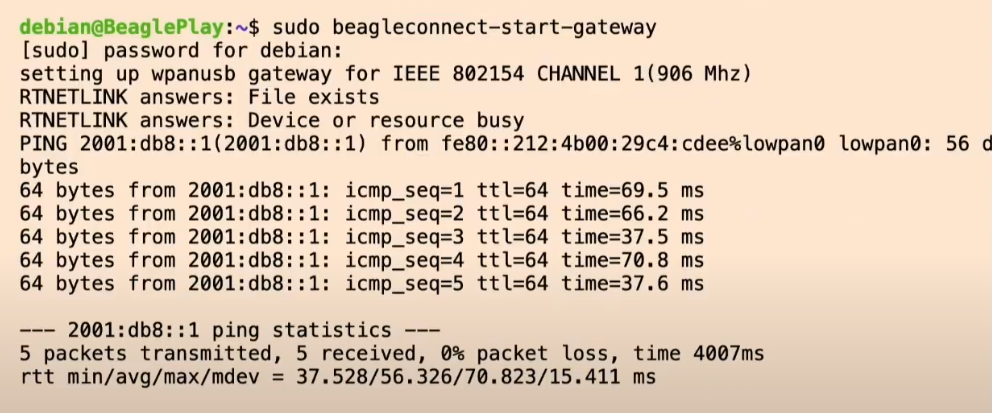
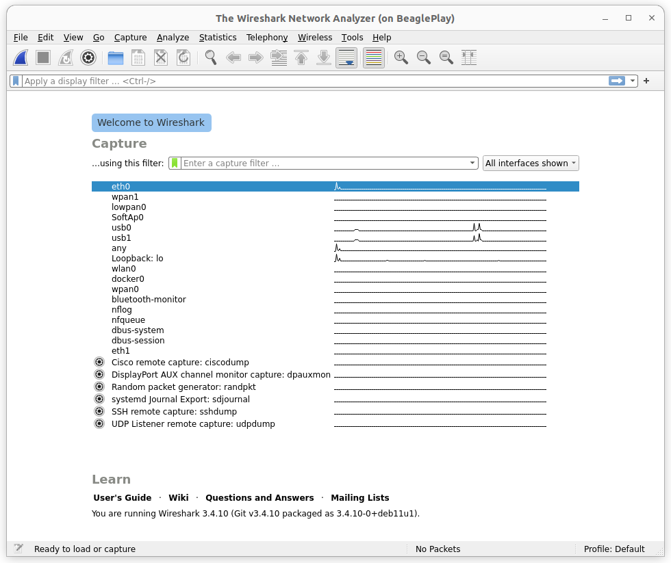
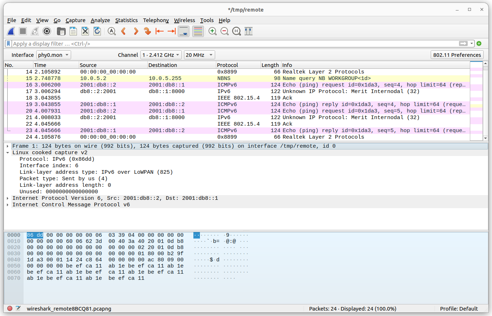
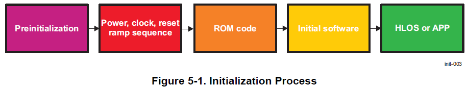
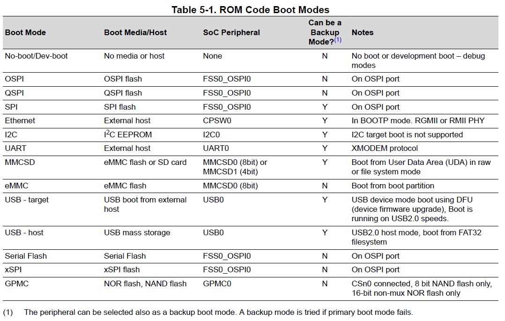
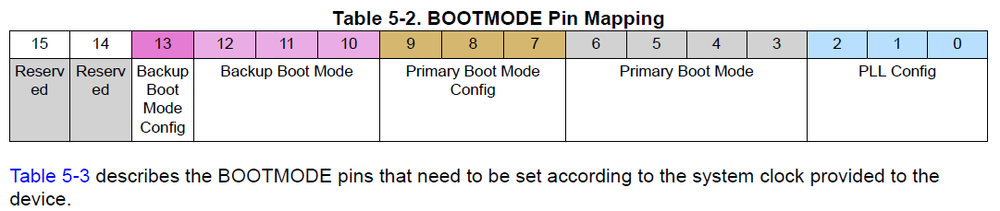

.. _beaglebone-cookbook-misc:

.. |I2C| replace:: I\ :sup:`2`\ C

Misc
####

Here are bits and pieces of ideas that are being developed.

BeagleConnect Freedom
=====================

Here are some notes on how to setup and use the Connect.

First get the flasher image from:
https://www.beagleboard.org/distros/beagleplay-home-assistant-webinar-demo-image

Flash the eMMC (which also loads the cc1352 with 
the correct firmware)

Here's Jason's demo at the 2023 EOSS:
https://youtu.be/ZT9GEs3_ZYU?t=2195

    beagleconnect-start-gateway

.. code-block:: shell-session

    bone$ sudo beagleconnect-start-gateway
    setting up wpanusb gateway for IEEE 802154 CHANNEL 1(906 Mhz)
    RTNETLINK answers: File exists
    RTNETLINK answers: Device or resource busy
    PING 2001:db8::1(2001:db8::1) from fe80::212:4b00:29b9:9884%lowpan0 lowpan0: 56 data bytes
    64 bytes from 2001:db8::1: icmp_seq=1 ttl=64 time=70.0 ms
    64 bytes from 2001:db8::1: icmp_seq=2 ttl=64 time=66.6 ms
    64 bytes from 2001:db8::1: icmp_seq=3 ttl=64 time=37.6 ms
    64 bytes from 2001:db8::1: icmp_seq=4 ttl=64 time=37.6 ms
    64 bytes from 2001:db8::1: icmp_seq=5 ttl=64 time=37.6 ms

    --- 2001:db8::1 ping statistics ---
    5 packets transmitted, 5 received, 0% packet loss, time 4005ms
    rtt min/avg/max/mdev = 37.559/49.868/70.035/15.084 ms

Useful Links
------------

https://docs.micropython.org/en/latest/zephyr/quickref.html

https://docs.zephyrproject.org/latest/boards/arm/beagle_bcf/doc/index.html

micropython Examples
--------------------

Here is the output from running the examples from here:
https://docs.beagleboard.org/latest/boards/beagleconnect/freedom/demos-and-tutorials/using-micropython.html

Plug the BeagleConnect Freedom into the USB on the Play.

.. code-block:: shell-session

    bone:~$ sudo systemd-resolve --set-mdns=yes --interface=lowpan0
    bone:~$ avahi-browse -r -t _zephyr._tcp
    + lowpan0 IPv6 zephyr                                        _zephyr._tcp         local
    = lowpan0 IPv6 zephyr                                        _zephyr._tcp         local
    hostname = [zephyr.local]
    address = [2001:db8::1]
    port = [12345]
    txt = []
    bone:~$ avahi-resolve -6 -n zephyr.local
    zephyr.local    2001:db8::1
    bone:~$ mcumgr conn add bcf0 type="udp" connstring="[2001:db8::1%lowpan0]:1337"
    Connection profile bcf0 successfully added
    bone:~$ mcumgr -c bcf0 image list
    Images:
    image=0 slot=0
        version: hu.hu.hu
        bootable: true
        flags: active confirmed
        hash: 16a97391d2570eae80667cfd8c475cb051d4a4a600430b64cb52b59f5db4ce22
    Split status: N/A (0)
    bone:~$ mcumgr -c bcf0 shell exec "device list"
    status=0

    devices:
    - GPIO_0 (READY)
    - random@40028000 (READY)
    - UART_1 (READY)
    - UART_0 (READY)
    - i2c@40002000 (READY)
    - I2C_0S (READY)
    requires: GPIO_0
    requires: i2c@40002000
    - flash-controller@40030000 (READY)
    - spi@40000000 (READY)
    requires: GPIO_0
    - ieee802154g (READY)
    - gd25q16c@0 (READY)
    requires: spi@40000000
    - leds (READY)
    - HDC2010-HUMIDITY (READY)
    requires: I2C_0S
    -
    bone:~$ mcumgr -c bcf0 shell exec "net iface"
    status=0

    Hostname: zephyr

    Interface 0x20002de4 (IEEE 802.15.4) [1]
    ========================================
    Link addr : 3D:9A:B9:29:00:4B:12:00
    MTU       : 125
    Flags     : AUTO_START,IPv6
    IPv6 unicast addresses (max 3):
            fe80::3f9a:b929:4b:1200 autoconf preferred infinite
            2001:db8::1 manual preferred infinite
    IPv6 multicast addresses (max 4):
            ff02::1
            ff02::1:ff4b:1200
            ff02::1:ff00:1
    bone:~$ tio /dev/ttyACM0

Press the ``RST`` button on the Connect.

.. code-block:: shell-session

    I: gd25q16c@0: SFDP v 1.6 AP ff with 2 PH
    I: PH0: ff00 rev 1.6: 16 DW @ 30
    I: gd25q16c@0: 2 MiBy flash
    I: PH1: ffc8 rev 1.0: 3 DW @ 90
    *** Booting Zephyr OS build zephyr-v3.2.0-3470-g14e193081b1f ***
    I: Starting bootloader
    I: Primary image: magic=unset, swap_type=0x1, copy_done=0x3, image_ok=0x3
    I: Scratch: magic=unset, swap_type=0x1, copy_done=0x3, image_ok=0x3
    I: Boot source: primary slot
    I: Swap type: none
    I: Bootloader chainload address offset: 0x20000
    I: Jumping to the first image slot

    [00:00:00.001,464] <inf> spi_nor: gd25q16c@0: SFDP v 1.6 AP ff with 2 PH
    [00:00:00.001,464] <inf> spi_nor: PH0: ff00 rev 1.6: 16 DW @ 30
    [00:00:00.001,983] <inf> spi_nor: gd25q16c@0: 2 MiBy flash
    [00:00:00.002,014] <inf> spi_nor: PH1: ffc8 rev 1.0: 3 DW @ 90
    uart:~$ build time: Feb 22 2023 08:09:25MicroPython v1.19.1 on 2023-02-22; zephyr-beagleconnect_freedom with unknown-cpu
    Type "help()" for more information.
    >>>

.. _misc_shortcuts:

Setting up shortcuts to make life easier
========================================

We'll be ssh'ing from the host to the bone often, 
here are some shortcuts I use so instead of typing ssh debian@192.168.7.2 
and a password every time. I can enter `ssh bone` and no password.

First edit `/etc/hosts` and add a couple of lines.

    host$ sudo nano /etc/hosts

You may use whatever editor you want. I suggest nano since it's easy to figure 
out. Add the following to the end of `/etc/hosts` and quit the editor.

    192.168.7.2     bone

Now you can connect with

    host$ ssh debian@bone

Let's make it so you don't have to enter `debian`. On your host computer, 
put the following in `~/.ssh/config` (Note: ~ is a shortcut for your home directory.)

.. code-block:: 

    Host bone
    User debian
    UserKnownHostsFile /dev/null
    StrictHostKeyChecking no

These say that whenever you login to bone, login as `debian`. Now you can enter.

    host$ ssh bone

One last thing, let's make it so you don't have to add a password. 
Back to your host.

    host$ ssh-keygen

Accept all the defaults and then

    host$ ssh-copy-id bone

Now all you have to enter is

    host$ ssh bone

and no password is required. 
If you, especially virtual machine users, get an error says "sign_and_send_pubkey: signing failed: agent refused operation", you can solve this by entering

    host$ ssh-add

which adds the private key identities to the authentication agent. 
Then you should be able to `ssh bone`  without problems.

.. _root_login:

Setting up a root login
=======================

By default the image we are running doesn't allow a root login. 
You can always sudo from debian, but sometimes it's nice to login as root. 
Here's how to setup root so you can login from your host without a password.

.. code-block:: bash

    host$ ssh bone
    bone$ sudo -i
    root@bone# nano /etc/ssh/sshd_config

Search for the line

.. code-block:: bash

    #PermitRootLogin prohibit-password

and change it to

.. code-block:: bash

    PermitRootLogin yes

(The # symbol indicates a comment and must be removed in order for the setting to take effect.)

Save the file and quit the editor. Restart ssh so it will reread the file.

.. code-block:: bash

    root@bone# systemctl restart sshd

And assign a password to root.

.. code-block:: bash

    root@bone# passwd

Now open another window on your host computer and enter:

.. code-block:: bash

    host$ ssh-copy-id root@bone

and enter the root password. Test it with:

.. code-block:: bash

    host$ ssh root@bone

You should be connected without a password. 
Now go back to the Bone and turn off the root password access.

.. code-block:: bash

    root@bone# nano /etc/ssh/sshd_config

Restore the line:

.. code-block:: bash

    #PermitRootLogin prohibit-password

and restart sshd.

.. code-block:: bash

    root@bone# systemctl restart sshd
    root@bone# exit
    bone$ exit

You should now be able to go back to your host computer and login as root on the bone without a password.

    host$ ssh root@bone

You have access to your bone without passwords only from you host computer. Try it from another computer and see what happens

Wireshark
=========

`Wireshark <https://wireshark.org>`_ is a network protocol analyzer that can be 
run on the Beagle or the host computer to see what's happening on the network.

Running Wireshark on the Beagle 
-------------------------------

If you have X11 installed on the Beagle and you are 
running Linux on your host you can run Wireshark on the Beagle and have
it display on the host.  

.. tip:: 
    A quick way to see if you have X windows installed is to ssh to your 
    Beagle.  At the prompt enter ``xfce`` then enter <TAB><TAB>.  If you 
    see a list of completions, you have X installed.

#.  First ssh to the Beagle using the `-X` flag.

.. code-block:: bash

    host$ ssh -X debian@10.0.5.10

    bone$ sudo apt update
    bone$ sudo apt install wireshark
    bone$ sudo usermod -a -G wireshark debian
    bone$ exit

    host$ ssh -X debian@10.0.5.10
    host$ wireshark

The `-X` flag sets the `DISPLAY` variable on the Beagle so it knows 
where to display the Beagle's graphical data on the host.  We then 
install wireshark and add debian to the wireshark group.
We then log out and log back in again to be sure we are in the 
wireshark group. Finally we start wireshark.

You should see something like :ref:`wireshark_start_screen`.

.. _wireshark_start_screen:

    Wireshark start screen

Running Wireshark on the host
----------------------------- 

If you don't have X11 installed on the Beagle, you can run wireshark 
on your host computer and capture the packets on the Beagle. 
These instructions come from:
https://serverfault.com/questions/362529/how-can-i-sniff-the-traffic-of-remote-machine-with-wireshark

First login to the Beagle and install tcpdump. Use your Beagle's 
IP address.  

.. code-block:: bash

    host$ ssh 192.168.7.2
    bone$ sudo apt update
    bone$ sudo apt install tcpdump
    bone$ exit

Next, create a named pipe and have wireshark read from it.

.. code-block:: bash

    host$ mkfifo /tmp/remote
    host$ wireshark -k -i /tmp/remote

Then, run tcpdump over ssh on your remote machine and redirect the 
packets to the named pipe:

.. code-block:: bash

    host$ ssh root@192.168.7.2 "tcpdump -s 0 -U -n -w - -i any not port 22" > /tmp/remote

.. tip:: 
    For this to work you will need to follow in instructions in :ref:`root_login`.

Sharking the wpan radio
-----------------------

Now that you have Wireshark set up, you can view traffice from the Play's 
wpan radio. First, set up the network by running:

.. code-block:: shell-session

    bone:~$ beagleconnect-start-gateway

Go to Wireshark and in the field that says `Apply a display filter...` enter, 
``wpan || 6lowpan || ipv6``.  This will dispaly three types of packets.  
Be sure to hit Enter.

Now generate some traffic:

.. code-block:: shell-session

    bone:~$ ping6 -I lowpan0 2001:db8::1 -c 5 -p ca11ab1ebeef

.. _wireshark_ping:

    Wireshark ping6 -I lowpan0 2001:db8::1 -c 5 -p ca11ab1ebeef

You can see the pattern ``ca11ab1ebeef`` appears in the packets.

Converting a tmp117 to a tmp114
================================

Problem
-------

You have a tmp114 temperature sensor and you need a driver for it.

Solution
--------

Find a similar driver and convert it to the tmp114.

Let's first see if there is a driver for it already. Run the following on the bone using the tab key in place 
of <tab>.

.. code-block:: bash

  bone$ modinfo tmp<tab><tab>
  tmp006  tmp007  tmp102  tmp103  tmp108  tmp401  tmp421  tmp513
  bone$ modinfo tmp

Here you see a list of modules that match *tmp*, unfortunately *tmp114* is not there.
Let's see if there are any matches in */lib/modules*.

.. code-block:: bash

    bone$ find /lib/modules/ -iname "*tmp*"
    /lib/modules/5.10.168-ti-arm64-r104/kernel/drivers/iio/temperature/tmp006.ko.xz
    /lib/modules/5.10.168-ti-arm64-r104/kernel/drivers/iio/temperature/tmp007.ko.xz
    /lib/modules/5.10.168-ti-arm64-r104/kernel/drivers/hwmon/tmp103.ko.xz
    /lib/modules/5.10.168-ti-arm64-r104/kernel/drivers/hwmon/tmp421.ko.xz
    /lib/modules/5.10.168-ti-arm64-r104/kernel/drivers/hwmon/tmp108.ko.xz
    /lib/modules/5.10.168-ti-arm64-r104/kernel/drivers/hwmon/tmp513.ko.xz
    /lib/modules/5.10.168-ti-arm64-r104/kernel/drivers/hwmon/tmp401.ko.xz
    /lib/modules/5.10.168-ti-arm64-r104/kernel/drivers/hwmon/tmp102.ko.xz

Looks like the same list, but here we can see what type of driver it is, either *hwmon* or *iio*.
hwmon is an older `harware monitor <https://docs.kernel.org/hwmon/hwmon-kernel-api.html>`_.  
iio is the newer, and prefered, `Industrial IO driver
<https://www.kernel.org/doc/html/v4.12/driver-api/iio/index.html>`_.
Googling tmp006 and tmp007 shows that they are Infrared Thermopile Sensors, not the same at the *tmp114*.
(Google it).  Let's keep looking for a more compatible device.

Browse over to http://kernel.org to see if there are tmp114 drivers in the newer versions of the kernel.
The first line in the table is **mainline**.  Click on the **browse** link on the right.
Here you will see the top level of the Linux sourse tree for the *mainline* version of the kernel.
Click on **drivers** and then **iio**. Finally, since tmp114 is a temperture sensor, click on **temperature**.
Here you see all the source code for the iio temperature drivers for the mainline version of the kernel. 
We've seen tmp006 and tmp007 as before, tmp117 is new. Maybe it will work.  Click on **tmp117.c** to see the code.
Looks like it also works for the tmp116 too.  Let's try convering it to work with the tmp114.

A quick way to copy the code to the bone is to right-click on the **plain** link and select *Copy link address*.
Then, on the bone enter **wget** and paste the link.  Mine looks like the following, yours will be similar.

.. code-block:: bash

  bone$ wget https://git.kernel.org/pub/scm/linux/kernel/git/torvalds/linux.git/plain/drivers/iio/temperature/tmp117.c?h=v6.4-rc7
  bone$ mv 'tmp117.c?h=v6.4-rc7' tmp117.c
  bone$ cp tmp117.c tmp114.c

The **mv** command moves the downloaded file to a usable name and the **cp** copies to a new file with the new name.

Compiling the module
^^^^^^^^^^^^^^^^^^^^

Next we need to compile the driver.  To do this we need to load the corresponding header files for the
version of the kernel that's beening run.

.. code-block:: bash

  bone$ uname -r
  5.10.168-ti-arm64-r105

Here you see which version I'm running, yours will be similar.  Now load the headers.

.. code-block:: bash

  bone$ sudo apt install linux-headers-`uname -r`

Next create a *Makefile*.  Put the following in a file called *Makefile*.

.. _misc_makefile:

.. literalinclude:: figures/Makefile
   :caption: Makefile for compiling module (Makefile)
   :linenos:

:download:`Makefile <figures/Makefile>`

Now you are ready to compile:

.. code-block:: bash

    bone$ make
    make -C /lib/modules/5.10.168-ti-arm64-r105/build M=/home/debian/play modules
    make[1]: Entering directory '/usr/src/linux-headers-5.10.168-ti-arm64-r105'
    CC [M]  /home/debian/play/tmp114.o
    /home/debian/play/tmp114.c: In function ‘tmp117_identify’:
    /home/debian/play/tmp114.c:150:7: error: implicit declaration of function ‘i2c_client_get_device_id’; did you mean ‘i2c_get_device_id’? [-Werror=implicit-function-declaration]
    150 |  id = i2c_client_get_device_id(client);
        |       ^~~~~~~~~~~~~~~~~~~~~~~~
        |       i2c_get_device_id
    /home/debian/play/tmp114.c:150:5: warning: assignment to ‘const struct i2c_device_id *’ from ‘int’ makes pointer from integer without a cast [-Wint-conversion]
    150 |  id = i2c_client_get_device_id(client);
        |     ^
    cc1: some warnings being treated as errors
    make[2]: *** [scripts/Makefile.build:286: /home/debian/play/tmp114.o] Error 1
    make[1]: *** [Makefile:1822: /home/debian/play] Error 2
    make[1]: Leaving directory '/usr/src/linux-headers-5.10.168-ti-arm64-r105'
    make: *** [Makefile:7: all] Error 2

Well, the good news is, it is compiling, that means it found the correct headers.  
But now the work begins converting to the tmp114.

Converting to the tmp114
^^^^^^^^^^^^^^^^^^^^^^^^

You are mostly on your own for this part, but here are some suggestions:

- First get it to compile without errors.  In this case, the function at line 150 isn't defined.
  Try commenting it out and recompiling.
- Once it's compiling without errors, try running it. First open another window and login to beagle.
  Then run:

  .. code-block:: bash

    bone$ dmesg -Hw

This will display the kernel messages.  The **-H** put them in *human* readable form, and the **-w** waits for 
more messages.

- Next, "insert" it in the running kernel:

.. code-block:: bash

    bone$ sudo insmod tmp114.ko 

If all worked you shouldn't see any messages, either after the command or in the dmesg window.
If you want to insert the module again, you will have to remove it first.
Remove with:

.. code-block:: bash

    bone$ sudo rmmod tmp114

Now we need to tell the kernel we have an |I2C| device and which bus and which address.

Finding your |I2C| device
^^^^^^^^^^^^^^^^^^^^^^^^^

Each |I2C| device appears at a certain address on a given bus.  My device is on bus 3,
so I run:

.. code-block:: bash

    bone$ i2cdetect -y -r 3
        0  1  2  3  4  5  6  7  8  9  a  b  c  d  e  f
    00:                         -- -- -- -- -- -- -- --
    10: -- -- -- -- -- -- -- -- -- -- -- -- -- -- -- --
    20: -- -- -- -- -- -- -- -- -- -- -- -- -- -- -- --
    30: -- -- -- -- -- -- -- -- -- -- -- -- -- -- -- --
    40: -- -- -- -- -- -- -- -- -- -- -- -- -- 4d -- --
    50: -- -- -- -- -- -- -- -- -- -- -- -- -- -- -- --
    60: -- -- -- -- -- -- -- -- -- -- -- -- -- -- -- --
    70: -- -- -- -- -- -- -- --

This shows there is a device at address **0x4d**. If you don't know your bus number, 
just try a few until you find it.

The temperature is in register 0 for my device and it's 16 bits (one word),
it is read with:

.. code-block:: bash

    bone$  i2cget -y 3 0x4d 0 w
    0xb510

The tmp114 swaps the two bytes, so the real temperature is **0x10b5**, or so.
You need to look up the datawsheet to learn how to comvert it.

Registers and IDs
^^^^^^^^^^^^^^^^^

Each |I2C| device has a number of internal registers that interact with the device.
The tmp114 uses different register numbers than the tmp117, so you need to change these values.
To do this, Google for the data sheets for each and look them up. 
I found them at: https://www.ti.com/lit/gpn/tmp114 and https://www.ti.com/lit/gpn/tmp117.

Creating a new device
^^^^^^^^^^^^^^^^^^^^^

Once you've converted the module for the tmp114 and inserted it, you can now create a new device.

.. code-block:: bash

    bone$ cd /sys/class/i2c-adapter/i2c-3
    bone$ sudo chgrp gpio *
    bone$ sudo chmod g+w *
    bone$ ls -ls
    total 0
    0 --w--w---- 1 root gpio 4096 Jun 22 18:24 delete_device
    0 lrwxrwxrwx 1 root root    0 Jan  1  1970 device -> ../../20030000.i2c
    0 drwxrwxr-x 3 root gpio    0 Jun 22 18:20 i2c-dev
    0 -r--rw-r-- 1 root gpio 4096 Jun 22 18:20 name
    0 --w--w---- 1 root gpio 4096 Jun 22 18:20 new_device
    0 lrwxrwxrwx 1 root root    0 Jan  1  1970 of_node -> ../../../../../firmware/devicetree/base/bus@f0000/i2c@20030000
    0 drwxrwxr-x 2 root gpio    0 Jun 22 18:20 power
    0 lrwxrwxrwx 1 root root    0 Jan  1  1970 subsystem -> ../../../../../bus/i2c
    0 -rw-rw-r-- 1 root gpio 4096 Jun 22 18:20 uevent

The first line changes to the directory to where we can create the new device.
The final **3** in the path is for bus **3**, your milage may vary.
We then change the group to **gpio** and give it write permission.
You only need to do this once.

Now make a new device.

.. code-block:: bash

    bone$ echo tmp114 0x4d > new_device

Look in the demsg window and you should see:

.. code-block:: bash

    [Jun22 19:24] tmp114 3-004d: tmp114_identify id (0x1114)
    [  +0.000027] tmp114 3-004d: tmp114_probe id (0x1114)
    [  +0.000502] i2c i2c-3: new_device: Instantiated device tmp114 at 0x4d

It's been found! Let's see what it knows about it.

.. code-block:: bash

    bone$ iio_info
    Library version: 0.24 (git tag: v0.24)
    ...
            iio:device1: tmp114
                    1 channels found:
                            temp:  (input)
                            2 channel-specific attributes found:
                                    attr  0: raw value: 4257
                                    attr  1: scale value: 7.812500
                    No trigger on this device

I've left out some of the lines, at the bottom you see the tmp114, and
two values (**raw** and **scale**) that were read from it.  Let's read them ourselves.
Do an *ls* and you'll see a new directory, **3-004d**.  This is address 0x4d on bus 3,
just what we wanted.

.. code-block:: bash

    bone$ cd 3-004d/iio:device1
    bone$ ls
    dev  in_temp_raw  in_temp_scale  name  power  subsystem  uevent
    bone$ cat in_temp_raw
    4275

You'll have to look in the datasheet to learn how to convert the temperature.

If you try to run i2cget again, you'll get an error:

.. code-block:: bash

    bone$ i2cget -y 3 0x4d 0 w
    Error: Could not set address to 0x4d: Device or resource busy

This is because the module is using it.  Delete the device and you'll have access again.

.. code-block:: bash

    bone$ echo 0x4d > /sys/class/i2c-adapter/i2c-3/delete_device
    bone$ i2cget -y 3 0x4d 0 w
    0x8e10

You should also see a message in dmesg.

Documenting with Sphinx
========================

Problem
-------

You want to add or update the Beagle documentation.

Solution
--------

BeagleBoard.org uses the `Sphinx Python Documentation Generator 
<https://www.sphinx-doc.org/en/master/index.html>`_ and the 
`rst <https://www.sphinx-doc.org/en/master/usage/restructuredtext/basics.html>`_ markup language.

Here's what you need to do to fork the repository and render a local copy of
the documentation.  Browse to https://docs.beagleboard.org/latest/ and click on 
the **Edit on GitLab** button on the upper-right of the page. Clone the repository.

.. code-block:: bash

    bash$ git clone git@git.beagleboard.org:docs/docs.beagleboard.io.git
    bash$ cd docs.beagleboard.io

Then run the following to load the **code** submodule

.. code-block:: bash

    bash$ git submodule update --init

Now, sync changes with upstream:

.. code-block:: bash

    bone$ git remote add upstream https://git.beagleboard.org/docs/docs.beagleboard.io.git
    bone$ git fetch upstream
    bone$ git pull upstream main

Using Docker (Podman)
^^^^^^^^^^^^^^^^^^^^^
It is probably easies to use docker (or podman) if you are already familiar with container workflow.
The repository contains a helper script `docker-build-env.sh` which creates ephemeral container and drops you into bash inside. The project is mouted at `/build/docs.beagleboard.org`.

.. note::

    This section of docs assume that you are using rootless docker or podman. In case of rootful docker, you might run into permission issues

.. code-block:: bash

    ./docker-build-env.sh
    cd /build/docs.beagleboard.org
    make clean

To generate HTML output of docs:

.. code-block:: bash

    make html

To generate PDF output of docs:

.. code-block:: bash

    make latexpdf

To preview docs on your local machine:

.. code-block:: bash

    python3 -m http.server -d _build/html/

Downloading Sphinx
^^^^^^^^^^^^^^^^^^
Skip this section if you are using docker as shown above.

Run the following to download and setup Sphinx locally.

.. note::

  This will take a while, it loads some 6G bytes.

.. code-block:: bash

    bone$ sudo apt update
    bone$ sudo apt upgrade
    bone$ sudo apt install -y \
        make git wget \
        doxygen librsvg2-bin\
        texlive-latex-base texlive-latex-extra latexmk texlive-fonts-recommended \
        python3 python3-pip \
        imagemagick-6.q16 librsvg2-bin webp \
        texlive-full texlive-latex-extra texlive-fonts-extra \
        fonts-freefont-otf fonts-dejavu fonts-dejavu-extra fonts-freefont-ttf

In case of any problems, checkout `Beagleboard Forum <https://forum.beagleboard.org/>`_.

Setup virtual environment for python using the `venv-build-env.sh` script at the project root.

.. literalinclude:: ../../../venv-build-env.sh
   :language: bash
   :caption: Bash script for setting up virtual environment
   :linenos:

Now go to the cloned *docs.beagleboard.io* repository folder and do the following.
To clean build directory:

.. code-block:: bash

    bone$ cd docs.beagleboard.io
    bone$ make clean

To generate HTML output of docs:

.. code-block:: bash

    bone$ make html

To generate PDF output of docs:

.. code-block:: bash

    bone$ make latexpdf

To preview docs on your local machine:

.. code-block:: bash

    bone$ sphinx-serve

For hot reload in development:

.. code-block:: bash

    bone$ make livehtml

Then point your browser to localhost:8081.

.. tip:: 
    You can keep the sphinx-serve running until you clean the build directory 
    using make clean.
    Warnings will be hidden after first run of make html or make latexpdf, 
    to see all the warnings again just run make clean before building HTML or PDF

Creating A New Book
^^^^^^^^^^^^^^^^^^^^
- Create a new book folder here: 
  https://git.beagleboard.org/docs/docs.beagleboard.io/-/tree/main/books
- Create rst files for all the chapters in there respective folders so 
  that you can easily manage media for that chapter as shown here: 
  https://git.beagleboard.org/docs/docs.beagleboard.io/-/tree/main/books/pru-cookbook
- Create an index.rst file in the book folder and add a table of content (toc) 
  for all the chapters. For example see this file: 
  https://git.beagleboard.org/docs/docs.beagleboard.io/-/raw/main/books/pru-cookbook/index.rst
- Add the bookname/index.rst reference in the main index file as well: 
  https://git.beagleboard.org/docs/docs.beagleboard.io/-/raw/main/books/index.rst
- At last you have to update the two files below to render the book in HTML and 
  PDF version of the docs respectively:
  https://git.beagleboard.org/docs/docs.beagleboard.io/-/raw/main/index.rst
  https://git.beagleboard.org/docs/docs.beagleboard.io/-/raw/main/index-tex.rst

Running Sparkfun's qwiic Python Examples
========================================

Many of the Sparkfun qwiic devices have Python examples showing 
how to use them.  Unfortunately the examples assume |I2C| bus 
1 is used, but the qwiic bus on the Play is bus 5. 
Here is a quick hack to get the Sparkfun Python examples to use
bus 5. I'll show it for the Joystick, but it should work for the 
others as well.

First, browse to Sparkfun's qwiic Joystick page,
https://www.sparkfun.com/products/15168 and click on the 
**DOCUMENTS** tab and then on **Python Package**. Follow the pip
instillation instructions (sudo pip install sparkfun-qwiic-joystick)

Next, uninstall the current qwiic |I2C| package.

.. code-block:: shell-session

    bone$ sudo pip uninstall sparkfun-qwiic-i2c

Then clone the Qwiic |I2C| repo:

.. code-block:: shell-session

    bone$ git clone git@github.com:sparkfun/Qwiic_I2C_Py.git
    bone$ cd Qwiic_I2C_Py/qwiic_i2c

Edit **linux_i2c.py** and go to around line 62 and change it to:

.. code-block:: shell-session

    iBus = 5

Next, cd up a level to the Qwiic_I2C_Py directory and reinstall

.. code-block:: bash

    bone$ cd ..
    bone$ sudo python setup.py install

Finally, run one of the Joystick examples. If it isn't using 
bus 5, try reinstalling setup.py again.

Qwiic Alphanumeric display
--------------------------

Here's the repo I used for this display.
https://github.com/thess/qwiic_alphanumeric_py

.. _kernel_LEDs:

Controlling LEDs by Using SYSFS Entries
========================================

Problem
---------

You want to control the onboard LEDs from the command line.

Solution
---------

On Linux, `everything is a file <http://bit.ly/1AjhWUW>`_ that is, you can access all the inputs and outputs, the LEDs, 
and so on by opening the right ``file`` and reading or writing to it. For example, try the following:

.. code-block:: bash

    bone$ cd /sys/class/leds/
    bone$ ls
    beaglebone:green:usr0  beaglebone:green:usr2
    beaglebone:green:usr1  beaglebone:green:usr3

What you are seeing are four directories, one for each onboard LED. Now try this:

.. code-block:: bash

    bone$ cd beaglebone\:green\:usr0
    bone$ ls
    brightness  device  max_brightness  power  subsystem  trigger  uevent
    bone$ cat trigger
    none nand-disk mmc0 mmc1 timer oneshot [heartbeat] 
        backlight gpio cpu0 default-on transient 

The first command changes into the directory for LED *usr0*, which is the LED closest to the edge of the board. 
The *[heartbeat]* indicates that the default trigger (behavior) for the LED is to blink in the heartbeat pattern. 
Look at your LED.  Is it blinking in a heartbeat pattern?

Then try the following:

.. code-block:: bash

    bone$ echo none > trigger
    bone$ cat trigger 
    [none] nand-disk mmc0 mmc1 timer oneshot heartbeat
        backlight gpio cpu0 default-on transient 

This instructs the LED to use *none* for a trigger. Look again. It should be no longer blinking.

Now, try turning it on and off:

.. code-block:: bash

    bone$ echo 1 > brightness
    bone$ echo 0 > brightness

The LED should be turning on and off with the commands.

.. _kernel_gpio_sysfs:

Controlling GPIOs by Using SYSFS Entries
=========================================

Problem
--------

You want to control a GPIO pin from the command line.

Solution
---------

:ref:`kernel_LEDs` introduces the *sysfs*. This recipe shows how to read and write a GPIO pin. 

Reading a GPIO Pin via sysfs
=============================

Suppose that you want to read the state of the *P9_42* GPIO pin. (:ref:`sensors_pushbutton` shows how to wire a switch to *P9_42*.)  
First, you need to map the *P9* header location to GPIO number using :ref:`kernel_gpio_map_fig`, which shows that *P9_42* maps to GPIO 7.

.. _kernel_gpio_map_fig:

.. figure:: figures/cape-headers-digitalGPIO7.png
    :align: center
    :alt: Mapping Header Position to GPIO Numbers

    Mapping P9_42 header position to GPIO 7

Next, change to the GPIO *sysfs* directory:

.. code-block:: bash

    bone$ cd /sys/class/gpio/
    bone$ ls
    export  gpiochip0  gpiochip32  gpiochip64  gpiochip96  unexport

The *ls* command shows all the GPIO pins that have be exported. In this case, none have, 
so you see only the four GPIO controllers. Export using the *export* command:

.. code-block:: bash

    bone$ echo 7 > export
    bone$ ls
    export  gpio7  gpiochip0  gpiochip32  gpiochip64  gpiochip96  unexport

Now you can see the ``gpio7`` directory. Change into the ``gpio7`` directory and look around:

.. code-block:: bash

    bone$ cd gpio7
    bone$ ls
    active_low  direction  edge  power  subsystem  uevent  value
    bone$ cat direction
    in
    bone$ cat value
    0

Notice that the pin is already configured to be an input pin. (If it wasn't already configured that way, 
use *echo in > direction* to configure it.) You can also see that its current value is *0*—that is, it 
isn't pressed. Try pressing and holding it and running again:

.. code-block:: bash

    bone$ cat value
    1

The *1* informs you that the switch is pressed. When you are done with GPIO 7, you can always *unexport* it:

.. code-block:: bash

    bone$ cd ..
    bone$ echo 7 > unexport
    bone$ ls
    export  gpiochip0  gpiochip32  gpiochip64  gpiochip96  unexport

Writing a GPIO Pin via sysfs
=============================

Now, suppose that you want to control an external LED. :ref:`displays_externalLED` shows 
how to wire an LED to *P9_14*. :ref:`kernel_gpio_map_fig` shows *P9_14* is GPIO 50. Following 
the approach in :ref:`kernel_gpio_sysfs`, enable GPIO 50 and make it an output:

.. code-block:: bash

    bone$ cd /sys/class/gpio/
    bone$ echo 50 > export
    bone$ ls
    gpio50  gpiochip0  gpiochip32  gpiochip64  gpiochip96
    bone$ cd gpio50
    bone$ ls
    active_low  direction  edge  power  subsystem  uevent  value
    bone$ cat direction
    in

By default, *P9_14* is set as an input. Switch it to an output and turn it on:

.. code-block:: bash

    bone$ echo out > direction
    bone$ echo 1 > value
    bone$ echo 0 > value

The LED turns on when a *1* is written to *value* and turns off when a *0* is written.

The Play's Boot Sequence
==========================

The BeagleBoard Play is based on the Texas Instrument's AM625 Sitara
processor which supports many boot modes.  

.. note:: 
    bootlin (https://bootlin.com/) has many great Linux
    training materials for free on their site. Their embedded Linux workshop
    (https://bootlin.com/training/embedded-linux/) 
    gives a detailed presentation of the Play's boot sequence 
    (https://bootlin.com/doc/training/embedded-linux-beagleplay/embedded-linux-beagleplay-labs.pdf,
    starting at page 9).
    Check it out for details on building the boot sequence 
    from scratch.

Here we'll take a high-level look at
booting from both the user's view and the developer's view.

Booting for the User
--------------------

The most common way for the Play to boot is the power up the board,
if the micro SD card is present, it will boot from it, if it isn't 
present it will boot from the built in eMMC.

You can override the boot sequence by using the **USR** button 
(located near the micro SD cage). If the **USR** button is pressed 
the Play will boot from the micro SD card.

.. note:: 
    If the eMMC fails to boot, it will attempt to boot from 
    the UART. If the SD card fails to boot, it will try booting via 
    the USB. 

Booting for the Developer
-------------------------

.. tip:: 

    These diagrams might help: 
    https://github.com/u-boot/u-boot/blob/6e8fa0611f19824e200fe4725f18bce7e2000071/doc/board/ti/k3.rst

If you are developing firmware for the Play you may need to have
access to the processor early in the booting sequence. Much can 
happen before the Linux kernel starts its boot process.
Here are some notes on what the BeagleBoard Play does when it boots up.  Many of the booting
details come from Chapter 5 (Initialization) of the 
AM62x Technical Reference Manual (TRM)
(https://www.ti.com/product/AM625, https://www.ti.com/lit/pdf/spruiv7).
The following figure, taken from page 2456, shows the 
Initialization Process.

    Initialization Process

We are interested in what happens in the **ROM code**.
Page 2457, of the TRM, shows the different ROM Code Boot Modes.

    ROM Code Boot Modes

These are selected at boot time based on the state of the BOOTMODE pins.
The table on page 2465 shows the BOOTMODE pins.

    BOOTMODE Pin Mapping 

Page 14 of of the Play's schematic 
(https://git.beagleboard.org/beagleplay/beagleplay/-/blob/main/BeaglePlay_sch.pdf)
shows how the BOOTMODE pins are set during boot.

.. figure:: figures/bootstrap.png
    :align: center
    :alt: bootstrap

    Bootstrap    

Therefore the following modes are selected if **Button Not-pressed**

+---+-------------+--------------------+------------------------+
|1, | PLL Config  | B[2:0] = 0b011     |    : Ref Clcok -> 25MHz|
+---+-------------+--------------------+------------------------+
|2, | Primary Boot| B[9:3] = 0b1001001 |  : eMMC Boot           |
+---+-------------+--------------------+------------------------+
|3, |Backup Boot  | B[13:10] = 0b1011  |  : UART Boot           |
+---+-------------+--------------------+------------------------+

That is, you boot off the eMMC and if that fails you boot off the UART.

If **Button is Pressed**

+---+-------------+-------------------+------------------------+
|1, |PLL Config   | B[2:0] = 0b011    |   : Ref Clcok -> 25MHz |
+---+-------------+-------------------+------------------------+
|2, |Primary Boot |B[9:3] = 0b1001000 | : SD Card FS Boot      |
+---+-------------+-------------------+------------------------+
|3, |Backup Boot  |B[13:10] = 0b0001  |  : USB DFU Boot        |
+---+-------------+-------------------+------------------------+

Here you are booting off the SD card (in filesystem mode), or the USB if 
that fails.

Boot Flow
---------

There are many steps that occur after the BOOTMODE is selected 
and before the Linux Kernel boots.  
`Boot Flow <https://github.com/u-boot/u-boot/blob/master/doc/board/ti/am62x_sk.rst#boot-flow>`_ 
shows those steps for the **R5** processor and the arm (**A53**) processor. The key parts
are **tiboot3.bin** and **tispl.bin** runnng on the *R5* and **u-boot.img** running 
on the *A53*.  These binary files are found on the Play in ``/boot/firmware``.

.. note:: 
    The files on the SD card and the eMMC are in ``ext4`` format.  The files used for booting 
    must be in ``vfat`` format.  Therefore ``/boot/firmware`` is mounted in ``vfat`` as 
    seen in ``/etc/fstab``. 

    .. code-block:: 

        # /etc/fstab: static file system information.
        #
        /dev/mmcblk0p2  /  ext4  noatime,errors=remount-ro  0  1
        /dev/mmcblk0p1  /boot/firmware vfat defaults 0 0
        debugfs  /sys/kernel/debug  debugfs  mode=755,uid=root,gid=gpio,defaults  0  0

Source Code
-----------

The source code and examples of how to compile the source is found in: 
https://git.beagleboard.org/beagleboard/repos-arm64/-/blob/main/bb-u-boot-beagleplay/suite/bookworm/debian/rules#L29

Home Assistant
==============

#. Get an image here:
    https://www.beagleboard.org/distros/beagleplay-home-assistant-webinar-demo-image
    I chose the boot from SD image.
#. Boot the Play from the SD card 
#. Log into the Play
#. Find the Play's IP address by running
    .. code-block:: 

        bone$ ip a show eth0
        2: eth0: <BROADCAST,MULTICAST,UP,LOWER_UP> mtu 1500 qdisc mq state UP group default qlen 1000
            link/ether 34:08:e1:85:1b:a6 brd ff:ff:ff:ff:ff:ff
            inet 10.0.5.24/24 brd 10.0.5.255 scope global dynamic noprefixroute eth0

    The address is after ``inet``, in my case it's 10.0.5.24.
#. Wait 5 or 10 minutes and then open a browser at ``10.0.5.24:8123`` 
   using your IP address.

.. tip:: 
    If you get a "This site can’t be reached" error message, try running 
    ``journalctl -f`` to see the log messages.

#. Open another browser and follow the instructions at:  
    https://www.home-assistant.io/getting-started/onboarding

mqtt
----

Here are Jason's addons. 
https://git.beagleboard.org/jkridner/home-assistant-addons

