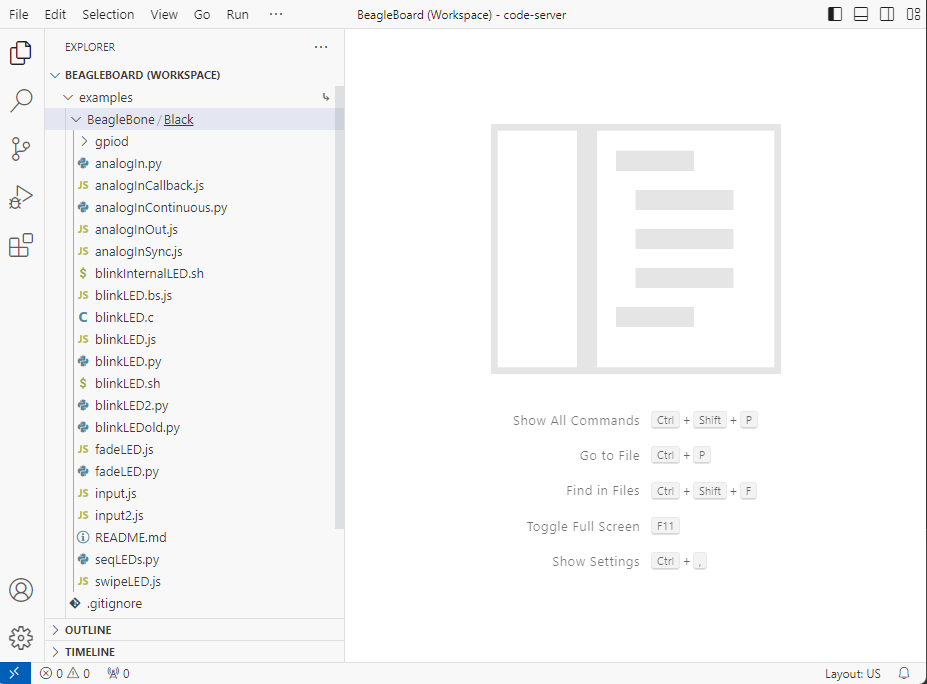
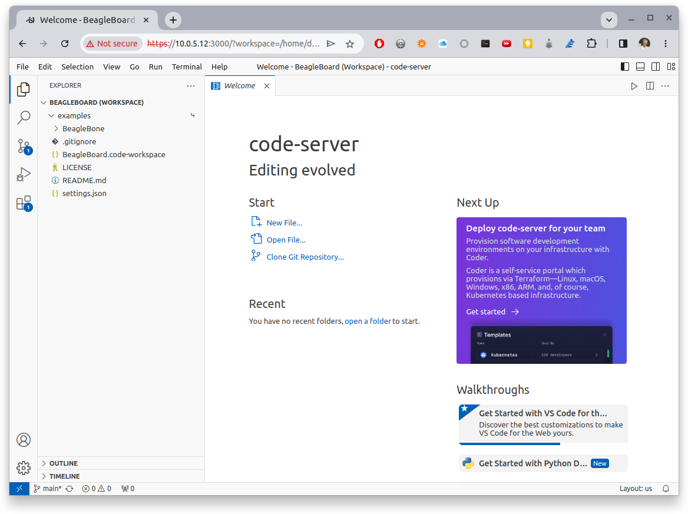

.. _pru-cookbook-start:

Getting Started
################

We assume you have some experience with the Beagle and are here to learn about 
the PRU.  This chapter discusses what Beagles are out there, how to load the 
<<<<<<< HEAD
<<<<<<< HEAD
latest software image on your Beagle, how to run the Visual Studio Code IDE and how to 
=======
latest software image on your Beagle, how to run the Visual Studio Code IDE and how to 
>>>>>>> d2f51ee3a125e07c469b23df15cd4949c09832de
blink an LED.
=======
latest software image on your Beagle, how to run the Visual Studio Code 
(VS Code) IDE and how to blink an LED.
>>>>>>> bf423e10a7d607eb485449d3f53e7823264dfebb

If you already have your Beagle and know your way around it, you can find the
code at https://git.beagleboard.org/beagleboard/pru-cookbook-code and book
contents at https://git.beagleboard.org/docs/docs.beagleboard.io under the
books/pru-cookbook directory.

Selecting a Beagle
********************

Problem
--------

Which Beagle should you use?

Solution
---------

http://beagleboard.org/boards lists the many Beagles from which to choose.  
Here we'll give examples for the venerable `BeagleBone Black <http://beagleboard.org/black>`_, 
the robotics `BeagleBone Blue <http://beagleboard.org/blue>`_, 
tiny `PockeBeagle <http://beagleboard.org/pocket>`_ and the powerful `AI <http://beagleboard.org/ai>`_.
All the examples should also run on the other Beagles too.

Discussion
------------

BeagleBone Black
~~~~~~~~~~~~~~~~~

If you aren't sure which Beagle to use, it's hard to go wrong with the
`BeagleBone Black <http://beagleboard.org/black>`_.  It's the most popular 
member of the open hardware Beagle family.

.. _start_black:

.. figure:: figures/product_detail_black_sm.jpg
    :align: center
    :alt: BeableBone Black

    BeagleBone Black

The Black has:

* AM335x 1GHz ARM® Cortex-A8 processor
* 512MB DDR3 RAM
* 4GB 8-bit eMMC on-board flash storage
* 3D graphics accelerator
* NEON floating-point accelerator
* 2x PRU 32-bit microcontrollers
* USB client for power & communications
* USB host
* Ethernet
* HDMI
* 2x 46 pin headers

See http://beagleboard.org/black for more details.

BeagleBone Blue
~~~~~~~~~~~~~~~~~

The `Blue <http://beagleboard.org/blue>`_ is a good choice if you are doing robotics.

.. _start_blue:

.. figure:: figures/beagle-blue.png
    :align: center
    :alt: BeagleBone Blue

    BeagleBone Blue

The Blue has everything the Black has except it has no Ethernet and no HDMI.  
But it also has:

* Wireless: 802.11bgn, Bluetooth 4.1 and BLE
* Battery support: 2-cell LiPo with balancing, LED state-of-charge monitor
* Charger input: 9-18V
* Motor control: 8 6V @ 4A servo out, 4 bidirectional DC motor out, 4 quadrature encoder in
* Sensors: 9 axis IMU (accels, gyros, magnetometer), barometer, thermometer
* User interface: 11 user programmable LEDs, 2 user programmable buttons

In addition you can mount the Blue on the 
`EduMIP kit <https://www.renaissancerobotics.com/eduMIP.html>`_ as shown in
:ref:`start_edumip` to get a balancing robot.

.. _start_edumip:

.. figure:: figures/edumip.png
    :align: center
    :alt: BeagleBone Blue EduMIP Kit

    BeagleBone Blue EduMIP Kit

https://www.hackster.io/53815/controlling-edumip-with-ni-labview-2005f8 
shows how to assemble the robot and control it from 
`LabVIEW <http://www.ni.com/en-us/shop/labview.html>`_.

PocketBeagle
~~~~~~~~~~~~~~

The `PocketBeagle <http://beagleboard.org/pocket>`_ is the smallest member of the 
Beagle family.  It is an ultra-tiny-yet-complete Beagle that is software 
compatible with the other Beagles.

.. _start_pocket:

.. figure:: figures/PocketBeagle-size-compare-small.jpg
    :align: center
    :alt: PocketBeagle

    PocketBeagle

The Pocket is based on the same processor as the Black and Blue and has:

* 8 analog inputs
* 44 digital I/Os and 
* numerous digital interface peripherals

See http://beagleboard.org/pocket for more details.

BeagleBone AI
~~~~~~~~~~~~~~

If you want to do deep learning, try the  `BeagleBone AI <http://beagleboard.org/ai>`_.

.. _start_ai:

.. figure:: figures/BB_AI_BeautyAngle_800px.jpg
    :align: center
    :alt: BeableBone AI

    BeagleBone AI

The AI has:

* Dual Arm® Cortex®-A15 microprocessor subsystem
* 2 C66x floating-point VLIW DSPs
* 2.5MB of on-chip L3 RAM
* 2x dual Arm® Cortex®-M4 co-processors
* 4x Embedded Vision Engines (EVEs)
* 2x dual-core Programmable Real-Time Unit and Industrial Communication SubSystem (PRU-ICSS)
* 2D-graphics accelerator (BB2D) subsystem
* Dual-core PowerVR® SGX544™ 3D GPU
* IVA-HD subsystem (4K @ 15fps encode and decode support for H.264, 1080p60 for others)
* BeagleBone Black mechanical and header compatibility
* 1GB RAM and 16GB on-board eMMC flash with high-speed interface
* USB type-C for power and superspeed dual-role controller; and USB type-A host
* Gigabit Ethernet, 2.4/5GHz WiFi, and Bluetooth
* microHDMI
* Zero-download out-of-box software experience with Debian GNU/Linux

Installing the Latest OS on Your Bone
*************************************

Problem
-------

You want to find the latest version of Debian that is available for your Bone.

Solution
--------

On your host computer open a browser and go to
http://www.beagleboard.org/distros.

.. TODO  Update links

This shows you two current choices of recent Debian images,
one for the BeagleBone AI 
(`AM5729 Debian 10.3 2020-04-06 8GB SD IoT TIDL <https://debian.beagleboard.org/images/am57xx-debian-10.3-iot-tidl-armhf-2020-04-06-6gb.img.xz>`_) and
one for all the other Beagles (
`AM3358 Debian 10.3 2020-04-06 4GB SD IoT <https://debian.beagleboard.org/images/bone-debian-10.3-iot-armhf-2020-04-06-4gb.img.xz>`_).
Download the one for your Beagle.

.. figure:: figures/latest-images.png
    :align: center
    :alt: Latest Debian images

    Latest Debian images

It contains all the packages we'll need.

Flashing a Micro SD Card
*************************

Problem
---------

I've downloaded the image and need to flash my micro SD card.

Solution
---------

Get a micro SD card that has at least 4GB and preferably 8GB.  

There are many ways to flash the card, but the best seems to be Etcher by
https://www.balena.io/.  Go to https://www.balena.io/etcher/ and download the version for your host 
computer.  Fire up Etcher, select the image you just downloaded (no need to 
uncompress it, Etcher does it for you), select the SD card and hit the *Flash* 
button and wait for it to finish.

.. _start_etcher:

.. figure:: figures/etcher.png
    :align: center
    :alt: Ether

    Etcher

Once the SD is flashed, insert it in the Beagle and power it up.

Visual Studio Code IDE
**********************

Problem
-------

How do I manage and edit my files?

Solution
--------

<<<<<<< HEAD
The image you downloaded includes `Visual Studio Code <https://github.com/coder/code-server>`_,
a web-based integrated development environment (IDE) as shown in 
:ref:`start_bb-code-server`.

.. _start_bb-code-server:

    Visual Studio Code IDE

Just point the browser on your host computer to http://192.168.7.2:3000 
and start exploring. You may also want to upgrade bb-code-server to pull in the latest updates.
Another route to take is to apply this command to boot the service called bb-code-server.

`sudo systemctl start bb-code-server.service`

If you want the files in your home directory to appear
in the tree structure click the settings gear and select *Show Home in Favorites* 
as shown in :ref:`start_c9_show_home`.
=======
The image you downloaded includes `Visual Studio Code <https://code.visualstudio.com/>`_,
a web-based integrated development environment (IDE) as shown in 
:ref:`start_vsc`.
>>>>>>> bf423e10a7d607eb485449d3f53e7823264dfebb

.. _start_vsc:

<<<<<<< HEAD
    :alt: Vidual Studio Code showing home files

    Visual Studio Code Showing Home files
=======
    :alt: The Visual Studio Code IDE

    The Visual Studio Code IDE
>>>>>>> bf423e10a7d607eb485449d3f53e7823264dfebb

Just point the browser on your host computer to http://192.168.7.2:3000 
and start exploring.  

If you want to edit files beyond your home directory you can link to the root file system by:

.. code-block:: shell-session

    bone:~$ cd
    bone:~$ ln -s / root
    bone:~$ cd root
    bone:~$ ls
    bbb-uEnv.txt  boot  etc   ID.txt  lost+found  mnt           opt   root  sbin  sys  usr
    bin           dev   home  lib     media       nfs-uEnv.txt  proc  run   srv   tmp  var

Now you can reach all the files from VS Code.

Getting Example Code
********************

Problem
-------

You are ready to start playing with the examples and need to find the code.

Solution
--------

You can find the code on the PRU Cookbook Code project on git.beagleboard.org: 
https://git.beagleboard.org/beagleboard/pru-cookbook-code. Just clone 
it on your Beagle.  

.. code-block:: shell-session

    bone:~$ cd /opt/source
    bone:~$ git clone https://git.beagleboard.org/beagleboard/pru-cookbook-code
    bone:~$ cd pru-cookbook-code
    bone:~$ sudo ./install.sh
    bone:~$ ls -F
    01case/   03details/  05blocks/  07more/  README.md
    02start/  04details/  06io/      08ai/

Each chapter has its own directory that has all of the code.

.. code-block:: shell-session

    bone:~$ cd 02start/
    bone:~$ ls
    hello.pru0.c  hello.pru1_1.c  Makefile  setup.sh
    ai.notes         hello2.pru1_1.c  hello2.pru2_1.c  Makefile
    hello2.pru0.c    hello2.pru1.c    hello.pru0.c     setup2.sh*
    hello2.pru1_0.c  hello2.pru2_0.c  hello.pru1_1.c   setup.sh*

Go and explore.

Blinking an LED
***************

Problem
-------

You want to make sure everything is set up by blinking an LED.

Solution
--------

The 'hello, world' of the embedded world is to flash an LED. :ref:`start_hello` 
is some code that blinks the ``USR3`` LED ten times using the PRU.

.. TODO The *'s and _'s in the code are messing with the formatting.

.. _start_hello:

.. literalinclude:: ../code/02start/hello.pru0.c
    :caption: hello.pru0.c
    :linenos:

:download:`hello.pru0.c <../code/02start/hello.pru0.c>`

Later chapters will go into details of how this code works, but if you want 
to run it right now do the following.

.. code-block:: shell-session

    bone:~$ cd /opt/source
    bone:~$ git clone https://git.beagleboard.org/beagleboard/pru-cookbook-code
    bone:~$ cd pru-cookbook-code/02start
    bone:~$ sudo ../install.sh

.. tip::

    If the following doesn't work see 
    :ref:`compiling_with_clpru_and_lnkpru`
    for installation instructions.

.. _start_running_code:

Running Code on the Black or Pocket
~~~~~~~~~~~~~~~~~~~~~~~~~~~~~~~~~~~

.. code-block:: shell-session

    bone:~$ make TARGET=hello.pru0
    /opt/source/pru-cookbook-code/common/Makefile:27: MODEL=TI_AM335x_BeagleBone_Green_Wireless,TARGET=hello.pru0,COMMON=/opt/source/pru-cookbook-code/common
    -    Stopping PRU 0
    CC	hello.pru0.c
    "/opt/source/pru-cookbook-code/common/prugpio.h", line 53: warning #1181-D: #warning directive: "Found else"
    LD	/tmp/vsx-examples/hello.pru0.o
    -	copying firmware file /tmp/vsx-examples/hello.pru0.out to /lib/firmware/am335x-pru0-fw
    -    Starting PRU 0
    write_init_pins.sh
    writing "none" to "/sys/class/leds/beaglebone:green:usr3/trigger"
    MODEL   = TI_AM335x_BeagleBone_Green_Wireless
    PROC    = pru
    PRUN    = 0
    PRU_DIR = /sys/class/remoteproc/remoteproc1

.. tip:: 
    If you get the following error:

    .. code-block:: shell-session

        cp: cannot create regular file '/lib/firmware/am335x-pru0-fw': Permission denied

    Run the following command to set the permissions.

    .. code-block:: shell-session

        bone:~$ sudo chown debian:debian /lib/firmware/am335x-pru*

Running Code on the AI
~~~~~~~~~~~~~~~~~~~~~~

.. code-block:: shell-session

<<<<<<< HEAD
    bone$ make TARGET=hello.pru1_1
    /var/lib/code-server/common/Makefile:28: MODEL=BeagleBoard.org_BeagleBone_AI,TARGET=hello.pru1_1
    -    Stopping PRU 1_1
    CC	hello.pru1_1.c
    "/var/lib/code-server/common/prugpio.h", line 4: warning #1181-D: #warning directive: "Found AI"
    LD	/tmp/code-server-examples/hello.pru1_1.o
    -	copying firmware file /tmp/code-server-examples/hello.pru1_1.out to /lib/firmware/am57xx-pru1_1-fw
=======
    bone:~$ make TARGET=hello.pru1_1
    /opt/source/pru-cookbook-code/common/Makefile:28: MODEL=BeagleBoard.org_BeagleBone_AI,TARGET=hello.pru1_1
    -    Stopping PRU 1_1
    CC	hello.pru1_1.c
    "/opt/source/pru-cookbook-code/common/prugpio.h", line 4: warning #1181-D: #warning directive: "Found AI"
    LD	/tmp/vsx-examples/hello.pru1_1.o
    -	copying firmware file /tmp/vsx-examples/hello.pru1_1.out to /lib/firmware/am57xx-pru1_1-fw
>>>>>>> bf423e10a7d607eb485449d3f53e7823264dfebb
    write_init_pins.sh
    writing "none" to "/sys/class/leds/beaglebone:green:usr3/trigger"
    -    Starting PRU 1_1
    MODEL   = BeagleBoard.org_BeagleBone_AI
    PROC    = pru
    PRUN    = 1_1
    PRU_DIR = /dev/remoteproc/pruss1-core1
<<<<<<< HEAD
    rm /tmp/code-server-examples/hello.pru1_1.o
=======
    rm /tmp/vsx-examples/hello.pru1_1.o
>>>>>>> bf423e10a7d607eb485449d3f53e7823264dfebb

Look quickly and you will see the ``USR3`` LED blinking.  

Later sections give more details on how all this works.
