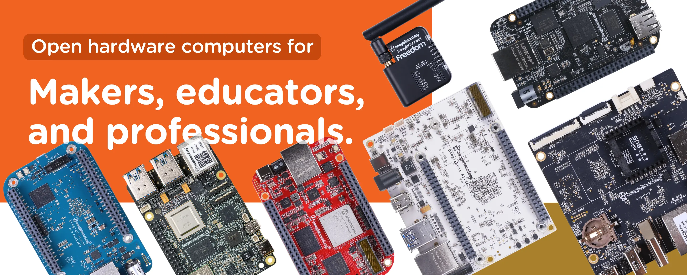

.. _bbdocs-home:

:html_theme.sidebar_secondary.remove: true
:sd_hide_title: true

BeagleBoard Documentation
############################

Welcome to the `BeagleBoard project documentation <https://git.beagleboard.org/docs/docs.beagleboard.io>`_.
If you are looking for help with your Beagle open-hardware development platform, you've found the right place!

.. note:: 
   The BeagleBoard.org Foundation is a US-based 501(c)3 non-profit organization providing open hardware
   computing solutions for a community of makers, educators and professionals that enable
   rapid prototyping without barriers to creating real-world embedded systems. The BeagleBoard.org Foundation
   supports the BeagleBoard community through efforts like developing this documentation.

Introduction
************

Get started quickly on our Linux-enabled boards with :ref:`blinkLED`, follow-up with articles in :ref:`intro_beagle-101`, and reach out
via resources on our :ref:`support` page as needed to resolve issues
and engage with the developer community. Don't forget that this is an open-source project! Your contributions are welcome. 
Learn about how to contribute to the BeagleBoard documentation project and any of the many open-source Beagle
projects ongoing on our :ref:`contribution` page.

* Get started quickly at :ref:`blinkLED`.
* Go a bit deaper at :ref:`intro_beagle-101`.
* Read the book at :ref:`bone-cook-book-home`.
* Get help from the community at :ref:`support`.
* Learn how to contribute to the project at :ref:`contribution`.

.. toctree::
   :maxdepth: 2
   :hidden:
   :caption: Introduction

   /intro/index

Boards
******

This is where you will find the System Reference Manuals (SRMs) for all of the boards.

All Beagles are `open-hardware <https://www.oshwa.org/definition/>`__ with documentation on the
design, including the
`materials <https://git.beagleboard.org/explore/projects/topics/boards>`__ to modify the designs
from source using appropriate design tools.

* Check out our easy-to-use Linux-based board at: :ref:`beagleplay-home`
* Check out our highest performance (8 TOPs) board at: :ref:`bbai64-home`
* Check out our first Zephyr-based board at: :ref:`beagleconnect-freedom-home`
* Find all of our boards at: :ref:`boards`

.. grid:: 1 1 2 3
   :margin: 4 4 0 0
   :gutter: 4

   .. grid-item-card::
      :link: beagley-ai-home
      :link-type: ref

      **BeagleY®-AI**
      ^^^

      .. image:: boards/images/beagley-ai.*
         :align: center
      +++

      An industry standard form-factor 64-bit ARM computer with 4 TOPS AI engine
      and integrated ARM Cortex-R5 for low-latency I/O tasks.

   .. grid-item-card::
      :link: beagleplay-home
      :link-type: ref

      **BeaglePlay®**
      ^^^

      .. image:: boards/images/beagleplay.*
         :align: center
      +++

      A 64-bit ARM computer designed to simplify physical world interactions
      to the connected world.

   .. grid-item-card::
      :link: beagleconnect-freedom-home
      :link-type: ref

      **BeagleConnect™ Freedom**
      ^^^

      .. image:: boards/images/beagleconnect-freedom.*
         :align: center
      +++

      BeagleConnect™ Freedom is based on a `TI Arm Cortex-M4 wireless-enabled microcontroller <https://www.ti.com/product/CC1352P7>`_ 
      and is the first available BeagleConnect™ solution.

   .. grid-item-card::
      :link: bbai64-home
      :link-type: ref

      **BeagleBone® AI-64**
      ^^^

      .. image:: boards/images/beaglebone-ai-64.*
         :align: center
      +++

      A complete 64-bit AI and Machine Learning System with the convenience
      and expandability of the BeagleBone® platform with the peripherals on
      board to get started right away learning and building applications.

   .. grid-item-card::
      :link: beaglev-fire-home
      :link-type: ref

      **BeagleV®-Fire**
      ^^^

      .. image:: boards/images/beaglev-fire.*
         :align: center
      +++

      Awesome quad-core RISC-V and *FPGA* SBC with BeagleBone cape headers,
      PCIe over M.2 and SYZYGY high-speed connector!

   .. grid-item-card::
      :link: beaglev-ahead-home
      :link-type: ref

      **BeagleV®-Ahead**
      ^^^

      .. image:: boards/images/beaglev-ahead.*
         :align: center
      +++

      High-performance quad-core RISC-V SBC with neural network and media accelerators
      with BeagleBone cape headers, mikroBUS shuttle connector, 2x CSI and DSI expansion.

   .. grid-item-card::
      :link: beagleboneblack-home
      :link-type: ref

      **BeagleBone® Black**
      ^^^

      .. image:: boards/images/beaglebone-black.*
         :align: center
      +++

      1GHz Single-Board Linux Computer based on ARM Cortex-A8 with PRU 
      microcontrollers and tons of features like Ethernet and HDMI – 
      credit card sized with over a decade of support, software and 
      materials behind it making it ready for any application.

   .. grid-item-card:: 
      :link: bbai-home
      :link-type: ref

      **BeagleBone® AI**
      ^^^

      .. image:: boards/images/beaglebone-ai.*
         :align: center
      +++

      Filling the gap between small SBCs and more powerful industrial computers, 
      BeagleBone® AI, based on the AM5729, makes it easy to explore how artificial 
      intelligence can be used in every day life. Powerful compute performance and software support.

   .. grid-item-card:: 
      :link: pocketbeagle-home
      :link-type: ref

      **PocketBeagle®**
      ^^^

      .. image:: boards/images/pocketbeagle.*
         :align: center
      +++

      This ultra-tiny-yet-complete open-source USB-key-fob computer has the same processor 
      as the BeagleBone® Black at one third the size. Give small projects the Linux computer 
      they deserve. Hundreds of example projects to help you get started.

   .. grid-item-card:: 
      :link: beaglebone-blue-home
      :link-type: ref

      **BeagleBone® Blue**
      ^^^

      .. image:: boards/images/beaglebone-blue.*
         :align: center
      +++

      An all-in-one Linux-based robotics computer with compatibility to BeagleBone® Black and 
      tons of integration including Wi-Fi, Bluetooth, IMU/barometer, power regulation, H-Bridges, 
      motor connectors and more. Robotics made streamlined, affordable and fun.

Capes
******

.. grid:: 1 1 2 3
   :margin: 4 4 0 0
   :gutter: 4

   .. grid-item-card::

      **BeagleBone® Servo Cape**
      ^^^

      .. image:: boards/capes/images/BeagleBoneServoCapeA2_Top_NEW-400x332.png
         :align: center
      +++

      Control up to 16 servos for many remote control, robotics or automation projects

   .. grid-item-card::

      **BeagleBone® Fan Cape**
      ^^^

      .. image:: boards/capes/images/fan-cape-400x299.png
         :align: center
      +++

      Keeps BeagleBone® cool under heavy operating loads while still providing easy 
      access to the headers. Essential for BeagleBone® AI Projects

   .. grid-item-card::

      **BeagleBone® Robotics Cape**
      ^^^

      .. image:: boards/capes/images/BBB_RoboticsCape-400x368.png
         :align: center
      +++

      Loaded with features needed for mobile robotics supporting 
      movement, sensing, power management and communication

   .. grid-item-card::
      :link: bone-cape-relay
      :link-type: ref

      **BeagleBone® Relay Cape**
      ^^^

      .. image:: boards/capes/images/BeagleBoneRelayCapeA2-400x274.png
         :align: center
      +++

      Control things like lights, pumps and more in any home 
      automation project quickly with 4 relay switches

   .. grid-item-card::

      **BeagleBone® Proto Cape**
      ^^^

      .. image:: boards/capes/images/BeagleBoneProtoCapeA2-e1622405187534.png
         :align: center
      +++

      Provides a blank slate including a grid of plated through-holes for external 
      components and supportive buttons and LEDs

   .. grid-item-card::

      **BeagleBone® Power Cape**
      ^^^

      .. image:: boards/capes/images/BeagleBonePowerCapeA2-400x285.png
         :align: center
      +++

      Provides a complete power interface with regulated 3.3V and 5V out as well as up to 30V input voltage

   .. grid-item-card::

      **BeagleBone® Load Cape**
      ^^^

      .. image:: boards/capes/images/BeagleBoneLoadCapeA2-400x290.png
         :align: center
      +++

      Drive high-current loads like relays, motors, solenoids, and high current LEDs

   .. grid-item-card::

      **BeagleBone® Motor Cape**
      ^^^

      .. image:: boards/capes/images/BeagleBoneMotorCapeA2-400x281.png
         :align: center
      +++

      Drive up to 4 DC motors with direction and PWM control

   .. grid-item-card::

      **BeagleBone® Comms Cape**
      ^^^

      .. image:: boards/capes/images/BeagleBoneCommsCapeA2-400x279.png
         :align: center
      +++

      Quickly develop industrial communication applications with an array of protocols including RS485 and CAN

   .. grid-item-card::

      **BeagleBone® GamePup Cape**
      ^^^

      .. image:: boards/capes/images/PocketBeagle_GamePup-400x410.png
         :align: center
      +++

      For making a handheld arcade emulator, your own games or otherwise taking your PocketBeagle 
      on the go, PocketBeagle® GamePup provides all the features you need in a slick shape for gaming

   .. grid-item-card::

      **BeagleBone® Grove Kit**
      ^^^

      .. image:: boards/capes/images/pb-grove-kit-400x267.png
         :align: center
      +++

      A complete kit for developing projects with PocketBeagle® and Grove modules. Great for 
      teaching embedded processing and Linux development. Comes complete with PocketBeagle® 
      as well as Grove Cape and 10 modules to get started.

   .. grid-item-card::

      **BeagleBone® TechLab Cape**
      ^^^

      .. image:: boards/capes/images/PocketBeagle_TechLab-400x212.png
         :align: center
      +++

      Designed with years of educational lessons-learned in mind, PocketBeagle® TechLab 
      Cape delivers easy introduction to programming, Linux and even hacking the kernel 
      itself. Supported by teaching materials from the Linux Foundation and eALE.

.. toctree::
   :maxdepth: 1
   :hidden:
   :caption: Boards
   
   boards/index

Projects
********

A number of software projects, like :ref:`simppru_home` exist to help Beagle
developers. Some developers choose to host documentation for their :ref:`projects-home` here.

.. toctree::
   :maxdepth: 1
   :hidden:
   :caption: Projects

   projects/index

Books
*****

This project hosts a collection of open-source :ref:`books-home` written to help Beagle developers.

* Find a great introduction to BeagleBone at: :ref:`bone-cook-book-home`
* Learn one of the most amazing Beagle features at: :ref:`pru-cookbook-home`

.. toctree::
   :maxdepth: 1
   :hidden:
   :caption: Books

   books/index

Accessories
************

This is a list of hardware accessories tested with BeagleBone hardware. 
The list is growing with support of volunteers like you. Checkout the :ref:`accessories-home` 
page for more information.

.. toctree::
   :maxdepth: 1
   :hidden:
   :caption: Accessories

   /accessories/index

Indices and tables
********************

* :ref:`glossary`
* :ref:`genindex`
