.. _contribution-how:

How can I contribute?
#####################

The most obvious way to contribute is using the `OpenBeagle (BeagleBoard.org GitLab server) <https://openbeagle.org>`_ to report
bugs, suggest enhancements and providing merge requests / pull requests to fix software, hardware designs and documentation. We 
have made it easy to share the link while you are working with documentation and provide feedback for any heading, figure, and table.

1. :fas:`link;pst-color-secondary` button is to copy the link of current heading, figure, or table.
2. :fas:`message;pst-color-secondary` button is to open feedback modal for submitting issue, feedback, and idea.

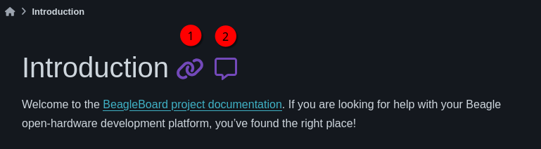

    Copy link and feedback button

When you click on :fas:`message;pst-color-secondary` button, you will see the modal as shown in the image below. 
With this you can easily provide us ideas, feedback, and create issues directly on OpenBeagle from docs site.

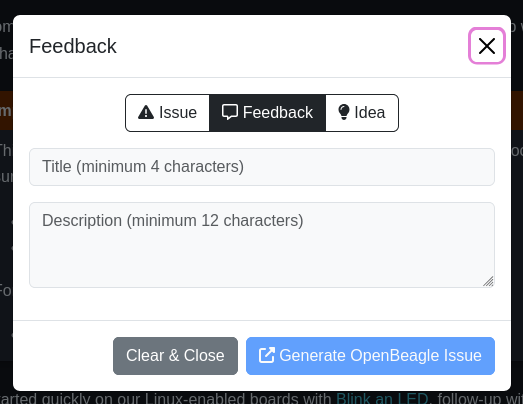

    Feedback modal

.. note:: 
    You need an active OpenBeagle account to use the feedback modal. 

.. tip::   
    Reading the `help guide <https://openbeagle.org/help/>`_ is a great way to get started using OpenBeagle.

Suggesting enhancements
***********************

An issue doesn't have to be something wrong, it can just be about making something better. If in doubt how to make
a productive suggestion, hop on the forum and live chat groups to see what other people say. Check the current
ideas that are already out there and give us your idea. Try to be constructive in your suggestion. We are a primarily
a volunteer community looking to make your experience better, as those that follow you, and your suggestion could be
key in that endeavor.

Where available, use the "enhancement" `label <https://openbeagle.org/help/user/project/labels.md>`_ on your issue
to make sure we know you are looking for a future improvement, not reporting something critically wrong.

Submitting merge requests
*************************

If you want to contribute to a project, the most practical way is with a
`merge request <https://openbeagle.org/help/user/project/merge_requests/index.html>`_. Start
by `creating a fork <https://openbeagle.org/help/user/project/repository/forking_workflow.html>`_, which
is your own copy of the project you can feel free to edit how you see fit. When ready,
`create a merge request <https://openbeagle.org/help/user/project/merge_requests/creating_merge_requests.html>`_ and
we'll review your work and give comments back to you. If suitable, we'll update the code to include your contribution!

A bit more detailed suggestions can be found in the articles linked below.

.. _docs-site-editing-guide:

Site Editing Guide
*******************

`Docs <https://docs.beagleboard.org/>`_ site uses `OpenBeagle Continous Integration (CI) / Continous Development
(CD) <https://docs.gitlab.com/ee/ci/>`_ which is a continuous method of software development, where
you continuously build, test, deploy, and monitor iterative code changes. which means you don't have to setup
anything on your local machine to update anything on the site. To contribute to this site, you can follow the
simple steps provided below.

.. note:: `OpenBeagle <https://openbeagle.org/>`_ is a self hosted instance of open source program called `GitLab <https://about.gitlab.com/>`_.

.. tip::

    If you want to build on your local machine we have added ``venv-build-env.sh`` and ``requirements.txt``
    to help you setup sphinx and all the other dependencies. Execute these commands in your terminal,

    Install python modules and setup virtual environment,

    .. code:: shell

        . ./venv-build-env.sh

    Build and serve it live using ``sphinx-autobuild``,

    .. code:: shell

        make livehtml

    Now, you can open `http://127.0.0.1:8000 <http://127.0.0.1:8000>`_ on any browser to see the rendered HTML with live updates.
    Clear cookies and site data in your browser window to view up-to-date site.

Fork the project
=================

Go to `docs.beagleboard.io repo on OpenBeagle <https://openbeagle.org/docs/docs.beagleboard.io>`_
and click on fork button create a fork on your personal OpenBeagle profile.

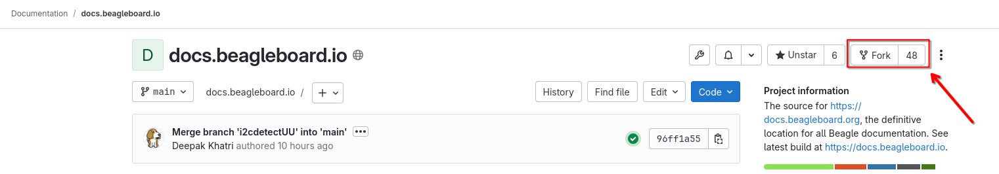

    Fork button

After clicking on the fork button, you'll be taken to a page like shown below where you have to,

1. Select your profile from the dropdown.
2. Click on fork project button to initiate the forking process.

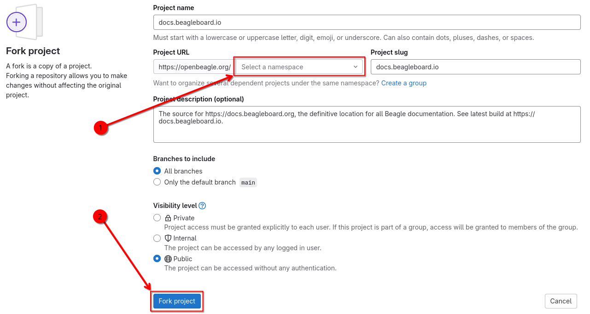

    Fork project

Select file to edit
====================

After successfully forking the project you have to,

1. Make sure you are on the forked repo on your profile, it should be ``https://openbeagle.org/<user-name>/docs.beagleboard.io`` where <user-name> should be replaced with your OpenBeagle username.
2. Select any file you want to edit from the files & folders view of the repo page.

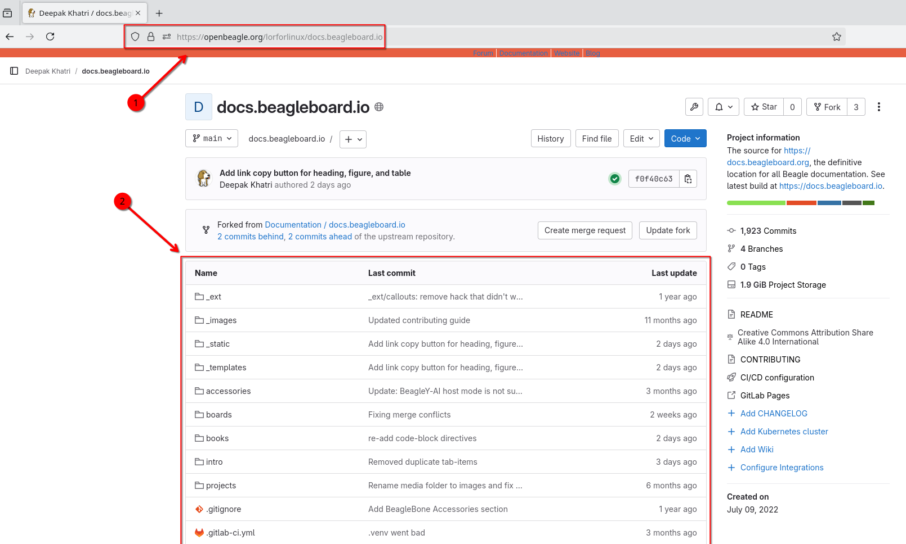

    Repository files and folders

After selecting the file you have to click on ``edit button`` and then choose either of the options from drop-down,

1. ``Open in Web IDE``, choose this if you want to work on multiple files.
2. ``Edit single file``, choose this if you want to make some small edits in a single file.

.. figure:: images/edit-button.png
    :align: center
    :alt: Edit button

    Edit button

.. note::
    Choosing ``Web IDE`` will load a `Visual Studio Code Server <https://code.visualstudio.com/docs/remote/vscode-server>`_
    instance which is a feature rich source code editor. Depending on the internent connection, your machine will take some time to
    load the editor and it can be a bit heavy for some machines to handle. Once fully loaded it should run smoothly but, if that is
    not the case then please consider using single file editor option. Considering majority of the users will be using ``Web IDE`` option,
    we are using the ``Web IDE`` for the rest of this guide.

Start editing
==============

If you select to open your file in ``Web IDE`` you'll see a familar interface. The GitLab Web IDE is actually a rich
`Visual Studio Code Server <https://code.visualstudio.com/docs/remote/vscode-server>`_ hosted on OpenBeagle.

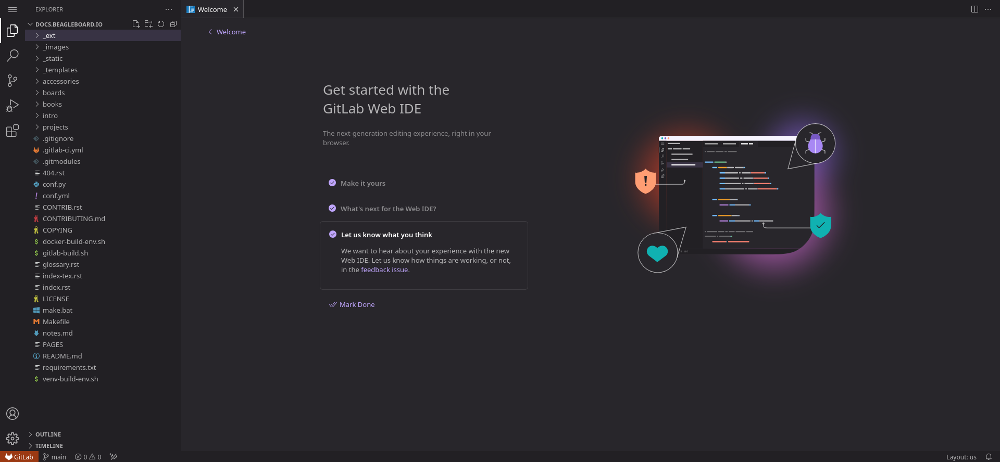

    Wed IDE

.. tip:: We use `reStructuredText (RST) <https://en.wikipedia.org/wiki/ReStructuredText>`_ for all of our documentation projects
   including `GSoC site  <https://gsoc.beagleboard.io/>`_ and `documentation site <https://docs.beagleboard.org/latest/>`_.
   If you are new to reStructuredText you can checkout our `reStructuredText cheatsheet <https://docs.beagleboard.org/latest/
   intro/contribution/rst-cheat-sheet.html>`_ to get yourself familiar with reStructuredText.

.. admonition:: Why not use Markdown for documentation?

   Because reStructuredText stands out against Markdown as,

   1. It’s more fully-featured.
   2. It’s much more standardized and uniform.
   3. It has built-in support for extensions.

   For more detailed comparison you can checkout `this article on reStructuredText vs. Markdown for technical
   documentation <https://eli.thegreenplace.net/2017/restructuredtext-vs-markdown-for-technical-documentation/>`_

Now you have to select a file and start editing. Below image shows some,

1. Edits made to the ``conf.py`` file, changes are highlighted with green bar on left side of code editor window near line numbers.
2. Source control button indicating (1) file updated in the repo.

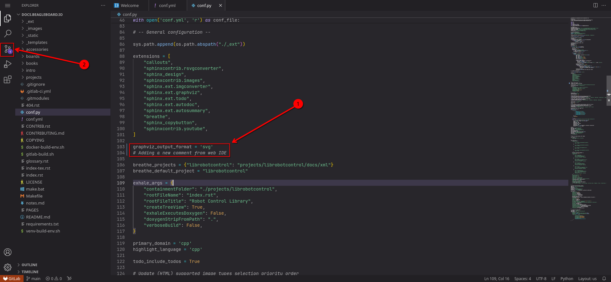

    Make edits

.. tip:: Just like you do on your normal Visual Studio Code desktop application, to commit your changes you can either
    click on Source control ( :fa:`code-branch;pst-color-secondary` ) button or press ``CTRL + SHIFT + G`` to see all the edited files.

After switching to source control you have to,

1. Add a commit message in the input field then commit your changes.
2. Click on ``Commit to main`` button (not recommended).
3. Click on drop down button to choose ``Commit to new branch`` (recommended).

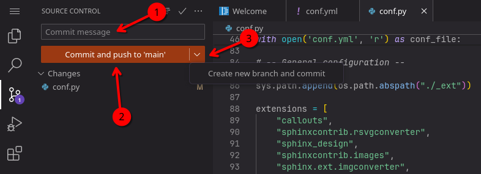

    Commit changes

After clicking ``Commit to 'main'`` button you'll be prompted with a window (shown below) with three options,

1. ``Create new branch``
2. ``Cancel``
3. ``Continue``

Click on ``Continue`` button if you want to commit to main (default branch) if it's a single edit or commit.
Click on ``Create new branch`` if you want to create a new branch and want to keep your main branch clean. Advantage
of creating a new branch is that assigned reviewer for a pull request / merge request can also add commits to your
newly created branch which is not possible for your main branch because it's a `protected branch <https://docs.gitlab.com/
ee/user/project/protected_branches.html>`_ by default.

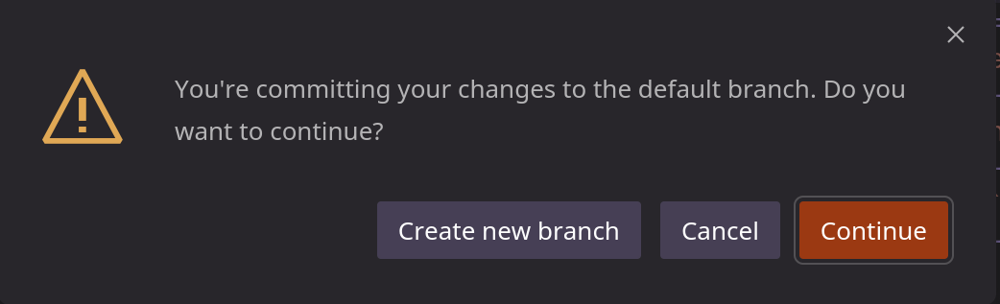

    Commit branch

When all done right, at the lower right side of the ``Web IDE`` you'll see a prompt showing 
``Success! Your changes have been committed`` message with two buttons,

1. ``Go to Project``
2. ``Continue working``

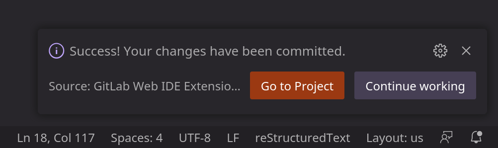

    Commit success

If you click on ``Go to Project`` button, you'll see,
1. The commit successfully applied and the green tick shown on the right side indicates that the CI build was also successful.
2. Option to create a merge request and update your fork.

.. figure:: images/commit.png
    :align: center
    :alt: Commit

    Commit

.. admonition:: Congratulations!!

    You have made a valuable contribution to an OpenBeagle project!

Create a merge request
=======================

After making your changes and commiting them to your forked repo, you are set to create a new `pull request / merge request
<https://en.wikipedia.org/wiki/Distributed_version_control#Pull_requests>`_ so that those changes can be merged to upstream
repo. To start your new PR, click on the dedicated button to create a new merge request and fill out all the details. The image
below shows all the fields you have to update,

1. Provide a good title that reflects your work.
2. Add a detailed description of the work you have done. Add pictures whenever seems useful.
3. (Optional) you can assign it to yourself if you'll be working on further updates or assign it to someone else who might want to work on the comments we may provide on your work.
4. Add ``lorforlinux`` as reviewer for PRs with site content update or add your mentor as reviewer if it's related to project work / proposal.
5. If you want your commits to be shown as a single commit, then you can choose the ``sqash commits ...`` check box.
6. Check if all your commits are shown in the bottom of the screen and if everything looks okay, then click on ``Create merge request`` button.

.. tip:: If you are still working on some updates, you may also choose ``Mark as draft`` checkbox (below title)
    which indicates that you are seeking feedback before making your commits suitable to merge.

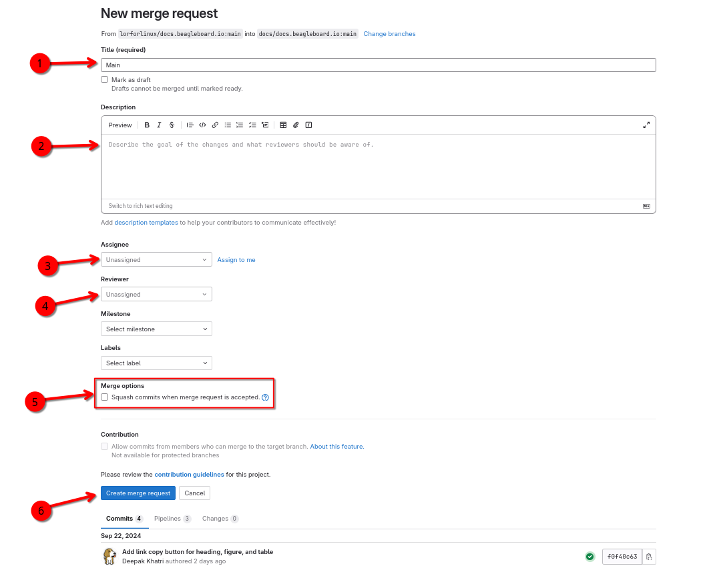

    Merge request

Now wait for a review and, if comments are raised, then you can continue working on the project
until everything looks perfect and your changes are merged in upstream.

Google Summer of Code (GSoC)
****************************

For newcomers venturing into the realm of open-source contribution, Google Summer of Code (GSoC) stands as an invaluable platform. GSoC provides a unique opportunity to collaborate with the open-source community, engaging in the identification and development of exciting projects during the summer term.

BeagleBoard.org serves as a mentorship organization that takes part in the Google Summer of Code program actively, giving students the opportunity to work on open-source projects during the summer. Visit our dedicated :ref:`beagleboard-gsoc` for more information about this program, including past projects and mentorship opportunities. 

Reporting bugs
***************

Start by reading the `OpenBeagle Issues help page <https://openbeagle.org/help/user/project/issues/index.md>`_.

Please request an account and report any issues on the appropriate project issue tracker at https://openbeagle.org.

Report issues on the software images at https://openbeagle.org/explore/topics/distros.

Report issues on the hardware at https://openbeagle.org/explore/projects/topics/boards.

.. _contribution-todo-list:

Tackle to-do list
*****************

This documentation has a number of ``todo`` items where help is needed that can be searched in the source. This list will
show up directly in the staging documentation at https://docs.beagleboard.io/latest/intro/contribution/how.html#contribution-todo-list

.. todolist::

Articles on contribution
**************************

- :ref:`beagleboard-git-usage`
- :ref:`beagleboard-doc-style`
- :ref:`rst-cheat-sheet`
- :ref:`beagleboard-linux-upstream`

History of contributors
***********************

- :ref:`contributors`
