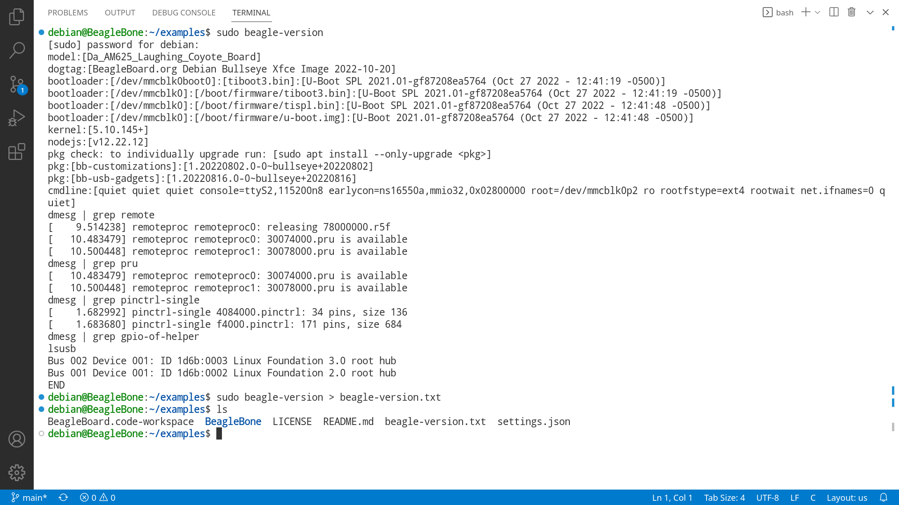
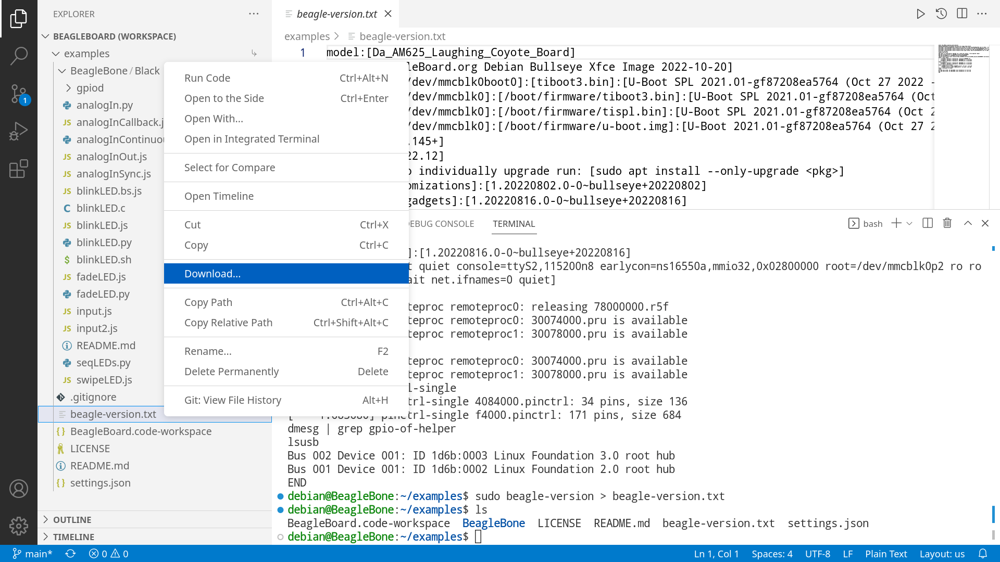

.. _support:

Support
#########

.. note:: #TODO# all the links need updating and content moved into 
   `this repo <https://git.beagleboard.org/docs/docs.beagleboard.io>`_, especially :ref:`intro_bone101`.

Getting started
***************

The starting experience for all Beagles has been made to be as
consistent as is possible. For any of the Beagle Linux-based open
hardware computers, visit :ref:`beagleboard-getting-started`.

.. toctree::
   :maxdepth: 2

   /intro/support/getting-started

.. _intro-getting-support:

Getting support
***************

BeagleBoard.org products and `open
hardware <https://www.oshwa.org/definition/>`_ designs are supported
via the on-line community resources. We are very confident in our
community’s ability to provide useful answers in a timely manner. If you
don’t get a productive response within 24 hours, please escalate issues
to Jason Kridner (contact info available on the `About
Page <https://beagleboard.org/about>`_). In case it is needed, Jason
will help escalate issues to suppliers, manufacturers or others. Be sure
to provide a link to your questions on the `community
forums <https://forum.beagleboard.org>`_ as answers will be provided
there.

Be sure to ask `smart questions <http://www.catb.org/~esr/faqs/smart-questions.html>`_
that provide the following:

*  What are you trying to accomplish?
*  What did you find when researching how to accomplish it?
*  What are the detailed results of what you tried?
*  How did these results differ from what you expected?
*  What would you consider to be a success?

.. important::
   Remember that community developers are volunteering their expertise. Respect
   developers time and expertise and they might be happy to share with you. If you
   want paid support, there are :ref:`consulting-resources` options for that. 

Diagnostic tools
================

Best to be prepared with good diagnostic information to aide with support.

-  Output of `beagle-version` script needed for support requests
-  `Beagle Tester source <https://git.beagleboard.org/jkridner/beagle-tester>`_

.. tip::
   You can send the beagle-version.txt you just downloaded or you can use paste output 
   from terminal to https://pastebin.com/ and send us the link of your beagle-version output.

Community resources
===================

Please execute the board diagnostics, review the hardware documentation,
and consult the mailing list and IRC channel for support.
BeagleBoard.org is a “community” project with free support only given to
those who are willing to discussing their issues openly for the benefit
of the entire community.

-  `Frequently Asked Questions <https://forum.beagleboard.org/c/faq>`_
-  `Mailing List <https://forum.beagleboard.org>`_
-  `Live Chat <https://beagleboard.org/chat>`_

.. _consulting-resources:

Consulting and other resources
==============================

Need timely response or contract resources because you are building a product?

- `Resources <https://beagleboard.org/resources>`_

Repairs
=======

Repairs and replacements only provided on unmodified boards purchased
via an authorized distributor within the first 90 days. All repaired
board will have their flash reset to factory contents. For repairs and
replacements, please contact ``support`` at BeagleBoard.org using the RMA
form:

-  `RMA request <https://www.beagleboard.org/rma>`_

Understanding Your Beagle
*************************

-  :ref:`intro_bone101`
-  `Hardware <https://beagleboard.org/Support/Hardware+Support>`_
-  `Software <https://beagleboard.org/Support/Software+Support>`_
-  :ref:`books-home`

   - :ref:`pru-cookbook-home`
   - :ref:`bone-cook-book-home`
   - `Exploring BeagleBone <https://beagleboard.org/ebb>`_
   - `Bad to the Bone <https://beagleboard.org/bad-to-the-bone>`_

Working with Cape Add-on Boards
*******************************

- :ref:`capes`
- :ref:`beaglebone-cape-interface-spec`
- :ref:`accessories-home`

