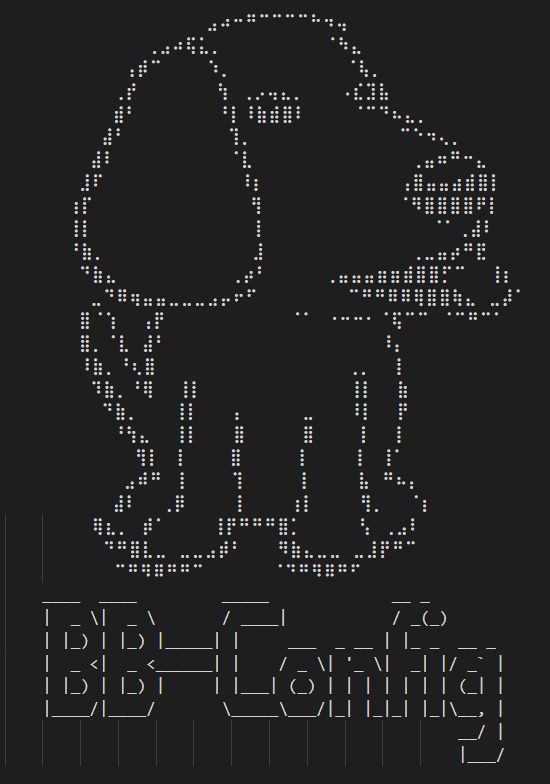

.. _bb_config_detail:

BB-Config Detail
#################
Configure your beagle devices easily.

`Github <https://git.beagleboard.org/gsoc/bb-config>`_

What is BB-Config
******************

BB-Config is software that makes the most common low-level 
configuration changes of beagle devices easily and provides a 
terminal UI.

BB-Config is using `FTXUI <https://github.com/ArthurSonzogni/FTXUI>`_ (C++ Functional Terminal User Interface)
which provides a simple and elegant looking UI.

==========

.. image:: images/about.png
   :align: center
   :alt: bb-config about
