Features
#########

BB-Config v1.x
***************

PRU Enable/Disable
===================
- Enable/Disable PRU

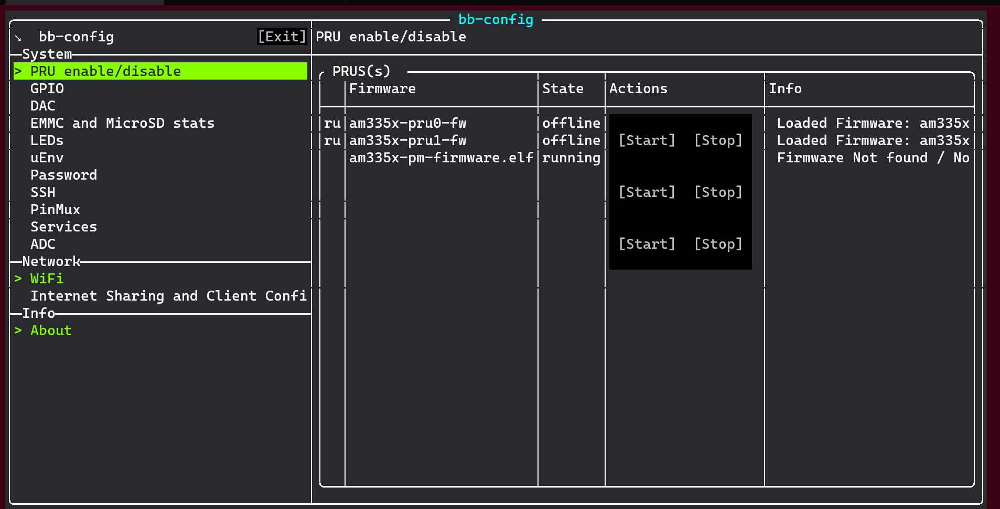

GPIO
=====
- Turn On/Off gpio

GPIO Menu
----------

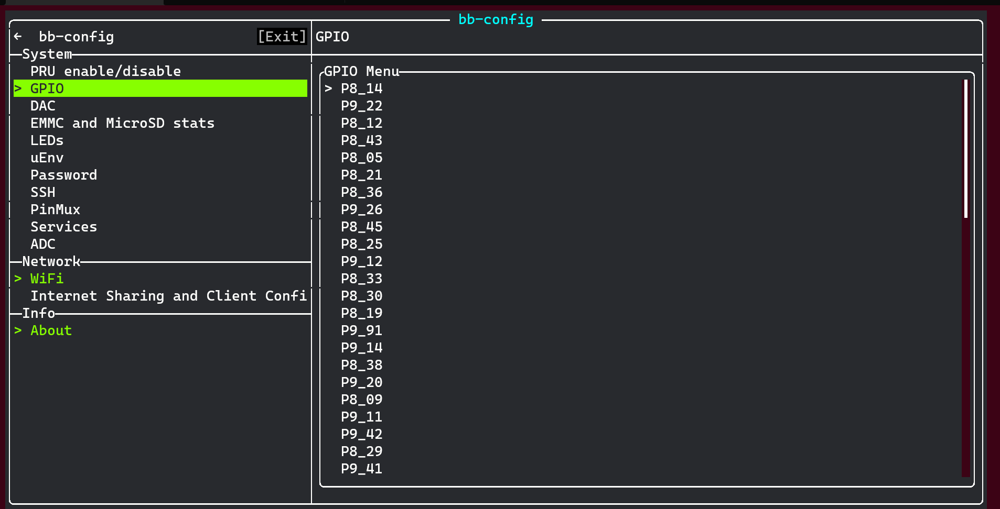

GPIO Setting
-------------

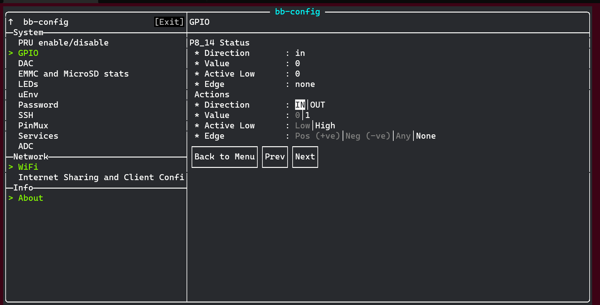

EMMC and MicroSD Stats
=======================
- Storage stats & grow partition

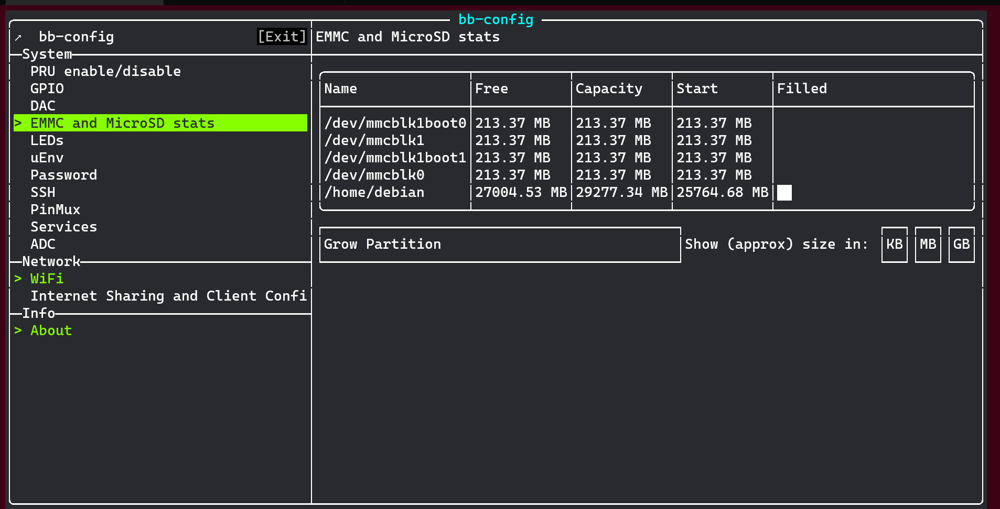

LEDs
=====
- Config board build in LEDs

.. image:: images/leds.png
   :align: center
   :alt: leds

Password
=========
- Change users password

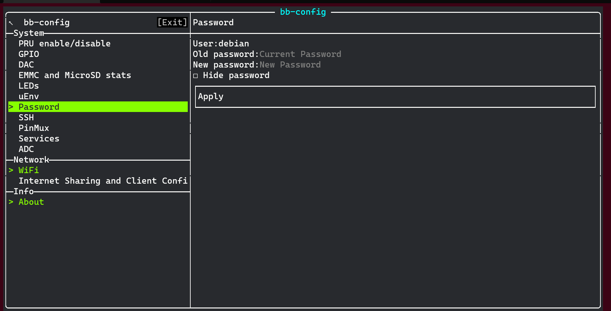

SSH
====
- Enable/Disable SSH

.. image:: images/ssh.png
   :align: center
   :alt: ssh

WiFi
=====
- Connect to Wi-Fi

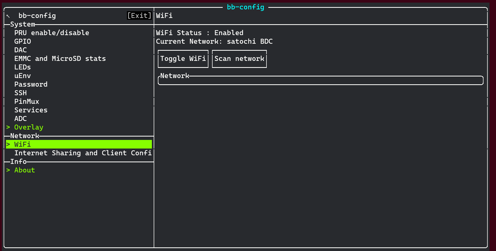

Internet Sharing and Client Config
===================================

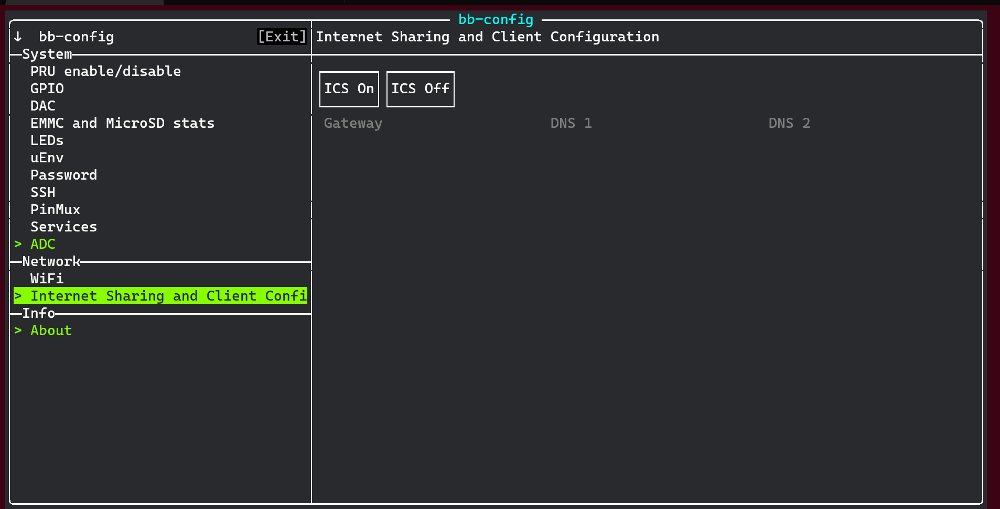

- Note: You'll have to configure your host Following is an example script:

.. code:: bash
   
    echo 1 > /proc/sys/net/ipv4/ip_forward
    iptables --table nat --append POSTROUTING --out-interface wlp4s0 -j MASQUERADE
    iptables --append FORWARD --in-interface wlp4s0 -j ACCEPT

About
======

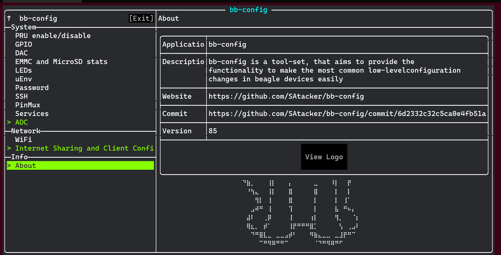

BB-Config v2.x
***************

ADC (Graph)
============
- Plot graph for Analogue pin

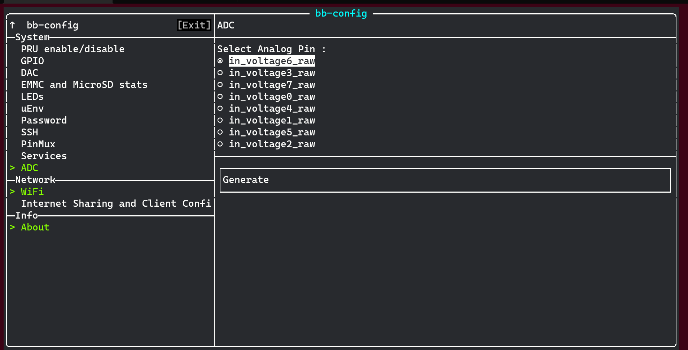

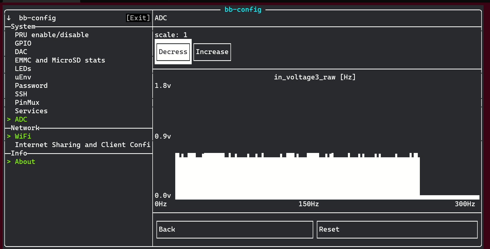

DAC (PWM)
==========
- Generate PWM waveform

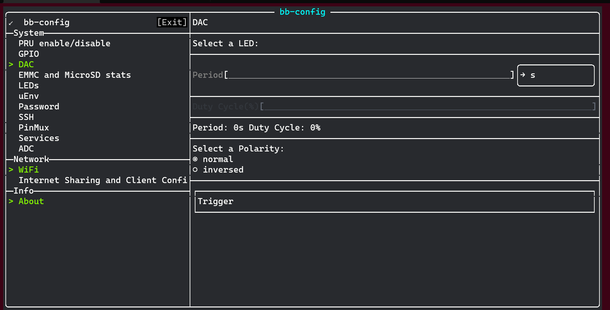

uEnv
=====
- Enable/Disable boot configuration

.. image:: images/uEnv.png
   :align: center
   :alt: uEnv

services
=========
- Enable/Disable services startup at boot

.. image:: images/service.png
   :align: center
   :alt: service

PINMUX
=======
- Display PIN I/O detail
- Config PINMUX

Hardware Display
-----------------
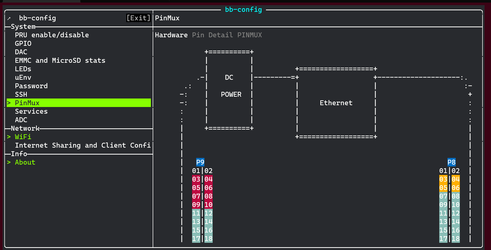

Pin Table References
--------------------
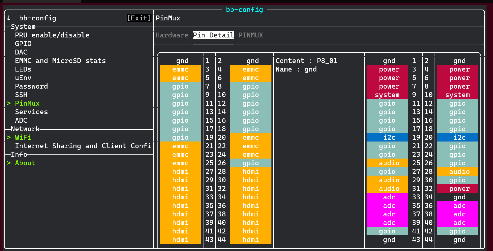

Pin Config
--------------
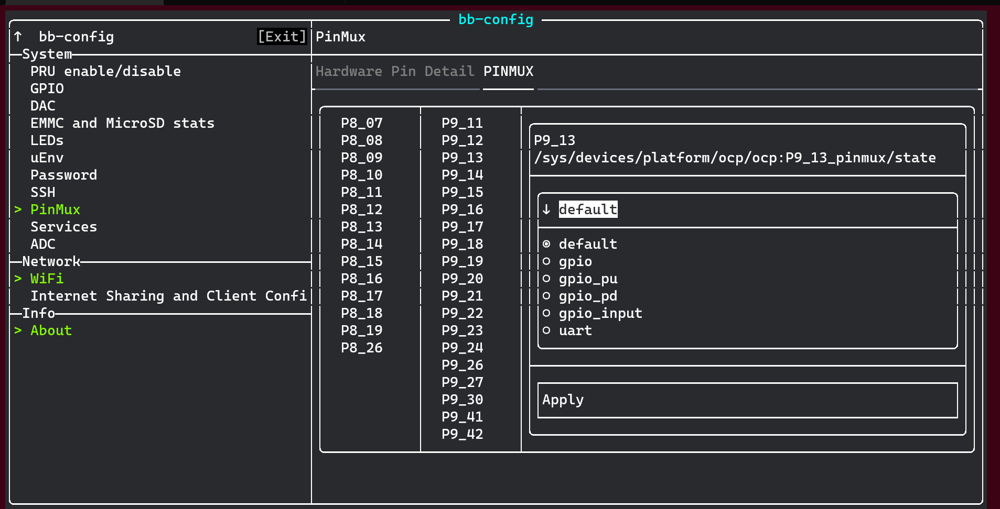

Overlay (dts)
==============
- Enable/Disable Device Tree Overlay in Boot option
- Select dtbo file and automate update in uEnv.txt 

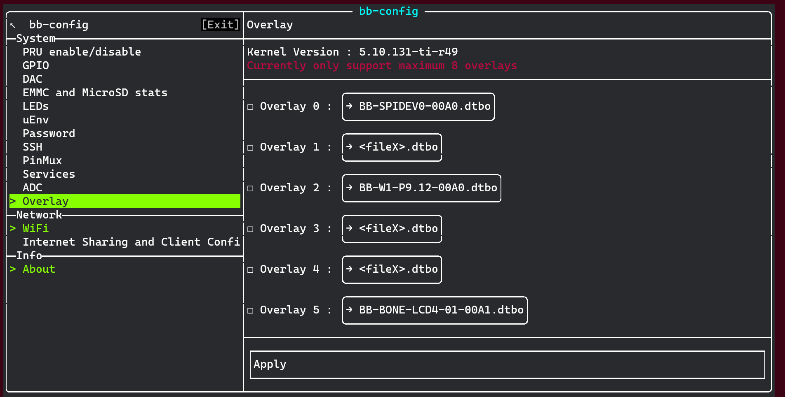

WiFi (D-Bus)
=============
- Connect to WiFi with wpa_supplicant
- Support for Debian 11

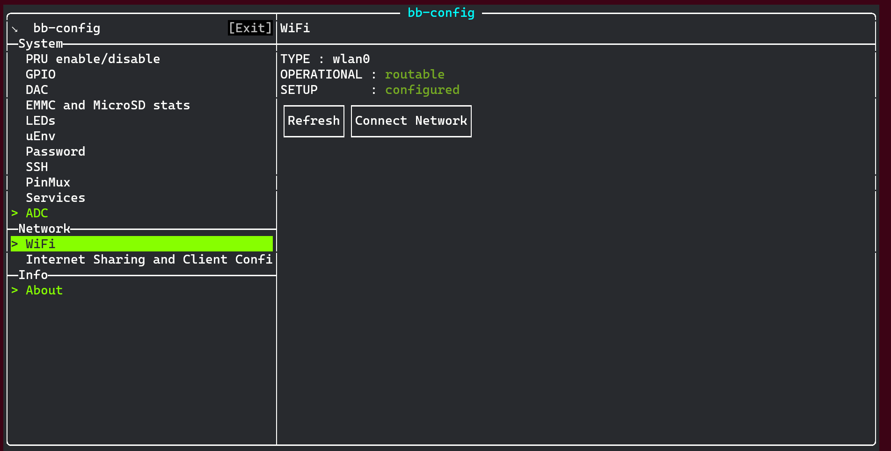